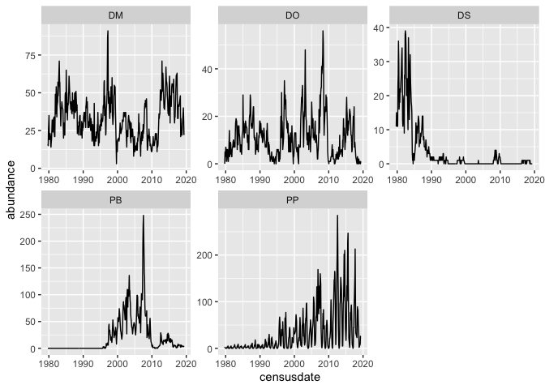
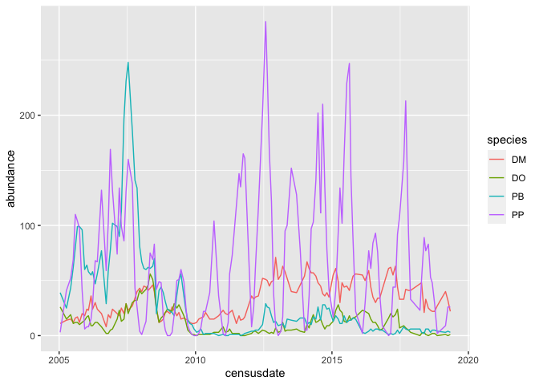
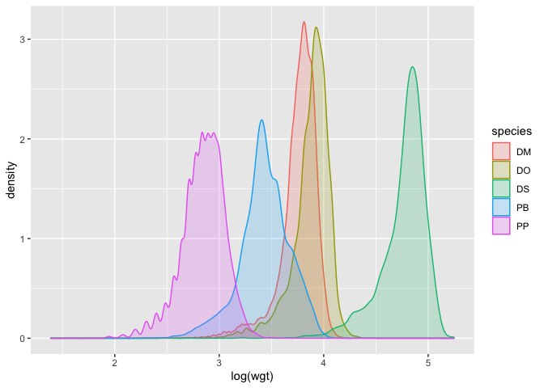

body size overlap
================

``` r
ratcounts <- portalr::abundance(level = "Site", type = "Granivores", time = "censusdate")
```

    ## Loading in data version 2.49.0

``` r
corerats <- ratcounts %>%
  select(censusdate, DM, DO, DS, PB, PP) %>%
  tidyr::pivot_longer(-censusdate, names_to = "species", values_to = "abundance") %>%
  mutate(censusdate = as.Date(censusdate))

ggplot(corerats, aes(censusdate, abundance)) +
  geom_line() +
  facet_wrap(vars(species), scales = "free")
```

<!-- -->

``` r
ggplot(filter(corerats, censusdate > as.Date("2005-01-01"), species != "DS"), aes(censusdate, abundance, color = species)) +
  geom_line() 
```

<!-- -->

``` r
  facet_wrap(vars(species), scales = "free")
```

    ## <ggproto object: Class FacetWrap, Facet, gg>
    ##     compute_layout: function
    ##     draw_back: function
    ##     draw_front: function
    ##     draw_labels: function
    ##     draw_panels: function
    ##     finish_data: function
    ##     init_scales: function
    ##     map_data: function
    ##     params: list
    ##     setup_data: function
    ##     setup_params: function
    ##     shrink: TRUE
    ##     train_scales: function
    ##     vars: function
    ##     super:  <ggproto object: Class FacetWrap, Facet, gg>

``` r
inds <- portalr::summarise_individual_rodents(type = "Rodents", time = "censusdate") 
```

    ## Loading in data version 2.49.0

``` r
inds <- inds %>%
  filter(!is.na(wgt)) %>%
  filter(species %in% c("DM", "DO", "DS", "PP", "PB"))

ggplot(inds, aes(log(wgt), color = species, group = species, fill = species)) +
  geom_density(alpha = .2)
```

<!-- -->
