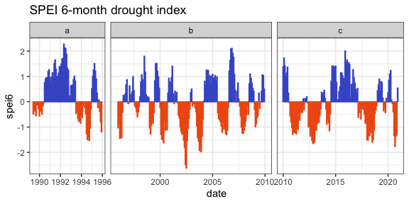
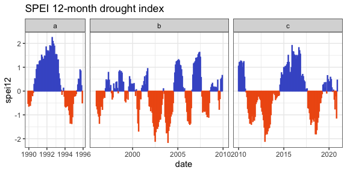
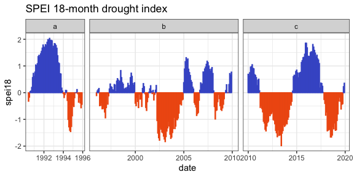

SPEI drought index
================

    ## Joining, by = c("year", "month")

## Summary

The period since 2010 has had two periods of long and severe drought,
longer and more severe than previous successive droughts, interspersed
with a relatively wet wet period (compared to the 2000s). However, there
have been several droughts - including a single long, severe drought in
the early 2000s - that did not coincide with major shifts in the
rodents.

    ## Registered S3 method overwritten by 'quantmod':
    ##   method            from
    ##   as.zoo.data.frame zoo

    ## Don't know how to automatically pick scale for object of type ts. Defaulting to continuous.

    ## Warning: Removed 5 rows containing missing values (position_stack).

<!-- -->

    ## Don't know how to automatically pick scale for object of type ts. Defaulting to continuous.

    ## Warning: Removed 11 rows containing missing values (position_stack).

<!-- -->

    ## Don't know how to automatically pick scale for object of type ts. Defaulting to continuous.

    ## Warning: Removed 17 rows containing missing values (position_stack).

<!-- -->
