ndvi anomaly
================

``` r
ndvi <- ndvi()


ndvi <- ndvi %>%
  mutate(month = format.Date(date, "%m"),
         year = format.Date(date, "%Y")) %>%
  group_by(month) %>%
  mutate(ndvi_norm = mean(ndvi)) %>%
  ungroup() %>%
  mutate(ndvi_difference = ndvi - ndvi_norm,
         ndvi_prop = ndvi / ndvi_norm) %>%
  mutate(numdate = as.numeric(date))

ggplot(ndvi, aes(date, ndvi_prop)) +
  geom_line()
```

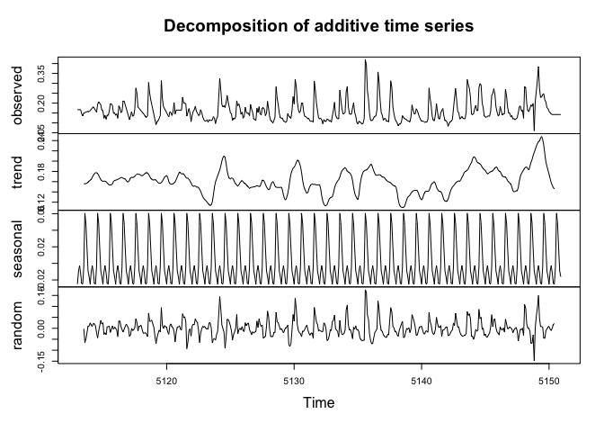<!-- -->

``` r
ggplot(ndvi, aes(date, ndvi_difference)) +
  geom_line()
```

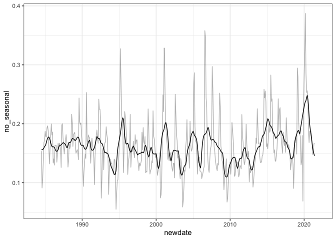<!-- -->

``` r
ggplot(ndvi, aes(date, abs(ndvi_difference))) +
  geom_line()
```

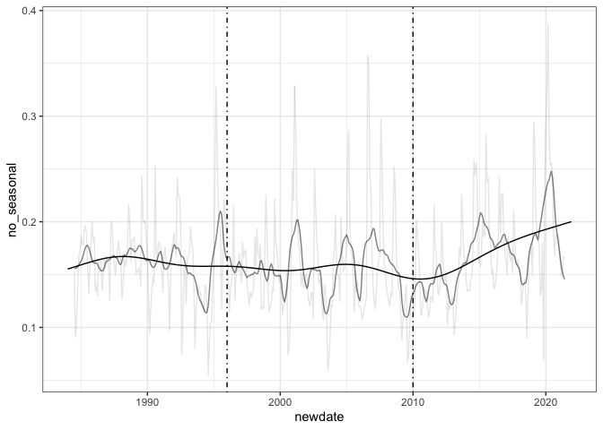<!-- -->

``` r
library(gratia)

load_mgcv()

diff_gam <- gam(ndvi_difference ~ s(numdate, k = 50), data = ndvi)

ndvi_fit <- ndvi %>%
  add_fitted(diff_gam)

ggplot(ndvi_fit, aes(date, .value)) +
  geom_line() +
  geom_line(aes(y = ndvi_difference), alpha = .1)
```

<!-- -->

### decomposition

``` r
ndvi_full <- expand.grid(
  year = c(1984:2021),
  month = c(1:12)
) %>%
  left_join(mutate(ndvi, month = as.numeric(month), year = as.numeric(year))) %>%
  mutate(datestr = paste0(year, "-01-", month)) %>%
  mutate(newdate = as.Date(datestr, format = "%Y-%d-%m")) %>%
  arrange(newdate)
```

    ## Joining, by = c("year", "month")

``` r
ndvi_ts <- ts(ndvi_full$ndvi, start = ndvi_full$newdate[1], frequency = 12)

ndvi_ts_interp <- imputeTS::na_interpolation(ndvi_ts)
```

    ## Registered S3 method overwritten by 'quantmod':
    ##   method            from
    ##   as.zoo.data.frame zoo

``` r
ndvi_decomp <- decompose(ndvi_ts_interp, type = "additive")

ndvi_stl <- stl(ndvi_ts_interp, "periodic")

plot(ndvi_decomp)
```

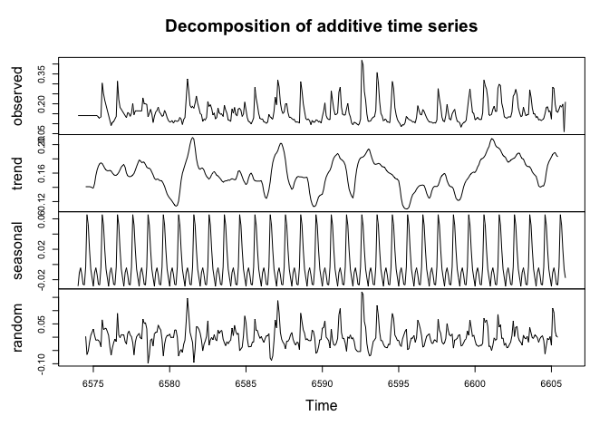<!-- -->

``` r
plot(ndvi_stl)
```

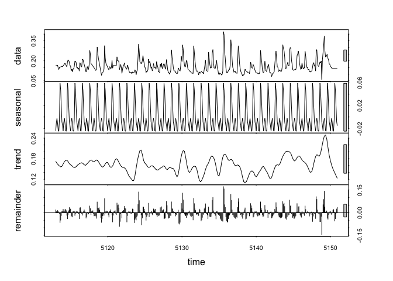<!-- -->

``` r
ndvi_full$trend <- as.numeric(ndvi_decomp$trend)

ggplot(ndvi_full, aes(newdate, trend)) +
 # geom_line() +
  geom_line( color = "green") 
```

    ## Warning: Removed 12 row(s) containing missing values (geom_path).

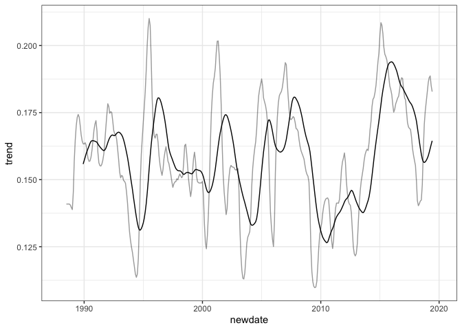<!-- -->

``` r
ndvi_full <- ndvi_full %>%
  mutate(era = ifelse(year < 1996, "a", ifelse(year < 2010, "b", "c")))

ndvi_full <- ndvi_full %>%
  group_by(era) %>%
  mutate(meantrend = mean(trend, na.rm = T),
            sdtrend = sd(trend, na.rm = T)) %>%
  ungroup()

ggplot(ndvi_full, aes(newdate, trend)) +
 # geom_line() +
  geom_line( color = "green") 
```

    ## Warning: Removed 12 row(s) containing missing values (geom_path).

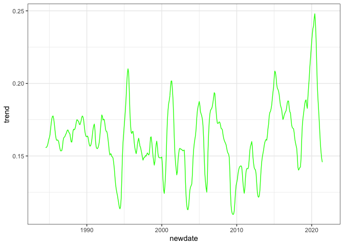<!-- -->

``` r
ndvi_gam <- gam(trend ~ s(as.numeric(newdate), k = 10), data = ndvi_full)

plot(ndvi_gam$fitted.values)
```

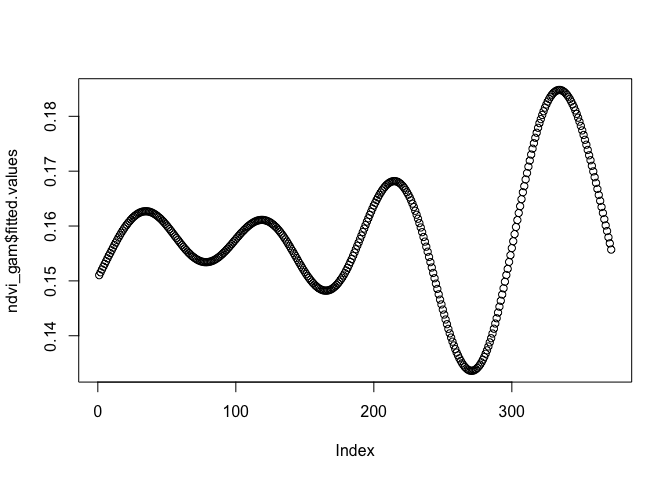<!-- -->

## diff

``` r
ndvi_ts <- ts(ndvi_full$ndvi_difference, start = ndvi_full$newdate[1], frequency = 12)

ndvi_ts_interp <- imputeTS::na_interpolation(ndvi_ts)

ndvi_decomp <- decompose(ndvi_ts_interp, type = "additive")

ndvi_stl <- stl(ndvi_ts_interp, "periodic")

plot(ndvi_decomp)
```

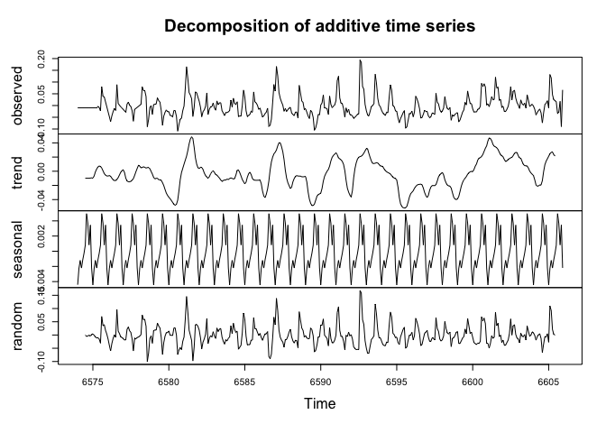<!-- -->

``` r
plot(ndvi_stl)
```

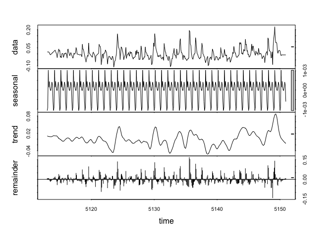<!-- -->

``` r
ndvi_full$trend <- as.numeric(ndvi_decomp$trend)

ggplot(ndvi_full, aes(newdate, trend)) +
 # geom_line() +
  geom_line( color = "green") 
```

    ## Warning: Removed 12 row(s) containing missing values (geom_path).

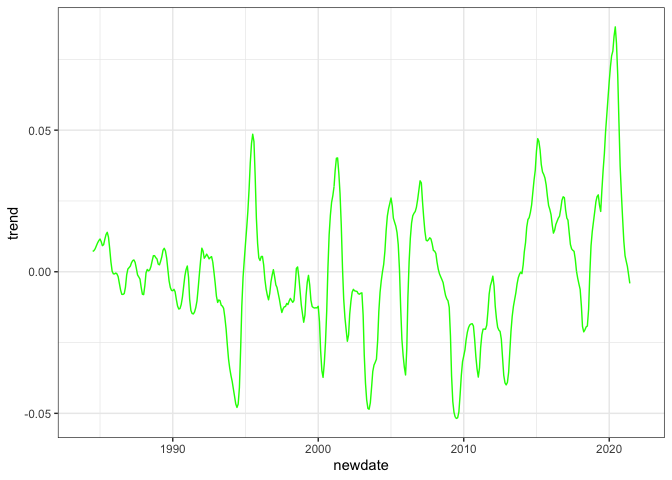<!-- -->

``` r
ndvi_full <- ndvi_full %>%
  mutate(era = ifelse(year < 1996, "a", ifelse(year < 2010, "b", "c")))

ndvi_full %>%
  group_by(era) %>%
  summarize(meantrend = mean(trend, na.rm = T),
            sdtrend = sd(trend, na.rm = T)) %>%
  ungroup()
```

    ## # A tibble: 3 x 3
    ##   era   meantrend sdtrend
    ##   <chr>     <dbl>   <dbl>
    ## 1 a      -0.00175  0.0162
    ## 2 b      -0.00602  0.0209
    ## 3 c       0.00806  0.0291

``` r
ggplot(ndvi_full, aes(newdate, trend)) +
 # geom_line() +
  geom_line( color = "green") 
```

    ## Warning: Removed 12 row(s) containing missing values (geom_path).

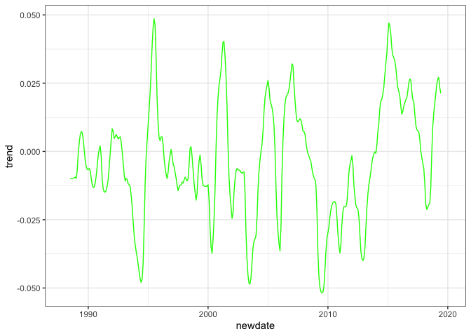<!-- -->

``` r
ndvi_gam <- gam(trend ~ s(as.numeric(newdate), k = 10), data = ndvi_full)

plot(ndvi_gam$fitted.values)
```

<!-- -->
