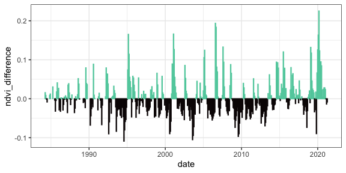

ndvi anomaly
================

## Summary

NDVI shows an extended (but noisy) low coinciding with the 2010 drought,
followed by *highs* in the wet period in the mid 2010s.

## Anomaly

<!-- --><!-- -->

(The second plot removes the facet panels to look more carefully at the
2008-2010 period.)

<!-- ## TS decompositon -->

<!-- ```{r} -->

<!-- ndvi_full <- expand.grid( -->

<!--   year = c(min(ndvi_dat$year) : max(ndvi_dat$year)), -->

<!--   month = c(1:12) -->

<!-- ) %>% -->

<!--   left_join(mutate(ndvi_dat, month = as.numeric(month), year = as.numeric(year))) %>% -->

<!--   mutate(datestr = paste0(year, "-01-", month)) %>% -->

<!--   mutate(newdate = as.Date(datestr, format = "%Y-%d-%m")) %>% -->

<!--   arrange(newdate) %>% -->

<!--   mutate(oera = ifelse(year < 1996, "a", ifelse(year < 2010, "b", "c"))) -->

<!-- ndvi_ts <- ts(ndvi_full$ndvi, start = ndvi_full$newdate[1], frequency = 12) -->

<!-- ndvi_ts_interp <- imputeTS::na_interpolation(ndvi_ts) -->

<!-- ndvi_decomp <- decompose(ndvi_ts_interp, type = "additive") -->

<!-- #plot(ndvi_decomp) -->

<!-- ndvi_full$no_seasonal <- as.numeric(ndvi_decomp$trend) + as.numeric(ndvi_decomp$random) -->

<!-- ndvi_full$trend <- as.numeric(ndvi_decomp$trend) -->

<!-- ndvi_full <- ndvi_full %>% -->

<!--   mutate(longterm_noseasonal = mean(ndvi_full$no_seasonal, na.rm = T)) %>% -->

<!--   mutate(noseasonal_diff = no_seasonal - longterm_noseasonal) -->

<!-- ggplot(ndvi_full, aes(newdate, noseasonal_diff, color = noseasonal_diff > 0)) + -->

<!--   geom_col() + -->

<!--   scale_color_viridis_d(option = "mako", end = .8) + -->

<!--   theme(legend.position = "none") + era_grid -->

<!-- ``` -->
