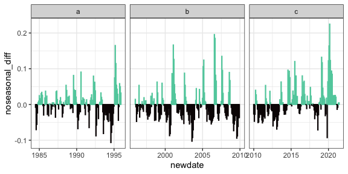

ndvi anomaly
================

## Anomaly

<!-- -->

## TS decompositon

    ## Joining, by = c("year", "month")

    ## Registered S3 method overwritten by 'quantmod':
    ##   method            from
    ##   as.zoo.data.frame zoo

    ## Warning: Removed 12 rows containing missing values (position_stack).

<!-- -->
