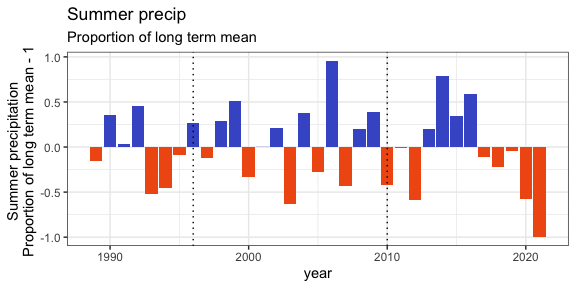
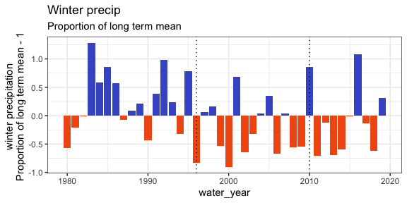
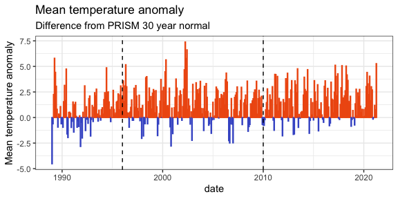
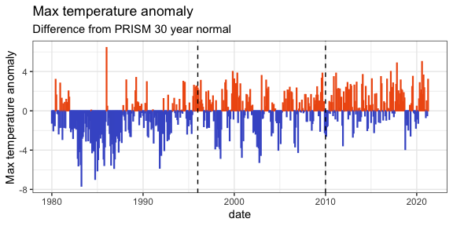
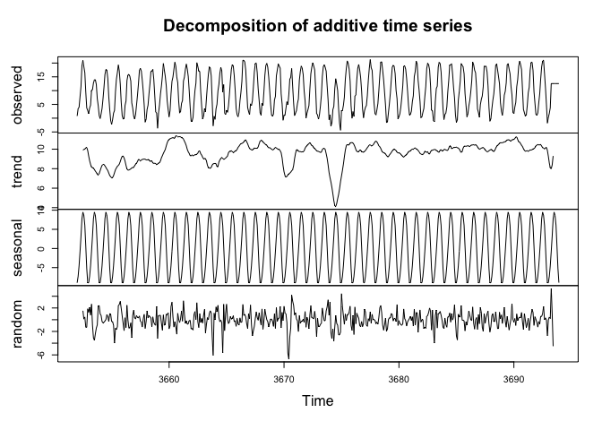
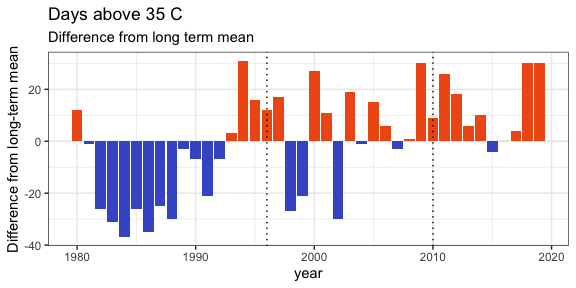

Other climate variables
================

  - [Summary](#summary)
  - [Precipitation](#precipitation)
      - [Precip anomaly](#precip-anomaly)
      - [Summer precip](#summer-precip)
      - [Winter precip](#winter-precip)
  - [Temperature](#temperature)
      - [Mean temp](#mean-temp)
      - [Max temp](#max-temp)
      - [Min temp](#min-temp)
      - [Days above 35 C](#days-above-35-c)

## Summary

Precipitation and min temp seem to have had a low/high period since
2010, respectively. The number of days \> 35 C have increased since the
early 2000s. Mean and min temps have may have weakly increased, but it’s
iffy.

None of these shifts is as pronounced as the shift towards lower precip
and higher temps seen from the late 1980s - early 1990s.

I think the drought index captures this story more succintly.

## Precipitation

### Precip anomaly

All of the anomalies come from `portalr::weather()`. Major hat tip to
Glenda for writing that function and putting me on this approach to
plotting anomalies (see also the aesthetic for NDVI, drought.)

Monthly precip / PRISM 30-year normal.

<!-- -->

### Summer precip

Calculated as the total precipitation from April-September each year,
visualized as the proportion of the long term mean.

There is a notable drop approaching 2020, but note that 2005-2015 is not
extraordinary compared to the 1990s-2000s.

<!-- -->

### Winter precip

Calculated as the total precipitation from October-March the following
year, visualized as the proportion of the long term mean.

<!-- -->

## Temperature

### Mean temp

Based on PRISM 30-year normal.

<!-- -->

### Max temp

<!-- -->

### Min temp

<!-- -->

### Days above 35 C

The number of days each year when the max temp exceeded 35C.

<!-- -->
