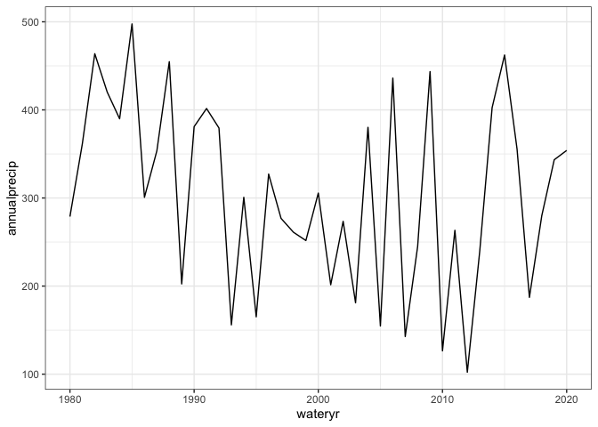
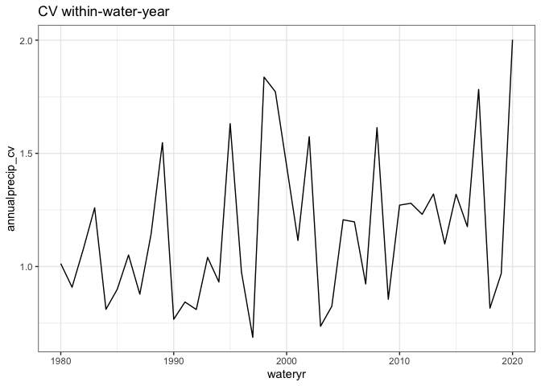
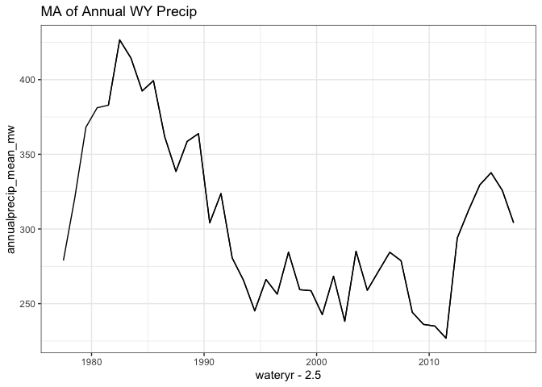
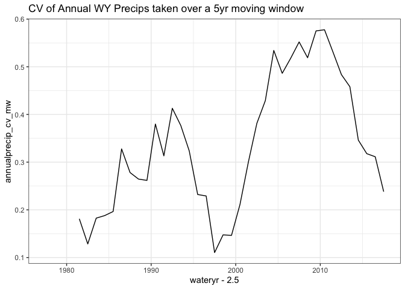
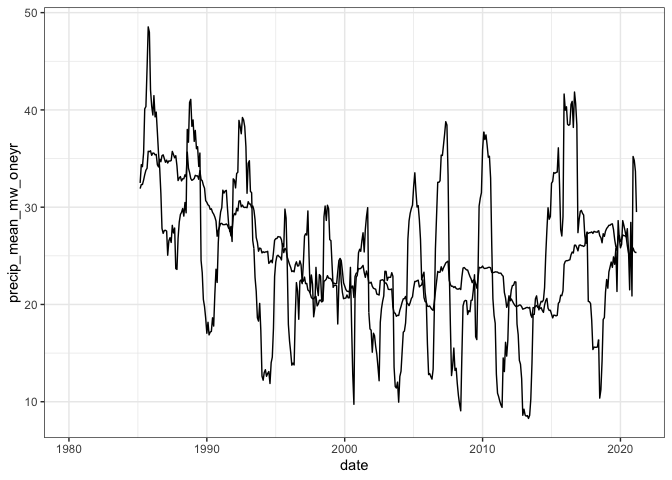
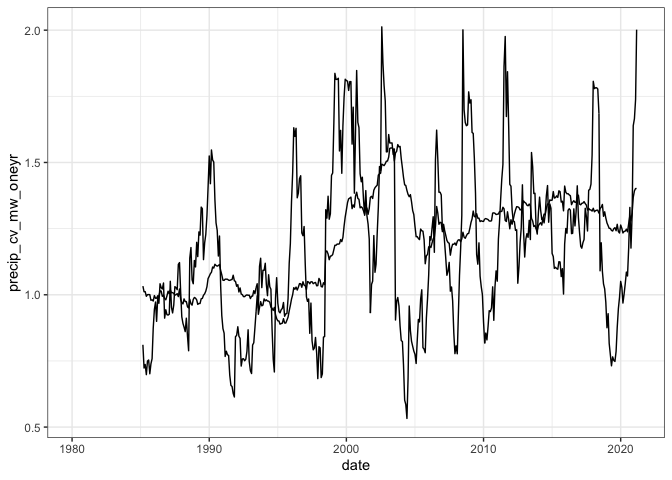

ndvi anomaly
================

``` r
weather <- weather(level = "monthly", fill = T)

weather <- weather %>%
    dplyr::mutate(date = format(lubridate::parse_date_time(paste(month, year, sep=" "),
                                                           orders = c("m/Y")), "%m-%Y")) %>%
    dplyr::mutate(date = as.Date(paste("01",date,sep="-"), format="%d-%m-%Y"))  %>%
  mutate(numdate = as.numeric(date))

weather_wy <- weather %>%
  mutate(wateryr = ifelse(month < 4, year - 1, year))

precip_wy <- weather_wy %>%
  group_by(wateryr) %>%
  summarize(annualprecip = sum(precipitation),
            annualprecip_sd = sd(precipitation),
            annualprecip_mean = mean(precipitation),
            annualprecip_cv = sd(precipitation) / mean(precipitation),
            nmo = dplyr::n()) %>%
  filter(nmo == 12) # remove incomplete years (ends)

ggplot(precip_wy, aes(wateryr, annualprecip)) +
  geom_line()
```

<!-- -->

``` r
ggplot(precip_wy, aes(wateryr, annualprecip_cv)) +
  geom_line() +
  ggtitle("CV within-water-year")
```

<!-- -->

``` r
precip_wy_cv_ma <- precip_wy %>%
  mutate(annualprecip_mean_mw = NA,
         annualprecip_cv_mw = NA,
         annualprecip_ma = maopts(annualprecip, n = 5))

for(i in 5:nrow(precip_wy)) {
  
  window <- precip_wy[c((i-4) : i),]
  
  precip_wy_cv_ma$annualprecip_mean_mw[i] = mean(window$annualprecip)
    precip_wy_cv_ma$annualprecip_cv_mw[i] = sd(window$annualprecip) / mean(window$annualprecip)

}

ggplot(precip_wy_cv_ma, aes(wateryr - 2.5, annualprecip_mean_mw)) +
  geom_line() +
  geom_line(aes(y = annualprecip_ma)) +
  ggtitle("MA of Annual WY Precip")
```

    ## Warning: Removed 4 row(s) containing missing values (geom_path).

<!-- -->

``` r
ggplot(precip_wy_cv_ma, aes(wateryr - 2.5, annualprecip_cv_mw)) +
  geom_line() +
  ggtitle("CV of Annual WY Precips taken over a 5yr moving window")
```

    ## Warning: Removed 4 row(s) containing missing values (geom_path).

<!-- -->

``` r
precip_monthly_cv_ma <- weather_wy %>%
  filter(wateryr > 1979, wateryr < 2021)%>%
  mutate(precip_mean_mw_fiveyr = NA,
         precip_cv_mw_fiveyr = NA,
         annualprecip_ma_fiveyr = maopts(precipitation, n = 60),
         precip_mean_mw_oneyr = NA,
         precip_cv_mw_oneyr = NA,
         annualprecip_ma_oneyr = maopts(precipitation, n = 12))

for(i in 60:nrow(precip_monthly_cv_ma)) {
  
  window <- precip_monthly_cv_ma[c((i-59) : i),]
  
  precip_monthly_cv_ma$precip_mean_mw_fiveyr[i] = mean(window$precipitation)
    precip_monthly_cv_ma$precip_cv_mw_fiveyr[i] = sd(window$precipitation) / mean(window$precipitation)

    
      window <- precip_monthly_cv_ma[c((i-11) : i),]

  precip_monthly_cv_ma$precip_mean_mw_oneyr[i] = mean(window$precipitation)
    precip_monthly_cv_ma$precip_cv_mw_oneyr[i] = sd(window$precipitation) / mean(window$precipitation)

    
}

ggplot(precip_monthly_cv_ma, aes(date, precip_mean_mw_oneyr)) +
  geom_line() +
  geom_line(aes(y = precip_mean_mw_fiveyr))
```

    ## Warning: Removed 59 row(s) containing missing values (geom_path).

    ## Warning: Removed 59 row(s) containing missing values (geom_path).

<!-- -->

``` r
ggplot(precip_monthly_cv_ma, aes(date, precip_cv_mw_oneyr)) +
  geom_line() +
  geom_line(aes(y = precip_cv_mw_fiveyr))
```

    ## Warning: Removed 59 row(s) containing missing values (geom_path).
    
    ## Warning: Removed 59 row(s) containing missing values (geom_path).

<!-- -->
