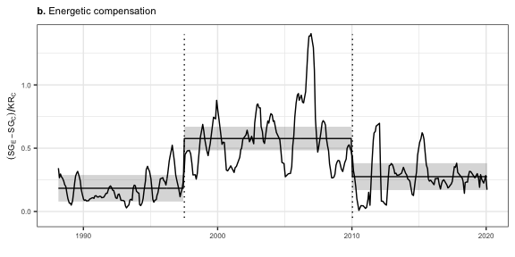
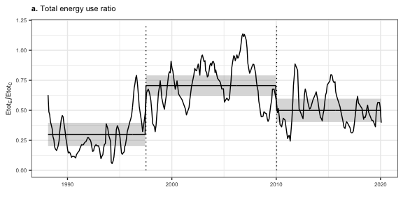
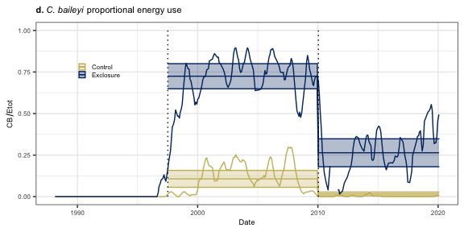
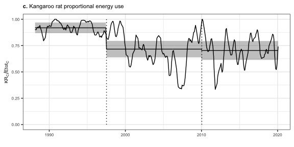
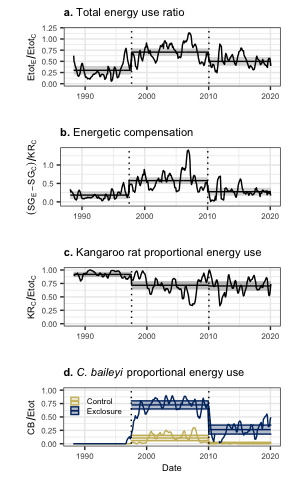

Figures for main text
================

  - [Figures](#figures)
      - [Compensation and total energy
        use](#compensation-and-total-energy-use)
          - [Compensation](#compensation)
          - [Total energy ratio](#total-energy-ratio)
      - [Rodent community composition](#rodent-community-composition)
          - [C. baileyi](#c-baileyi)
          - [Dipodomys](#dipodomys)
      - [Full figure](#full-figure)

# Figures

## Compensation and total energy use

Lines are 6-month moving averages. Horizontal lines + ribbons are means
and SE or CL from GLM or GLS.

### Compensation

**Compensation** refers to compensatory gains in energy use by small
granivores on exclosure plots relative to controls. Calculated as
\(\frac{SmgranExclosure - SmgranControl}{DipoControl}\), where
\(SmgranExclosure\) is total energy used by small granivores on
exclosure plots, \(SmgranControl\) is total energy used by small
granivores on control plots, and \(DipoControl\) is total energy used by
kangaroo rats (genus *Dipodomys*) on control plots.

    ## Joining, by = "oera"

<!-- -->

### Total energy ratio

**Total energy** refers to the overall loss in energy use caused by
kangaroo rat removal, or the ratio
\(\frac{TotalEnergyExclosure}{TotalEnergyControl}\) where
\(TotalEnergy\) is the total energy use by all rodents on exclosure and
control plots.

    ## Joining, by = "oera"

<!-- -->

## Rodent community composition

### C. baileyi

    ## Warning in eval(family$initialize): non-integer #successes in a binomial glm!

    ## Joining, by = c("oera", "oplottype")

    ## Joining, by = c("oplottype", "period", "censusdate", "pb_prop_ma")

    ## Warning: Removed 228 row(s) containing missing values (geom_path).

<!-- -->

### Dipodomys

    ## Warning in eval(family$initialize): non-integer #successes in a binomial glm!

    ## Joining, by = "oera"

<!-- -->

## Full figure

    ## Setting row to 1

    ## Setting column to 1

    ## Setting row to 2

    ## Setting column to 1

    ## Setting row to 3

    ## Setting column to 1

    ## Setting row to 4

    ## Setting column to 1

    ## Warning: Removed 228 row(s) containing missing values (geom_path).

<!-- -->
