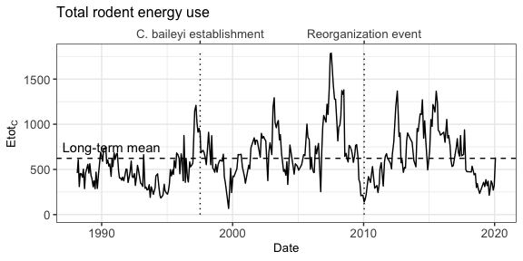
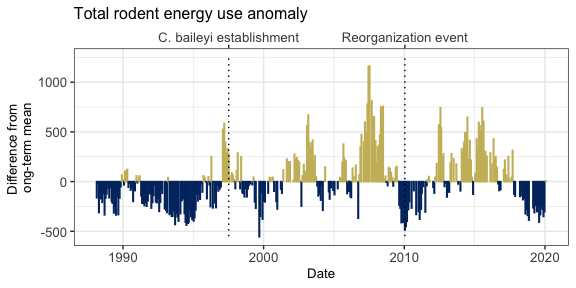
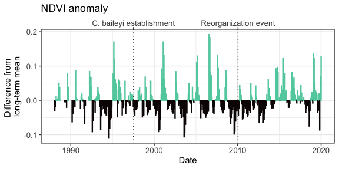
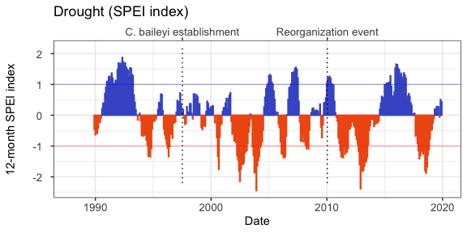
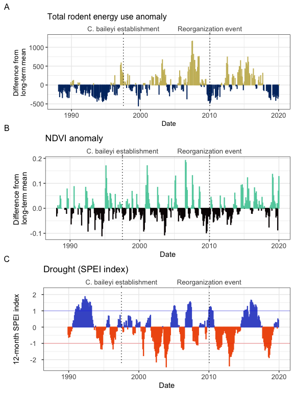

Covariates of rodent community change
================

  - [Total rodent abundance](#total-rodent-abundance)
  - [NDVI](#ndvi)
  - [Drought (SPEI index)](#drought-spei-index)
  - [All plots](#all-plots)

# Total rodent abundance

<!-- --><!-- -->

# NDVI

<!-- -->

# Drought (SPEI index)

    ## Loading required package: lmomco

    ## Loading required package: parallel

    ## # Package SPEI (1.7) loaded [try SPEINews()].

    ## Joining, by = c("year", "month")

    ## Registered S3 method overwritten by 'quantmod':
    ##   method            from
    ##   as.zoo.data.frame zoo

    ## Joining, by = "year"

    ## Warning: Removed 22 rows containing missing values (position_stack).

    ## Warning: Removed 1 rows containing missing values (geom_col).

<!-- -->

# All plots

    ## Setting row to 1

    ## Setting column to 1

    ## Setting row to 2

    ## Setting column to 1

    ## Setting row to 3

    ## Setting column to 1

    ## Warning: Removed 22 rows containing missing values (position_stack).

    ## Warning: Removed 1 rows containing missing values (geom_col).

<!-- -->
