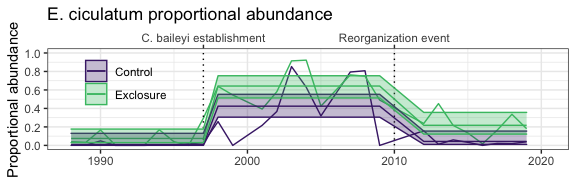

Erodium
================

  - [Treatment levels](#treatment-levels)

``` r
library(dplyr)
```

    ## 
    ## Attaching package: 'dplyr'

    ## The following objects are masked from 'package:stats':
    ## 
    ##     filter, lag

    ## The following objects are masked from 'package:base':
    ## 
    ##     intersect, setdiff, setequal, union

``` r
library(soar)
library(ggplot2)
knitr::opts_chunk$set(echo = FALSE, fig.dim = c(6, 3))

theme_set(theme_bw())

era_grid <-   facet_grid(cols = vars(oera), space = "free", scales = "free_x")
both_scale <- scale_color_viridis_d(begin = .1, end = .8)
both_fscale <- scale_fill_viridis_d(begin = .1, end = .8)

era_df <- make_era_df() %>%
  mutate(year = format.Date(event_date, "%Y")) %>%
  mutate(year = as.integer(year))
```

    ## Loading in data version 2.95.0

    ## Joining, by = "plot"

    ## Loading in data version 2.95.0
    ## Loading in data version 2.95.0

    ## Joining, by = "plot"

    ## Joining, by = c("year", "season", "plot")

    ## Joining, by = "year"

# Treatment levels

Gaps are for censuses in 1996, 2000, 2006, and 2011 where plots were
censused but no individuals were found (of any species).

The interaction between plottype and era is not significant, so dropping
it:

<div class="kable-table">

| Resid. Df | Resid. Dev |  Df |    Deviance | Pr(\>Chi) |
| --------: | ---------: | --: | ----------: | --------: |
|        49 |   8.825256 |  NA |          NA |        NA |
|        51 |   9.125314 | \-2 | \-0.3000576 | 0.3983751 |

</div>

    ## Joining, by = c("period", "oplottype")

    ## Joining, by = c("period", "oplottype", "oera")

<!-- -->

<div class="kable-table">

| oera           | oplottype |      prob |        SE |  df | asymp.LCL | asymp.UCL |
| :------------- | :-------- | --------: | --------: | --: | --------: | --------: |
| a\_pre\_pb     | CC        | 0.0214594 | 0.0107953 | Inf | 0.0003010 | 0.0426177 |
| b\_pre\_reorg  | CC        | 0.3932264 | 0.0578821 | Inf | 0.2797796 | 0.5066733 |
| c\_post\_reorg | CC        | 0.0691380 | 0.0243978 | Inf | 0.0213192 | 0.1169568 |
| a\_pre\_pb     | EE        | 0.0652294 | 0.0280600 | Inf | 0.0102329 | 0.1202260 |
| b\_pre\_reorg  | EE        | 0.6734300 | 0.0551609 | Inf | 0.5653165 | 0.7815435 |
| c\_post\_reorg | EE        | 0.1911589 | 0.0495320 | Inf | 0.0940780 | 0.2882398 |

</div>

<div class="kable-table">

| contrast                       | oplottype |    estimate |        SE |  df |     z.ratio |   p.value |
| :----------------------------- | :-------- | ----------: | --------: | --: | ----------: | --------: |
| a\_pre\_pb - b\_pre\_reorg     | CC        | \-0.3717670 | 0.0556879 | Inf |  \-6.675904 | 0.0000000 |
| a\_pre\_pb - c\_post\_reorg    | CC        | \-0.0476786 | 0.0238026 | Inf |  \-2.003086 | 0.1114336 |
| b\_pre\_reorg - c\_post\_reorg | CC        |   0.3240885 | 0.0539333 | Inf |    6.009057 | 0.0000000 |
| a\_pre\_pb - b\_pre\_reorg     | EE        | \-0.6082006 | 0.0591687 | Inf | \-10.279099 | 0.0000000 |
| a\_pre\_pb - c\_post\_reorg    | EE        | \-0.1259295 | 0.0557680 | Inf |  \-2.258093 | 0.0618588 |
| b\_pre\_reorg - c\_post\_reorg | EE        |   0.4822711 | 0.0667785 | Inf |    7.221956 | 0.0000000 |

</div>
