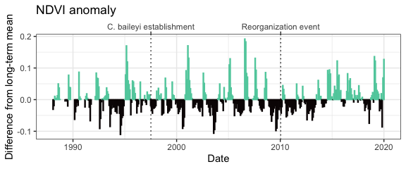
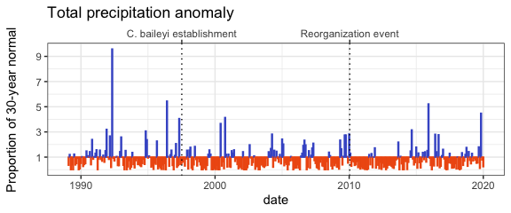
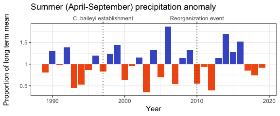
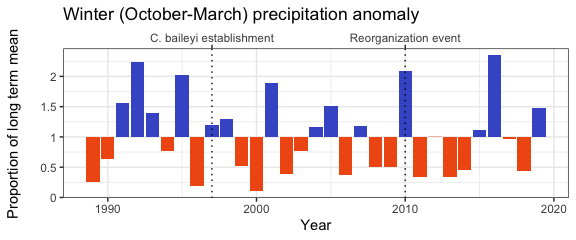
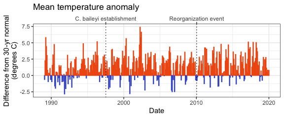
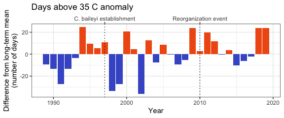
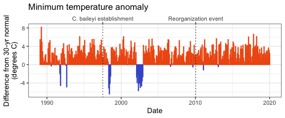
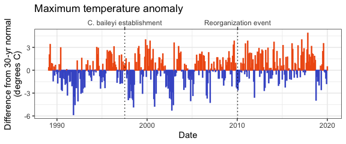

NDVI and other climate variables
================

  - [NDVI](#ndvi)
  - [Precipitation](#precipitation)
      - [Total precipitation](#total-precipitation)
      - [Summer precipitation](#summer-precipitation)
      - [Winter precipitation](#winter-precipitation)
  - [Temperature](#temperature)
      - [Mean temperature](#mean-temperature)
      - [Days above 35 C](#days-above-35-c)
      - [Min temperature](#min-temperature)
      - [Max temperature](#max-temperature)
  - [References](#references)

# NDVI

<!-- -->

Monthly NDVI (mean NDVI from Landsat 5, 7, and 8) difference from
long-term mean for each month from January 1988-January 2020.

# Precipitation

## Total precipitation

<!-- -->

Monthly precipitation anomaly as a proportion of the 30-year PRISM
normal.

## Summer precipitation

<!-- -->

Summer precipitation (total precipitation from April-September per year)
as a proportion of the long-term mean.

## Winter precipitation

<!-- -->

Winter precipitation (total precipitation from October-March the
following year) as a proportion of the long-term mean.

# Temperature

## Mean temperature

<!-- -->

Mean temperature anomaly as difference from the 30-year PRISM normal.

## Days above 35 C

<!-- -->

Number of days per calendar year when maximum temperature \> 35C;
anomaly calculated as difference from long term mean.

## Min temperature

<!-- -->

Min temperature anomaly as difference from the 30-year PRISM normal.

## Max temperature

<!-- -->

Max temperature anomaly as difference from the 30-year PRISM normal.

# References

PRISM Climate Group, Oregon State University,
<http://prism.oregonstate.edu>, Norm81m (Monthly and annual 1981-2010
Normals), active as of October 2019, latest release date July 2012.
