plant ca
================

``` r
library(dplyr)
```

    ## Warning: package 'dplyr' was built under R version 4.0.5

    ## 
    ## Attaching package: 'dplyr'

    ## The following objects are masked from 'package:stats':
    ## 
    ##     filter, lag

    ## The following objects are masked from 'package:base':
    ## 
    ##     intersect, setdiff, setequal, union

``` r
library(ggplot2)
```

    ## Warning: package 'ggplot2' was built under R version 4.0.5

``` r
library(soar)
library(vegan)
```

    ## Loading required package: permute

    ## Loading required package: lattice

    ## This is vegan 2.5-6

``` r
winter <- soar::get_plants_plots()
```

    ## Loading in data version 2.94.0

    ## Joining, by = "plot"

``` r
winter <- winter %>%
filter(combined_trt %in% c("CC", "EE")) 

plantnames <- colnames(winter)[5:ncol(winter)]

replace_na <- function(aval) {
  if(is.na(aval)) {
    return(0)
  } else {
  return(aval)
  }
}

winter_full <- expand.grid(year = unique(winter$year),
                           plot = unique(winter$plot)) %>%
  left_join(distinct(select(winter, plot, combined_trt, season))) %>%
  left_join(winter) %>%
  group_by_all() %>%
  mutate_at(plantnames, replace_na) %>%
  ungroup()
```

    ## Joining, by = "plot"

    ## Joining, by = c("year", "plot", "combined_trt", "season")

``` r
wintertrts <- winter_full %>%
  group_by(combined_trt, year, season) %>%
  mutate_at(plantnames, sqrt) %>%
  summarize_at(plantnames, mean) %>%
  ungroup()

# working from - following Erica - 
# another example: https://rgriff23.github.io/2017/05/23/mosquito-community-ecology-in-vegan.html

winter.trts.abundance.matrix <- wintertrts %>%
  select(-(c(year, season, combined_trt))) %>%
  mutate(rs = rowSums(.)) %>%
  filter(rs > 0) %>%
  select(-rs)

winter.abundance.matrix <- winter_full %>%
  select(-(c(plot, year, season, combined_trt)))  %>%
  mutate(rs = rowSums(.)) %>%
  filter(rs > 0) %>%
  select(-rs) %>%
  mutate_all(sqrt)

winter.ca <- cca(winter.abundance.matrix)

barplot(winter.ca$CA$eig / winter.ca$tot.chi, names.arg = 1:winter.ca$CA$rank, cex.names = 0.5)
```

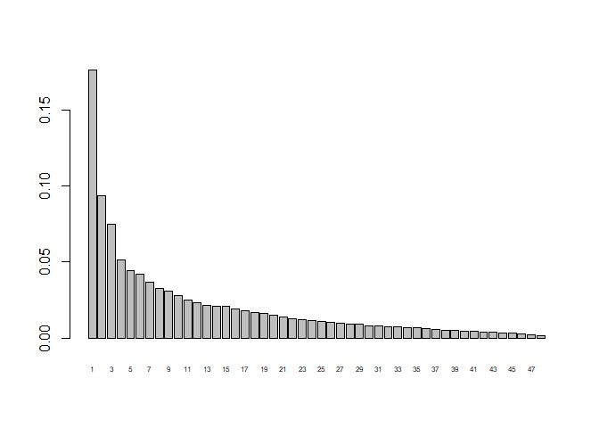<!-- -->

``` r
winter.ca$CA$eig / winter.ca$tot.chi
```

    ##         CA1         CA2         CA3         CA4         CA5         CA6 
    ## 0.176177738 0.093812803 0.074742068 0.051360369 0.044381516 0.041766451 
    ##         CA7         CA8         CA9        CA10        CA11        CA12 
    ## 0.036542987 0.032536869 0.030585841 0.027992409 0.025005928 0.023334118 
    ##        CA13        CA14        CA15        CA16        CA17        CA18 
    ## 0.021295749 0.020934523 0.020645508 0.019160853 0.017803128 0.017036945 
    ##        CA19        CA20        CA21        CA22        CA23        CA24 
    ## 0.016031902 0.014820168 0.013624163 0.012389601 0.011869397 0.011287229 
    ##        CA25        CA26        CA27        CA28        CA29        CA30 
    ## 0.011015913 0.010420853 0.009659234 0.009164590 0.008859021 0.008080326 
    ##        CA31        CA32        CA33        CA34        CA35        CA36 
    ## 0.007906933 0.007522004 0.007231528 0.007058577 0.006504587 0.006268095 
    ##        CA37        CA38        CA39        CA40        CA41        CA42 
    ## 0.005692719 0.005300633 0.005108463 0.004575760 0.004311489 0.004051173 
    ##        CA43        CA44        CA45        CA46        CA47        CA48 
    ## 0.003668203 0.003289847 0.003071052 0.002563879 0.002021265 0.001515592

``` r
tcols <- data.frame(combined_trt = c("CC", "EE"),
                    tcol = terrain.colors(2)) %>%
  right_join(select(wintertrts, combined_trt))
```

    ## Joining, by = "combined_trt"

``` r
layout(matrix(1:2, 1, 1))
plot(winter.ca, display = "sites", scaling = "sites", type = "t")
```

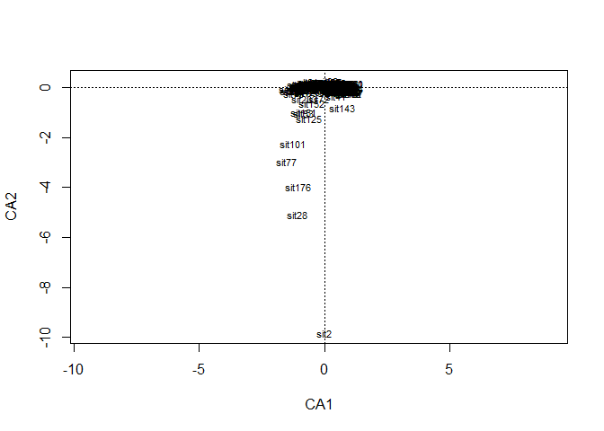<!-- -->

``` r
preds <-  winter_full %>%
  mutate(rs = rowSums(select(winter_full, -c(plot, year, season, combined_trt)))) %>%
  filter(rs > 0) %>%
  select(-rs) %>%
  select((c(plot, year, combined_trt)))%>%
  mutate(rod_era = as.ordered(ifelse(year < 1997, "a",
                                     ifelse(year < 2010, "b",
                                            "c"))),
         fiveyr_era = as.ordered(ceiling((year - 1989.5) / 4)),
         fyear = as.ordered(year))

winter.ca.scores <- as.data.frame(scores(winter.ca, display = "sites", scaling = "sites")) %>%
  cbind(preds)

ggplot(winter.ca.scores, aes(CA1, CA2, color = rod_era)) + 
  geom_point()  +
  stat_ellipse() +
    ylim(-2.5, 1) +
  facet_wrap(vars(combined_trt))
```

    ## Warning: Removed 4 rows containing non-finite values (stat_ellipse).

    ## Warning: Removed 4 rows containing missing values (geom_point).

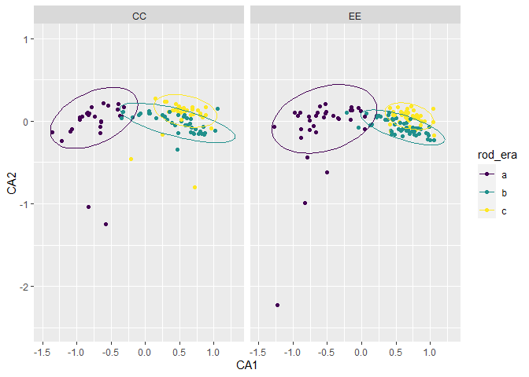<!-- -->

``` r
winter.ca.trt <- cca(winter.trts.abundance.matrix)
predstrt <- wintertrts %>%
 mutate(rs = rowSums(select(wintertrts, -(c(year, season, combined_trt))))) %>%
  filter(rs > 0) %>%
  select(-rs) %>%
  select((c( year, combined_trt)))%>%
  mutate(rod_era = as.ordered(ifelse(year < 1997, "a",
                                     ifelse(year < 2010, "b",
                                            "c"))),
         fiveyr_era = as.ordered(ceiling((year - 1989.5) / 4)))


winter.ca.trt.scores <- as.data.frame(scores(winter.ca.trt, display = "sites", scaling = "sites")) %>%
  cbind(predstrt)
  
ggplot(winter.ca.trt.scores, aes(CA1, CA2, color = rod_era)) + 
  geom_point()  +
stat_ellipse() +
    facet_wrap(vars(combined_trt))
```

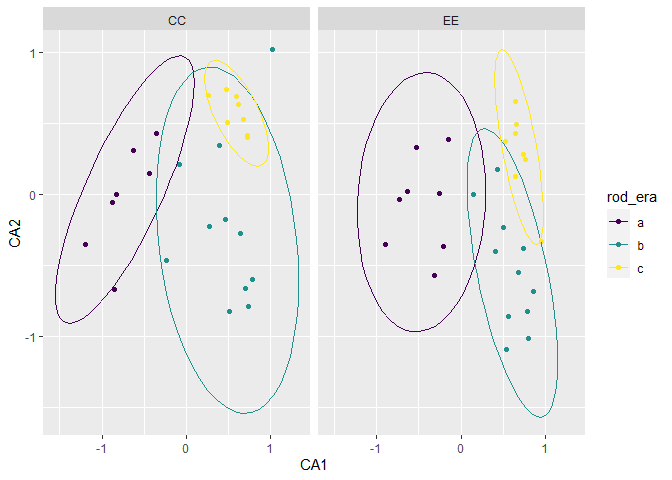<!-- -->

``` r
#### cca ####


winter.cca <- cca(winter.abundance.matrix ~ ., data = select(preds, combined_trt, rod_era))
winter.cca2 <- cca(winter.abundance.matrix ~ ., data = select(preds, rod_era))
winter.cca3 <- cca(winter.abundance.matrix ~ ., data = select(preds, combined_trt))

extractAIC(winter.cca)
```

    ## [1]    4.000 1074.927

``` r
extractAIC(winter.cca2)
```

    ## [1]    3.000 1077.772

``` r
extractAIC(winter.cca3)
```

    ## [1]    2.000 1117.673

``` r
vif.cca(winter.cca)
```

    ## combined_trtEE      rod_era.L      rod_era.Q 
    ##       1.000393       1.059662       1.059259

``` r
# none > 10

barplot(winter.cca$CA$eig / winter.cca$tot.chi)
```

<!-- -->

``` r
# MINISCULE. .08 of VAR. But, Erica's are like this too.

# var explained

winter.cca$CCA$tot.chi / winter.cca$tot.chi
```

    ## [1] 0.2013513

``` r
# perm test
anova(winter.cca, by = "margin")
```

    ## Permutation test for cca under reduced model
    ## Marginal effects of terms
    ## Permutation: free
    ## Number of permutations: 999
    ## 
    ## Model: cca(formula = winter.abundance.matrix ~ combined_trt + rod_era, data = select(preds, combined_trt, rod_era))
    ##               Df ChiSquare      F Pr(>F)    
    ## combined_trt   1   0.04220  4.810  0.001 ***
    ## rod_era        2   0.44757 25.506  0.001 ***
    ## Residual     222   1.94776                  
    ## ---
    ## Signif. codes:  0 '***' 0.001 '**' 0.01 '*' 0.05 '.' 0.1 ' ' 1

``` r
anova(winter.cca)
```

    ## Permutation test for cca under reduced model
    ## Permutation: free
    ## Number of permutations: 999
    ## 
    ## Model: cca(formula = winter.abundance.matrix ~ combined_trt + rod_era, data = select(preds, combined_trt, rod_era))
    ##           Df ChiSquare      F Pr(>F)    
    ## Model      3   0.49106 18.657  0.001 ***
    ## Residual 222   1.94776                  
    ## ---
    ## Signif. codes:  0 '***' 0.001 '**' 0.01 '*' 0.05 '.' 0.1 ' ' 1

``` r
winter.cca.scores <- as.data.frame(scores(winter.cca, display = "sites", scaling = "sites")) %>%
  cbind(preds)

ggplot(winter.cca.scores,aes(CCA1, CCA2)) + 
  stat_ellipse(aes(color = rod_era)) +
  geom_point(aes(color = rod_era)) +
  facet_wrap(vars(combined_trt))
```

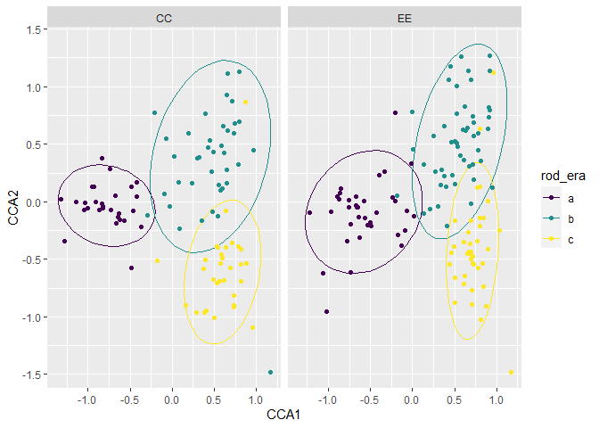<!-- -->

``` r
ggplot(winter.cca.scores, aes(CCA1, CCA2, color = rod_era)) + 
  geom_point()  +
  #  ylim(-1, 1) +
  facet_wrap(vars(combined_trt))
```

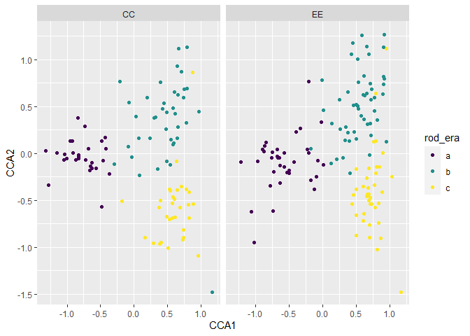<!-- -->

``` r
winter.cca <- cca(winter.abundance.matrix ~ ., data = select(preds, combined_trt, rod_era))

vif.cca(winter.cca)
```

    ## combined_trtEE      rod_era.L      rod_era.Q 
    ##       1.000393       1.059662       1.059259

``` r
# none > 10

barplot(winter.cca$CA$eig / winter.cca$tot.chi)
```

<!-- -->

``` r
# MINISCULE. .08 of VAR. But, Erica's are like this too.

# var explained

winter.cca$CCA$tot.chi / winter.cca$tot.chi
```

    ## [1] 0.2013513

``` r
# perm test
anova(winter.cca, by = "margin")
```

    ## Permutation test for cca under reduced model
    ## Marginal effects of terms
    ## Permutation: free
    ## Number of permutations: 999
    ## 
    ## Model: cca(formula = winter.abundance.matrix ~ combined_trt + rod_era, data = select(preds, combined_trt, rod_era))
    ##               Df ChiSquare      F Pr(>F)    
    ## combined_trt   1   0.04220  4.810  0.001 ***
    ## rod_era        2   0.44757 25.506  0.001 ***
    ## Residual     222   1.94776                  
    ## ---
    ## Signif. codes:  0 '***' 0.001 '**' 0.01 '*' 0.05 '.' 0.1 ' ' 1

``` r
anova(winter.cca)
```

    ## Permutation test for cca under reduced model
    ## Permutation: free
    ## Number of permutations: 999
    ## 
    ## Model: cca(formula = winter.abundance.matrix ~ combined_trt + rod_era, data = select(preds, combined_trt, rod_era))
    ##           Df ChiSquare      F Pr(>F)    
    ## Model      3   0.49106 18.657  0.001 ***
    ## Residual 222   1.94776                  
    ## ---
    ## Signif. codes:  0 '***' 0.001 '**' 0.01 '*' 0.05 '.' 0.1 ' ' 1

``` r
winter.cca.trt <- cca(winter.trts.abundance.matrix ~ ., data = select(predstrt, combined_trt, rod_era))


vif.cca(winter.cca.trt)
```

    ## combined_trtEE      rod_era.L      rod_era.Q 
    ##       1.000404       1.060615       1.060201

``` r
# none > 10

barplot(winter.cca.trt$CA$eig / winter.cca.trt$tot.chi)
```

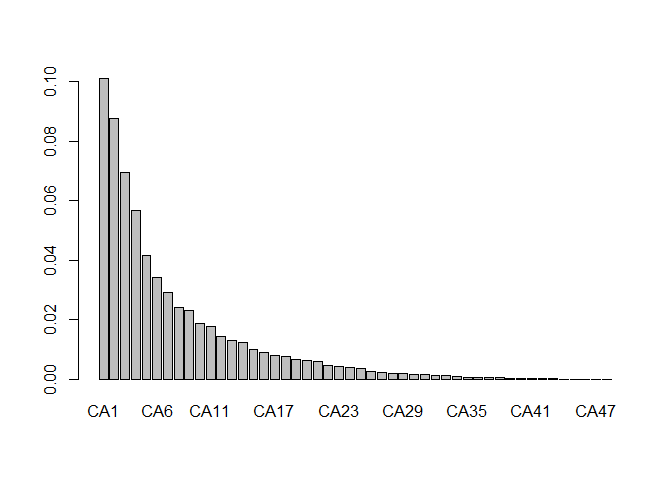<!-- -->

``` r
# MINISCULE. .08 of VAR. But, Erica's are like this too.

# var explained

winter.cca.trt$CCA$tot.chi / winter.cca.trt$tot.chi
```

    ## [1] 0.3694493

``` r
winter.cca.trt_scores <- as.data.frame(scores(winter.cca.trt, display = "sites", scaling = "sites")) %>%
  cbind(predstrt)

ggplot(winter.cca.trt_scores, aes(CCA1, CCA2, color = rod_era)) + 
  geom_point()  +
  stat_ellipse() +
  facet_wrap(vars(combined_trt))
```

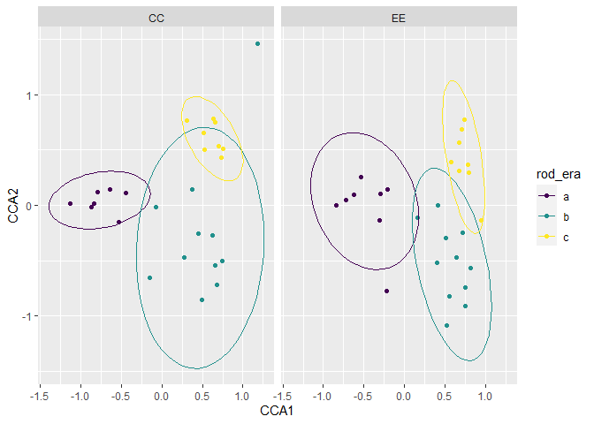<!-- -->

``` r
#### pcca ####

winter.pcca <- cca(winter.abundance.matrix, Y = select(preds, combined_trt, rod_era), Z = select(preds, plot))

winter.pcca2 <- cca(winter.abundance.matrix, Y = select(preds, combined_trt), Z = select(preds, plot))
winter.pcca3 <- cca(winter.abundance.matrix, Y = select(preds, rod_era), Z = select(preds, plot))

extractAIC(winter.pcca)
```

    ## [1]    5.000 1072.864

``` r
extractAIC(winter.pcca2)
```

    ## [1]    3.000 1116.478

``` r
extractAIC(winter.pcca3)
```

    ## [1]    4.000 1075.912

``` r
vif.cca(winter.pcca)
```

    ##           plot combined_trtEE      rod_era.L      rod_era.Q 
    ##       1.118309       1.118349       1.060206       1.059554

``` r
barplot(winter.pcca$CA$eig / winter.pcca$tot.chi)
```

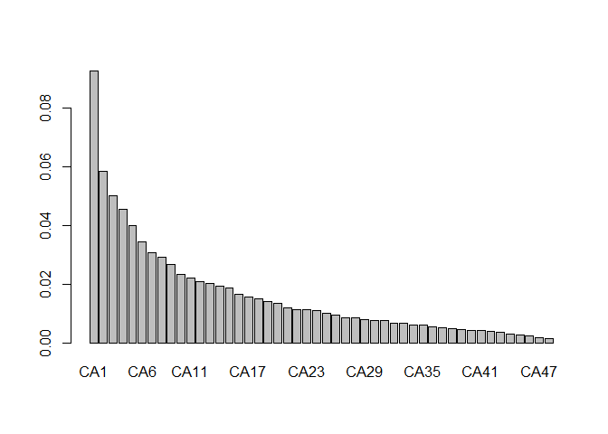<!-- -->

``` r
winter.pcca$CCA$tot.chi / winter.pcca$tot.chi
```

    ## [1] 0.2021187

``` r
anova(winter.pcca)
```

    ## Permutation test for cca under reduced model
    ## Permutation: free
    ## Number of permutations: 999
    ## 
    ## Model: cca(X = winter.abundance.matrix, Y = select(preds, combined_trt, rod_era), Z = select(preds, plot))
    ##           Df ChiSquare      F Pr(>F)    
    ## Model      3   0.49293 18.981  0.001 ***
    ## Residual 221   1.91306                  
    ## ---
    ## Signif. codes:  0 '***' 0.001 '**' 0.01 '*' 0.05 '.' 0.1 ' ' 1

``` r
winter.pcca2 <- cca(winter.abundance.matrix, Y = select(preds, combined_trt), Z = select(preds, plot))
winter.pcca3 <- cca(winter.abundance.matrix, Y = select(preds, rod_era), Z = select(preds, plot))


winter.pcca.scores <- as.data.frame(scores(winter.pcca, display = "sites", scaling = "sites")) %>%
  cbind(preds)

ggplot(winter.pcca.scores, aes(CCA1, CCA2, color = rod_era)) + 
  geom_point()  +
stat_ellipse() +  facet_wrap(vars(combined_trt))
```

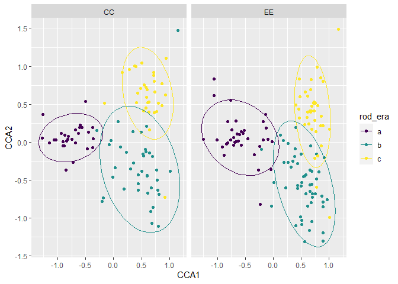<!-- -->

``` r
#### Summer ####

summer <- soar::get_plants_plots("summer")
```

    ## Loading in data version 2.94.0

    ## Joining, by = "plot"

``` r
summer <- summer %>%
  filter(combined_trt %in% c("CC", "EE")) 

plantnames <- colnames(summer)[5:ncol(summer)]


summer_full <- expand.grid(year = unique(summer$year),
                           plot = unique(summer$plot)) %>%
  left_join(distinct(select(summer, plot, combined_trt, season))) %>%
  left_join(summer) %>%
  group_by_all() %>%
  mutate_at(plantnames, replace_na) %>%
  ungroup()
```

    ## Joining, by = "plot"

    ## Joining, by = c("year", "plot", "combined_trt", "season")

``` r
summertrts <- summer_full %>%
  group_by(combined_trt, year, season) %>%
  mutate_at(plantnames, sqrt) %>%
  summarize_at(plantnames, mean) %>%
  ungroup()


summer.trts.abundance.matrix <- summertrts %>%
  select(-(c(year, season, combined_trt))) %>%
  mutate(rs = rowSums(.)) %>%
  filter(rs > 0) %>%
  select(-rs)

summer.abundance.matrix <- summer_full %>%
  select(-(c(plot, year, season, combined_trt)))  %>%
  mutate(rs = rowSums(.)) %>%
  filter(rs > 0) %>%
  select(-rs) %>%
  mutate_all(sqrt)

summer.ca <- cca(summer.abundance.matrix)

barplot(summer.ca$CA$eig / summer.ca$tot.chi, names.arg = 1:summer.ca$CA$rank, cex.names = 0.5)
```

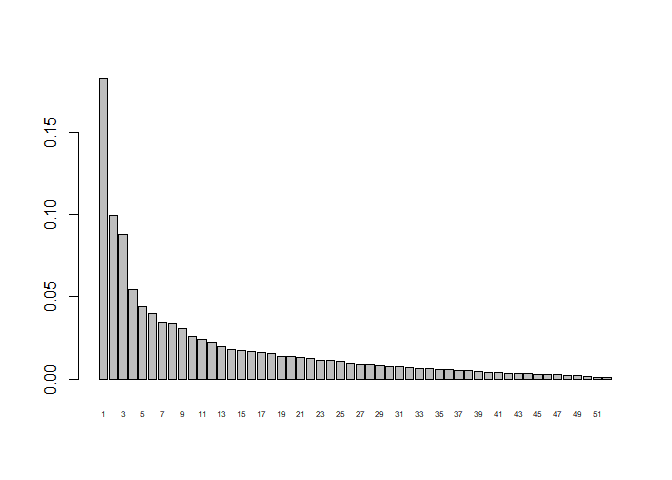<!-- -->

``` r
summer.ca$CA$eig / summer.ca$tot.chi
```

    ##          CA1          CA2          CA3          CA4          CA5          CA6 
    ## 0.1824312598 0.0992135270 0.0875989911 0.0542693632 0.0443301537 0.0398447703 
    ##          CA7          CA8          CA9         CA10         CA11         CA12 
    ## 0.0343107842 0.0336921023 0.0304570557 0.0260875099 0.0238939215 0.0220703387 
    ##         CA13         CA14         CA15         CA16         CA17         CA18 
    ## 0.0199338603 0.0181954110 0.0173304539 0.0165882180 0.0160420044 0.0153767286 
    ##         CA19         CA20         CA21         CA22         CA23         CA24 
    ## 0.0139029883 0.0137902709 0.0132968361 0.0126690583 0.0113252845 0.0111907697 
    ##         CA25         CA26         CA27         CA28         CA29         CA30 
    ## 0.0104285570 0.0096458752 0.0090576568 0.0088476774 0.0084619418 0.0077407970 
    ##         CA31         CA32         CA33         CA34         CA35         CA36 
    ## 0.0074032788 0.0070394193 0.0064612188 0.0062105316 0.0059625506 0.0056079648 
    ##         CA37         CA38         CA39         CA40         CA41         CA42 
    ## 0.0051730057 0.0050091874 0.0047116368 0.0041480636 0.0038500451 0.0035113638 
    ##         CA43         CA44         CA45         CA46         CA47         CA48 
    ## 0.0033466155 0.0033046215 0.0028961486 0.0028134089 0.0025673946 0.0024049128 
    ##         CA49         CA50         CA51         CA52 
    ## 0.0019817378 0.0014860190 0.0012147134 0.0008719951

``` r
summer_preds <-  summer_full %>%
  mutate(rs = rowSums(select(summer_full, -c(plot, year, season, combined_trt)))) %>%
  filter(rs > 0) %>%
  select(-rs) %>%
  select((c(plot, year, combined_trt)))%>%
  mutate(rod_era = as.ordered(ifelse(year < 1997, "a",
                                     ifelse(year < 2010, "b",
                                            "c"))),
         fiveyr_era = as.ordered(ceiling((year - 1989.5) / 4)))

summer.ca.scores <- as.data.frame(scores(summer.ca, display = "sites", scaling = "sites")) %>%
  cbind(summer_preds)

ggplot(summer.ca.scores, aes(CA1, CA2, color = rod_era)) + 
  geom_point()  +
stat_ellipse() +
    facet_wrap(vars(combined_trt))
```

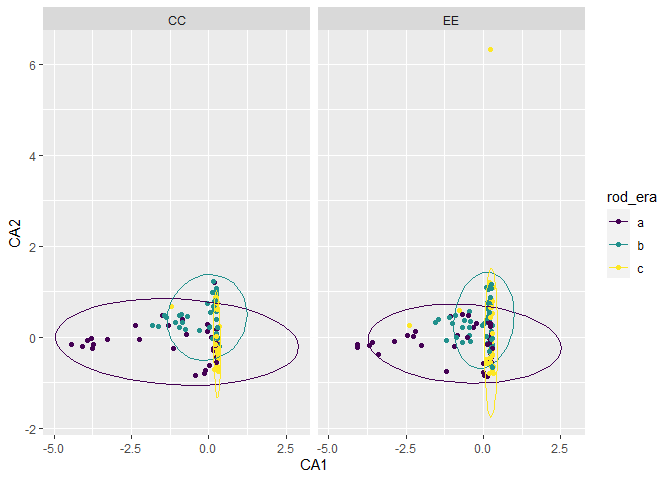<!-- -->

``` r
summer.ca.trt <- cca(summer.trts.abundance.matrix)
summer_predstrt <- summertrts %>%
  mutate(rs = rowSums(select(summertrts, -(c(year, season, combined_trt))))) %>%
  filter(rs > 0) %>%
  select(-rs) %>%
  select((c( year, combined_trt)))%>%
  mutate(rod_era = as.ordered(ifelse(year < 1997, "a",
                                     ifelse(year < 2010, "b",
                                            "c"))),
         fiveyr_era = as.ordered(ceiling((year - 1989.5) / 4)))


summer.ca.trt.scores <- as.data.frame(scores(summer.ca.trt, display = "sites", scaling = "sites")) %>%
  cbind(summer_predstrt)

ggplot(summer.ca.trt.scores, aes(CA1, CA2, color = rod_era)) +
  geom_point()  +
  stat_ellipse() +
  #  ylim(-1, 1) +
  facet_wrap(vars(combined_trt))
```

    ## Warning in MASS::cov.trob(data[, vars]): Probable convergence failure

    ## Warning in MASS::cov.trob(data[, vars]): Probable convergence failure

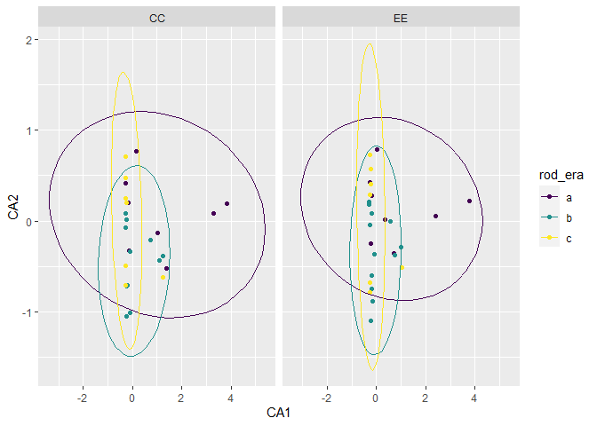<!-- -->

``` r
summer.cca <- cca(summer.abundance.matrix ~ ., data = select(summer_preds, combined_trt, rod_era))

vif.cca(summer.cca)
```

    ## combined_trtEE      rod_era.L      rod_era.Q 
    ##       1.000452       1.009983       1.010437

``` r
# none > 10

barplot(summer.cca$CA$eig / summer.cca$tot.chi)
```

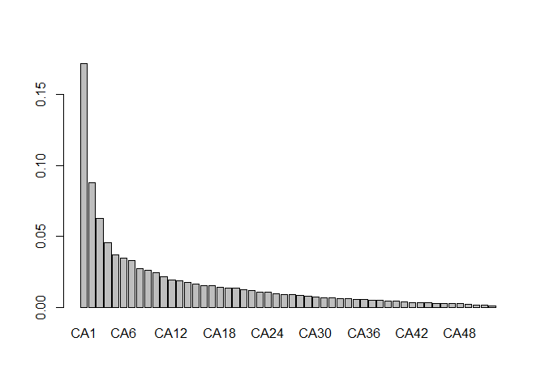<!-- -->

``` r
# var explained

summer.cca$CCA$tot.chi / summer.cca$tot.chi
```

    ## [1] 0.1046241

``` r
# perm test
anova(summer.cca, by = "margin")
```

    ## Permutation test for cca under reduced model
    ## Marginal effects of terms
    ## Permutation: free
    ## Number of permutations: 999
    ## 
    ## Model: cca(formula = summer.abundance.matrix ~ combined_trt + rod_era, data = select(summer_preds, combined_trt, rod_era))
    ##               Df ChiSquare       F Pr(>F)    
    ## combined_trt   1   0.02534  2.0489  0.014 *  
    ## rod_era        2   0.29855 12.0720  0.001 ***
    ## Residual     224   2.76990                   
    ## ---
    ## Signif. codes:  0 '***' 0.001 '**' 0.01 '*' 0.05 '.' 0.1 ' ' 1

``` r
anova(summer.cca)
```

    ## Permutation test for cca under reduced model
    ## Permutation: free
    ## Number of permutations: 999
    ## 
    ## Model: cca(formula = summer.abundance.matrix ~ combined_trt + rod_era, data = select(summer_preds, combined_trt, rod_era))
    ##           Df ChiSquare      F Pr(>F)    
    ## Model      3   0.32366 8.7248  0.001 ***
    ## Residual 224   2.76990                  
    ## ---
    ## Signif. codes:  0 '***' 0.001 '**' 0.01 '*' 0.05 '.' 0.1 ' ' 1

``` r
summer.cca.scores <- as.data.frame(scores(summer.cca, display = "sites", scaling = "sites")) %>%
  cbind(summer_preds)


ggplot(summer.cca.scores,aes(CCA1, CCA2)) + 
  stat_ellipse(aes(color = rod_era)) +
  geom_point(aes(color = rod_era)) +
  facet_wrap(vars(combined_trt))
```

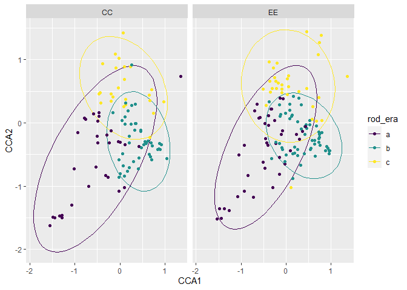<!-- -->
