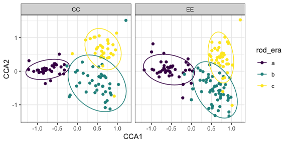
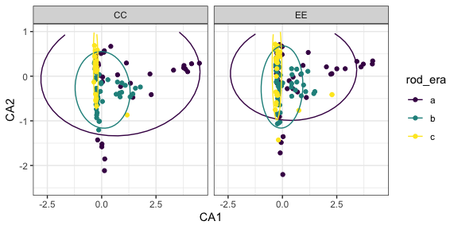
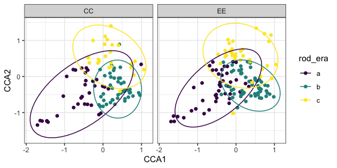

(P)(C)CA on annual plants
================

  - [Summary](#summary)
      - [Takeaway](#takeaway)
  - [Winter](#winter)
      - [CA](#ca)
      - [pCCA](#pcca)
  - [Summer](#summer)
      - [CA](#ca-1)
      - [pCCA](#pcca-1)

# Summary

I am not at expert-level in correspondence analysis, so this is to the
best of my understanding.

With CA, we just try to summarize the variability in the community
composition data and then plot each sample (community composition of a
plot in a census year) on the first 2 axes. I then colored the points
and plotted the centroids of three “eras”: a, 1988-96, b, 1996-2010, and
c, 2010-2019. The analysis has no idea these are structuring variables
of interest.

The CA plot for winter shows strong temporal structure; in particular, b
and c are very different from a (but not really different from each
other). The CA for summer shows no such structure.

For the pCCA, we tell the cca function to pay attention to treatment and
“era”, and condition on the effect of plot (similar to a random effect).
Adding these constraints results in greater separation of b and c for
the winter annuals, and less - but still huge - overlap for the
different eras for the summer annuals.

The constraints, combined, account for about 20% of variation in winter
and 10% in summer. All the constraints (treatment, era, and plot) come
up as “significant” in permutation tests.

#### Takeaway

What I take away from this is that:

  - The annuals change over time\!
  - Winter has more temporal structure than summer.
  - I am hesitant to interpret this as there being a really pronounced
    shift in 2010, though.
      - The plotted axes account for very little of the total variation
        in the pCCAs (20% for winter, 9% for summer).
      - I haven’t found a way to test contrasts in CCA (e.g. “is b
        significantly different from c”).
      - The eras may be arbitrary (with respect to this data) - although
        trying this with other time chunking strategies gives
        qualitatively similar answers.

# Winter

## CA

Combined, these two axes account for about 27% of variation.

    ##        CA1        CA2        CA3        CA4        CA5 
    ## 0.17643661 0.09337063 0.07394717 0.04917945 0.04390622

    ## Warning: Removed 4 rows containing non-finite values (stat_ellipse).

    ## Warning: Removed 4 rows containing missing values (geom_point).

<!-- -->

<!-- ## CCA -->

<!-- ```{r} -->

<!-- winter_plot_cca <- cca(winter_plot_abund_matrix ~ ., data = select(winter_preds, combined_trt, rod_era)) -->

<!-- summary(winter_plot_cca) -->

<!-- winter_plot_cca_scores <- as.data.frame(scores(winter_plot_cca, display = "sites", scaling = "sites")) %>% -->

<!--   cbind(winter_preds) -->

<!-- ggplot(winter_plot_cca_scores, aes(CCA1, CCA2, color = rod_era)) +  -->

<!--   geom_point()  + -->

<!--   stat_ellipse() + -->

<!--   facet_wrap(vars(combined_trt)) -->

<!-- ``` -->

## pCCA

The constraints account for about 20% of total variation. These two axes
account for about 19%.

    ## Call: cca(formula = winter_plot_abund_matrix ~ rod_era + combined_trt +
    ## Condition(plot), data = winter_preds)
    ## 
    ##               Inertia Proportion Rank
    ## Total         2.42842    1.00000     
    ## Conditional   0.03001    0.01236    1
    ## Constrained   0.49093    0.20216    3
    ## Unconstrained 1.90748    0.78548   48
    ## Inertia is scaled Chi-square 
    ## 
    ## Eigenvalues for constrained axes:
    ##   CCA1   CCA2   CCA3 
    ## 0.3583 0.0983 0.0344 
    ## 
    ## Eigenvalues for unconstrained axes:
    ##     CA1     CA2     CA3     CA4     CA5     CA6     CA7     CA8 
    ## 0.22398 0.13906 0.11722 0.10815 0.09506 0.08213 0.07468 0.07050 
    ## (Showing 8 of 48 unconstrained eigenvalues)

    ##       CCA1       CCA2       CCA3 
    ## 0.14752736 0.04048434 0.01414886

<!-- -->

# Summer

## CA

    ##        CA1        CA2        CA3        CA4        CA5 
    ## 0.17143025 0.09424031 0.08319808 0.07749190 0.05074886

    ## Warning: Removed 1 rows containing non-finite values (stat_ellipse).

    ## Warning: Removed 1 rows containing missing values (geom_point).

<!-- -->

## pCCA

The plotted axes account for a combined 9% of total variation.

    ## Call: cca(formula = summer_plot_abund_matrix ~ rod_era + combined_trt +
    ## Condition(plot), data = summer_preds)
    ## 
    ##               Inertia Proportion Rank
    ## Total         3.25214    1.00000     
    ## Conditional   0.02202    0.00677    1
    ## Constrained   0.31114    0.09567    3
    ## Unconstrained 2.91898    0.89756   52
    ## Inertia is scaled Chi-square 
    ## 
    ## Eigenvalues for constrained axes:
    ##    CCA1    CCA2    CCA3 
    ## 0.15623 0.13005 0.02486 
    ## 
    ## Eigenvalues for unconstrained axes:
    ##    CA1    CA2    CA3    CA4    CA5    CA6    CA7    CA8 
    ## 0.5266 0.2790 0.2657 0.1807 0.1377 0.1094 0.1056 0.0991 
    ## (Showing 8 of 52 unconstrained eigenvalues)

    ##        CCA1        CCA2        CCA3 
    ## 0.048038415 0.039990533 0.007643492

<!-- -->
