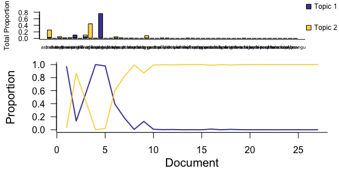
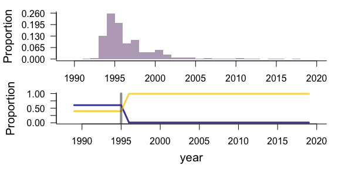
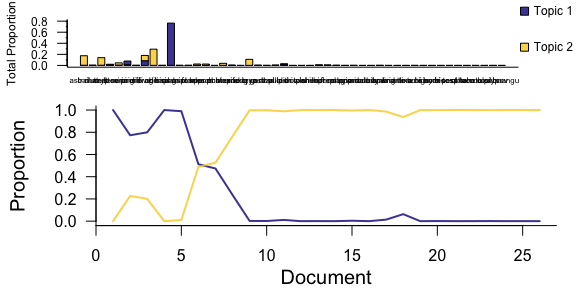
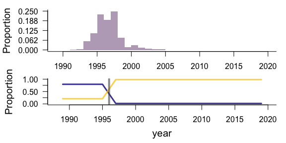
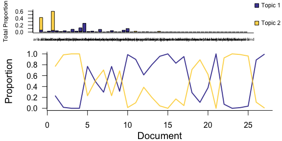
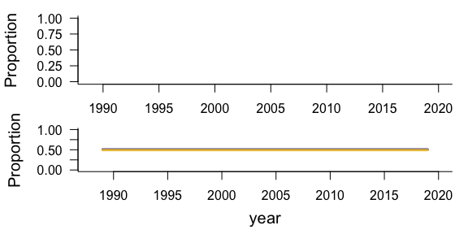
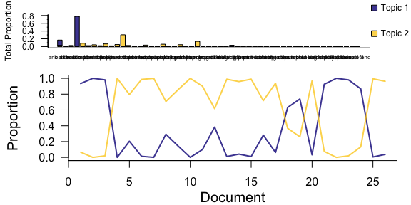
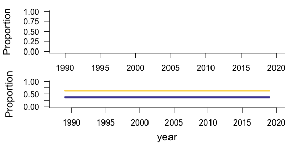

LDATS on annual plants
================

  - [Best models](#best-models)
  - [Winter](#winter)
      - [Exclosures](#exclosures)
      - [Controls](#controls)
  - [Summer](#summer)
      - [Exclosures](#exclosures-1)
      - [Controls](#controls-1)

## Best models

These are run with only 10 LDA seeds, so it’s very possible different
results will come out when it’s run with more seeds.

`nfolds` corresponds to nyears. There are slightly different numbers of
years because LDATS requires removing years that are all 0s, and some
treatment/year combos have all 0s.

For summer, it finds 0 changepoints. For winter, it finds 1 changepoint.
This is consistent between treatments.

| k | seed | cpts | nfolds | season | trt |   mean\_ll |    se\_ll |
| -: | :--- | ---: | -----: | :----- | :-- | ---------: | --------: |
| 2 | 6    |    0 |     25 | summer | CC  | \-3677.570 | 1399.7419 |
| 2 | 4    |    0 |     26 | summer | EE  | \-4120.497 | 1201.6529 |
| 2 | 2    |    1 |     26 | winter | CC  | \-2007.004 |  575.3860 |
| 2 | 2    |    1 |     27 | winter | EE  | \-3037.572 |  996.7481 |

## Winter

### Exclosures

    ## Loading in data version 2.95.0
    ## Loading in data version 2.95.0

    ## Joining, by = "plot"

    ## Joining, by = c("year", "season", "plot")

    ## Running LDA with 2 topics (seed 2)

    ## Running TS model with 1 changepoints and equation gamma ~ 1 on LDA model

    ##   Estimating changepoint distribution

    ##   Estimating regressor distribution

<!-- --><!-- -->

| topic | species   | proportion | topic\_rank |
| :---- | :-------- | ---------: | ----------: |
| 1     | hapl grac |  0.7591143 |           1 |
| 1     | eria diff |  0.0805146 |           2 |
| 1     | erio aber |  0.0464566 |           3 |
| 1     | astr nutt |  0.0306846 |           4 |
| 1     | chae stev |  0.0149610 |           5 |
| 2     | erod cicu |  0.4409208 |           1 |
| 2     | astr nutt |  0.2266093 |           2 |
| 2     | lesq gord |  0.0740535 |           3 |
| 2     | erio aber |  0.0549752 |           4 |
| 2     | chae stev |  0.0395400 |           5 |

### Controls

    ## Loading in data version 2.95.0
    ## Loading in data version 2.95.0

    ## Joining, by = "plot"

    ## Joining, by = c("year", "season", "plot")

    ## Running LDA with 2 topics (seed 2)

    ## Running TS model with 1 changepoints and equation gamma ~ 1 on LDA model

    ##   Estimating changepoint distribution

    ##   Estimating regressor distribution

<!-- --><!-- -->

| topic | species   | proportion | topic\_rank |
| :---- | :-------- | ---------: | ----------: |
| 1     | hapl grac |  0.7643075 |           1 |
| 1     | erio aber |  0.0840154 |           2 |
| 1     | eria diff |  0.0664546 |           3 |
| 1     | vulp octo |  0.0188899 |           4 |
| 1     | cryp micr |  0.0102917 |           5 |
| 2     | erod cicu |  0.2927733 |           1 |
| 2     | astr nutt |  0.1719657 |           2 |
| 2     | chae stev |  0.1368234 |           3 |
| 2     | lesq gord |  0.1092310 |           4 |
| 2     | erio aber |  0.0967200 |           5 |

## Summer

The summer models are just fitting means.

### Exclosures

    ## Loading in data version 2.95.0
    ## Loading in data version 2.95.0

    ## Joining, by = "plot"

    ## Joining, by = c("year", "season", "plot")

    ## Running LDA with 2 topics (seed 4)

    ## Running TS model with 0 changepoints and equation gamma ~ 1 on LDA model

<!-- --><!-- -->

### Controls

    ## Loading in data version 2.95.0
    ## Loading in data version 2.95.0

    ## Joining, by = "plot"

    ## Joining, by = c("year", "season", "plot")

    ## Running LDA with 2 topics (seed 4)

    ## Running TS model with 0 changepoints and equation gamma ~ 1 on LDA model

<!-- --><!-- -->

\`\`\`
