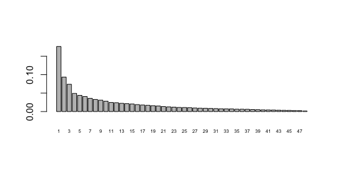
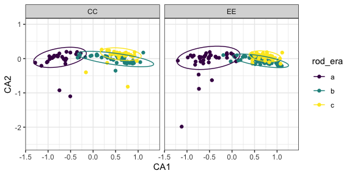
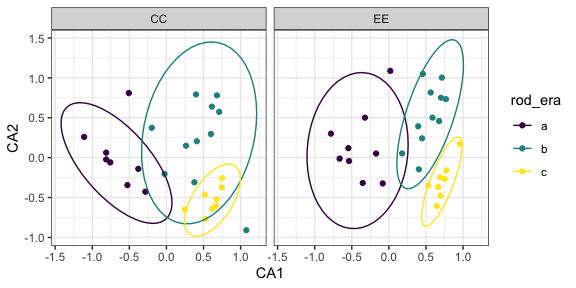
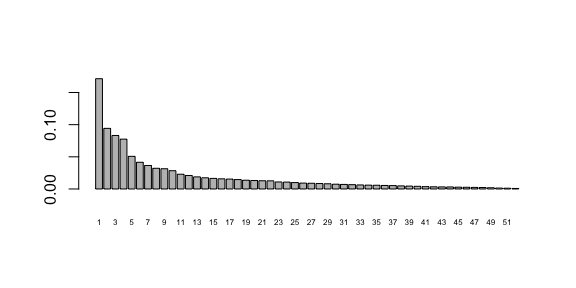
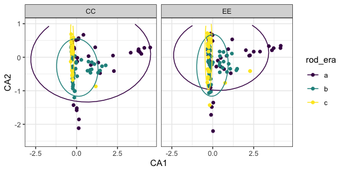
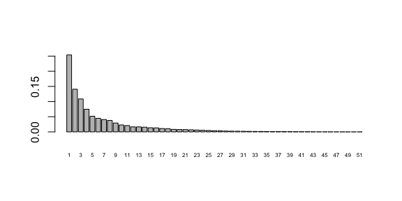
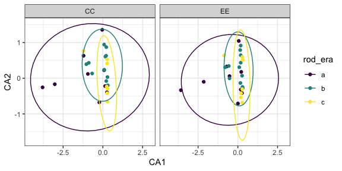

(P)(C)CA on annual plants
================

  - [Winter](#winter)
      - [CA](#ca)
          - [Plot level](#plot-level)
          - [Treatment level](#treatment-level)
  - [Summer](#summer)
      - [CA](#ca-1)
          - [Plot level](#plot-level-1)
          - [Treatment level](#treatment-level-1)

# Winter

## CA

### Plot level

<!-- -->

    ##        CA1        CA2        CA3        CA4        CA5 
    ## 0.17643661 0.09337063 0.07394717 0.04917945 0.04390622

    ## Warning: Removed 4 rows containing non-finite values (stat_ellipse).

    ## Warning: Removed 4 rows containing missing values (geom_point).

<!-- -->

### Treatment level

<!-- -->

    ##        CA1        CA2        CA3        CA4        CA5 
    ## 0.26948796 0.11155617 0.10184362 0.06998191 0.05478313

<!-- -->

# Summer

## CA

### Plot level

<!-- -->

    ##        CA1        CA2        CA3        CA4        CA5 
    ## 0.17143025 0.09424031 0.08319808 0.07749190 0.05074886

    ## Warning: Removed 1 rows containing non-finite values (stat_ellipse).

    ## Warning: Removed 1 rows containing missing values (geom_point).

<!-- -->

### Treatment level

<!-- -->

    ##        CA1        CA2        CA3        CA4        CA5 
    ## 0.25385559 0.14075788 0.10867652 0.07478264 0.05173259

    ## Warning in MASS::cov.trob(data[, vars]): Probable convergence failure
    
    ## Warning in MASS::cov.trob(data[, vars]): Probable convergence failure

<!-- -->
