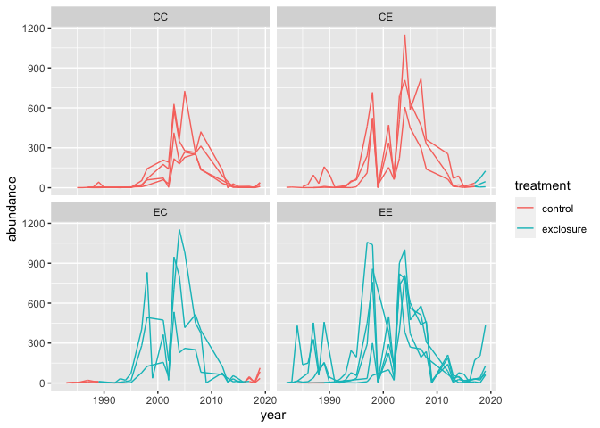
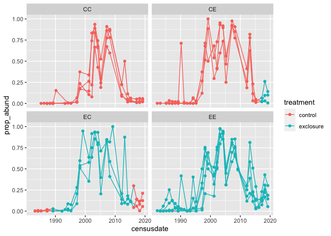
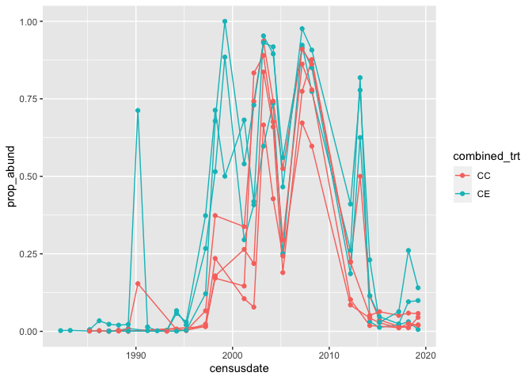
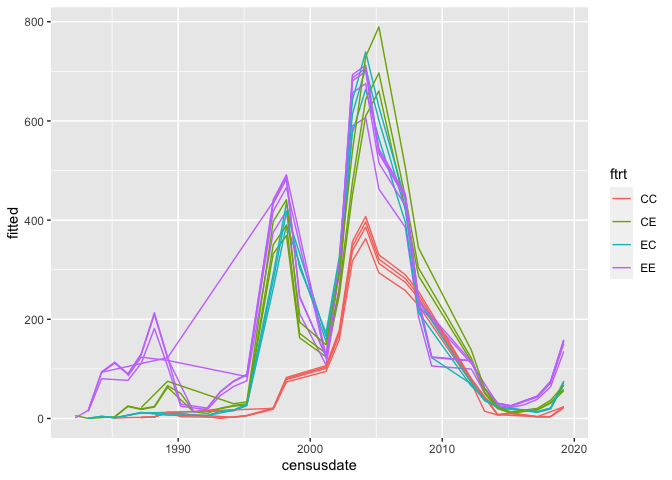
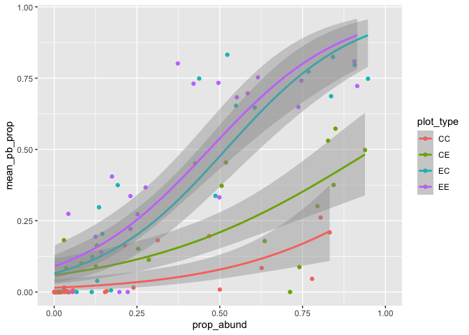
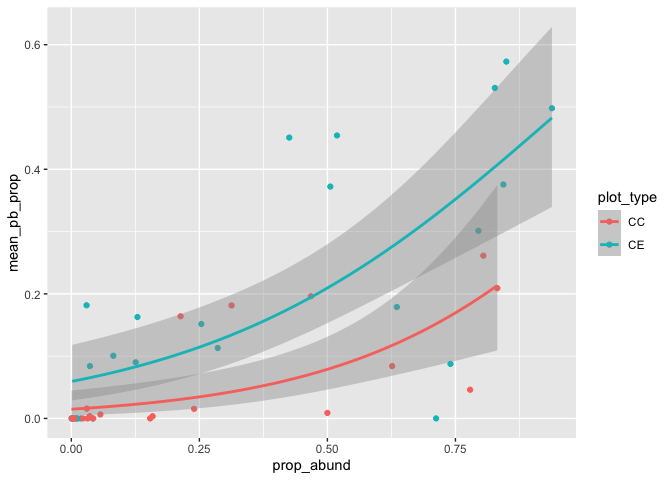
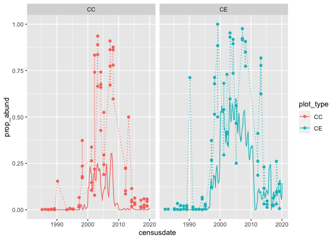
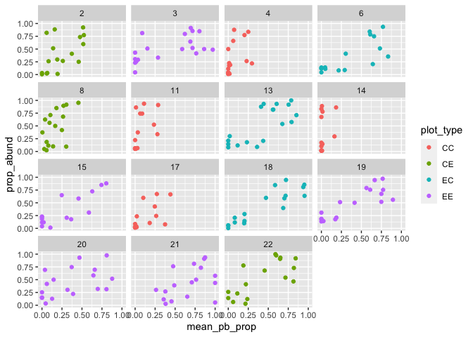
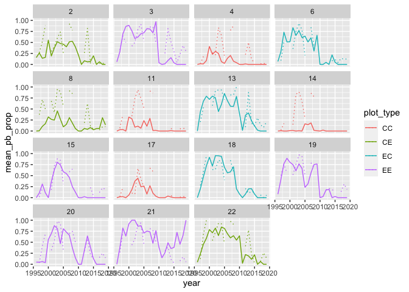

Untitled
================

``` r
library(dplyr)
```

    ## 
    ## Attaching package: 'dplyr'

    ## The following objects are masked from 'package:stats':
    ## 
    ##     filter, lag

    ## The following objects are masked from 'package:base':
    ## 
    ##     intersect, setdiff, setequal, union

``` r
library(ggplot2)

winter <- portalr::plant_abundance(level = "Plot", type = "Winter Annuals", length = "all")
```

    ## Warning in summarize_plant_data(..., shape = "flat", output = "abundance"): The
    ## `length` argument is deprecated; please use `plots` instead.

    ## Loading in data version 2.95.0

``` r
head(winter)
```

    ##   year season plot   species abundance quads treatment
    ## 1 1981 summer    1 chen frem         2     8   control
    ## 2 1981 summer    1 erio aber        55     8   control
    ## 3 1981 summer    2 erio aber        61     8   control
    ## 4 1981 summer    3 chen frem         2     8 exclosure
    ## 5 1981 summer    3 erio aber        72     8 exclosure
    ## 6 1981 summer    4 chen frem        11     8   control

``` r
winter <- winter %>%
  filter(season == "winter") %>%
  soar::add_plot_types() %>%
  filter(combined_trt %in% c("CC", "EE", "CE", "EC")) %>%
  mutate(plot_type = combined_trt) %>%
  mutate(ftrt = as.factor(combined_trt))
```

    ## Joining, by = "plot"

``` r
ggplot(filter(winter, species == "erod cicu"), aes(year, abundance, color = treatment, group = plot)) +
  geom_line() +
  facet_wrap(vars(combined_trt))
```

<!-- -->

``` r
winter_props <- winter %>%
  group_by(year, plot) %>%
  mutate(total_abund = sum(abundance)) %>%
  ungroup() %>%
  filter(species == "erod cicu") %>%
  mutate(prop_abund = abundance / total_abund) %>%
  mutate(censusdate = as.Date(paste0(year, "-03-15"), origin =  "%Y-%m-%d")) 

tms <- soar::get_treatment_means() 
```

    ## Loading in data version 2.95.0

    ## Joining, by = "plot"

``` r
ggplot(winter_props, aes(censusdate, prop_abund, color = treatment, group = plot)) +
  geom_line() +
  geom_point() +
  facet_wrap(vars(combined_trt))
```

<!-- -->

``` r
ggplot(filter(winter_props, ftrt %in% c("CC", "CE")), aes(censusdate, prop_abund, color = combined_trt, group = plot)) +
  geom_line() +
  geom_point()
```

<!-- -->

``` r
library(gratia)
library(mgcv)
```

    ## Loading required package: nlme

    ## 
    ## Attaching package: 'nlme'

    ## The following object is masked from 'package:dplyr':
    ## 
    ##     collapse

    ## This is mgcv 1.8-33. For overview type 'help("mgcv-package")'.

``` r
erod_prop_gam <- gam(winter_props, formula = abundance ~ ftrt + s(year, k = 20) + s(year, by = ftrt, k = 20) + s(plot, bs = "re"), family = poisson)

erod_prop_fit <- winter_props %>%
  select(year, censusdate, ftrt, plot) %>%
  distinct() %>%
  add_fitted(erod_prop_gam, value = "fitted")

ggplot(erod_prop_fit, aes(censusdate, fitted, color = ftrt, group = plot)) +
  geom_line()
```

<!-- -->

``` r
tms2 <- tms %>%
  mutate(year = as.integer(format.Date(censusdate, "%Y"))) %>%
  left_join(select(winter_props, year, abundance, prop_abund, plot_type)) %>%
  group_by(year, plot_type) %>%
  summarize(mean_pb = mean(pb_e),
            mean_pb_prop = mean(pb_e / total_e),
            prop_abund = mean(prop_abund)) %>%
  ungroup()
```

    ## Joining, by = c("plot_type", "year")

    ## `summarise()` has grouped output by 'year'. You can override using the `.groups` argument.

``` r
ggplot(tms2, aes(prop_abund, mean_pb_prop, color = plot_type)) +
  geom_point() +
  geom_smooth(method = "glm", method.args = list(family = quasibinomial()))
```

    ## `geom_smooth()` using formula 'y ~ x'

    ## Warning: Removed 35 rows containing non-finite values (stat_smooth).

    ## Warning: Removed 35 rows containing missing values (geom_point).

<!-- -->

``` r
ggplot(filter(tms2, plot_type %in% c("CC", "CE")), aes(prop_abund, mean_pb_prop, color = plot_type)) +
  geom_point() +
  geom_smooth(method = "glm", method.args = list(family = quasibinomial()))
```

    ## `geom_smooth()` using formula 'y ~ x'

    ## Warning: Removed 19 rows containing non-finite values (stat_smooth).

    ## Warning: Removed 19 rows containing missing values (geom_point).

<!-- -->

``` r
ggplot(filter(winter_props, plot_type %in% c("CC", "CE")), aes(censusdate, prop_abund, color = plot_type)) +
  geom_point() +
  geom_line(linetype = 3) +
  geom_line(data = filter(tms, plot_type %in% c("CC", "CE")), aes(y = pb_e_ma / total_e_ma)) +
  facet_wrap(vars(plot_type))
```

<!-- -->

``` r
plotl <- soar::get_plot_totals(currency = "abundance") 
```

    ## Loading in data version 2.95.0

    ## Joining, by = "plot"

``` r
plotl_erod <- plotl %>%
  mutate(year = as.integer(format.Date(censusdate, "%Y"))) %>%
  left_join(select(winter_props, year, abundance, prop_abund, plot_type, plot)) %>%
  group_by(year, plot_type, plot) %>%
  summarize(mean_pb = mean(pb_n, na.rm =T),
            mean_pb_prop = mean(pb_n / total_n, na.rm = T),
            total_abund = mean(abundance, na.rm = T),
            prop_abund = mean(prop_abund, na.rm = T),
            unique_erod_vals = length(unique(abundance))) %>%
  ungroup() %>%
  filter(year > 1995)
```

    ## Joining, by = c("plot", "plot_type", "year")

    ## `summarise()` has grouped output by 'year', 'plot_type'. You can override using the `.groups` argument.

``` r
ggplot(plotl_erod,  aes( mean_pb_prop, prop_abund, color = plot_type, group = plot)) +
  geom_point() +
  #geom_smooth(method = "glm", method.args = list(family = quasibinomial()), se = F) +
  facet_wrap(vars(plot))
```

    ## Warning: Removed 113 rows containing missing values (geom_point).

<!-- -->

``` r
ggplot(plotl_erod, aes(year, mean_pb_prop, color = plot_type, group = plot)) +
  geom_line() +
  geom_line(aes(y = prop_abund), linetype = 3) +
  facet_wrap(vars(plot))
```

    ## Warning: Removed 15 row(s) containing missing values (geom_path).

<!-- -->
