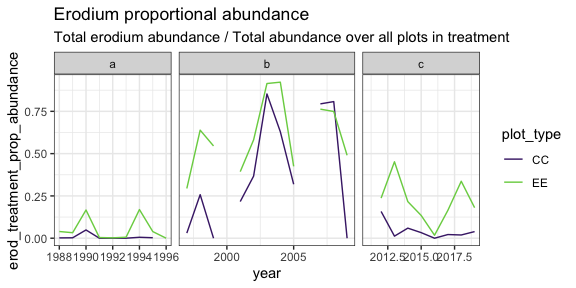
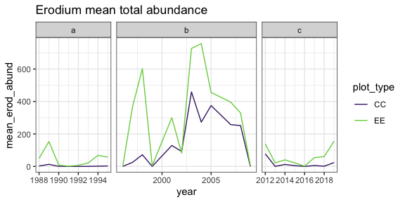
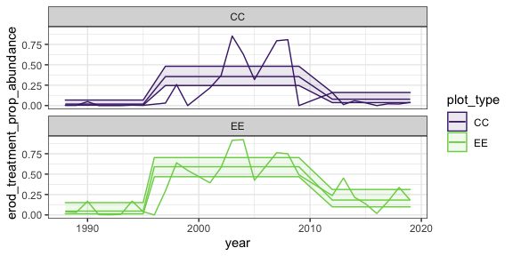
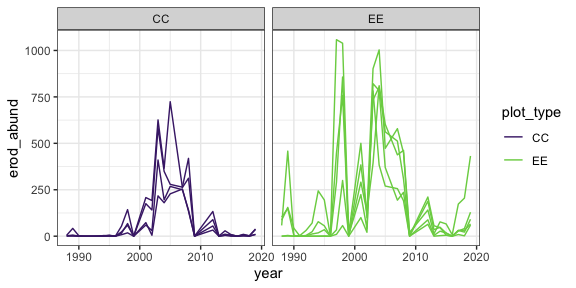
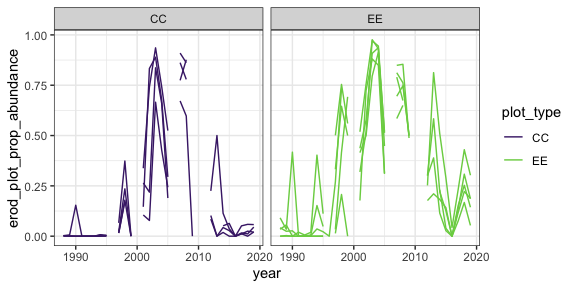
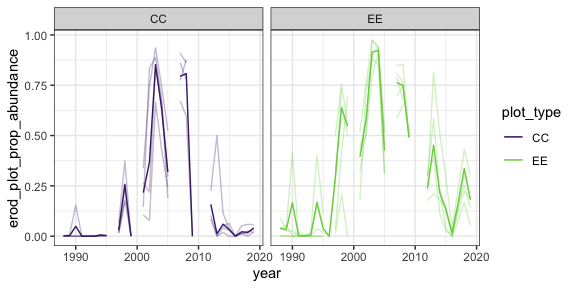

Erodium
================

  - [Treatment levels](#treatment-levels)
      - [GLM on proportional abundance](#glm-on-proportional-abundance)
  - [Plot level](#plot-level)

``` r
library(dplyr)
```

    ## 
    ## Attaching package: 'dplyr'

    ## The following objects are masked from 'package:stats':
    ## 
    ##     filter, lag

    ## The following objects are masked from 'package:base':
    ## 
    ##     intersect, setdiff, setequal, union

``` r
library(soar)
library(ggplot2)
knitr::opts_chunk$set(echo = FALSE, fig.dim = c(6, 3))

theme_set(theme_bw())

era_grid <-   facet_grid(cols = vars(oera), space = "free", scales = "free_x")
both_scale <- scale_color_viridis_d(begin = .1, end = .8)
cc_scale <- scale_color_viridis_d(begin = .1, end = .1)
ee_scale <- scale_color_viridis_d(begin = .8, end =.8)
both_fscale <- scale_fill_viridis_d(begin = .1, end = .8)
cc_fscale <- scale_fill_viridis_d(begin = .1, end = .1)
ee_fscale <- scale_fill_viridis_d(begin = .8, end =.8)
```

    ## Loading in data version 2.95.0
    ## Loading in data version 2.95.0

    ## Joining, by = "plot"

    ## Joining, by = c("year", "season", "plot")

# Treatment levels

Gaps are for censuses in 1996, 2000, 2006, and 2011 where plots were
censused but no individuals were found (of any species).

<!-- --><!-- -->

### GLM on proportional abundance

`prop_abund ~ treatment + era, family = quasibinomial`

<div class="kable-table">

| Resid. Df | Resid. Dev |  Df |    Deviance | Pr(\>Chi) |
| --------: | ---------: | --: | ----------: | --------: |
|        49 |    9.53541 |  NA |          NA |        NA |
|        51 |    9.78910 | \-2 | \-0.2536895 | 0.4853155 |

</div>

    ## Joining, by = c("oera", "oplottype")

<!-- -->

<div class="kable-table">

| oera | oplottype |       est |     lower |     upper |
| :--- | :-------- | --------: | --------: | --------: |
| a    | CC        | 0.0149772 | 0.0042249 | 0.0516743 |
| a    | EE        | 0.0445932 | 0.0140037 | 0.1329894 |
| b    | CC        | 0.3629483 | 0.2590846 | 0.4813964 |
| b    | EE        | 0.6362187 | 0.5177554 | 0.7401845 |
| c    | CC        | 0.0707817 | 0.0340022 | 0.1415165 |
| c    | EE        | 0.1895152 | 0.1079129 | 0.3112916 |

</div>

    ## oplottype = CC:
    ##  contrast estimate    SE  df z.ratio p.value
    ##  a - b       -3.62 0.624 Inf -5.805  <.0001 
    ##  a - c       -1.61 0.670 Inf -2.407  0.0425 
    ##  b - c        2.01 0.371 Inf  5.419  <.0001 
    ## 
    ## oplottype = EE:
    ##  contrast estimate    SE  df z.ratio p.value
    ##  a - b       -3.62 0.624 Inf -5.805  <.0001 
    ##  a - c       -1.61 0.670 Inf -2.407  0.0425 
    ##  b - c        2.01 0.371 Inf  5.419  <.0001 
    ## 
    ## Results are given on the log odds ratio (not the response) scale. 
    ## P value adjustment: tukey method for comparing a family of 3 estimates

# Plot level

Broken out by plot, we get gaps for years and plots when there were no
individuals (of any species) observed:

    ## Loading in data version 2.95.0
    ## Loading in data version 2.95.0

    ## Joining, by = "plot"

    ## Joining, by = c("year", "season", "plot")

<!-- --><!-- --><!-- -->
