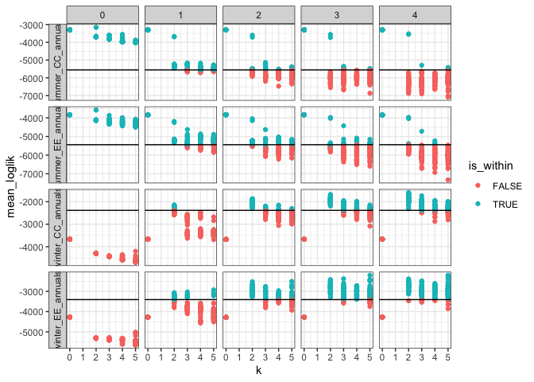
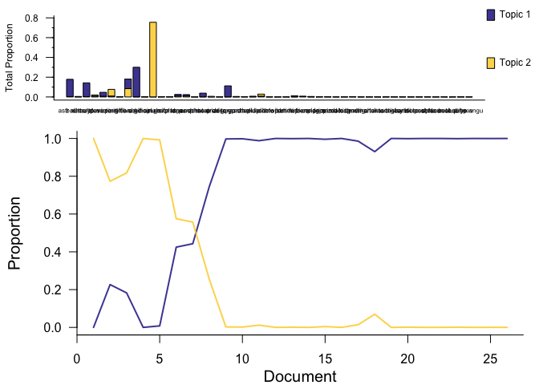
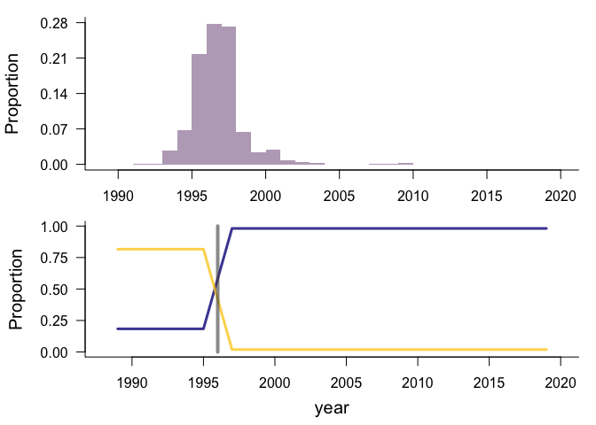
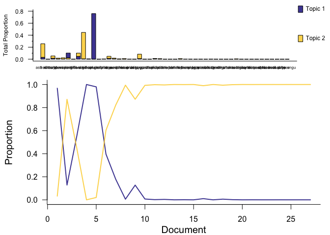
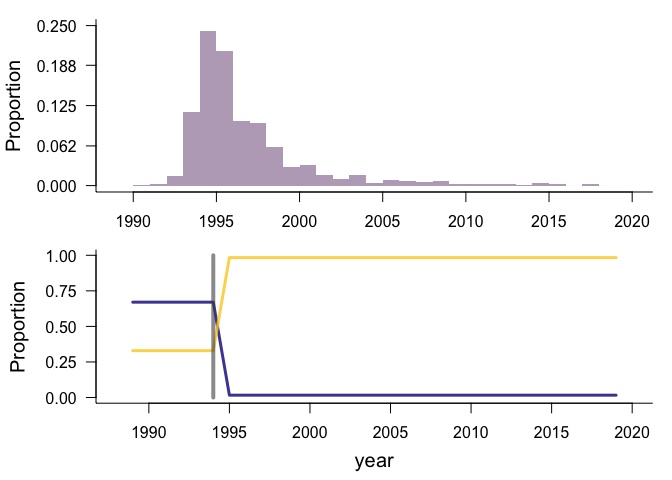
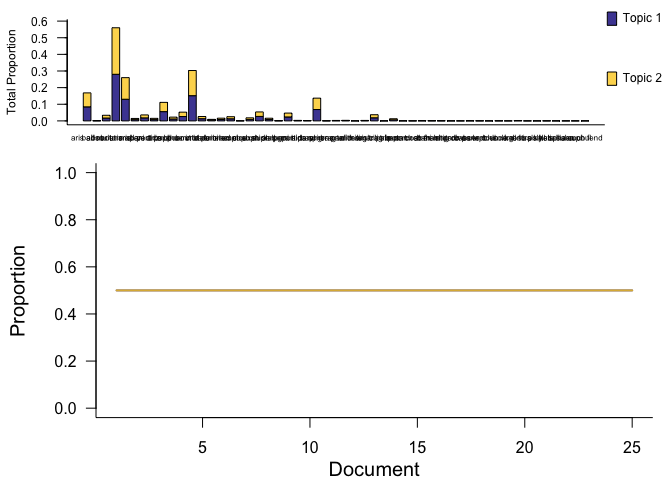
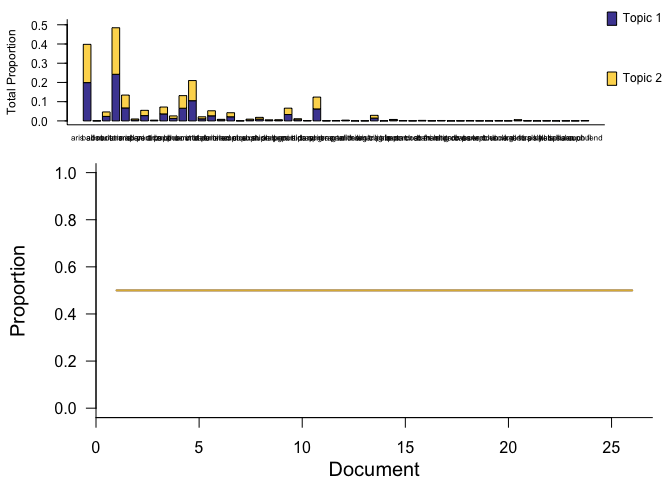
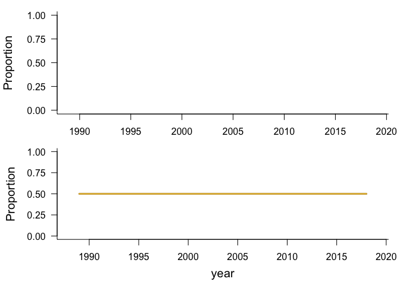

Portal annuals
================
Renata Diaz
2021-07-07

  - [Specs](#specs)
  - [winter](#winter)
  - [summer](#summer)

## Specs

``` r
   methods <- drake::drake_plan(
    ldats_fit = target(fit_ldats_crossval(dataset, buffer = 2, k = ks, lda_seed = seeds, cpts = cpts, nit = 100),
                       transform = cross(
                         dataset = !!rlang::syms(datasets$target),
                         ks = !!c(0,2:5),
                         seeds = !!seq(2, 100, by = 2),
                         cpts = !!c(0:4),
                         return_full = F,
                         return_fits = F,
                         summarize_ll = F
                       )),
```

    ## Joining, by = "dat_name"

<!-- -->

## winter

    ## Joining, by = "year"

    ## Joining, by = "cpt"

    ## Joining, by = "year"

    ## Joining, by = c("year", "species")

<div class="kable-table">

| k | lda\_seed | cpts | nit | mean\_loglik | se\_loglik | dat\_name           |    Mean | Median | Mode | Lower\_95% | Upper\_95% |   SD | MCMCerr |  AC10 |      ESS | cpt | nyears | width | width\_ratio | modal\_estimate | seg\_before | seg\_after | dissimilarity | overall\_r2 | species\_mean\_r2 |
| -: | --------: | ---: | --: | -----------: | ---------: | :------------------ | ------: | -----: | ---: | ---------: | ---------: | ---: | ------: | ----: | -------: | :-- | -----: | ----: | -----------: | --------------: | ----------: | ---------: | ------------: | ----------: | ----------------: |
| 2 |        92 |    1 | 100 |   \-2145.249 |   647.2037 | winter\_CC\_annuals | 1996.28 |   1996 | 1996 |       1993 |       2000 | 1.74 |   0.055 | 2e-04 | 487.3693 | 1   |     26 |     7 |    0.2692308 |            1996 |           1 |          2 |     0.6752331 |    0.339953 |         0.2422645 |

</div>

<!-- --><!-- -->

<div class="kable-table">

| topic | species   |      prop | topic\_rank |
| :---- | :-------- | --------: | ----------: |
| V1    | erod cicu | 0.2994644 |           1 |
| V1    | astr nutt | 0.1750965 |           2 |
| V1    | chae stev | 0.1394181 |           3 |
| V1    | lesq gord | 0.1116691 |           4 |
| V2    | hapl grac | 0.7550908 |           1 |
| V2    | erio aber | 0.0840689 |           2 |
| V2    | eria diff | 0.0679770 |           3 |
| V2    | vulp octo | 0.0208036 |           4 |

</div>

    ## Joining, by = "year"

<div class="kable-table">

| seg | species   | prop\_abund | topic\_seg\_rank |
| :-- | :-------- | ----------: | ---------------: |
| 1   | hapl grac |   0.6165549 |                1 |
| 1   | erio aber |   0.0864259 |                2 |
| 1   | eria diff |   0.0571511 |                3 |
| 1   | erod cicu |   0.0557800 |                4 |
| 1   | astr nutt |   0.0349702 |                5 |
| 2   | erod cicu |   0.2937713 |                1 |
| 2   | astr nutt |   0.1718228 |                2 |
| 2   | chae stev |   0.1368232 |                3 |
| 2   | lesq gord |   0.1095509 |                4 |
| 2   | erio aber |   0.0966649 |                5 |

</div>

    ## Joining, by = "year"

    ## Joining, by = "cpt"

    ## Joining, by = "year"

    ## Joining, by = c("year", "species")

<div class="kable-table">

| k | lda\_seed | cpts | nit | mean\_loglik | se\_loglik | dat\_name           |    Mean | Median | Mode | Lower\_95% | Upper\_95% |   SD | MCMCerr |   AC10 |      ESS | cpt | nyears | width | width\_ratio | modal\_estimate | seg\_before | seg\_after | dissimilarity | overall\_r2 | species\_mean\_r2 |
| -: | --------: | ---: | --: | -----------: | ---------: | :------------------ | ------: | -----: | ---: | ---------: | ---------: | ---: | ------: | -----: | -------: | :-- | -----: | ----: | -----------: | --------------: | ----------: | ---------: | ------------: | ----------: | ----------------: |
| 2 |        42 |    1 | 100 |   \-3065.653 |   1052.029 | winter\_EE\_annuals | 1996.19 |   1995 | 1994 |       1992 |       2004 | 3.68 |  0.1164 | 0.0531 | 289.5904 | 1   |     27 |    12 |    0.4444444 |            1994 |           1 |          2 |     0.5406009 |   0.5246287 |         0.3921912 |

</div>

<!-- --><!-- -->

<div class="kable-table">

| topic | species   |      prop | topic\_rank |
| :---- | :-------- | --------: | ----------: |
| V1    | hapl grac | 0.7592815 |           1 |
| V1    | eria diff | 0.0805273 |           2 |
| V1    | erio aber | 0.0464516 |           3 |
| V1    | astr nutt | 0.0306590 |           4 |
| V2    | erod cicu | 0.4407091 |           1 |
| V2    | astr nutt | 0.2265608 |           2 |
| V2    | lesq gord | 0.0740219 |           3 |
| V2    | erio aber | 0.0549775 |           4 |

</div>

    ## Joining, by = "year"

<div class="kable-table">

| seg | species   | prop\_abund | topic\_seg\_rank |
| :-- | :-------- | ----------: | ---------------: |
| 1   | hapl grac |   0.5092959 |                1 |
| 1   | erod cicu |   0.1488626 |                2 |
| 1   | astr nutt |   0.0952202 |                3 |
| 1   | eria diff |   0.0613793 |                4 |
| 1   | erio aber |   0.0492614 |                5 |
| 2   | erod cicu |   0.4335646 |                1 |
| 2   | astr nutt |   0.2233456 |                2 |
| 2   | lesq gord |   0.0729579 |                3 |
| 2   | erio aber |   0.0548375 |                4 |
| 2   | chae stev |   0.0391255 |                5 |

</div>

## summer

    ## Joining, by = "year"

    ## Joining, by = "cpt"

    ## Joining, by = "year"

    ## Joining, by = c("year", "species")

<div class="kable-table">

| k | lda\_seed | cpts | nit | mean\_loglik | se\_loglik | dat\_name           | Mean | Median | Mode | Lower\_95. | Upper\_95. | SD | MCMCerr | AC10 | ESS | cpt | nyears | width | width\_ratio | modal\_estimate | seg\_before | seg\_after | dissimilarity | overall\_r2 | species\_mean\_r2 |
| -: | --------: | ---: | --: | -----------: | ---------: | :------------------ | :--- | :----- | :--- | :--------- | :--------- | :- | :------ | :--- | --: | :-- | -----: | :---- | :----------- | :-------------- | :---------- | :--------- | :------------ | ----------: | ----------------: |
| 0 |         2 |    0 | 100 |   \-3297.154 |   1231.419 | summer\_CC\_annuals | NA   | NA     | NA   | NA         | NA         | NA | NA      | NA   |   0 | NA  |     25 | NA    | NA           | NA              | NA          | NA         | NA            |   0.3089993 |         0.3089993 |

</div>

<!-- --><!-- -->

    ## Joining, by = "year"

    ## Joining, by = "cpt"

    ## Joining, by = "year"

    ## Joining, by = c("year", "species")

<div class="kable-table">

| k | lda\_seed | cpts | nit | mean\_loglik | se\_loglik | dat\_name           | Mean | Median | Mode | Lower\_95. | Upper\_95. | SD | MCMCerr | AC10 | ESS | cpt | nyears | width | width\_ratio | modal\_estimate | seg\_before | seg\_after | dissimilarity | overall\_r2 | species\_mean\_r2 |
| -: | --------: | ---: | --: | -----------: | ---------: | :------------------ | :--- | :----- | :--- | :--------- | :--------- | :- | :------ | :--- | --: | :-- | -----: | :---- | :----------- | :-------------- | :---------- | :--------- | :------------ | ----------: | ----------------: |
| 0 |         2 |    0 | 100 |    \-3833.49 |   1090.141 | summer\_EE\_annuals | NA   | NA     | NA   | NA         | NA         | NA | NA      | NA   |   0 | NA  |     26 | NA    | NA           | NA              | NA          | NA         | NA            |   0.3459892 |         0.3459892 |

</div>

<!-- --><!-- -->
