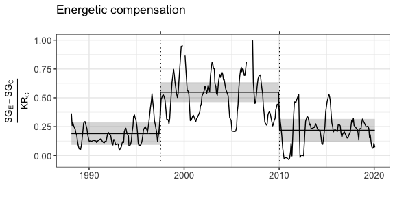
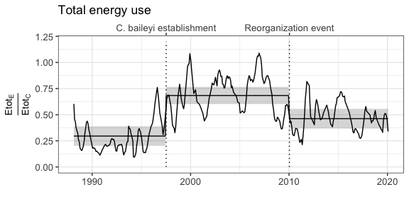
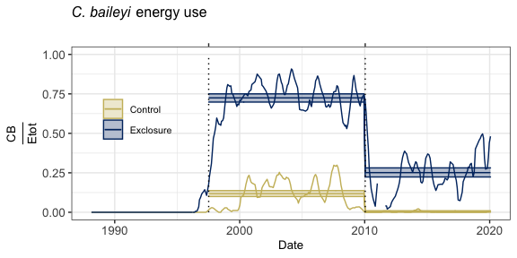
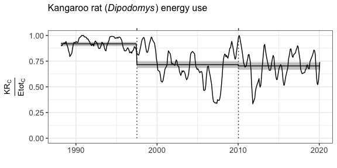
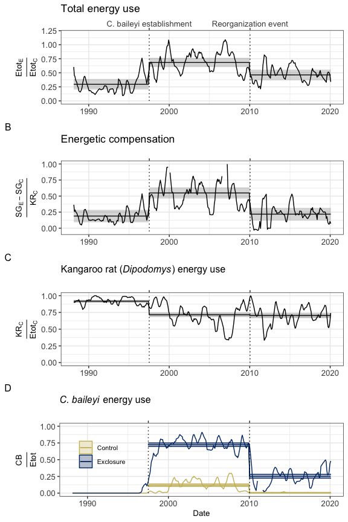

MS figs
================

  - [Figures](#figures)
      - [Compensation and total energy
        use](#compensation-and-total-energy-use)
          - [Compensation](#compensation)
          - [Total energy ratio](#total-energy-ratio)
      - [Rodent community composition](#rodent-community-composition)
          - [C. baileyi](#c.-baileyi)
          - [Dipodomys](#dipodomys)
      - [Full figure](#full-figure)
  - [Model results](#model-results)
      - [Compensation & total energy
        use](#compensation-total-energy-use)
          - [Compensation](#compensation-1)
          - [Total energy use](#total-energy-use)
      - [Community composition](#community-composition)
          - [Kangaroo rats](#kangaroo-rats)
          - [C. baileyi](#c.-baileyi-1)

# Figures

## Compensation and total energy use

Lines are 6-month moving averages. Horizontal lines + ribbons are means
and SE or CL from GLM or GLS.

### Compensation

**Compensation** refers to compensatory gains in energy use by small
granivores on exclosure plots relative to controls. Calculated as
\(\frac{SmgranExclosure - SmgranControl}{DipoControl}\). **Total
energy** refers to the overall loss in energy use caused by kangaroo rat
removal.

    ## Joining, by = "era"

<!-- -->

### Total energy ratio

    ## Joining, by = "era"

<!-- -->

## Rodent community composition

### C. baileyi

    ## Joining, by = c("period", "oplottype")

    ## Joining, by = c("period", "oplottype", "censusdate")

    ## Warning: Removed 228 row(s) containing missing values (geom_path).

<!-- -->

### Dipodomys

    ## Joining, by = c("period", "oplottype")

    ## Joining, by = "period"

<!-- -->

## Full figure

    ## Setting row to 1

    ## Setting column to 1

    ## Setting row to 2

    ## Setting column to 1

    ## Setting row to 3

    ## Setting column to 1

    ## Setting row to 4

    ## Setting column to 1

    ## Warning: Removed 228 row(s) containing missing values (geom_path).

<!-- -->

# Model results

## Compensation & total energy use

### Compensation

    ## Generalized least squares fit by REML
    ##   Model: smgran_comp ~ era 
    ##   Data: compensation 
    ##        AIC      BIC    logLik
    ##   62.62169 81.75169 -26.31084
    ## 
    ## Correlation Structure: Continuous AR(1)
    ##  Formula: ~period 
    ##  Parameter estimate(s):
    ##       Phi 
    ## 0.5141927 
    ## 
    ## Coefficients:
    ##                     Value  Std.Error  t-value p-value
    ## (Intercept)     0.1887873 0.04849229 3.893142  0.0001
    ## erab_pre_reorg  0.3596238 0.06442326 5.582204  0.0000
    ## erac_post_reorg 0.0296368 0.06914950 0.428590  0.6685
    ## 
    ##  Correlation: 
    ##                 (Intr) erb_p_
    ## erab_pre_reorg  -0.742       
    ## erac_post_reorg -0.701  0.528
    ## 
    ## Standardized residuals:
    ##        Min         Q1        Med         Q3        Max 
    ## -2.2604463 -0.4462201 -0.1654825  0.4070499  7.5010175 
    ## 
    ## Residual standard error: 0.2973631 
    ## Degrees of freedom: 342 total; 339 residual

Estimates:

| era            |    emmean |        SE |       df |  lower.CL |  upper.CL |
| :------------- | --------: | --------: | -------: | --------: | --------: |
| a\_pre\_pb     | 0.1887873 | 0.0484923 | 56.08128 | 0.0916487 | 0.2859260 |
| b\_pre\_reorg  | 0.5484112 | 0.0432238 | 60.40971 | 0.4619628 | 0.6348595 |
| c\_post\_reorg | 0.2184241 | 0.0493101 | 59.73403 | 0.1197802 | 0.3170680 |

Contrasts:

| contrast                       |    estimate |        SE |       df |     t.ratio |   p.value |
| :----------------------------- | ----------: | --------: | -------: | ----------: | --------: |
| a\_pre\_pb - b\_pre\_reorg     | \-0.3596238 | 0.0644233 | 60.44042 | \-5.5822045 | 0.0000018 |
| a\_pre\_pb - c\_post\_reorg    | \-0.0296368 | 0.0691495 | 57.97849 | \-0.4285901 | 0.9038819 |
| b\_pre\_reorg - c\_post\_reorg |   0.3299870 | 0.0650229 | 62.66119 |   5.0749352 | 0.0000110 |

### Total energy use

    ## Generalized least squares fit by REML
    ##   Model: total_e_rat ~ era 
    ##   Data: energy_ratio 
    ##         AIC       BIC  logLik
    ##   -148.4102 -129.2802 79.2051
    ## 
    ## Correlation Structure: Continuous AR(1)
    ##  Formula: ~period 
    ##  Parameter estimate(s):
    ##       Phi 
    ## 0.6318768 
    ## 
    ## Coefficients:
    ##                     Value  Std.Error  t-value p-value
    ## (Intercept)     0.2955610 0.04616723 6.401964  0.0000
    ## erab_pre_reorg  0.3881293 0.06052106 6.413128  0.0000
    ## erac_post_reorg 0.1666183 0.06555100 2.541812  0.0115
    ## 
    ##  Correlation: 
    ##                 (Intr) erb_p_
    ## erab_pre_reorg  -0.740       
    ## erac_post_reorg -0.703  0.537
    ## 
    ## Standardized residuals:
    ##        Min         Q1        Med         Q3        Max 
    ## -1.9222140 -0.6293278 -0.1030659  0.5885477  5.4080459 
    ## 
    ## Residual standard error: 0.2404411 
    ## Degrees of freedom: 342 total; 339 residual

Estimates:

| era            |    emmean |        SE |       df |  lower.CL |  upper.CL |
| :------------- | --------: | --------: | -------: | --------: | --------: |
| a\_pre\_pb     | 0.2955610 | 0.0461672 | 36.54729 | 0.2019781 | 0.3891438 |
| b\_pre\_reorg  | 0.6836903 | 0.0407429 | 38.89409 | 0.6012729 | 0.7661077 |
| c\_post\_reorg | 0.4621793 | 0.0465896 | 38.01610 | 0.3678648 | 0.5564937 |

Contrasts:

| contrast                       |    estimate |        SE |       df |    t.ratio |   p.value |
| :----------------------------- | ----------: | --------: | -------: | ---------: | --------: |
| a\_pre\_pb - b\_pre\_reorg     | \-0.3881293 | 0.0605211 | 40.83178 | \-6.413128 | 0.0000003 |
| a\_pre\_pb - c\_post\_reorg    | \-0.1666183 | 0.0655510 | 37.48394 | \-2.541812 | 0.0396518 |
| b\_pre\_reorg - c\_post\_reorg |   0.2215110 | 0.0608245 | 41.78673 |   3.641807 | 0.0020966 |

## Community composition

### Kangaroo rats

    ## 
    ## Call:
    ## glm(formula = dipo_prop ~ oera, family = quasibinomial(), data = dipo_c_dat)
    ## 
    ## Deviance Residuals: 
    ##      Min        1Q    Median        3Q       Max  
    ## -1.04138  -0.27463   0.06426   0.34579   0.83853  
    ## 
    ## Coefficients:
    ##             Estimate Std. Error t value Pr(>|t|)    
    ## (Intercept)  1.40325    0.05941  23.620  < 2e-16 ***
    ## oera.L      -1.10008    0.11350  -9.693  < 2e-16 ***
    ## oera.Q       0.58555    0.09108   6.429 4.36e-10 ***
    ## ---
    ## Signif. codes:  0 '***' 0.001 '**' 0.01 '*' 0.05 '.' 0.1 ' ' 1
    ## 
    ## (Dispersion parameter for quasibinomial family taken to be 0.1561938)
    ## 
    ##     Null deviance: 81.582  on 341  degrees of freedom
    ## Residual deviance: 59.814  on 339  degrees of freedom
    ## AIC: NA
    ## 
    ## Number of Fisher Scoring iterations: 5

Estimates:

Estimates from `emmeans` differ numerically (very slightly) from
estimates obtained via `predict()` and back transformation. Below are
estimates from `emmeans`, because those are what are used for contrasts.

| oera           |      prob |        SE |  df | asymp.LCL | asymp.UCL |
| :------------- | --------: | --------: | --: | --------: | --------: |
| a\_pre\_pb     | 0.9183528 | 0.0101357 | Inf | 0.8984872 | 0.9382184 |
| b\_pre\_reorg  | 0.7160901 | 0.0157507 | Inf | 0.6852192 | 0.7469610 |
| c\_post\_reorg | 0.7035835 | 0.0180485 | Inf | 0.6682091 | 0.7389579 |

Estimates from `predict`:

| oera           |       est |     lower |     upper |
| :------------- | --------: | --------: | --------: |
| a\_pre\_pb     | 0.9183528 | 0.8956519 | 0.9364654 |
| b\_pre\_reorg  | 0.7160901 | 0.6835646 | 0.7465121 |
| c\_post\_reorg | 0.7035835 | 0.6662647 | 0.7383680 |

Contrasts:

| contrast                       |  estimate |        SE |  df |    z.ratio |   p.value |
| :----------------------------- | --------: | --------: | --: | ---------: | --------: |
| a\_pre\_pb - b\_pre\_reorg     | 0.2022627 | 0.0187302 | Inf | 10.7987757 | 0.0000000 |
| a\_pre\_pb - c\_post\_reorg    | 0.2147693 | 0.0206998 | Inf | 10.3754389 | 0.0000000 |
| b\_pre\_reorg - c\_post\_reorg | 0.0125066 | 0.0239548 | Inf |  0.5220892 | 0.8605416 |

### C. baileyi

    ## 
    ## Call:
    ## glm(formula = pb_prop ~ oera * oplottype, family = quasibinomial(), 
    ##     data = pb_nozero)
    ## 
    ## Deviance Residuals: 
    ##      Min        1Q    Median        3Q       Max  
    ## -0.77785  -0.23751  -0.07486   0.18362   1.66203  
    ## 
    ## Coefficients:
    ##                    Estimate Std. Error t value Pr(>|t|)    
    ## (Intercept)         -2.0044     0.1601 -12.523  < 2e-16 ***
    ## oera.L              -2.0922     0.2263  -9.243  < 2e-16 ***
    ## oplottype.L          2.7474     0.2263  12.138  < 2e-16 ***
    ## oera.L:oplottype.L   0.8987     0.3201   2.807  0.00521 ** 
    ## ---
    ## Signif. codes:  0 '***' 0.001 '**' 0.01 '*' 0.05 '.' 0.1 ' ' 1
    ## 
    ## (Dispersion parameter for quasibinomial family taken to be 0.1092629)
    ## 
    ##     Null deviance: 242.507  on 454  degrees of freedom
    ## Residual deviance:  51.407  on 451  degrees of freedom
    ##   (1 observation deleted due to missingness)
    ## AIC: NA
    ## 
    ## Number of Fisher Scoring iterations: 8

Estimates:

| oera           | oplottype |      prob |        SE |  df |   asymp.LCL | asymp.UCL |
| :------------- | :-------- | --------: | --------: | --: | ----------: | --------: |
| b\_pre\_reorg  | CC        | 0.1172888 | 0.0094009 | Inf |   0.0988634 | 0.1357142 |
| c\_post\_reorg | CC        | 0.0027984 | 0.0017460 | Inf | \-0.0006237 | 0.0062206 |
| b\_pre\_reorg  | EE        | 0.7248069 | 0.0130485 | Inf |   0.6992323 | 0.7503815 |
| c\_post\_reorg | EE        | 0.2512829 | 0.0144098 | Inf |   0.2230401 | 0.2795256 |

Estimates from `predict`:

| oplottype | oera           |       est |     lower |     upper |
| :-------- | :------------- | --------: | --------: | --------: |
| CC        | b\_pre\_reorg  | 0.1172888 | 0.0997539 | 0.1374355 |
| EE        | b\_pre\_reorg  | 0.7248069 | 0.6979585 | 0.7501232 |
| CC        | c\_post\_reorg | 0.0027984 | 0.0008023 | 0.0097130 |
| EE        | c\_post\_reorg | 0.2512829 | 0.2235731 | 0.2811833 |
| CC        | NA             |        NA |        NA |        NA |
| EE        | NA             |        NA |        NA |        NA |

Contrasts:

| contrast                       | oplottype |  estimate |        SE |  df |  z.ratio | p.value |
| :----------------------------- | :-------- | --------: | --------: | --: | -------: | ------: |
| b\_pre\_reorg - c\_post\_reorg | CC        | 0.1144904 | 0.0095617 | Inf | 11.97390 |       0 |
| b\_pre\_reorg - c\_post\_reorg | EE        | 0.4735241 | 0.0194398 | Inf | 24.35843 |       0 |

