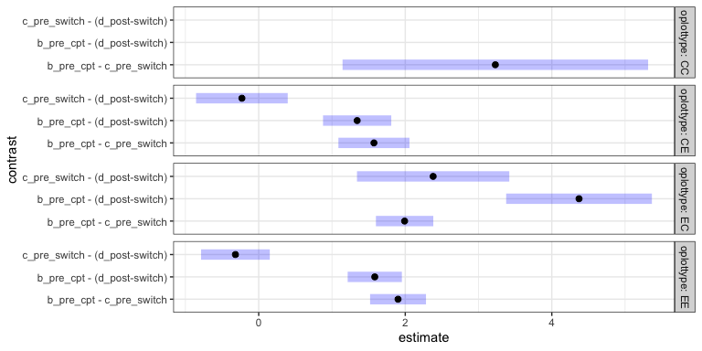
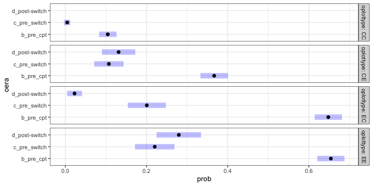
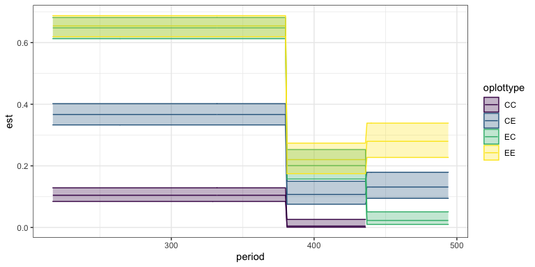

PB
================
Renata Diaz
2021-05-03

  - [models](#models)

``` r
plot_ps <- get_plot_totals(use_pre_switch = F)
```

    ## Loading in data version 2.95.0

    ## Joining, by = "plot"

``` r
treat_ps <- get_treatment_means(use_pre_switch = F) 
```

    ## Loading in data version 2.95.0
    ## Joining, by = "plot"

``` r
ggplot(filter(plot_ps), aes(censusdate, pb_e_ma,group = plot, color = oplottype)) +
  geom_line() +
  facet_wrap(vars(oplottype)) +
  ggtitle("PB - all time")
```

<!-- -->

``` r
ggplot(filter(plot_ps, as.numeric(oera) > 2), aes(censusdate, pb_e_ma,group = plot, color = oplottype)) +
  geom_line() +
  facet_wrap(vars(oplottype)) +
  ggtitle("PB - since 2010ish")
```

<!-- -->

``` r
ggplot(filter(plot_ps), aes(censusdate, pb_e_ma/total_e_ma,group = plot, color = oplottype)) +
  geom_line() +
  facet_wrap(vars(oplottype)) +
  ggtitle("PB as percent of plot energy - all time") +
  geom_line(data = filter(treat_ps), aes(censusdate, pb_e_ma/total_e_ma, color = oplottype), inherit.aes = F, size = 2)
```

<!-- -->

``` r
ggplot(filter(plot_ps, as.numeric(oera) > 2), aes(censusdate, pb_e_ma / total_e_ma,group = plot, color = oplottype)) +
  geom_line() +
  facet_wrap(vars(oplottype)) +
  ggtitle("PB as percent of plot energy - since 2010ish") +
  geom_line(data = filter(treat_ps, as.numeric(oera) > 2), aes(censusdate, pb_e_ma/total_e_ma, color = oplottype), inherit.aes = F, size = 2)
```

<!-- -->

### models

``` r
library(mgcv)
```

    ## Loading required package: nlme

    ## 
    ## Attaching package: 'nlme'

    ## The following object is masked from 'package:dplyr':
    ## 
    ##     collapse

    ## This is mgcv 1.8-33. For overview type 'help("mgcv-package")'.

``` r
library(gratia)
library(emmeans)

plot_ps_pb <- plot_ps %>%
  mutate(pb_prop = pb_e / total_e) %>%
  filter(as.numeric(oera) > 1) %>%
  mutate(pb_prop = ifelse(is.nan(pb_prop), 0, pb_prop),
         row = dplyr::row_number())

qbin_int_gam <- gam(pb_prop ~ oera * oplottype + s(fplot, bs = "re"), family = quasibinomial(), data= plot_ps_pb)

qbin_int_gam_fit <- plot_ps_pb %>%
  add_fitted(qbin_int_gam, exclude = "s(fplot)")

ggplot(qbin_int_gam_fit, aes(censusdate, .value, color = oplottype)) +
  geom_line()
```

<!-- -->

``` r
pairs(emmeans(qbin_int_gam, specs = ~ oera | oplottype))
```

    ## NOTE: A nesting structure was detected in the fitted model:
    ##     fplot %in% oplottype

    ## oplottype = CC:
    ##  contrast                       estimate    SE   df t.ratio p.value
    ##  b_pre_cpt - c_pre_switch         3.2025 0.632 3637  5.067  <.0001 
    ##  b_pre_cpt - (d_post-switch)      5.1001 1.678 3637  3.039  0.0067 
    ##  c_pre_switch - (d_post-switch)   1.8976 1.789 3637  1.061  0.5386 
    ## 
    ## oplottype = CE:
    ##  contrast                       estimate    SE   df t.ratio p.value
    ##  b_pre_cpt - c_pre_switch         1.7061 0.174 3637  9.799  <.0001 
    ##  b_pre_cpt - (d_post-switch)      1.6951 0.180 3637  9.439  <.0001 
    ##  c_pre_switch - (d_post-switch)  -0.0110 0.232 3637 -0.047  0.9988 
    ## 
    ## oplottype = EC:
    ##  contrast                       estimate    SE   df t.ratio p.value
    ##  b_pre_cpt - c_pre_switch         2.0264 0.143 3637 14.205  <.0001 
    ##  b_pre_cpt - (d_post-switch)      4.4013 0.371 3637 11.857  <.0001 
    ##  c_pre_switch - (d_post-switch)   2.3748 0.388 3637  6.122  <.0001 
    ## 
    ## oplottype = EE:
    ##  contrast                       estimate    SE   df t.ratio p.value
    ##  b_pre_cpt - c_pre_switch         2.1304 0.118 3637 17.989  <.0001 
    ##  b_pre_cpt - (d_post-switch)      2.1552 0.123 3637 17.532  <.0001 
    ##  c_pre_switch - (d_post-switch)   0.0248 0.151 3637  0.164  0.9852 
    ## 
    ## Results are averaged over the levels of: fplot 
    ## Results are given on the log odds ratio (not the response) scale. 
    ## P value adjustment: tukey method for comparing a family of 3 estimates

``` r
plot(regrid(emmeans(qbin_int_gam, specs = ~ oera | oplottype)))
```

    ## NOTE: A nesting structure was detected in the fitted model:
    ##     fplot %in% oplottype

<!-- -->

GLM:

``` r
qbin_glm <- glm(pb_prop ~ oera * oplottype, family = quasibinomial(), data= plot_ps_pb)

summary(qbin_glm)
```

    ## 
    ## Call:
    ## glm(formula = pb_prop ~ oera * oplottype, family = quasibinomial(), 
    ##     data = plot_ps_pb)
    ## 
    ## Deviance Residuals: 
    ##      Min        1Q    Median        3Q       Max  
    ## -1.39247  -0.48083  -0.09665   0.38555   2.10920  
    ## 
    ## Coefficients:
    ##                    Estimate Std. Error t value Pr(>|t|)    
    ## (Intercept)        -2.26314    0.16069 -14.084  < 2e-16 ***
    ## oera.L             -2.29772    0.31811  -7.223 6.16e-13 ***
    ## oera.Q              0.45306    0.23179   1.955   0.0507 .  
    ## oplottype.L         2.68440    0.41930   6.402 1.73e-10 ***
    ## oplottype.Q        -1.31670    0.32137  -4.097 4.27e-05 ***
    ## oplottype.C         0.94664    0.17535   5.398 7.15e-08 ***
    ## oera.L:oplottype.L  1.05518    0.83197   1.268   0.2048    
    ## oera.Q:oplottype.L -0.01731    0.60224  -0.029   0.9771    
    ## oera.L:oplottype.Q -0.36567    0.63622  -0.575   0.5655    
    ## oera.Q:oplottype.Q  0.39063    0.46358   0.843   0.3995    
    ## oera.L:oplottype.C  1.81953    0.34260   5.311 1.16e-07 ***
    ## oera.Q:oplottype.C  0.59571    0.25908   2.299   0.0215 *  
    ## ---
    ## Signif. codes:  0 '***' 0.001 '**' 0.01 '*' 0.05 '.' 0.1 ' ' 1
    ## 
    ## (Dispersion parameter for quasibinomial family taken to be 0.4091462)
    ## 
    ##     Null deviance: 2659.0  on 3659  degrees of freedom
    ## Residual deviance: 1598.3  on 3648  degrees of freedom
    ## AIC: NA
    ## 
    ## Number of Fisher Scoring iterations: 9

The above GLM struggles, I think because the controls in d are literally
all 0. One could either remove just that time period for controls, or
remove controls wholesale.

``` r
qbin_glm_noctrl <- glm(pb_prop ~ oera * oplottype, family = quasibinomial(), data= filter(plot_ps_pb, oplottype != "CC"))

qbin_glm_nocd <- glm(pb_prop ~ oera * oplottype, family = quasibinomial(), data= filter(plot_ps_pb, paste0(oplottype, oera) != "CCd_post-switch"))

plot(pairs(emmeans(qbin_glm_noctrl, specs = ~ oera | oplottype)))
```

<!-- -->

``` r
plot(pairs(emmeans(qbin_glm_nocd, specs = ~ oera | oplottype)))
```

    ## Warning: Removed 2 rows containing missing values (geom_point).

    ## Warning: Removed 2 rows containing missing values (geom_segment).

    ## Warning: Removed 2 rows containing missing values (geom_point).

<!-- -->

It literally doesn’t matter which you do, so I’m gonna go with no
controls at all because the piecewise removal creeps me out.

``` r
ilink <- qbin_glm$family$linkinv

qbin_glm_se <- predict(qbin_glm_noctrl, type = "link", se.fit = T, newdata = filter(plot_ps_pb, oplottype != "CC")) %>%
  as.data.frame() %>%
  mutate(est = ilink(fit),
         lower = ilink(fit - 2*se.fit),
         upper = ilink(fit + 2*se.fit),
         period = filter(plot_ps_pb, oplottype != "CC")$period,
         oplottype = filter(plot_ps_pb, oplottype != "CC")$oplottype)


ggplot(qbin_glm_se, aes(period, est, color = oplottype, fill = oplottype)) +
  geom_line() +
  geom_ribbon(aes(ymin = lower, ymax= upper), alpha = .3)
```

<!-- -->

``` r
qbin_glm_se <- qbin_glm_se %>%
  right_join(select(plot_ps_pb, oera, oplottype, period))
```

    ## Joining, by = c("period", "oplottype")

``` r
qbin_glm_se %>%
  select(oera, oplottype, est, lower, upper) %>%
  distinct() %>%
  arrange(oplottype, oera)
```

<div class="kable-table">

| oera           | oplottype |       est |     lower |     upper |
| :------------- | :-------- | --------: | --------: | --------: |
| b\_pre\_cpt    | CC        |        NA |        NA |        NA |
| c\_pre\_switch | CC        |        NA |        NA |        NA |
| d\_post-switch | CC        |        NA |        NA |        NA |
| b\_pre\_cpt    | CE        | 0.3773377 | 0.3454396 | 0.4103348 |
| c\_pre\_switch | CE        | 0.1081368 | 0.0780539 | 0.1479533 |
| d\_post-switch | CE        | 0.1091666 | 0.0778756 | 0.1509720 |
| b\_pre\_cpt    | EC        | 0.6207243 | 0.5877035 | 0.6526634 |
| c\_pre\_switch | EC        | 0.1793774 | 0.1404816 | 0.2262083 |
| d\_post-switch | EC        | 0.0200208 | 0.0088405 | 0.0447028 |
| b\_pre\_cpt    | EE        | 0.5917202 | 0.5659753 | 0.6169715 |
| c\_pre\_switch | EE        | 0.1768627 | 0.1462660 | 0.2122683 |
| d\_post-switch | EE        | 0.1735686 | 0.1420966 | 0.2103025 |

</div>

``` r
treat_ps %>%
  group_by(oera, oplottype) %>%
  summarize(mean_pb_prop = mean(pb_e / total_e, na.rm = T)) %>%
  ungroup() %>%
  arrange(oplottype, oera)
```

    ## `summarise()` has grouped output by 'oera'. You can override using the `.groups` argument.

<div class="kable-table">

| oera           | oplottype | mean\_pb\_prop |
| :------------- | :-------- | -------------: |
| a\_pre\_ba     | CC        |      0.0000000 |
| b\_pre\_cpt    | CC        |      0.1046083 |
| c\_pre\_switch | CC        |      0.0046035 |
| d\_post-switch | CC        |      0.0008429 |
| a\_pre\_ba     | CE        |      0.0004537 |
| b\_pre\_cpt    | CE        |      0.3667359 |
| c\_pre\_switch | CE        |      0.1072642 |
| d\_post-switch | CE        |      0.1312703 |
| a\_pre\_ba     | EC        |      0.0009833 |
| b\_pre\_cpt    | EC        |      0.6523698 |
| c\_pre\_switch | EC        |      0.2174779 |
| d\_post-switch | EC        |      0.0227079 |
| a\_pre\_ba     | EE        |      0.0000000 |
| b\_pre\_cpt    | EE        |      0.6541999 |
| c\_pre\_switch | EE        |      0.2246082 |
| d\_post-switch | EE        |      0.2796247 |

</div>

KKKK, the above code is a mess, but things I think I’m learning…

  - PB has declined sitewide, raw and as a proportion of total energy
    use.
  - It is now totally absent on control plots.
  - There are a lot of modeling options and none of them are perfect.
    Some notes on the considerations: -\~ The GAMs fit with a smooth for
    period and a random effect for plot were doing a really bad job;
    they’d fit control higher than any other treatment even though
    that’s just Wrong. This might be fixable by increasing the k for
    the period smooth, but I haven’t gone deep in there because models
    with high k take a while to run and this isn’t exactly what I’m
    trying to learn right now.\~ I think this is because I wasn’t
    including a parametric term for the factor.
      - I’ve been working with both betar() and quasibinomial() as
        GAM/GLM families. I think they give essentially the same results
        in this application, but haven’t tested extensively.

What I really wanted to know was,

how much energy is PB using *now* on exclosures vs. when it was more
dominant? And that looks like, an estimate now of about 14-18% post-2010
compared to about 60% pre-2010. If you don’t take into account plot
variation, and work just with the treatment means, that’s about 24%
post-2010. Compared to, essentially none on control plots. (Although
note, oddly enough, it was more abundant on C –\> E plots prior to the
switch than on C –\> C plots. I see this a bunch and I think it means we
can’t use those plots to get at priority effects.)

Since I’ve been working with GLS (allows for autocorr) in the ratios…

``` r
library(nlme)

treat_ps <- treat_ps %>%
  mutate(pb_prop = pb_e / total_e) %>%
  group_by_all() %>%
  mutate(pb_prop = ifelse(is.na(pb_prop), 0, pb_prop)) %>%
  ungroup()

pb_treat <- filter(treat_ps, as.numeric(oera) != 1) %>%
  filter(oplottype != "CC")

pb_gls <- gls(pb_prop ~ plot_type * era, correlation = corAR1(form = ~ period | plot_type), data = pb_treat)

plot(emmeans(pb_gls, specs = ~ era | plot_type))
```

<!-- -->

``` r
plot(pairs(emmeans(pb_gls, specs = ~ era | plot_type)))
```

<!-- -->

The GLS makes some negative predictions for near zero values. It pushes
the contrast for c-d for EC to not sig.

The directly comparable model would be a GLM on treatment means. Again,
including controls in d makes the CIs huge.

``` r
pb_treat <- filter(treat_ps, as.numeric(oera) != 1) %>%
  filter(paste0(oplottype, oera) != "CCd_post-switch")  %>%
  group_by(oplottype) %>%
  mutate(pb_prop_ma = maopts(pb_prop)) %>%
  ungroup()

glm_treat <- glm(pb_prop ~ oera * oplottype, family = quasibinomial(), data= pb_treat)

plot(pairs(emmeans(glm_treat, specs = ~ oera | oplottype)))
```

    ## Warning: Removed 2 rows containing missing values (geom_point).

    ## Warning: Removed 2 rows containing missing values (geom_segment).

    ## Warning: Removed 2 rows containing missing values (geom_point).

<!-- -->

``` r
plot(regrid(emmeans(glm_treat, specs = ~ oera | oplottype)))
```

    ## Warning: Removed 1 rows containing missing values (geom_point).

    ## Warning: Removed 1 rows containing missing values (geom_segment).

    ## Warning: Removed 1 rows containing missing values (geom_point).

<!-- -->

``` r
ilink <- glm_treat$family$linkinv

glm_treat_se <- predict(glm_treat, type = "link", se.fit = T, newdata = pb_treat) %>%
  as.data.frame() %>%
  mutate(est = ilink(fit),
         lower = ilink(fit - 2*se.fit),
         upper = ilink(fit + 2*se.fit),
         period = filter(pb_treat)$period,
         oplottype = filter(pb_treat)$oplottype)
```

    ## Warning in predict.lm(object, newdata, se.fit, scale = residual.scale, type = if
    ## (type == : prediction from a rank-deficient fit may be misleading

``` r
ggplot(glm_treat_se, aes(period, est, color = oplottype, fill = oplottype)) +
  geom_line() +
  geom_ribbon(aes(ymin = lower, ymax= upper), alpha = .3)
```

<!-- -->

``` r
glm_treat_se <- glm_treat_se %>%
  right_join(select(pb_treat, oera, oplottype, period, censusdate, pb_prop_ma))
```

    ## Joining, by = c("period", "oplottype")

``` r
ggplot(glm_treat_se, aes(censusdate, est, color = oplottype, fill = oplottype)) +
  geom_line() +
  geom_ribbon(aes(ymin = lower, ymax= upper), alpha = .3) +
  geom_line(aes(y = pb_prop_ma)) +
  facet_grid(cols = vars(oera), space = "free_x", scales = "free_x") +
  ylab("PB % of energy use") +
  ggtitle("PB ratio over time") +
  theme(legend.position = "top")
```

<!-- -->
