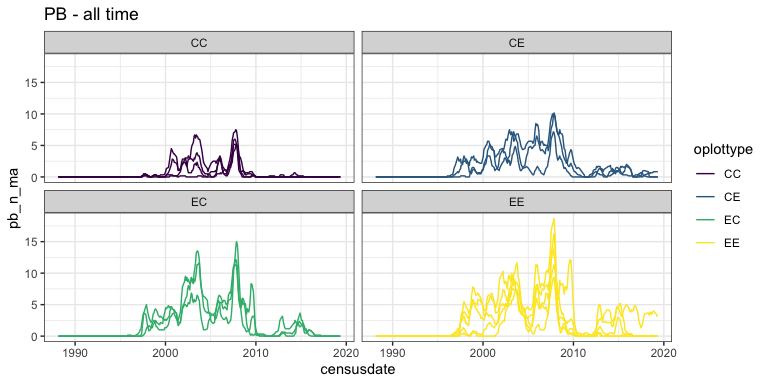
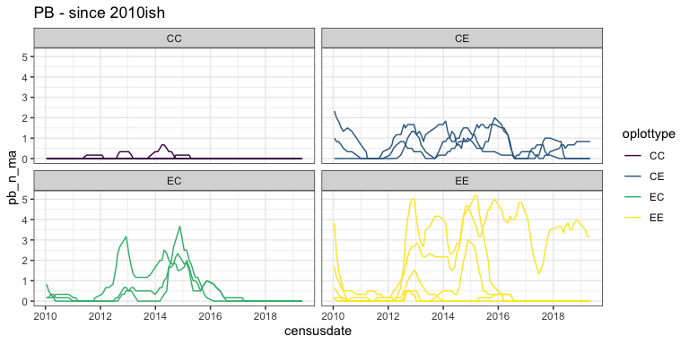
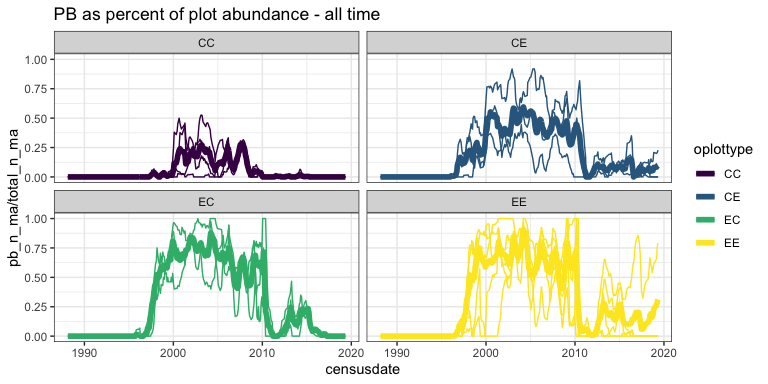
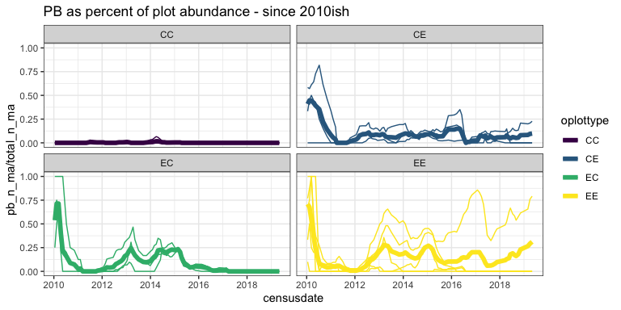
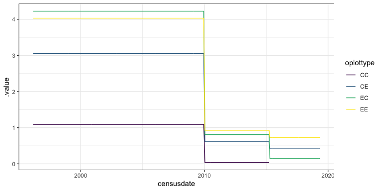
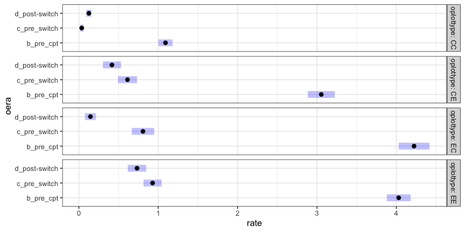
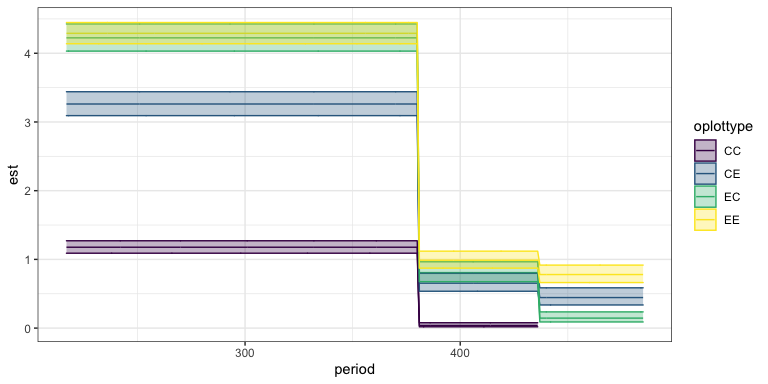
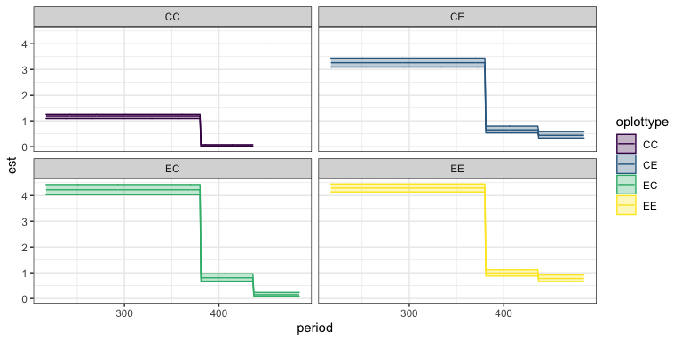

PB
================
Renata Diaz
2021-03-30

  - [models](#models)

``` r
plot_ps <- get_plot_totals(use_pre_switch = F, currency = "abundance")
```

    ## Loading in data version 2.49.0

    ## Joining, by = "plot"

``` r
treat_ps <- get_treatment_means(use_pre_switch = F, currency = "abundance") 
```

    ## Loading in data version 2.49.0
    ## Joining, by = "plot"

``` r
ggplot(filter(plot_ps), aes(censusdate, pb_n_ma,group = plot, color = oplottype)) +
  geom_line() +
  facet_wrap(vars(oplottype)) +
  ggtitle("PB - all time")
```

<!-- -->

``` r
ggplot(filter(plot_ps, as.numeric(oera) > 2), aes(censusdate, pb_n_ma,group = plot, color = oplottype)) +
  geom_line() +
  facet_wrap(vars(oplottype)) +
  ggtitle("PB - since 2010ish")
```

<!-- -->

``` r
ggplot(filter(plot_ps), aes(censusdate, pb_n_ma/total_n_ma,group = plot, color = oplottype)) +
  geom_line() +
  facet_wrap(vars(oplottype)) +
  ggtitle("PB as percent of plot abundance - all time") +
  geom_line(data = filter(treat_ps), aes(censusdate, pb_n_ma/total_n_ma, color = oplottype), inherit.aes = F, size = 2)
```

<!-- -->

``` r
ggplot(filter(plot_ps, as.numeric(oera) > 2), aes(censusdate, pb_n_ma / total_n_ma,group = plot, color = oplottype)) +
  geom_line() +
  facet_wrap(vars(oplottype)) +
  ggtitle("PB as percent of plot abundance - since 2010ish") +
  geom_line(data = filter(treat_ps, as.numeric(oera) > 2), aes(censusdate, pb_n_ma/total_n_ma, color = oplottype), inherit.aes = F, size = 2)
```

<!-- -->

### models

``` r
library(mgcv)
```

    ## Loading required package: nlme

    ## 
    ## Attaching package: 'nlme'

    ## The following object is masked from 'package:dplyr':
    ## 
    ##     collapse

    ## This is mgcv 1.8-33. For overview type 'help("mgcv-package")'.

``` r
library(gratia)
library(emmeans)
library(lme4)
```

    ## Loading required package: Matrix

    ## 
    ## Attaching package: 'lme4'

    ## The following object is masked from 'package:nlme':
    ## 
    ##     lmList

``` r
plot_ps_pb <- plot_ps %>%
  filter(as.numeric(oera) > 1) %>%
  group_by_all() %>%
  mutate(pb_n = ifelse(all(oplottype == "CC", as.numeric(oera) == 4), NA, pb_n)) %>%
  ungroup() %>%
  filter(!is.na(pb_n))#%>%
  #filter(oplottype != "CC")

abund_int_gam <- gam(pb_n ~ oplottype * oera + s(fplot, bs = "re"), data = plot_ps_pb, family = poisson)

abund_int_gam_fitted <- plot_ps_pb %>%
  add_fitted(abund_int_gam, exclude = "s(fplot)")

ggplot(abund_int_gam_fitted, aes(censusdate, .value, color = oplottype)) +
  geom_line() #+
```

<!-- -->

``` r
  #geom_line(data = treat_ps, aes(y = pb_n)) 

plot(regrid(emmeans(abund_int_gam, specs = ~ oera | oplottype)))
```

    ## NOTE: A nesting structure was detected in the fitted model:
    ##     fplot %in% oplottype

<!-- -->

``` r
pairs((emmeans(abund_int_gam, specs = ~ oera | oplottype)))
```

    ## NOTE: A nesting structure was detected in the fitted model:
    ##     fplot %in% oplottype

    ## oplottype = CC:
    ##  contrast                       estimate     SE   df t.ratio p.value
    ##  b_pre_cpt - c_pre_switch          3.421 0.3556 3347  9.620  <.0001 
    ##  b_pre_cpt - (d_post-switch)       2.164 0.1254 3347 17.265  <.0001 
    ##  c_pre_switch - (d_post-switch)   -1.257 0.3771 3347 -3.333  0.0025 
    ## 
    ## oplottype = CE:
    ##  contrast                       estimate     SE   df t.ratio p.value
    ##  b_pre_cpt - c_pre_switch          1.607 0.1025 3347 15.673  <.0001 
    ##  b_pre_cpt - (d_post-switch)       1.993 0.1412 3347 14.115  <.0001 
    ##  c_pre_switch - (d_post-switch)    0.386 0.1704 3347  2.266  0.0609 
    ## 
    ## oplottype = EC:
    ##  contrast                       estimate     SE   df t.ratio p.value
    ##  b_pre_cpt - c_pre_switch          1.654 0.0921 3347 17.962  <.0001 
    ##  b_pre_cpt - (d_post-switch)       3.370 0.2437 3347 13.830  <.0001 
    ##  c_pre_switch - (d_post-switch)    1.715 0.2584 3347  6.639  <.0001 
    ## 
    ## oplottype = EE:
    ##  contrast                       estimate     SE   df t.ratio p.value
    ##  b_pre_cpt - c_pre_switch          1.468 0.0649 3347 22.611  <.0001 
    ##  b_pre_cpt - (d_post-switch)       1.705 0.0831 3347 20.527  <.0001 
    ##  c_pre_switch - (d_post-switch)    0.238 0.1023 3347  2.321  0.0530 
    ## 
    ## Results are averaged over the levels of: fplot 
    ## Results are given on the log (not the response) scale. 
    ## P value adjustment: tukey method for comparing a family of 3 estimates

``` r
abund_int_gam_fitted %>%
  select(oplottype, oera, .value) %>%
  mutate(.value = round(.value, digits = 2)) %>%
  distinct()
```

<div class="kable-table">

| oplottype | oera           | .value |
| :-------- | :------------- | -----: |
| CE        | b\_pre\_cpt    |   3.05 |
| EE        | b\_pre\_cpt    |   4.03 |
| CC        | b\_pre\_cpt    |   1.09 |
| EC        | b\_pre\_cpt    |   4.22 |
| CE        | c\_pre\_switch |   0.61 |
| EE        | c\_pre\_switch |   0.93 |
| CC        | c\_pre\_switch |   0.04 |
| EC        | c\_pre\_switch |   0.81 |
| CE        | d\_post-switch |   0.42 |
| EE        | d\_post-switch |   0.73 |
| EC        | d\_post-switch |   0.15 |

</div>

``` r
treat_ps %>%
  group_by(oplottype, oera) %>%
  summarize(mean_pb_n = mean(pb_n)) %>%
  ungroup()
```

    ## `summarise()` has grouped output by 'oplottype'. You can override using the `.groups` argument.

<div class="kable-table">

| oplottype | oera           | mean\_pb\_n |
| :-------- | :------------- | ----------: |
| CC        | a\_pre\_ba     |   0.0000000 |
| CC        | b\_pre\_cpt    |   1.1770833 |
| CC        | c\_pre\_switch |   0.0384615 |
| CC        | d\_post-switch |   0.0000000 |
| CE        | a\_pre\_ba     |   0.0034014 |
| CE        | b\_pre\_cpt    |   3.2615741 |
| CE        | c\_pre\_switch |   0.6538462 |
| CE        | d\_post-switch |   0.4444444 |
| EC        | a\_pre\_ba     |   0.0034014 |
| EC        | b\_pre\_cpt    |   4.2245370 |
| EC        | c\_pre\_switch |   0.8076923 |
| EC        | d\_post-switch |   0.1452991 |
| EE        | a\_pre\_ba     |   0.0000000 |
| EE        | b\_pre\_cpt    |   4.2902778 |
| EE        | c\_pre\_switch |   0.9884615 |
| EE        | d\_post-switch |   0.7794872 |

</div>

``` r
pois_glm <- glm(pb_n ~ oera * oplottype, family = poisson, data= plot_ps_pb)

summary(pois_glm)
```

    ## 
    ## Call:
    ## glm(formula = pb_n ~ oera * oplottype, family = poisson, data = plot_ps_pb)
    ## 
    ## Deviance Residuals: 
    ##     Min       1Q   Median       3Q      Max  
    ## -2.9293  -1.4060  -0.5391   0.6889   8.3183  
    ## 
    ## Coefficients: (1 not defined because of singularities)
    ##                    Estimate Std. Error z value Pr(>|z|)    
    ## (Intercept)         -0.3548     0.1277  -2.779 0.005451 ** 
    ## oera.L              -1.5617     0.2333  -6.695 2.15e-11 ***
    ## oera.Q               0.7621     0.1208   6.309 2.81e-10 ***
    ## oplottype.L          1.2696     0.3613   3.514 0.000442 ***
    ## oplottype.Q         -0.4579     0.2821  -1.623 0.104590    
    ## oplottype.C          0.5842     0.1201   4.864 1.15e-06 ***
    ## oera.L:oplottype.L  -0.1890     0.6771  -0.279 0.780170    
    ## oera.Q:oplottype.L  -1.1703     0.3539  -3.307 0.000943 ***
    ## oera.L:oplottype.Q   0.6688     0.5266   1.270 0.204056    
    ## oera.Q:oplottype.Q   1.0505     0.2727   3.853 0.000117 ***
    ## oera.L:oplottype.C   0.6626     0.1737   3.815 0.000136 ***
    ## oera.Q:oplottype.C       NA         NA      NA       NA    
    ## ---
    ## Signif. codes:  0 '***' 0.001 '**' 0.01 '*' 0.05 '.' 0.1 ' ' 1
    ## 
    ## (Dispersion parameter for poisson family taken to be 1)
    ## 
    ##     Null deviance: 13312.0  on 3368  degrees of freedom
    ## Residual deviance:  8711.6  on 3358  degrees of freedom
    ## AIC: 14420
    ## 
    ## Number of Fisher Scoring iterations: 6

``` r
ilink <- pois_glm$family$linkinv

pois_glm_se <- predict(pois_glm, type = "link", se.fit = T, newdata = plot_ps_pb) %>%
  as.data.frame() %>%
  mutate(est = ilink(fit),
         lower = ilink(fit - 2*se.fit),
         upper = ilink(fit + 2*se.fit),
         period = plot_ps_pb$period,
         oplottype = plot_ps_pb$oplottype,
         actual = plot_ps_pb$pb_n)
```

    ## Warning in predict.lm(object, newdata, se.fit, scale = residual.scale, type = if
    ## (type == : prediction from a rank-deficient fit may be misleading

``` r
ggplot(filter(pois_glm_se, !is.na(actual)), aes(period, est, color = oplottype, fill = oplottype)) +
  geom_line() +
  geom_ribbon(aes(ymin = lower, ymax= upper), alpha = .3)
```

<!-- -->

``` r
ggplot(filter(pois_glm_se, !is.na(actual)), aes(period, est, color = oplottype, fill = oplottype)) +
  geom_line() +
  geom_ribbon(aes(ymin = lower, ymax= upper), alpha = .3) +
  facet_wrap(vars(oplottype))
```

<!-- -->

``` r
pairs(emmeans(pois_glm, specs = ~ oera | oplottype))
```

    ## oplottype = CC:
    ##  contrast                       estimate     SE  df z.ratio p.value
    ##  b_pre_cpt - c_pre_switch          3.421 0.3556 Inf  9.620  <.0001 
    ##  b_pre_cpt - (d_post-switch)      nonEst     NA  NA     NA      NA 
    ##  c_pre_switch - (d_post-switch)   nonEst     NA  NA     NA      NA 
    ## 
    ## oplottype = CE:
    ##  contrast                       estimate     SE  df z.ratio p.value
    ##  b_pre_cpt - c_pre_switch          1.607 0.1025 Inf 15.673  <.0001 
    ##  b_pre_cpt - (d_post-switch)       1.993 0.1412 Inf 14.115  <.0001 
    ##  c_pre_switch - (d_post-switch)    0.386 0.1704 Inf  2.266  0.0607 
    ## 
    ## oplottype = EC:
    ##  contrast                       estimate     SE  df z.ratio p.value
    ##  b_pre_cpt - c_pre_switch          1.654 0.0921 Inf 17.962  <.0001 
    ##  b_pre_cpt - (d_post-switch)       3.370 0.2437 Inf 13.830  <.0001 
    ##  c_pre_switch - (d_post-switch)    1.715 0.2584 Inf  6.639  <.0001 
    ## 
    ## oplottype = EE:
    ##  contrast                       estimate     SE  df z.ratio p.value
    ##  b_pre_cpt - c_pre_switch          1.468 0.0649 Inf 22.611  <.0001 
    ##  b_pre_cpt - (d_post-switch)       1.705 0.0831 Inf 20.528  <.0001 
    ##  c_pre_switch - (d_post-switch)    0.238 0.1023 Inf  2.321  0.0529 
    ## 
    ## Results are given on the log (not the response) scale. 
    ## P value adjustment: tukey method for comparing a family of 3 estimates

``` r
pois_glm_se <- pois_glm_se %>%
  right_join(select(plot_ps_pb, oera, oplottype, period))
```

    ## Joining, by = c("period", "oplottype")

``` r
pois_glm_se %>%
  select(oera, oplottype, est, lower, upper) %>%
  distinct()
```

<div class="kable-table">

| oera           | oplottype |       est |     lower |     upper |
| :------------- | :-------- | --------: | --------: | --------: |
| b\_pre\_cpt    | CE        | 3.2615741 | 3.0923418 | 3.4400678 |
| b\_pre\_cpt    | EE        | 4.2902778 | 4.1386371 | 4.4474747 |
| b\_pre\_cpt    | CC        | 1.1770833 | 1.0900571 | 1.2710574 |
| b\_pre\_cpt    | EC        | 4.2245370 | 4.0313174 | 4.4270176 |
| c\_pre\_switch | CE        | 0.6538462 | 0.5363798 | 0.7970374 |
| c\_pre\_switch | EE        | 0.9884615 | 0.8725266 | 1.1198010 |
| c\_pre\_switch | CC        | 0.0384615 | 0.0189642 | 0.0780044 |
| c\_pre\_switch | EC        | 0.8076923 | 0.6758742 | 0.9652193 |
| d\_post-switch | CE        | 0.4444444 | 0.3367952 | 0.5865015 |
| d\_post-switch | EE        | 0.7794872 | 0.6627617 | 0.9167704 |
| d\_post-switch | EC        | 0.1452991 | 0.0894539 | 0.2360080 |

</div>

This was to explore how many **individuals** of PB there are in the
different time periods.

  - PB has always been less abundant on controls than on treatment
    plots. (Although it has always been more abundant on the CE controls
    than on the CC controls).
  - Since 2010 it is essentially absent on control plots.
  - Absolute abundance on treatment plots declined from around \~3-4
    individuals per plot to \~.5-1 individuals per plot.

Note that there have also been fluctuations in total abundance of all
species over time. I generally think that that compositional change is
addressed by the energy analyses more appropriately (for the purposes of
this project at the moment) than it would be by repeating that exercise
with number of individuals here.

In fitting GAMs and GLMs here, I’m using Poisson link. These plots and
results come from, removing a) all data prior to 1996, because they’re
all 0s and b) control data after 2015, because they’re all 0s. Leaving
them in blows up the CI for the controls. I tried a quasipoisson link
and that didn’t fix it. I got the same qualitative results just
excluding controls wholesale.

You might be able to fit a GLMM with a random effect for plot. I don’t
know that it will change the outcome that much; the models here are
mostly to estimate the ballpark means, and none of the effects we are
interested in here are ambiguous.
