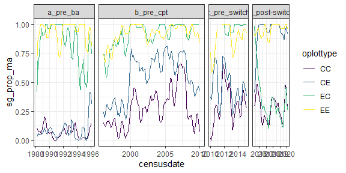
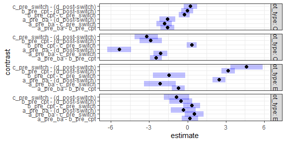
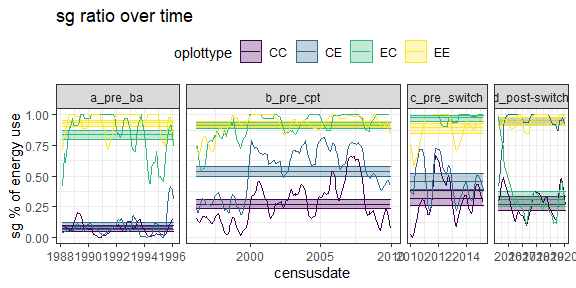
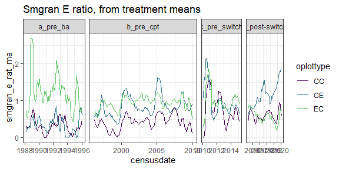
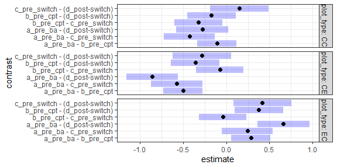
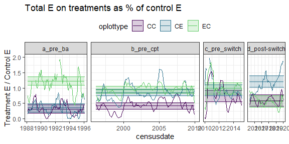

Small granivore energy use
================

SG as a % of treatment use

    ## Loading in data version 2.18.0

    ## Joining, by = "plot"

<!-- --><!-- -->

    ## Joining, by = c("period", "plot_type")

<!-- -->

SG on non-exclosures v EE

    ## Joining, by = "period"

<!-- --><!-- -->

    ## Joining, by = c("era", "plot_type")

<!-- -->
