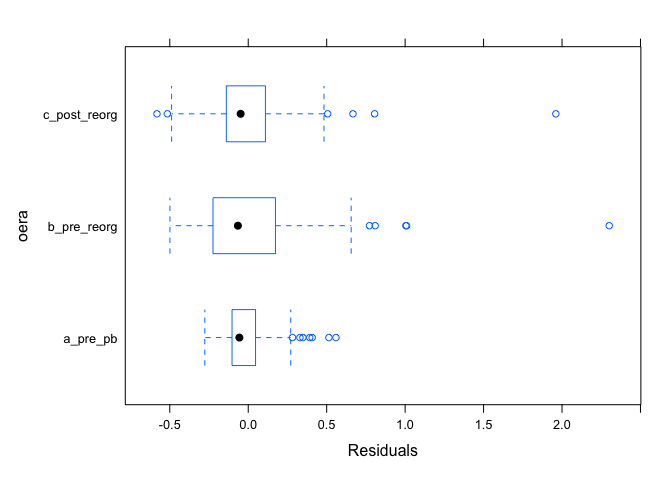
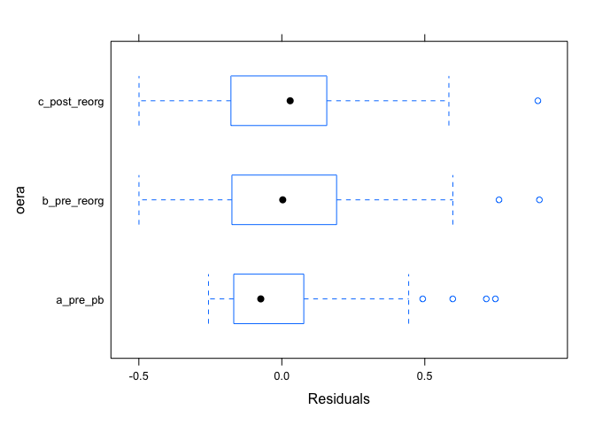
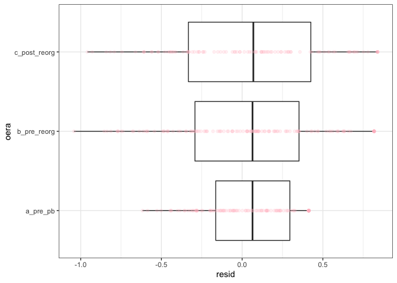
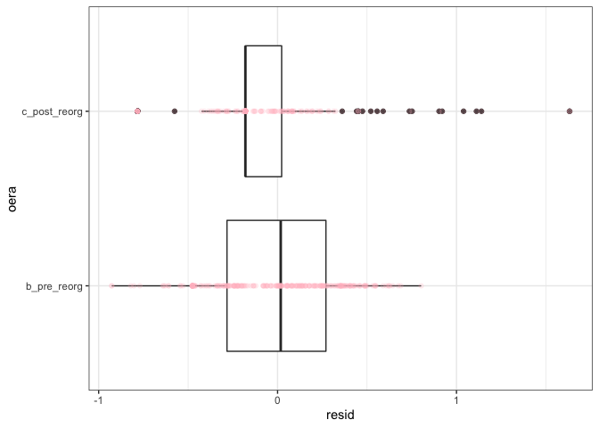

Appendix S2 - Full analytical methods and model results
================
Fully annotated code and RMarkdown documents to reproduce these analyses
are available at <https://doi.org/10.5281/zenodo.5544362> and
<https://doi.org/10.5281/zenodo.5539881>.

  - [Compensation](#compensation)
      - [Table S1. Model comparison for
        compensation.](#table-s1-model-comparison-for-compensation)
      - [Residuals from GLS for
        compensation](#residuals-from-gls-for-compensation)
      - [Table S2. Coefficients from GLS for
        compensation](#table-s2-coefficients-from-gls-for-compensation)
      - [Table S3. Estimates from GLS for
        compensation](#table-s3-estimates-from-gls-for-compensation)
      - [Table S4. Contrasts from GLS for
        compensation](#table-s4-contrasts-from-gls-for-compensation)
  - [Total energy use ratio](#total-energy-use-ratio)
      - [Table S5. Model comparison for total energy
        ratio.](#table-s5-model-comparison-for-total-energy-ratio)
      - [Residuals from GLS for total energy
        ratio](#residuals-from-gls-for-total-energy-ratio)
      - [Table S6. Coefficients from GLS on total energy
        ratio](#table-s6-coefficients-from-gls-on-total-energy-ratio)
      - [Table S7. Estimates from GLS on total energy
        ratio](#table-s7-estimates-from-gls-on-total-energy-ratio)
      - [Table S8. Contrasts from GLS on total energy
        ratio](#table-s8-contrasts-from-gls-on-total-energy-ratio)
  - [Kangaroo rat (Dipodomys) proportional energy
    use](#kangaroo-rat-dipodomys-proportional-energy-use)
      - [Table S9. Model comparison for Dipodomys proportional energy
        use.](#table-s9-model-comparison-for-dipodomys-proportional-energy-use)
      - [Residuals from GLM on Dipodomys energy
        use.](#residuals-from-glm-on-dipodomys-energy-use)
      - [Table S10. Coefficients from GLM on Dipodomys energy
        use.](#table-s10-coefficients-from-glm-on-dipodomys-energy-use)
      - [Table S11. Estimates from GLM on Dipodomys energy
        use.](#table-s11-estimates-from-glm-on-dipodomys-energy-use)
      - [Table S12. Contrasts from GLM on Dipodomys energy
        use.](#table-s12-contrasts-from-glm-on-dipodomys-energy-use)
  - [C. baileyi proportional energy
    use](#c-baileyi-proportional-energy-use)
      - [Table S13. Model comparison for C. baileyi proportional energy
        use.](#table-s13-model-comparison-for-c-baileyi-proportional-energy-use)
      - [Residuals from GLM on C. baileyi energy
        use.](#residuals-from-glm-on-c-baileyi-energy-use)
      - [Table S14. Coefficients from GLM on C. baileyi energy
        use](#table-s14-coefficients-from-glm-on-c-baileyi-energy-use)
      - [Table S15. Estimates from GLM on C. baileyi energy
        use](#table-s15-estimates-from-glm-on-c-baileyi-energy-use)
      - [Table S16. Contrasts from GLM on C. baileyi energy
        use.](#table-s16-contrasts-from-glm-on-c-baileyi-energy-use)
  - [References](#references)

<!-- # Data -->

<!-- ## Functions -->

<!-- Data are accessed and processed using functions stored in https://github.com/diazrenata/soar, archived on Zenodo at https://doi.org/10.5281/zenodo.5539880. Install these functions either by running: -->

<!-- or by downloading the Zenodo archive and installing the package manually.  -->

<!-- ## Data access -->

<!-- Data can be downloaded directly from the Portal data repository: -->

<!-- For speed and offline access, data files are also included in this repository in the `data` directory: -->

<!-- For interpretability, translating the era and treatment "names" as RMD coded them for analysis to the corresponding dates: -->

<!-- ## Balancing exclosure and control plots -->

<!-- Because there are 5 exclosure plots and 4 control plots in these data, we remove 1 exclosure plot to achieve a balanced design. From the 5 possible exclosures to remove, we randomly select 1 using the seed 1977 (the year the Portal Project was initiated).  -->

<!-- ## Treatment-level means and quantities of interest -->

<!-- In order to calculate compensation and the total energy ratio, it is necessary to take the treatment-level mean total energy use and energy use by kangaroo rats and small granivores on control plots. For consistency in the main analysis, we take treatment-level means for all quantities. -->

<!-- Because this necessarily elides some degree of variability between plots with treatment types, we also conducted a provisional analysis incorporating between-plot variability for exclosure plots (but not for control plots), with qualitatively the same results (see appendix S4).  -->

<!-- To take treatment-level means: -->

<!-- Calculate proportional energy use of *C. baileyi* on exclosure and control plots. The `pb_nozero` dataframe omits the first time period, because during that time *C. baileyi* was essentially absent at the site (and the large number of 0s for an entire treatment-by-factor level combination breaks statistical models). -->

<!-- Calculate total energy ratio and compensation, comparing exclosure to control plots: -->

<!-- Calculate kangaroo rat (Dipodomys) proportion of total energy use on control plots: -->

<!-- ## Variable names for analyses -->

<!-- The variables used in these analyses, and their definitions. -->

<!-- - `period`: The monthly census period number for each census. Numeric. -->

<!-- - `censusdate`: The date of the monthly census. Date. -->

<!-- - `era`: The "time period", as described in the text. Character, one of `a_pre_pb` (first time period, before *C. baileyi* arrived at the site), `b_pre_reorg` (second time period, after *C. baileyi* established but before the most recent reorganization event), or `c_post_reorg` (third time period, after the last reorganization event). -->

<!-- - `oera`: `era` as an ordered factor, for modeling. Ordered factor. -->

<!-- - `plot_type`: The treatment, either `CC` for control or `EE` for exclosure. Character. -->

<!-- - `oplottype`: `plot_type` as an ordered factor, for modeling. Ordered factor. -->

<!-- - `total_e_rat`, `total_e_rat_ma` (specific to `energy_ratio`): The ratio of total energy use on exclosure plots relative to control plots, and the 6-month moving average. Numeric, unbounded. -->

<!-- - `smgran_comp`, `smgran_comp_ma` (specific to `compensation`): Energetic compensation by small granivores for kangaroo rat removal, and the 6-month moving average. Numeric, unbounded. -->

<!-- - `pb_prop`, `pb_prop_ma` (specific to `pb` and `pb_nozero`): The proportion of treatment-level energy use accounted for by *C. baileyi*, and the 6-month moving average. Numeric, proportion bounded 0-1. -->

<!-- - `dipo_prop`, `dipo_prop_ma` (specific to `dipo_c_dat`): The proportion of treatment-level energy use accounted for by all kangaroo rats, and the 6-month moving average. Numeric, proportion bounded 0-1. -->

# Compensation

We fit a generalized least squares (of the form *compensation \~
timeperiod*; note that “timeperiod” is coded as “oera” throughout) using
the `gls` function from the R package `nlme` (Pinheiro et al. 2021).
Because values from monthly censuses within each time period are subject
to temporal autocorrelation, we included a continuous autoregressive
temporal autocorrelation structure of order 1 (using the `CORCAR1`
function). We compared this model to models fit without the
autocorrelation structure and without the time period term using AIC.
The model with both the time period term and the autocorrelation
structure was the best-fitting model via AIC, and we used this model to
calculate estimates and contrasts using the package `emmeans` (Lenth
2021).

### Table S1. Model comparison for compensation.

    ##                        Model.specification       AIC
    ## 1 intercept + timeperiod + autocorrelation  69.85023
    ## 2              intercept + autocorrelation  84.74902
    ## 3                   intercept + timeperiod 157.09726
    ## 4                                intercept 252.74534

### Residuals from GLS for compensation

<!-- -->

### Table S2. Coefficients from GLS for compensation

Note that “oera” is the variable name for the term for time period in
these analyses.

    ##                   Value  Std.Error   t-value      p-value
    ## (Intercept)  0.34503129 0.02949958 11.696141 8.903066e-27
    ## oera.L       0.06479327 0.05241035  1.236269 2.172146e-01
    ## oera.Q      -0.28335529 0.04773594 -5.935890 7.228121e-09

### Table S3. Estimates from GLS for compensation

    ##   Timeperiod    emmean         SE       df   lower.CL  upper.CL
    ## 1  1988-1997 0.1835362 0.05203782 44.11081 0.07866834 0.2884041
    ## 2  1997-2010 0.5763899 0.04626406 47.37851 0.48333826 0.6694416
    ## 3  2010-2020 0.2751677 0.05280098 46.75897 0.16893141 0.3814041

### Table S4. Contrasts from GLS for compensation

    ##              Comparison    estimate         SE       df   t.ratio p.value
    ## 1 1988-1997 - 1997-2010 -0.39285369 0.06894132 47.89422 -5.698378  0.0000
    ## 2 1988-1997 - 2010-2020 -0.09163152 0.07411943 45.51740 -1.236269  0.4383
    ## 3 1997-2010 - 2010-2020  0.30122217 0.06949891 49.52957  4.334200  0.0002

# Total energy use ratio

As for compensation, we fit a generalized least squares of the form
*total\_energy\_ratio \~ timeperiod*, accounting for temporal
autocorrelation between monthly censuses within each time period using a
continuous autoregressive autocorrelation structure of order 1. We
compared this model to models fit without the timeperiod term and/or
autocorrelation structure, and found the full (timeperiod plus
autocorrelation) model had the best performance via AIC. We used this
model for estimates and contrasts.

### Table S5. Model comparison for total energy ratio.

    ##                        Model.specification        AIC
    ## 1 intercept + timeperiod + autocorrelation -132.92138
    ## 2              intercept + autocorrelation -118.15000
    ## 3                   intercept + timeperiod   13.29396
    ## 4                                intercept  156.85988

### Residuals from GLS for total energy ratio

<!-- -->

### Table S6. Coefficients from GLS on total energy ratio

Note that “oera” is the variable name for the term for time period in
these analyses.

    ##                  Value  Std.Error   t-value      p-value
    ## (Intercept)  0.5016731 0.02711764 18.499880 2.562257e-53
    ## oera.L       0.1413504 0.04776457  2.959316 3.300140e-03
    ## oera.Q      -0.2503659 0.04293122 -5.831790 1.279286e-08

### Table S7. Estimates from GLS on total energy ratio

    ##   Timeperiod    emmean         SE       df  lower.CL  upper.CL
    ## 1  1988-1997 0.2995118 0.04758060 36.19943 0.2030323 0.3959913
    ## 2  1997-2010 0.7060960 0.04197730 38.51943 0.6211550 0.7910369
    ## 3  2010-2020 0.4994115 0.04800663 37.62774 0.4021956 0.5966274

### Table S8. Contrasts from GLS on total energy ratio

    ##              Comparison   estimate         SE       df   t.ratio p.value
    ## 1 1988-1997 - 1997-2010 -0.4065842 0.06233984 40.51631 -6.522060  0.0000
    ## 2 1988-1997 - 2010-2020 -0.1998997 0.06754930 37.12310 -2.959316  0.0144
    ## 3 1997-2010 - 2010-2020  0.2066845 0.06264557 41.44768  3.299267  0.0056

# Kangaroo rat (Dipodomys) proportional energy use

Proportional energy use is bounded 0-1 and cannot be fit with
generalized least squares. We therefore used a binomial generalized
linear model of the form *dipodomys\_proportional\_energy\_use \~
timeperiod*. We compared a model fit with a timeperiod term to an
intercept-only (null) model using AIC, and found the timeperiod term
improved model fit. We used this model for estimates and contrasts.

Note that we were unable to incorporate temporal autocorrelation into
generalized linear models, and we prioritized fitting models of the
appropirate family over accounting for autocorrelation. Due to the
pronounced differences between time periods for these variables, we were
comfortable proceeding without explicitly accounting for
autocorrelation.

### Table S9. Model comparison for Dipodomys proportional energy use.

    ##      Model.specification      AIC
    ## 1 intercept + timeperiod 258.3581
    ## 2              intercept 280.8497

### Residuals from GLM on Dipodomys energy use.

<!-- -->

### Table S10. Coefficients from GLM on Dipodomys energy use.

Note that “oera” is the variable name for the term for time period in
these analyses. Coefficients are given on the link (logit) scale.

    ##               Estimate Std. Error   z value     Pr(>|z|)
    ## (Intercept)  1.4032480  0.1503201  9.335068 1.009263e-20
    ## oera.L      -1.1000833  0.2871738 -3.830723 1.277674e-04
    ## oera.Q       0.5855493  0.2304516  2.540878 1.105745e-02

### Table S11. Estimates from GLM on Dipodomys energy use.

Note that estimates are back-transformed onto the response scale, for
interpretability.

    ##   Timeperiod      prob         SE  df asymp.LCL asymp.UCL
    ## 1  1988-1997 0.9183528 0.02564615 Inf 0.8680872 0.9686183
    ## 2  1997-2010 0.7160901 0.03985374 Inf 0.6379782 0.7942020
    ## 3  2010-2020 0.7035835 0.04566769 Inf 0.6140765 0.7930905

### Table S12. Contrasts from GLM on Dipodomys energy use.

Contrasts are performed on the link (logit) scale.

    ##                     contrast   estimate        SE  df   z.ratio p.value
    ## 1     a_pre_pb - b_pre_reorg 1.49502488 0.3942281 Inf 3.7922836  0.0004
    ## 2    a_pre_pb - c_post_reorg 1.55575274 0.4061251 Inf 3.8307227  0.0004
    ## 3 b_pre_reorg - c_post_reorg 0.06072786 0.2938992 Inf 0.2066282  0.9767

# C. baileyi proportional energy use

As for kangaroo rat proportional energy use, we used a binomial
generalized linear model to compare *C. baileyi* proportional energy use
across time periods. Because *C. baileyi* occurs on both control and
exclosure plots, we investigated whether the dynamics of *C. baileyi*’s
proportional energy use differed between treatment types. We compared
models incorporating separate slopes, separate intercepts, or no terms
for treatment modulating the change in *C. baileyi* proportional energy
use across time periods, i.e. comparing the full set of models:

  - *cbaileyi\_proportional\_energy\_use \~ timeperiod + treatment +
    timeperiod:treatment*
  - *cbaileyi\_proportional\_energy\_use \~ timeperiod + treatment*
  - *cbaileyi\_proportional\_energy\_use \~ timeperiod*

We also tested a null (intercept-only) model of no change across time
periods:

  - *cbaileyi\_proportional\_energy\_use \~ 1*

We found that the best-fitting model incorporated effects for time
period and for treatment, but no interaction between them
(*cbaileyi\_proportional\_energy\_use \~ timeperiod + treatment*). We
therefore proceeded with this model.

### Table S13. Model comparison for C. baileyi proportional energy use.

    ##                                         Model.specification      AIC
    ## 1 intercept + timeperiod + treatment + timeperiod:treatment 237.7643
    ## 2                        intercept + timeperiod + treatment 231.0963
    ## 3                                    intercept + timeperiod 460.8477
    ## 4                                                 intercept 541.3799

### Residuals from GLM on C. baileyi energy use.

<!-- -->

### Table S14. Coefficients from GLM on C. baileyi energy use

Note that “oera” is the variable name for the term for time period in
these analyses, and “oplottype” refers to treatment. Coefficients are
given on the link (logit) scale.

    ##              Estimate Std. Error   z value     Pr(>|z|)
    ## (Intercept) -1.574028  0.1670168 -9.424367 4.327058e-21
    ## oera.L      -1.409273  0.2010398 -7.009921 2.384524e-12
    ## oplottype.L  2.184896  0.2267112  9.637355 5.560233e-22

### Table S15. Estimates from GLM on C. baileyi energy use

Note that estimates are back-transformed onto the response scale, for
interpretability.

    ##   Timeperiod Treatment       prob          SE  df   asymp.LCL  asymp.UCL
    ## 1  1997-2010   Control 0.10693137 0.025889415 Inf 0.056189046 0.15767369
    ## 2  1997-2010 Exclosure 0.72460757 0.038512940 Inf 0.649123596 0.80009155
    ## 3  2010-2020   Control 0.01605595 0.005822351 Inf 0.004644356 0.02746755
    ## 4  2010-2020 Exclosure 0.26394192 0.042845780 Inf 0.179965733 0.34791810

### Table S16. Contrasts from GLM on C. baileyi energy use.

Contrasts are performed on the link (logit) scale.

    ##              Comparison Treatment estimate        SE  df  z.ratio p.value
    ## 1 1997-2010 - 2010-2020   Control 1.993013 0.2843132 Inf 7.009921       0
    ## 2 1997-2010 - 2010-2020 Exclosure 1.993013 0.2843132 Inf 7.009921       0

# References

Lenth, Russell V. (2021). emmeans: *Estimated Marginal Means, aka
Least-Squares Means.* R package version 1.7.0. \<URL:
<https://CRAN.R-project.org/package=emmeans>\>

Pinheiro J, Bates D, DebRoy S, Sarkar D, R Core Team (2021). *nlme:
Linear and Nonlinear Mixed Effects Models*. R package version 3.1-153,
\<URL: <https://CRAN.R-project.org/package=nlme>\>.
