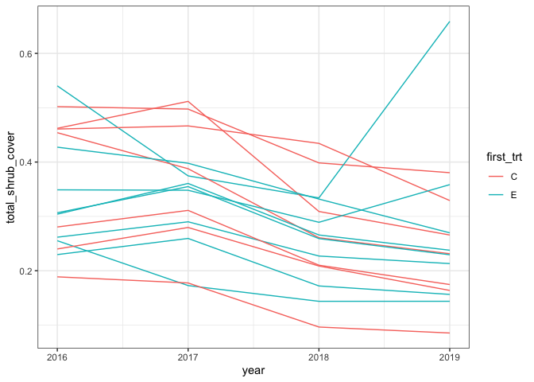
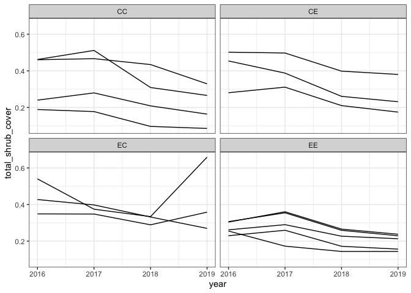
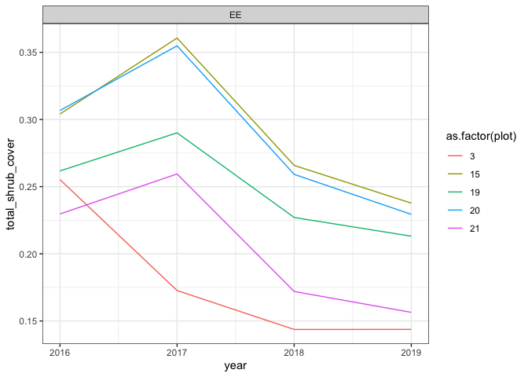
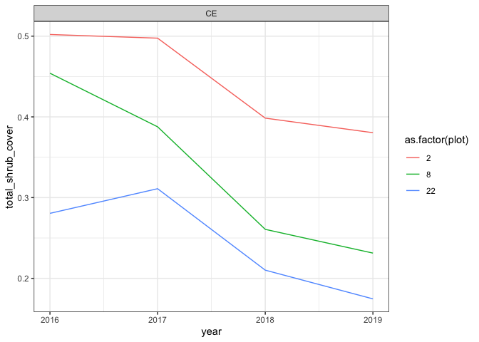

Shrub sprint
================
Renata Diaz
2021-04-16

``` r
shrub_cover_fixed <- function(path = get_default_data_path(), type = "Shrubs", plots = "all", 
  unknowns = FALSE, correct_sp = TRUE, download_if_missing = TRUE, 
  quiet = FALSE) 
{
  type <- tolower(type)
  data_tables <- load_plant_data(path, download_if_missing = download_if_missing, 
    quiet = quiet)
  clean_transect_data <- function(df) {
    df %>% dplyr::left_join(data_tables$species_table, by = "species") %>% 
      dplyr::left_join(data_tables$plots_table, by = c("year", 
        "month", "plot")) %>%  portalr:::rename_species_plants(correct_sp) %>% 
       portalr:::process_annuals(type) %>%  portalr:::process_unknownsp_plants(unknowns) %>% 
       portalr:::filter_plots(plots) %>% dplyr::mutate(treatment = as.character(.data$treatment), 
      species = as.factor(.data$species)) %>% dplyr::group_by_at(c("year", 
      "treatment", "plot", "species"))
  }
  oldtransect_data <- data_tables$oldtransect_data %>% dplyr::mutate(month = 8) %>% 
    clean_transect_data() %>% dplyr::summarize(count = dplyr::n()) %>% 
    dplyr::ungroup() %>% dplyr::mutate(cover = .data$count/1000, 
    height = NA, species = as.character(.data$species)) %>% 
    dplyr::select(-.data$count)
  transect_data <- data_tables$transect_data %>% dplyr::filter(!grepl(3, 
    .data$notes)) %>% clean_transect_data() %>% dplyr::mutate(stop = replace(.data$stop, 
    .data$stop > 7071.1, 7071.1), length = .data$stop - 
    .data$start) %>% dplyr::filter(start < 7071.1) %>% dplyr::summarize(length = sum(.data$length, 
    na.rm = TRUE), height = mean(.data$height, na.rm = TRUE)) %>% 
    dplyr::ungroup() %>% dplyr::mutate(cover = .data$length/(2 * 
    7071.1), species = as.character(.data$species)) %>% 
    dplyr::select(c("year", "treatment", "plot", "species", 
      "cover", "height"))
  dplyr::bind_rows(oldtransect_data, transect_data) %>% as.data.frame()
}
```

``` r
shrubs <- shrub_cover_fixed(plots = "all")
```

    ## Loading in data version 2.95.0

    ## `summarise()` has grouped output by 'year', 'treatment', 'plot'. You can override using the `.groups` argument.
    ## `summarise()` has grouped output by 'year', 'treatment', 'plot'. You can override using the `.groups` argument.

``` r
total_cover <- shrubs %>%
  group_by(year, plot, treatment) %>%
  summarize(total_shrub_cover = sum(cover)) %>%
  ungroup() %>%
  group_by(year) %>%
  mutate(annual_mean = mean(total_shrub_cover)) %>%
  ungroup() %>%
  mutate(total_relative_to_annual = total_shrub_cover / annual_mean)
```

    ## `summarise()` has grouped output by 'year', 'plot'. You can override using the `.groups` argument.

``` r
# 
# ggplot(total_cover, aes(year, total_shrub_cover, group = plot, color = as.factor(plot))) +
#   geom_line() +
#   theme(legend.position = "none")
# 
# ggplot(total_cover, aes(year, total_relative_to_annual, group = plot, color = as.factor(plot))) +
#   geom_line() +
#   theme(legend.position = "none")
```

2.  How does contemporary shrub cover vary between treatments?

<!-- end list -->

``` r
total_cover <- total_cover %>%
  add_plot_types() %>%
  filter(year > 2015) %>%
  filter(!(combined_trt %in% c("CR", "RC", "RR")))
```

    ## Joining, by = "plot"

``` r
ggplot(total_cover, aes(year, total_shrub_cover, color = first_trt, group = plot)) +
  geom_line()
```

<!-- -->

``` r
ggplot(total_cover, aes(year, total_shrub_cover, group = plot)) +
  geom_line() +
  facet_wrap(vars(combined_trt))
```

<!-- -->

3.  How does shrub cover vary between plots within treatments?

<!-- end list -->

``` r
ggplot(filter(total_cover, combined_trt == "EE"), aes(year, total_shrub_cover, color = as.factor(plot))) +
  geom_line() +
  facet_wrap(vars(combined_trt))
```

<!-- -->

``` r
ggplot(filter(total_cover, combined_trt == "CE"), aes(year, total_shrub_cover, color = as.factor(plot))) +
  geom_line() +
  facet_wrap(vars(combined_trt))
```

<!-- -->
