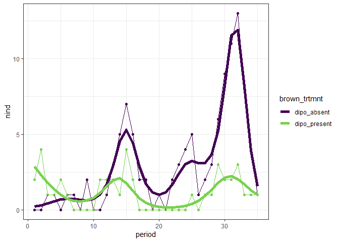
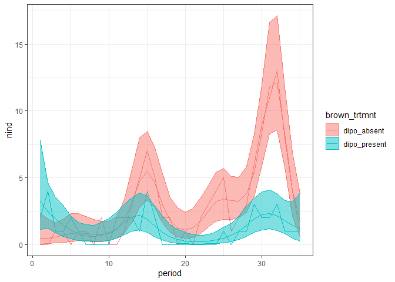
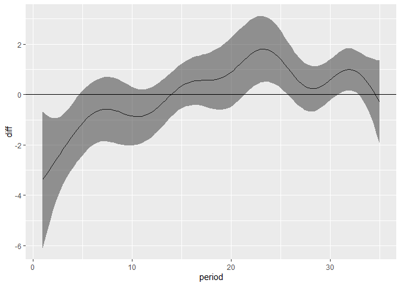
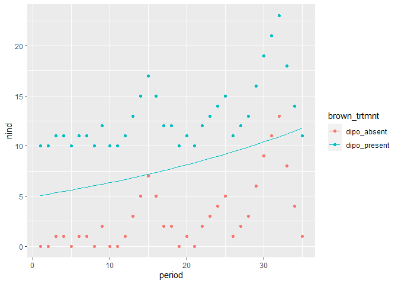
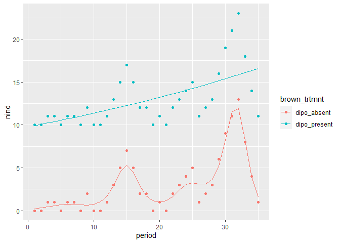
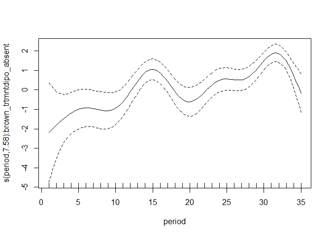
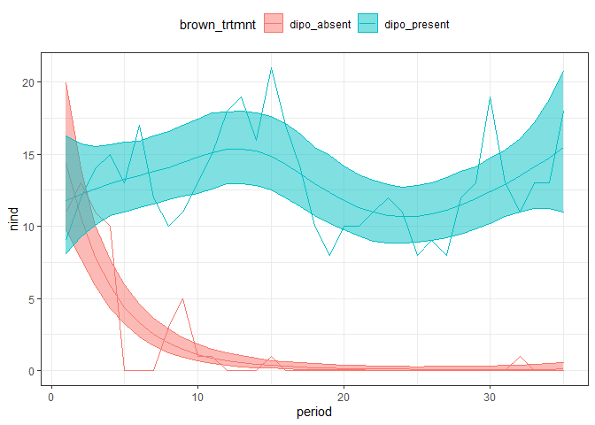
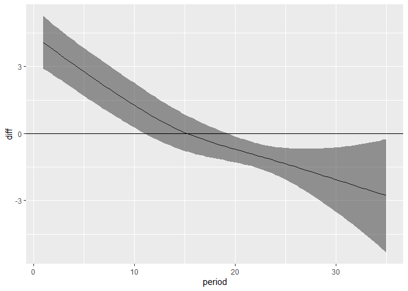

New plots with 81 data
================

<!-- -->

``` r
rat_totals <- rat_totals 

load_mgcv()

rat_totals <- rat_totals %>%
  mutate(brown_trtmnt = as.factor(brown_trtmnt))

sg <- filter(rat_totals, type == "small_granivore")

n_gam <- gam(nind ~  brown_trtmnt + s(period, by = brown_trtmnt), data = sg, method = "REML", family = "poisson")

draw(n_gam)
```

<!-- -->

``` r
n_gam_fitted <- add_fitted(sg, n_gam, value = "fitted")

ggplot(n_gam_fitted, aes(period, nind, color = brown_trtmnt)) +
  geom_point() +
  geom_line() +
  theme_bw() +
  geom_line(aes(period, fitted, color = brown_trtmnt), size = 2) +
  scale_color_viridis_d(end = .8)
```

<!-- -->

``` r
fitted_ci <- function(gam_obj, ndraws = 500, df, seed = 1977) {
  
  sampled_vals <- fitted_samples(gam_obj, n = ndraws, newdata = df, seed = seed)
  
  sampled_vals <- sampled_vals %>%
    group_by(row) %>%
    summarize(
      meanfit = mean(fitted),
      lowerfit = quantile(fitted, probs = .025),
      upperfit= quantile(fitted, probs = .975)
    ) %>%
    ungroup()
  
  df <- df %>%
    mutate(row = dplyr::row_number()) %>%
    left_join(sampled_vals)
  
  df  
}

n_gam_ci_manual <- fitted_ci(n_gam, df= sg)
```

    ## `summarise()` ungrouping output (override with `.groups` argument)

    ## Joining, by = "row"

``` r
ggplot(n_gam_ci_manual, aes(period, nind, color = brown_trtmnt)) +
  geom_line() +
  geom_line(aes(period, meanfit)) +
  geom_ribbon(aes(period, ymin = lowerfit, ymax = upperfit, fill = brown_trtmnt), alpha = .5) +
  theme_bw() +
  theme(legend.position = "top")
```

<!-- -->

``` r
n_gam_diff <- difference_smooths(n_gam, smooth = "s(period)")

ggplot(n_gam_diff, aes(period, diff)) +
  geom_line() +
  geom_ribbon(aes(period, ymin = lower,ymax= upper), alpha = .5) +
  geom_hline(yintercept = 0)
```

<!-- -->

This is fitting a single GAM to the small granivores by treatment. There
is no plot effect included - I haven’t checked to see if there are
differences between plots. So this is rough.

The difference\_smooths plot kind of matches but doesn’t completely
track with the estimates/fitted CI I generated via
`gratia::fitted_samples`. The samples appear to overlap at the
beginning, when the difference plot would have that the dipo\_present
treatment is higher than the dipo\_absent treatment (although note that
those first 3-5 periods are right as the treatments were being
implemented). Then, around period 30, the samples appear divergent while
the difference plot has the difference as much closer to 0 than it
appears.

``` r
load_mgcv()

rat_totals <- rat_totals %>%
  mutate(brown_trtmnt = as.factor(brown_trtmnt))

so <- filter(rat_totals, type == "small_omnivore")

n_gam <- gam(nind ~  brown_trtmnt + s(period, by = brown_trtmnt), data = so, method = "REML", family = "poisson")

draw(n_gam)
```

<!-- -->

``` r
n_gam_fitted <- add_fitted(so, n_gam, value = "fitted")

ggplot(n_gam_fitted, aes(period, nind, color = brown_trtmnt)) +
  geom_point() +
  geom_line() +
  theme_bw() +
  geom_line(aes(period, fitted, color = brown_trtmnt), size = 2) +
  scale_color_viridis_d(end = .8)
```

<!-- -->

``` r
fitted_ci <- function(gam_obj, ndraws = 500, df, seed = 1977) {
  
  sampled_vals <- fitted_samples(gam_obj, n = ndraws, newdata = df, seed = seed)
  
  sampled_vals <- sampled_vals %>%
    group_by(row) %>%
    summarize(
      meanfit = mean(fitted),
      lowerfit = quantile(fitted, probs = .025),
      upperfit= quantile(fitted, probs = .975)
    ) %>%
    ungroup()
  
  df <- df %>%
    mutate(row = dplyr::row_number()) %>%
    left_join(sampled_vals)
  
  df  
}

n_gam_ci_manual <- fitted_ci(n_gam, df= so)
```

    ## `summarise()` ungrouping output (override with `.groups` argument)

    ## Joining, by = "row"

``` r
ggplot(n_gam_ci_manual, aes(period, nind, color = brown_trtmnt)) +
  geom_line() +
  geom_line(aes(period, meanfit)) +
  geom_ribbon(aes(period, ymin = lowerfit, ymax = upperfit, fill = brown_trtmnt), alpha = .5) +
  theme_bw() +
  theme(legend.position = "top")
```

<!-- -->

``` r
n_gam_diff <- difference_smooths(n_gam, smooth = "s(period)")

ggplot(n_gam_diff, aes(period, diff)) +
  geom_line() +
  geom_ribbon(aes(period, ymin = lower,ymax= upper), alpha = .5) +
  geom_hline(yintercept = 0)
```

<!-- -->

``` r
load_mgcv()

rat_totals <- rat_totals %>%
  mutate(brown_trtmnt = as.factor(brown_trtmnt))

dipo <- filter(rat_totals, type == "dipo")

n_gam <- gam(nind ~  brown_trtmnt + s(period, by = brown_trtmnt), data = dipo, method = "REML", family = "poisson")

draw(n_gam)
```

<!-- -->

``` r
n_gam_fitted <- add_fitted(dipo, n_gam, value = "fitted")

ggplot(n_gam_fitted, aes(period, nind, color = brown_trtmnt)) +
  geom_point() +
  geom_line() +
  theme_bw() +
  geom_line(aes(period, fitted, color = brown_trtmnt), size = 2) +
  scale_color_viridis_d(end = .8)
```

<!-- -->

``` r
fitted_ci <- function(gam_obj, ndraws = 500, df, seed = 1977) {
  
  sampled_vals <- fitted_samples(gam_obj, n = ndraws, newdata = df, seed = seed)
  
  sampled_vals <- sampled_vals %>%
    group_by(row) %>%
    summarize(
      meanfit = mean(fitted),
      lowerfit = quantile(fitted, probs = .025),
      upperfit= quantile(fitted, probs = .975)
    ) %>%
    ungroup()
  
  df <- df %>%
    mutate(row = dplyr::row_number()) %>%
    left_join(sampled_vals)
  
  df  
}

n_gam_ci_manual <- fitted_ci(n_gam, df= dipo)
```

    ## `summarise()` ungrouping output (override with `.groups` argument)

    ## Joining, by = "row"

``` r
ggplot(n_gam_ci_manual, aes(period, nind, color = brown_trtmnt)) +
  geom_line() +
  geom_line(aes(period, meanfit)) +
  geom_ribbon(aes(period, ymin = lowerfit, ymax = upperfit, fill = brown_trtmnt), alpha = .5) +
  theme_bw() +
  theme(legend.position = "top")
```

<!-- -->

``` r
n_gam_diff <- difference_smooths(n_gam, smooth = "s(period)")

ggplot(n_gam_diff, aes(period, diff)) +
  geom_line() +
  geom_ribbon(aes(period, ymin = lower,ymax= upper), alpha = .5) +
  geom_hline(yintercept = 0)
```

<!-- -->

I feel like there might be something I’m not grasping here around the
parametric term? Shouldn’t the dipo\_absent **always** be lower than
dipo\_present (for the krats on the krat removals)? Unless the
difference smooths is showing the difference **without taking into
account the *partial* effect of treatment**
