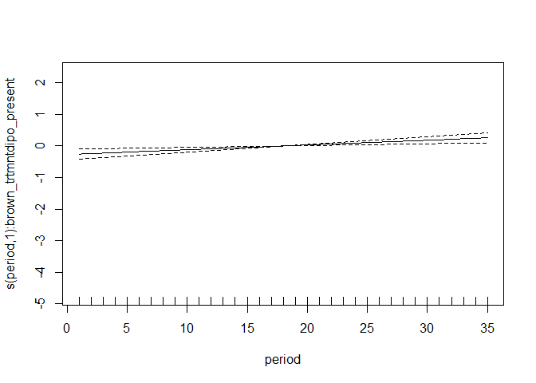

New plots with 81 data
================

<!-- -->

``` r
load_mgcv()
df <- data_sim("eg4")
m <- gam(y ~ fac + s(x2, by = fac) + s(x0), data = df, method = "REML")
difference_smooths(m, smooth = "s(x2)")
```

    ## # A tibble: 300 x 9
    ##    smooth by    level_1 level_2  diff    se   lower upper       x2
    ##    <chr>  <chr> <chr>   <chr>   <dbl> <dbl>   <dbl> <dbl>    <dbl>
    ##  1 s(x2)  fac   1       2       0.759 0.799 -0.808   2.33 0.000757
    ##  2 s(x2)  fac   1       2       0.800 0.750 -0.669   2.27 0.0108  
    ##  3 s(x2)  fac   1       2       0.840 0.702 -0.536   2.22 0.0209  
    ##  4 s(x2)  fac   1       2       0.881 0.657 -0.407   2.17 0.0310  
    ##  5 s(x2)  fac   1       2       0.921 0.615 -0.285   2.13 0.0411  
    ##  6 s(x2)  fac   1       2       0.961 0.577 -0.169   2.09 0.0512  
    ##  7 s(x2)  fac   1       2       1.00  0.542 -0.0621  2.06 0.0613  
    ##  8 s(x2)  fac   1       2       1.04  0.511  0.0370  2.04 0.0714  
    ##  9 s(x2)  fac   1       2       1.08  0.484  0.128   2.03 0.0815  
    ## 10 s(x2)  fac   1       2       1.11  0.461  0.211   2.02 0.0916  
    ## # ... with 290 more rows

``` r
rat_totals <- rat_totals %>%
  mutate(brown_trtmnt = as.factor(brown_trtmnt))

n_gam <- gam(nind ~  brown_trtmnt + s(period, by = brown_trtmnt), data = filter(rat_totals, type == "small_granivore"), method = "REML", family = "poisson")

n_gam_fitted <- rat_totals %>%
  filter(type == "small_granivore") %>%
  add_fitted(model = n_gam, value = "fitted")

ggplot(n_gam_fitted, aes(period, nind, shape = brown_trtmnt)) +
  geom_line() +
  geom_line(aes(period, fitted), color = "blue") +
  facet_wrap(vars(brown_trtmnt))
```

<!-- -->

``` r
n_gam_diff <- difference_smooths(n_gam, smooth = "s(period)", newdata = select(filter(rat_totals, type == "small_granivore"), period, brown_trtmnt))

head(n_gam_diff)
```

    ## # A tibble: 6 x 9
    ##   smooth    by           level_1     level_2      diff    se lower  upper period
    ##   <chr>     <chr>        <chr>       <chr>       <dbl> <dbl> <dbl>  <dbl>  <dbl>
    ## 1 s(period) brown_trtmnt dipo_absent dipo_prese~ -3.39 1.38  -6.08 -0.689   1   
    ## 2 s(period) brown_trtmnt dipo_absent dipo_prese~ -3.18 1.21  -5.57 -0.803   1.34
    ## 3 s(period) brown_trtmnt dipo_absent dipo_prese~ -2.98 1.07  -5.07 -0.890   1.69
    ## 4 s(period) brown_trtmnt dipo_absent dipo_prese~ -2.78 0.938 -4.62 -0.940   2.03
    ## 5 s(period) brown_trtmnt dipo_absent dipo_prese~ -2.58 0.833 -4.21 -0.944   2.37
    ## 6 s(period) brown_trtmnt dipo_absent dipo_prese~ -2.37 0.755 -3.85 -0.895   2.72

``` r
draw(n_gam)
```

<!-- -->

``` r
ggplot(n_gam_diff, aes(period, diff)) +
  geom_line() +
  geom_line(aes(period, lower)) +
  geom_line(aes(period, upper)) +
  theme_bw() +
  geom_hline(yintercept = 0)
```

<!-- -->

I’m not sure what the difference is between,

`nind ~ brown_trtmnt + s(period, by = brown_trtmnt)`

`nind ~ s(period, by = brown_trtmnt)`

and even more complicated models, like including effects for plot or
somehow fitting all 3 types (krats, small granivores, and omnivores)
within the same model.

In this vein, I’m taking as my model Erica’s 2019 plot switch paper.
Relevant scripts here:

<https://github.com/emchristensen/PlotSwitch/blob/master/FinalAnalysis/rodent-GAM-analyses.R>

and

<https://github.com/emchristensen/PlotSwitch/blob/master/FinalAnalysis/analysis_functions.R>

These *do not use gratia* but are working towards something similar to
what I’m looking at:

  - Comparing **no rodents –\> all rodents** and **no krats –\> all
    rodents** plots. The “treatment effect” is the difference in the
    smooths between the manipulated plots and the control plots. The
    effect the paper is interested in is the difference in **that**
    difference between the manipulation types.
  - Looking at **abundance** responses for two groups, **kangaroo rats**
    and **small granivores**.
      - Kangaroo rats (DM, DO, DS) in order to capture how long it took
        krats to colonize the newly available plots to match controls,
        depending on whether other rodents were present or not.
      - Small granivores “because we expected inferior competitors to be
        displaced by the invasion of kangaroo rats”.
          - Results are not shown in the main text but described.
            “Before the switch, sg abundances were higher on krat
            removals than on controls. After all plots were converted to
            controls, sg abundances on both plot types quickly converged
            to control levels within a few months. The rapid decline in
            non krats is consistent with previous research showing that
            krats are behaviorally dominant over other rodents. Because
            differences in treatments in non krat species disappeared
            quickly, seems unlikely that direct interference with non
            krats explains the delay in recovery of krats on plots that
            had rodents present.”
          - The “small granivores” species list is longer than it was in
            1981, I think because more species showed up as time went
            on.

Without, or rather **before** getting into the specific questions being
asked/comparisons being made, the 2019 analysis illustrates that we can
use GAMs and the difference in GAM smooths to

  - compare two time series to find when they diverge/converge
  - without making assumptions about the *form* of the timeseries
  - and possibly make reference to a reference state.

additionally,

  - we can include effects for plot

<!-- end list -->

``` r
dummy_totals <- rat_totals %>%
  filter(type == "small_granivore", brown_trtmnt == "dipo_absent")

dummy_totals <- dummy_totals %>%
  bind_rows(mutate(dummy_totals, brown_trtmnt = "dipo_present")) %>%
  mutate(nind = ifelse(brown_trtmnt == "dipo_absent", nind, nind + 10),
         biomass =ifelse(brown_trtmnt == "dipo_absent", biomass, biomass + 30),
         energy = ifelse(brown_trtmnt == "dipo_absent", energy, energy + 100)) %>%
  mutate(brown_trtmnt = as.factor(brown_trtmnt))

ggplot(dummy_totals, aes(period, nind, color = brown_trtmnt)) +
  geom_line()
```

<!-- -->

``` r
dummy_gam_nofac <-gam(nind ~  s(period, by = brown_trtmnt), data = dummy_totals, method = "REML", family = "poisson")

dummy_gam_fac <- gam(nind ~  brown_trtmnt + s(period, by = brown_trtmnt), data = dummy_totals, method = "REML", family = "poisson")

nofac_pred <- add_fitted(dummy_totals, dummy_gam_nofac)
ggplot(nofac_pred, aes(period, nind, color = brown_trtmnt)) +
  geom_point() +
  geom_line(aes(period, .value, color = brown_trtmnt))
```

<!-- -->

``` r
fac_pred <- add_fitted(dummy_totals, dummy_gam_fac)
ggplot(fac_pred, aes(period, nind, color = brown_trtmnt)) +
  geom_point() +
  geom_line(aes(period, .value, color = brown_trtmnt))
```

<!-- -->

``` r
fac_pred_2 <- fac_pred %>%
  select(-biomass, -energy) %>%
  tidyr::pivot_wider(values_from = c(.value, nind), names_from = brown_trtmnt) %>%
  mutate(value_diff = .value_dipo_present - .value_dipo_absent)
  
plot(dummy_gam_fac)
```

<!-- --><!-- -->

I am not understanding this properly.
