New plots with 81 data
================

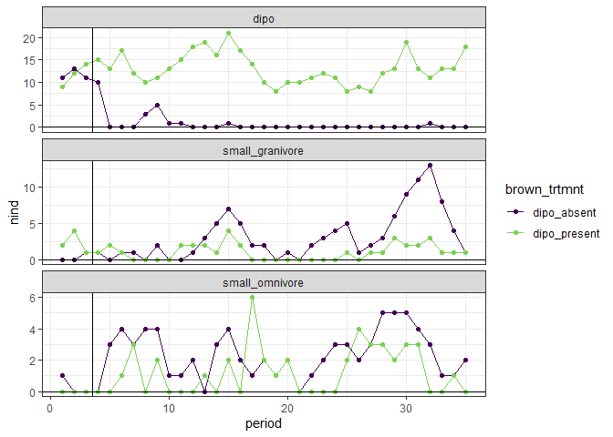<!-- -->

## Analyzed using GAMs

Following Christensen et al (2019), we can use the *difference in
smooths* fitted using a GAM as a way to tell if and when two timeseries
are diverging/converging.

### Difference smooths walkthrough

Here is a walkthrough (fairly detailed) of how we obtain the difference
in smooths. This approach is modeled after the analysis in Christensen
et al 2019 (code in Erica’s github and also copied to this repo in
`lore/2019_switch`) and blog posts by Gavin Simpson. I have re-written
the code mostly for my own understanding; bits of it probably echo Erica
and Gavin closely.

#### Fitting the GAM

  - (For now at least) we’re working with count data, so the link is
    Poisson. This means we get the differences in the difference smooth
    on the log scale.
  - I have fit using **treatment** but not **plot**. It may be best
    practice to include terms for plot (see Christensen et al 2019) but
    that would complicate the machinery for now.
  - I am using the default `k = 10` for the number of basis functions.
  - I am fitting using the formula `count ~ okrat_treatment + s(period)
    + s(period, by okrat_treatment)`, where `okrat_treatment` is an
    ordered factor with levels for control and krat exclosure. This
    means:
      - `okrat_treatment`: There is an intercept like term for the
        *difference in means* between treatments. Because
        `okrat_treatment` is an ordered factor, they aren’t really
        intercepts, they’re weird exponential things.
      - `s(period)`: This fits the smooth for the *reference level* of
        `okrat_treatment`, in this case `control`.
      - `s(period, by = okrat_treatment)`: This fits the smooth for the
        *difference* between the remaining levels of `okrat_treatment`
        and the reference level. In this case there is only one other
        level.

<!-- end list -->

``` r
rat_totals <- rat_totals %>%
  mutate(krat_treatment = ifelse(brown_trtmnt == "dipo_present", "control", "exclosure")) %>%
  mutate(okrat_treatment = ordered(krat_treatment))

sg <- filter(rat_totals, type == "small_granivore")

ggplot(sg, aes(period, nind, color= okrat_treatment)) +
  geom_line() +
  geom_point() +
  theme_bw() +
  scale_color_viridis_d(end = .8)
```

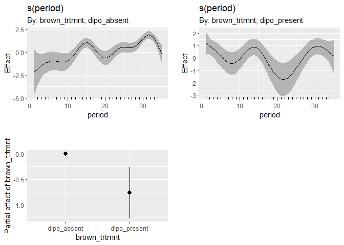<!-- -->

``` r
nind.gam <- gam(nind ~ okrat_treatment + s(period) + s(period, by = okrat_treatment), data = sg, family = poisson, method = "REML")

plot(nind.gam, pages= 1, scale = 0)
```

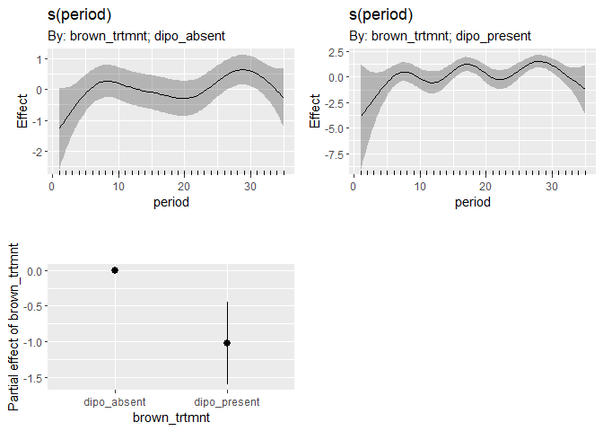<!-- -->

These are the default plots from `mgcv` for a GAM fit with an ordered
factor. The plot on the left is the fit for the reference level of the
factor, so control. The plot on the right is the adjustment between the
reference level and the second level, exclosure.

We can extract the predicted values and a SE envelope for these smooths.
First on the link (log) scale, and then invlink-ed back to count values.

The control smooth on the link scale matches the left-side plot from
`mgcv`. The exclosure smooths should be (about) the control smooth plus
the difference.

``` r
pdat <- as.data.frame(expand.grid(period = seq(min(sg$period), max(sg$period), length.out= 500), okrat_treatment = levels(sg$okrat_treatment)))

nind.predicted <- predict(nind.gam, newdata = pdat, type = "lpmatrix")
nind.link <- predict(nind.gam, newdata = pdat, type = "link", se.fit = T)

nind.predicted.vals <- nind.gam$family$linkinv(nind.predicted %*% coefficients(nind.gam))

pdat.pred <- pdat %>%
  mutate(predicted = nind.predicted.vals,
         link = nind.link$fit,
         se_link = nind.link$se.fit) %>%
  mutate(invlink_fit = nind.gam$family$linkinv(link),
         invlink_upper = nind.gam$family$linkinv(link + (2 * se_link)),
         invlink_lower = nind.gam$family$linkinv(link - (2 * se_link)),
         link_upper = link + (2 * se_link),
         link_lower = link - (2 * se_link))


ggplot(pdat.pred, aes(period, link, color= okrat_treatment)) +
  geom_line() +
  geom_ribbon(aes(period, ymin = link_lower, ymax = link_upper, fill = okrat_treatment), alpha = .5) +
  theme_bw() +
  scale_color_viridis_d(end = .8) +
  scale_fill_viridis_d(end = .8)
```

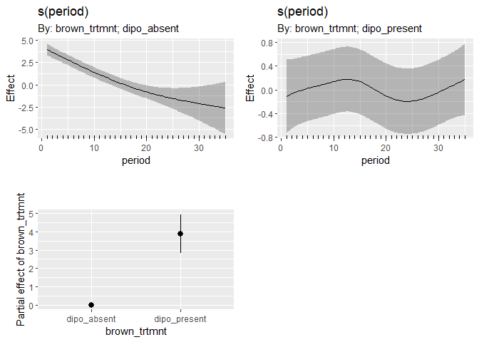<!-- -->

``` r
ggplot(pdat.pred, aes(period, invlink_fit, color= okrat_treatment)) +
  geom_line() +
  geom_ribbon(aes(period, ymin = invlink_lower, ymax = invlink_upper, fill = okrat_treatment), alpha = .5) +
  theme_bw() +
  scale_color_viridis_d(end = .8) +
  scale_fill_viridis_d(end = .8)
```

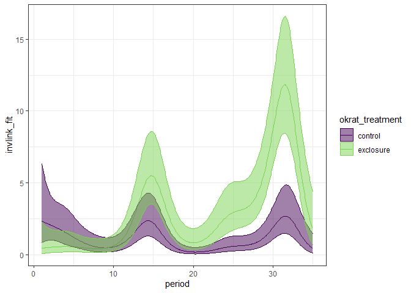<!-- -->

We can then calculate the *difference* between these smooths, plus a
credible interval. This then allows us to find when the difference is
overlapping 0 (no treatment effect) and when it is not.

We do this keeping **all** the terms. That is, including the
quasi-intercept to account for the difference in means between
treatments. Erica’s models included terms for plot, which she then
excluded from calculating the differences. That’s not in play here
(yet?).

``` r
nind.diff.keeppar <- nind.predicted[1:500, ] - nind.predicted[501:1000, ]

nind.diff.vals <- nind.diff.keeppar %*% coef(nind.gam)


nind.diff.se<- sqrt(rowSums((nind.diff.keeppar %*% vcov(nind.gam, unconditional = FALSE)) * nind.diff.keeppar))

crit <- qnorm(.05/2, lower.tail = FALSE)
upr <- nind.diff.vals + (crit * nind.diff.se)
lwr <- nind.diff.vals - (crit * nind.diff.se)


pdat.diff <- pdat %>%
  select(period) %>%
  distinct()%>%
  mutate(fitted_dif = nind.diff.vals,
         upper= upr,
         lower = lwr) %>%
  mutate(diff_overlaps_zero = (upper * lower) < 0
  )

ggplot(pdat.diff, aes(period, fitted_dif)) +
  geom_line() +
  geom_ribbon(aes(period, ymin = lower, ymax = upper), alpha  = .5) +
  geom_hline(yintercept = 0) +
  geom_point(data = filter(pdat.diff, diff_overlaps_zero), aes(period, 1), color  = "red", size = 2) +
  theme_bw()
```

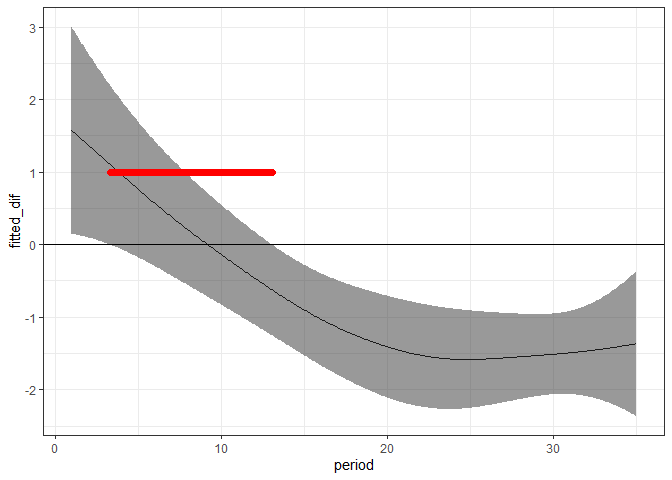<!-- -->

The red line shows where the difference between the two smooths’ CI is
overlapping 0; i.e., we aren’t really confident that the two smooths are
different.

``` r
pdat.pred <- left_join(pdat.pred, select(pdat.diff, period, diff_overlaps_zero))
```

    ## Joining, by = "period"

``` r
ggplot(pdat.pred, aes(period, link, color= okrat_treatment)) +
  geom_line() +
  geom_ribbon(aes(period, ymin = link_lower, ymax = link_upper, fill = okrat_treatment), alpha = .5) +
  theme_bw() +
  scale_color_viridis_d(end = .8) +
  scale_fill_viridis_d(end = .8) +
  geom_point(data = filter(pdat.pred, diff_overlaps_zero), aes(period, 0), color = "red")
```

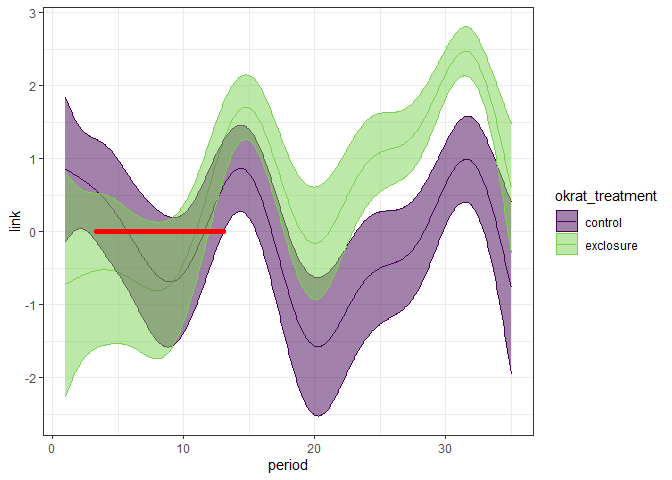<!-- -->

``` r
ggplot(pdat.pred, aes(period, invlink_fit, color= okrat_treatment)) +
  geom_line() +
  geom_ribbon(aes(period, ymin = invlink_lower, ymax = invlink_upper, fill = okrat_treatment), alpha = .5) +
  theme_bw() +
  scale_color_viridis_d(end = .8) +
  scale_fill_viridis_d(end = .8) +
  geom_point(data = filter(pdat.pred, diff_overlaps_zero), aes(period, 0), color = "red")
```

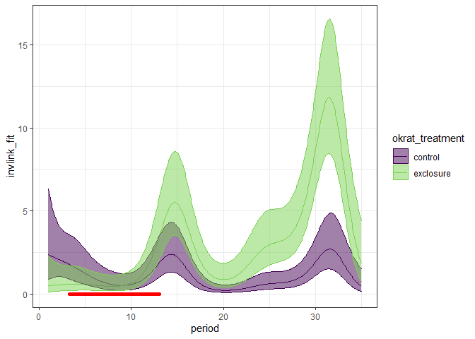<!-- -->

This doesn’t quite match what we would think from the `mgcv` plot, I
think because the `mgcv` plot is showing the difference smooth without
the intercept adjustment.

I re-did this but swapped in Erica’s data and you get the results that
match the 2019 paper. So I think it is basically sound?

What gives me the creeps is that the overlapping-zero interval 1)
differs from the mgcv plot and 2) doesn’t match what you’d think if you
just looked at the plots of the smooths themselves.

However, 1) may be because the mgcv plot doesn’t include the offset for
different treatment means. You see this especially in Erica’s data,
where the mgcv plot for exclosure only briefly overlaps 0 - because of
the huge offset, maybe? Anyway, this arithmetic for calculating the
difference smooths, including the offset term, qualitatively matches the
paper (even though there might be minor differences because the paper
included a plot term and had different k’s). It also matches in 2), in
that the *smooths* appear to overlap at times when the *difference
smooth* does not overlap 0 (e.g. the very end of the TS for the total
exclosure v. control plots, the very last plot in
gams\_switchdata.Rmda).

### Interpreting

``` r
min(filter(pdat.pred, period > 4, !diff_overlaps_zero)$period)
```

    ## [1] 13.12826

So this analysis actually picks up a difference in small granivore
abundance on krat exclosures vs. control plots as early as period 13-14,
or about 10 months after the treatments were implemented.

The paper identifies the change as starting in July 1978, or “eight
months”.

``` r
filter(rat_totals, period == 13) %>%
  select(period, year, month)%>%
  distinct()
```

    ##   period year month
    ## 1     13 1978     7

OMG. O M G.

## Plot

``` r
plot_totals <- read.csv(here::here("lore", "1981_competition", "1981_data_plot_totals.csv"))

plot_totals <- plot_totals %>%
  mutate(oplot = as.ordered(plot),
         okrat_treatment = as.ordered(okrat_treatment))

sg_plot <- filter(plot_totals, type == "small_granivore")

ggplot(sg_plot, aes(period, nind, group = oplot)) +
  geom_line() +
  theme_bw() +
  facet_wrap(vars(okrat_treatment))
```

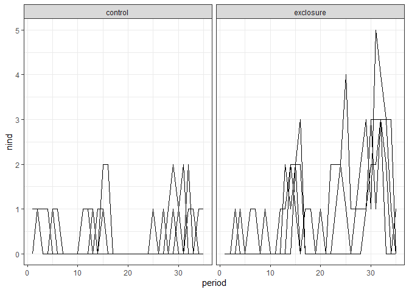<!-- -->

``` r
plot.gam <- gam(nind ~ okrat_treatment + oplot + s(period) + s(period, by = okrat_treatment) + s(period, by = oplot), data = sg_plot, family = poisson, method = "REML")

plot(plot.gam, pages= 1, scale = 0)
```

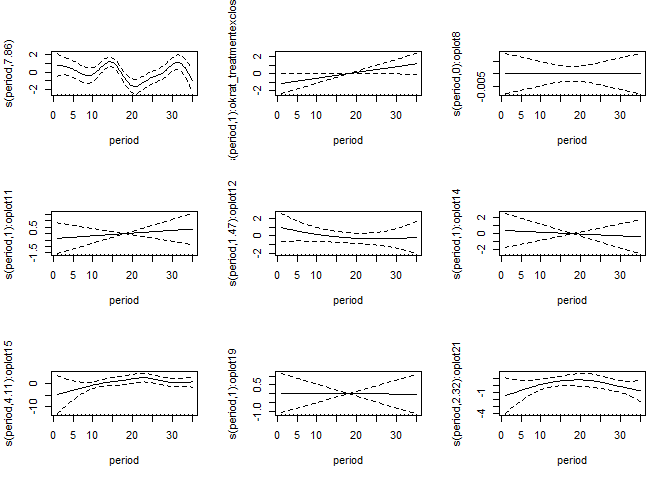<!-- -->

``` r
summary(plot.gam)
```

    ## 
    ## Family: poisson 
    ## Link function: log 
    ## 
    ## Formula:
    ## nind ~ okrat_treatment + oplot + s(period) + s(period, by = okrat_treatment) + 
    ##     s(period, by = oplot)
    ## 
    ## Parametric coefficients:
    ##                   Estimate Std. Error z value Pr(>|z|)    
    ## (Intercept)        -1.4152     0.1694  -8.356  < 2e-16 ***
    ## okrat_treatment.L   0.9085     0.3008   3.020  0.00252 ** 
    ## oplot.L            -0.9704     0.4590  -2.114  0.03448 *  
    ## oplot.Q             0.0000     0.0000      NA       NA    
    ## oplot.C             1.0299     0.6360   1.619  0.10541    
    ## oplot^4            -0.3449     0.3694  -0.934  0.35044    
    ## oplot^5            -0.3856     0.4180  -0.922  0.35628    
    ## oplot^6             0.5764     0.5574   1.034  0.30109    
    ## oplot^7             0.0750     0.5320   0.141  0.88789    
    ## ---
    ## Signif. codes:  0 '***' 0.001 '**' 0.01 '*' 0.05 '.' 0.1 ' ' 1
    ## 
    ## Approximate significance of smooth terms:
    ##                                          edf    Ref.df Chi.sq p-value    
    ## s(period)                          7.858e+00 8.620e+00 56.272  <2e-16 ***
    ## s(period):okrat_treatmentexclosure 1.000e+00 1.001e+00  3.664  0.0557 .  
    ## s(period):oplot8                   1.458e-05 2.899e-05  0.000  0.5000    
    ## s(period):oplot11                  1.000e+00 1.000e+00  0.364  0.5461    
    ## s(period):oplot12                  1.469e+00 1.776e+00  0.933  0.4668    
    ## s(period):oplot14                  1.000e+00 1.000e+00  0.133  0.7150    
    ## s(period):oplot15                  4.111e+00 5.061e+00 13.015  0.0251 *  
    ## s(period):oplot19                  1.000e+00 1.000e+00  0.003  0.9548    
    ## s(period):oplot21                  2.325e+00 2.926e+00  4.556  0.1873    
    ## ---
    ## Signif. codes:  0 '***' 0.001 '**' 0.01 '*' 0.05 '.' 0.1 ' ' 1
    ## 
    ## Rank: 88/90
    ## R-sq.(adj) =  0.576   Deviance explained = 54.9%
    ## -REML = 214.82  Scale est. = 1         n = 280

The plot smooth is significant, esp for plot 15

``` r
plotvars <- c('oplot', paste0('s(period):oplot', c(8,11,12,14,15,19,21)))

pdat.plot <- as.data.frame(expand.grid(period = seq(min(sg_plot$period), max(sg_plot$period), length.out= 500), okrat_treatment = levels(sg_plot$okrat_treatment), oplot = levels(sg_plot$oplot)[1]))

nind.plot.predicted <- predict(plot.gam, newdata = pdat.plot, type = "lpmatrix", exclude =plotvars)

nind.plot.link <- predict(plot.gam, newdata = pdat.plot, type = "link", se.fit = T, exclude = plotvars)


nind.plot.predicted.vals <- plot.gam$family$linkinv(nind.plot.predicted %*% coefficients(plot.gam))

pdat.plot.pred <- pdat.plot %>%
  mutate(predicted = nind.plot.predicted.vals,
         link = nind.plot.link$fit,
         se_link = nind.plot.link$se.fit) %>%
  mutate(invlink_fit = plot.gam$family$linkinv(link),
         invlink_upper = plot.gam$family$linkinv(link + (2 * se_link)),
         invlink_lower = plot.gam$family$linkinv(link - (2 * se_link)),
         link_upper = link + (2 * se_link),
         link_lower = link - (2 * se_link))


ggplot(pdat.plot.pred, aes(period, link, color= okrat_treatment)) +
  geom_line() +
  geom_ribbon(aes(period, ymin = link_lower, ymax = link_upper, fill = okrat_treatment), alpha = .5) +
  theme_bw() +
  scale_color_viridis_d(end = .8) +
  scale_fill_viridis_d(end = .8)
```

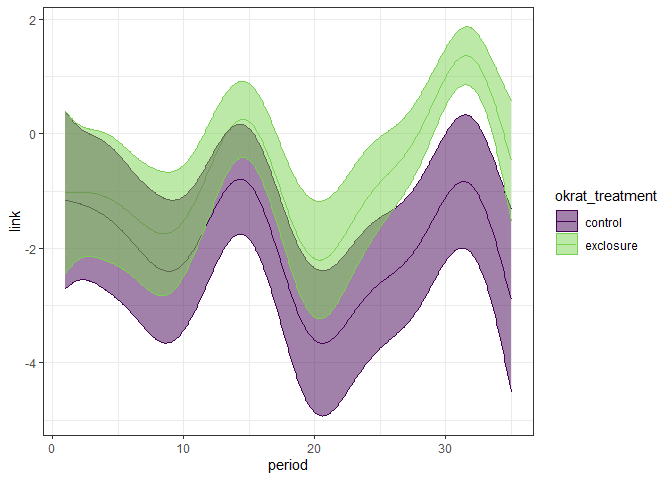<!-- -->

``` r
ggplot(pdat.plot.pred, aes(period, invlink_fit, color= okrat_treatment)) +
  geom_line() +
  geom_ribbon(aes(period, ymin = invlink_lower, ymax = invlink_upper, fill = okrat_treatment), alpha = .5) +
  theme_bw() +
  scale_color_viridis_d(end = .8) +
  scale_fill_viridis_d(end = .8)
```

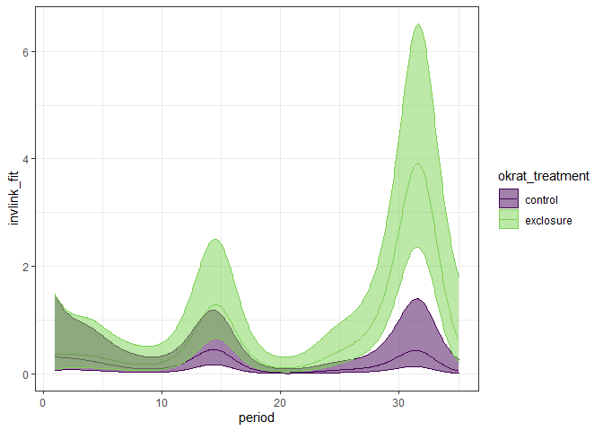<!-- -->

``` r
ggplot(pdat.plot.pred, aes(period, link)) +
  geom_line() +
 geom_line(data = pdat.pred, inherit.aes = T, color = "red") +
  theme_bw() +
  scale_color_viridis_d(end = .8) +
  scale_fill_viridis_d(end = .8) +
  facet_wrap(vars(okrat_treatment))
```

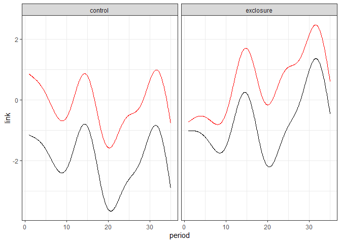<!-- -->

``` r
ggplot(pdat.plot.pred, aes(period, invlink_fit)) +
  geom_line() +
 geom_line(data = pdat.pred, inherit.aes = T, color = "red") +
  theme_bw() +
  scale_color_viridis_d(end = .8) +
  scale_fill_viridis_d(end = .8) +
  facet_wrap(vars(okrat_treatment))
```

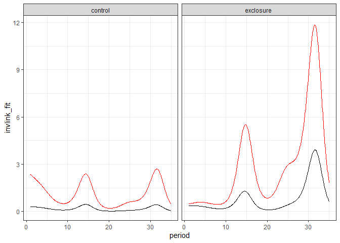<!-- -->

``` r
nind.plot.diff.keeppar <- nind.plot.predicted[1:500, ] - nind.plot.predicted[501:1000, ]

nind.diff.plot.vals <- nind.plot.diff.keeppar %*% coef(plot.gam)


nind.diff.plot.se<- sqrt(rowSums((nind.plot.diff.keeppar %*% vcov(plot.gam, unconditional = FALSE)) * nind.plot.diff.keeppar))

crit <- qnorm(.05/2, lower.tail = FALSE)
plot.upr <- nind.diff.plot.vals + (crit * nind.diff.plot.se)
plot.lwr <- nind.diff.plot.vals - (crit * nind.diff.plot.se)


pdat.plot.diff <- pdat.plot %>%
  select(period) %>%
  distinct()%>%
  mutate(fitted_dif = nind.diff.plot.vals,
         upper= plot.upr,
         lower = plot.lwr) %>%
  mutate(diff_overlaps_zero = (upper * lower) < 0
  )

ggplot(pdat.plot.diff, aes(period, fitted_dif)) +
  geom_line() +
  geom_ribbon(aes(period, ymin = lower, ymax = upper), alpha  = .5) +
  geom_hline(yintercept = 0) +
  geom_point(data = filter(pdat.plot.diff, diff_overlaps_zero), aes(period, 1), color  = "red", size = 2) +
  theme_bw()
```

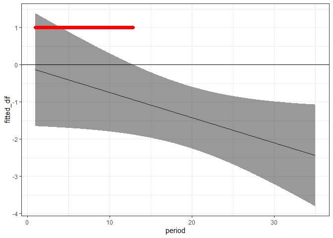<!-- -->

``` r
pdat.plot.pred <- left_join(pdat.plot.pred, select(pdat.plot.diff, period, diff_overlaps_zero))
```

    ## Joining, by = "period"

``` r
ggplot(pdat.plot.pred, aes(period, link, color= okrat_treatment)) +
  geom_line() +
  geom_ribbon(aes(period, ymin = link_lower, ymax = link_upper, fill = okrat_treatment), alpha = .5) +
  theme_bw() +
  scale_color_viridis_d(end = .8) +
  scale_fill_viridis_d(end = .8) +
  geom_point(data = filter(pdat.plot.pred, diff_overlaps_zero), aes(period, 0), color = "red")
```

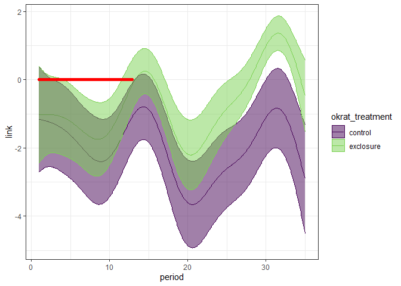<!-- -->

``` r
ggplot(pdat.plot.pred, aes(period, invlink_fit, color= okrat_treatment)) +
  geom_line() +
  geom_ribbon(aes(period, ymin = invlink_lower, ymax = invlink_upper, fill = okrat_treatment), alpha = .5) +
  theme_bw() +
  scale_color_viridis_d(end = .8) +
  scale_fill_viridis_d(end = .8) +
  geom_point(data = filter(pdat.plot.pred, diff_overlaps_zero), aes(period, 0), color = "red")
```

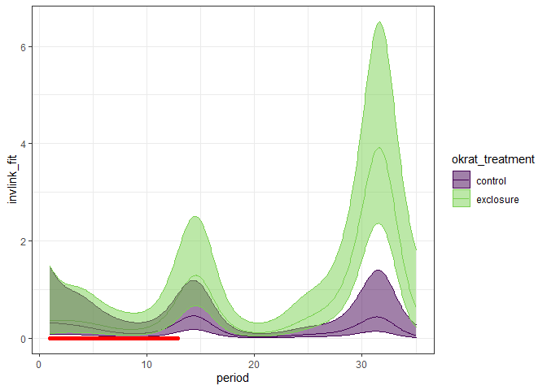<!-- -->

``` r
min(filter(pdat.plot.diff,  !diff_overlaps_zero)$period)
```

    ## [1] 12.92385
