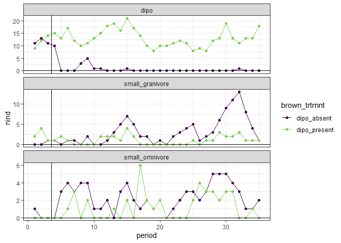
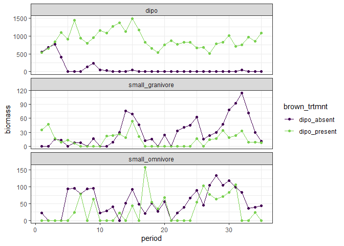
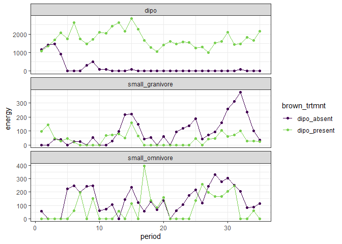
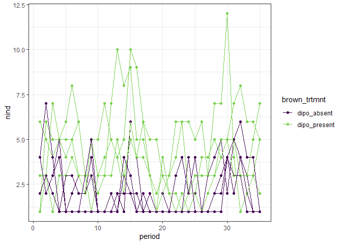
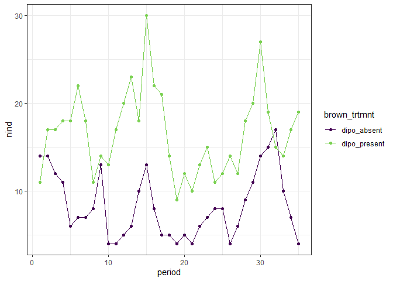
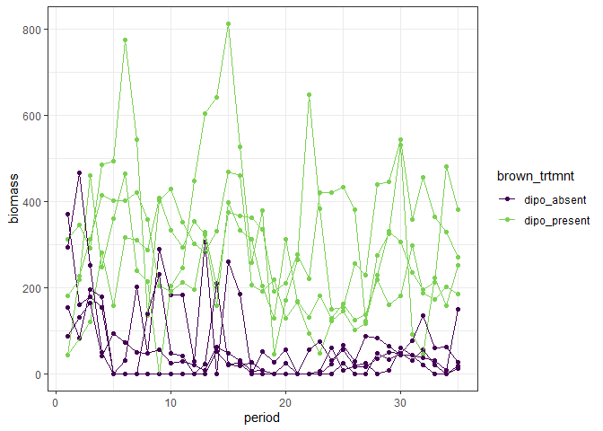
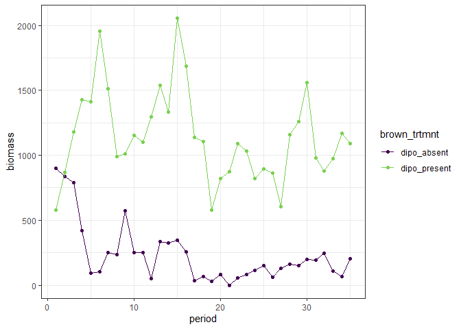
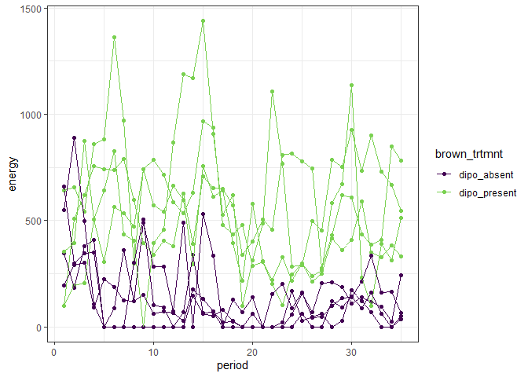
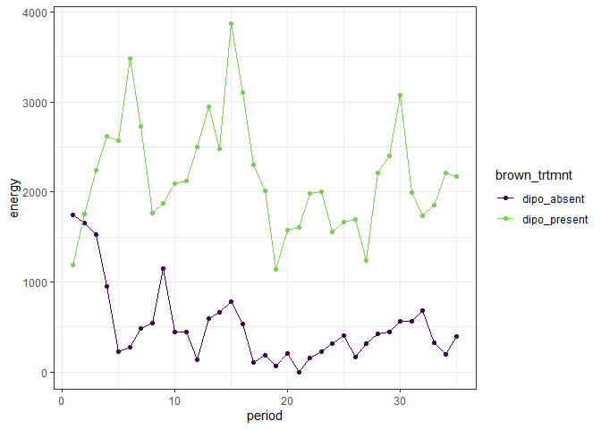

New plots with 81 data
================

<!-- -->

## Biomass and energy use

``` r
ggplot(filter(rat_totals, type != "other"), aes(period, biomass, color = brown_trtmnt)) +
  geom_point() +
  geom_line() +
  theme_bw() +
  scale_color_viridis_d(end = .8) +
  facet_wrap(vars(type),scales = "free_y", ncol = 1)
```

<!-- -->

``` r
ggplot(filter(rat_totals, type != "other"), aes(period, energy, color = brown_trtmnt)) +
  geom_point() +
  geom_line() +
  theme_bw() +
  scale_color_viridis_d(end = .8) +
  facet_wrap(vars(type),scales = "free_y", ncol = 1)
```

<!-- -->

### Plot totals

``` r
rat_plot_totals <- rats %>%
  group_by(plot, period) %>%
  mutate(nind = dplyr::n(),
         biomass = sum(wgt, na.rm = T),
         energy = sum(energy, na.rm = T)) %>%
  select(-day, -stake, -species, -sex, -hfl, -wgt, -tag, -ltag, -granivore, -omnivore, -small_granivore, -small_omnivore, -dipo, -type) %>%
  distinct()

rat_treatment_totals <- rats %>%
  group_by(brown_trtmnt, period) %>%
  summarize(nind = dplyr::n(),
         biomass = sum(wgt, na.rm = T),
         energy = sum(energy, na.rm = T))
```

    ## `summarise()` regrouping output by 'brown_trtmnt' (override with `.groups` argument)

``` r
ggplot(rat_plot_totals, aes(period, nind, group = plot, color = brown_trtmnt)) +
  geom_point() +
  geom_line() +
  scale_color_viridis_d(end = .8) +
  theme_bw() 
```

<!-- -->

``` r
ggplot(rat_treatment_totals, aes(period, nind, color = brown_trtmnt)) +
  geom_point() +
  geom_line() +
  theme_bw() +
  scale_color_viridis_d(end = .8)
```

<!-- -->

``` r
ggplot(rat_plot_totals, aes(period, biomass, group = plot, color = brown_trtmnt)) +
  geom_point() +
  geom_line() +
  scale_color_viridis_d(end = .8) +
  theme_bw() 
```

<!-- -->

``` r
ggplot(rat_treatment_totals, aes(period, biomass, color = brown_trtmnt)) +
  geom_point() +
  geom_line() +
  theme_bw() +
  scale_color_viridis_d(end = .8)
```

<!-- -->

``` r
ggplot(rat_plot_totals, aes(period, energy, group = plot, color = brown_trtmnt)) +
  geom_point() +
  geom_line() +
  scale_color_viridis_d(end = .8) +
  theme_bw() 
```

<!-- -->

``` r
ggplot(rat_treatment_totals, aes(period, energy, color = brown_trtmnt)) +
  geom_point() +
  geom_line() +
  theme_bw() +
  scale_color_viridis_d(end = .8)
```

<!-- -->
