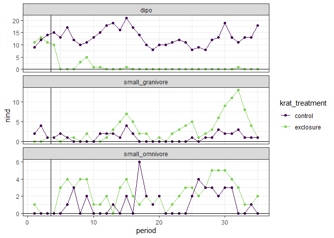
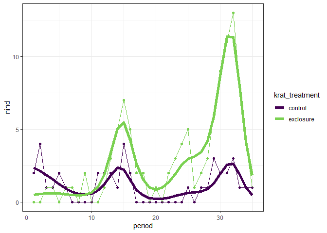
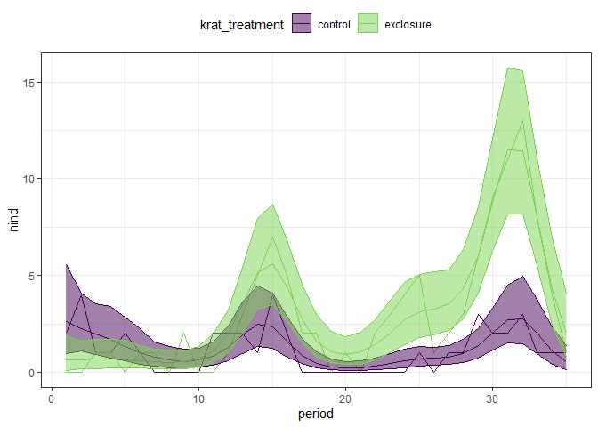
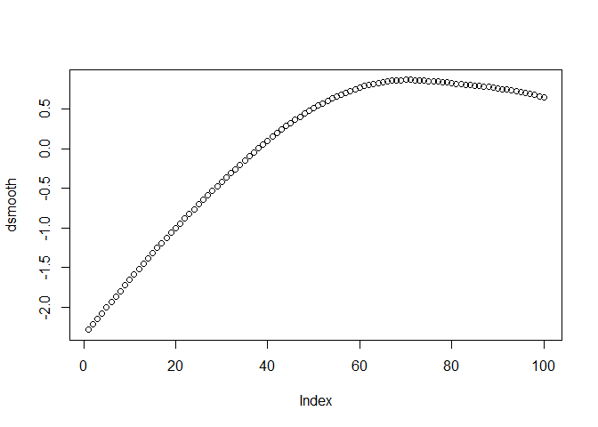
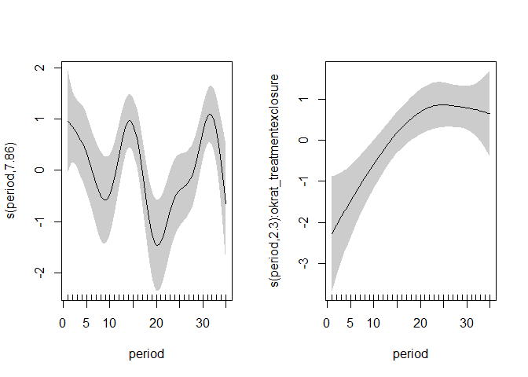
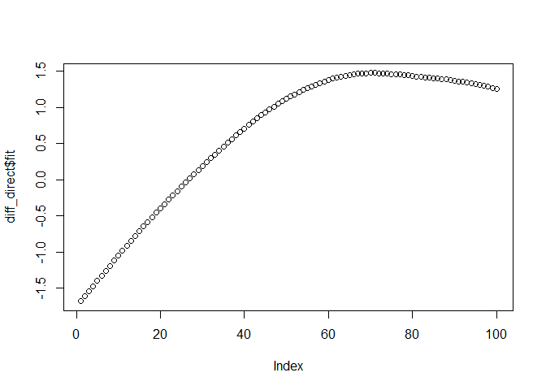

New plots with 81 data
================

<!-- -->

``` r
load_mgcv()


sg <- filter(rat_totals, type == "small_granivore")

n_gam <- gam(nind ~  okrat_treatment + s(period) + s(period, by = okrat_treatment), data = sg, method = "REML", family = "poisson")

n_gam_fitted <- add_fitted(sg, n_gam, value = "fitted")

ggplot(n_gam_fitted, aes(period, nind, color = krat_treatment)) +
  geom_point() +
  geom_line() +
  theme_bw() +
  geom_line(aes(period, fitted, color = krat_treatment), size = 2) +
  scale_color_viridis_d(end = .8)
```

<!-- -->

``` r
fitted_ci <- function(gam_obj, ndraws = 500, df, seed = 1977) {
  
  sampled_vals <- fitted_samples(gam_obj, n = ndraws, newdata = df, seed = seed)
  
  sampled_vals <- sampled_vals %>%
    group_by(row) %>%
    summarize(
      meanfit = mean(fitted),
      lowerfit = quantile(fitted, probs = .025),
      upperfit= quantile(fitted, probs = .975)
    ) %>%
    ungroup()
  
  df <- df %>%
    mutate(row = dplyr::row_number()) %>%
    left_join(sampled_vals)
  
  df  
}

n_gam_ci_manual <- fitted_ci(n_gam, df= sg)
```

    ## `summarise()` ungrouping output (override with `.groups` argument)

    ## Joining, by = "row"

``` r
ggplot(n_gam_ci_manual, aes(period, nind, color = krat_treatment)) +
  geom_line() +
  geom_line(aes(period, meanfit)) +
  geom_ribbon(aes(period, ymin = lowerfit, ymax = upperfit, fill = krat_treatment), alpha = .5) +
  theme_bw() +
  theme(legend.position = "top") +
  scale_color_viridis_d(end = .8) +
    scale_fill_viridis_d(end = .8)
```

<!-- -->

The `difference_smooths` function in `gratia` doesn’t work for ordered
smooths. Working from Gavin’s post…

``` r
plot(n_gam, shade = T, pages = 1, scale = 0, seWithMean = T)
```

<!-- -->

This may have directly given you what you want - the difference between
the control and the exclosure smooths is the plot on the right.

We can apparently interpret the signifiance relatively usually?

``` r
summary(n_gam)
```

    ## 
    ## Family: poisson 
    ## Link function: log 
    ## 
    ## Formula:
    ## nind ~ okrat_treatment + s(period) + s(period, by = okrat_treatment)
    ## 
    ## Parametric coefficients:
    ##                   Estimate Std. Error z value Pr(>|z|)    
    ## (Intercept)         0.2488     0.1201   2.073 0.038204 *  
    ## okrat_treatment.L   0.5028     0.1526   3.295 0.000983 ***
    ## ---
    ## Signif. codes:  0 '***' 0.001 '**' 0.01 '*' 0.05 '.' 0.1 ' ' 1
    ## 
    ## Approximate significance of smooth terms:
    ##                                      edf Ref.df Chi.sq  p-value    
    ## s(period)                          7.858  8.633  49.28  < 2e-16 ***
    ## s(period):okrat_treatmentexclosure 2.302  2.845  15.45 0.000912 ***
    ## ---
    ## Signif. codes:  0 '***' 0.001 '**' 0.01 '*' 0.05 '.' 0.1 ' ' 1
    ## 
    ## R-sq.(adj) =  0.869   Deviance explained = 76.8%
    ## -REML = 111.42  Scale est. = 1         n = 70

I.e. the exclosure is significant.

We could use a not ordered factor to estimate the parametric effect if
we want an easy-to-interpret mean?

``` r
n_gam2 <- n_gam <- gam(nind ~  krat_treatment + s(period) + s(period, by = okrat_treatment), data = sg, method = "REML", family = "poisson")

summary(n_gam2)
```

    ## 
    ## Family: poisson 
    ## Link function: log 
    ## 
    ## Formula:
    ## nind ~ krat_treatment + s(period) + s(period, by = okrat_treatment)
    ## 
    ## Parametric coefficients:
    ##                         Estimate Std. Error z value Pr(>|z|)    
    ## (Intercept)              -0.1067     0.1743  -0.612 0.540568    
    ## krat_treatmentexclosure   0.7110     0.2158   3.295 0.000983 ***
    ## ---
    ## Signif. codes:  0 '***' 0.001 '**' 0.01 '*' 0.05 '.' 0.1 ' ' 1
    ## 
    ## Approximate significance of smooth terms:
    ##                                      edf Ref.df Chi.sq  p-value    
    ## s(period)                          7.858  8.633  49.28  < 2e-16 ***
    ## s(period):okrat_treatmentexclosure 2.302  2.845  15.45 0.000912 ***
    ## ---
    ## Signif. codes:  0 '***' 0.001 '**' 0.01 '*' 0.05 '.' 0.1 ' ' 1
    ## 
    ## R-sq.(adj) =  0.869   Deviance explained = 76.8%
    ## -REML = 111.07  Scale est. = 1         n = 70

Can I get the difference smooth?

``` r
pdat <- data.frame(period = seq(min(sg$period), max(sg$period), length.out = 100),
                   krat_treatment = sg$krat_treatment[1],
                   okrat_treatment= sg$okrat_treatment[1])


xp <- predict(n_gam, newdata = pdat, type = 'lpmatrix')

# cols for the difference smooth
diff_cols <- grepl("okrat_treatmentexclosure", colnames(xp))

X <- xp
# Zero out the columns from the xp matrix that were for the other smooth

X[, !diff_cols] <- 0

# And zero out ones that aren't smooths (i.e. the parametric cols)
X[ ,!grepl("^s\\(", colnames(xp))] <- 0

# Use matrix multiplication of the X matrix (the modified Xp matrix) with the model coefficients from m to MULTIPLY Xp by the coefficients and SUM row wise in one step

dsmooth <- X %*% coef(n_gam)

plot(dsmooth)
```

<!-- -->

``` r
plot(n_gam, shade = T, pages = 1, scale = 0, seWithMean = T)
```

<!-- -->

``` r
# Might be able to do this directly using `mgcv::predict.gam`

diff_direct <- predict(n_gam, newdata = pdat, type = "link", se.fit = T, terms = "s(period):okrat_treatmentexclosure")

plot(diff_direct$fit)
```

<!-- -->
