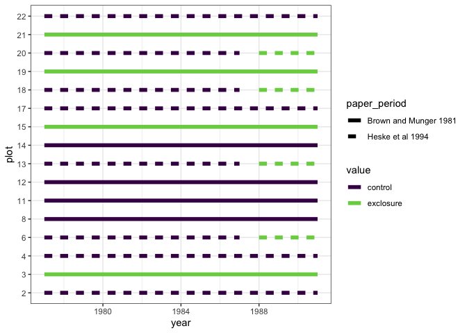

Treatments 1977-1991
================

This is as best as RMD can reconstruct based on the text of Brown &
Munger 1981 and Heske, Brown, and Mistry 1994, and the [PortalData plot
treatments
table](https://github.com/weecology/PortalData/blob/master/SiteandMethods/Portal_plot_treatments.csv).

``` r
plots <- data.frame(plot = as.factor(c(1:24)),
                    treatment = NA)

plots$treatment[c(3,15,19,21)] <- "orig_exclosure"
plots$treatment[c(8,11,12,14)] <- "orig_control"
plots$treatment[c(6,13,18,20)] <- "second_exclosure"
plots$treatment[c(2,4,17,22)] <- "second_control"

plots <- plots %>%
  mutate(seventies = ifelse(treatment == "orig_exclosure", "exclosure", "control"),
         eighties = ifelse(grepl(treatment, pattern = "exclosure"), "exclosure", ifelse(is.na(treatment), NA, "control"))) %>%
  filter(!is.na(treatment)) %>%
  tidyr::pivot_longer(cols = c(seventies, eighties), names_to = "time_period") %>%
  mutate(time_period = ordered(time_period, levels = c("seventies", "eighties"))) %>%
  mutate(paper_period = ifelse(grepl(treatment, pattern = "orig"), "Brown and Munger 1981", "Heske et al 1994")) %>%
  mutate(paper_period = ordered(paper_period, levels = c("Brown and Munger 1981", "Heske et al 1994")))

timeperiods <- data.frame(year = c(1977:1991)) %>%
  mutate(time_period = ifelse(year < 1988, "seventies", "eighties"))

plots <- right_join(plots, timeperiods)
```

    ## Joining, by = "time_period"

``` r
ggplot(plots, aes(year, plot, color = value)) +
  geom_line(size = 2) +
  theme_bw() +
  scale_color_viridis_d(end = .8) +
  facet_wrap(vars(paper_period), ncol = 1)
```

<!-- -->

``` r
ggplot(plots, aes(year, plot, color = value, linetype = paper_period)) +
  geom_line(size = 2) +
  theme_bw() +
  scale_color_viridis_d(end = .8) 
```

<!-- -->

`gam(nind ~ plot + plot_type + s(period) + s(period, by = plot_type) +
s(period, by = plot), family = "poisson")`

or, without plot

`gam(nind ~ plot_type + s(period) + s(period, by = plot_type), family =
"poisson")`
