Small granivores originals
================

``` r
rat_totals <- rat_totals_1977 %>%
  rename(trtmnt = trtmnt_1977) %>%
  mutate(time_period = "seventies") %>%
  bind_rows(mutate(rename(rat_totals_1988, trtmnt = trtmnt_1988), time_period = "eighties"))
```

``` r
source(here::here("lore", "1994_longterm", "gams_fxns_generalized.R"))

sg_all<- filter(rat_totals, type == "small_granivore") %>%
  mutate(plot_type = paste(time_period, trtmnt, sep = "_")) %>%
  mutate(oplot_type = ordered(plot_type, levels = c("seventies_control", "seventies_exclosure", "eighties_control", "eighties_exclosure")))

ggplot(sg_all, aes(as.Date(censusdate), nind, color = oplot_type)) +
  geom_line(size = 2) +
  theme_bw() +
  scale_color_viridis_d(end = .8) + 
  theme(legend.position = "top")
```

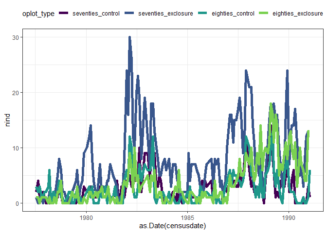<!-- -->

``` r
library(mgcv)
```

    ## Warning: package 'mgcv' was built under R version 4.0.3

    ## Loading required package: nlme

    ## 
    ## Attaching package: 'nlme'

    ## The following object is masked from 'package:dplyr':
    ## 
    ##     collapse

    ## This is mgcv 1.8-33. For overview type 'help("mgcv-package")'.

``` r
sg.gam <- gam(nind ~ oplot_type + s(period, k  = 30) + s(period, by = oplot_type, k = 30), family = "poisson", data = sg_all)
summary(sg.gam)
```

    ## 
    ## Family: poisson 
    ## Link function: log 
    ## 
    ## Formula:
    ## nind ~ oplot_type + s(period, k = 30) + s(period, by = oplot_type, 
    ##     k = 30)
    ## 
    ## Parametric coefficients:
    ##              Estimate Std. Error z value Pr(>|z|)    
    ## (Intercept)   0.97253    0.03050  31.890   <2e-16 ***
    ## oplot_type.L -0.10816    0.05879  -1.840   0.0658 .  
    ## oplot_type.Q -0.46496    0.05301  -8.771   <2e-16 ***
    ## oplot_type.C  0.81620    0.05457  14.958   <2e-16 ***
    ## ---
    ## Signif. codes:  0 '***' 0.001 '**' 0.01 '*' 0.05 '.' 0.1 ' ' 1
    ## 
    ## Approximate significance of smooth terms:
    ##                                            edf Ref.df  Chi.sq p-value    
    ## s(period)                               28.999 29.000 408.849  <2e-16 ***
    ## s(period):oplot_typeseventies_exclosure 24.903 27.469 105.345  <2e-16 ***
    ## s(period):oplot_typeeighties_control     2.123  2.661   4.719   0.213    
    ## s(period):oplot_typeeighties_exclosure  25.308 27.692 144.973  <2e-16 ***
    ## ---
    ## Signif. codes:  0 '***' 0.001 '**' 0.01 '*' 0.05 '.' 0.1 ' ' 1
    ## 
    ## R-sq.(adj) =  0.768   Deviance explained =   77%
    ## UBRE = 0.36392  Scale est. = 1         n = 620

``` r
gam.check(sg.gam)
```

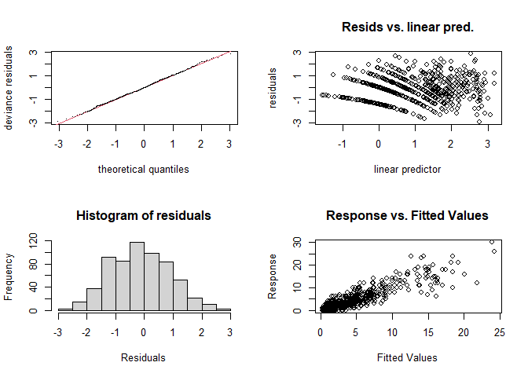<!-- -->

    ## 
    ## Method: UBRE   Optimizer: outer newton
    ## full convergence after 16 iterations.
    ## Gradient range [2.829989e-10,4.438155e-07]
    ## (score 0.3639213 & scale 1).
    ## Hessian positive definite, eigenvalue range [4.443051e-07,0.00456069].
    ## Model rank =  120 / 120 
    ## 
    ## Basis dimension (k) checking results. Low p-value (k-index<1) may
    ## indicate that k is too low, especially if edf is close to k'.
    ## 
    ##                                            k'   edf k-index p-value    
    ## s(period)                               29.00 29.00    0.85  <2e-16 ***
    ## s(period):oplot_typeseventies_exclosure 29.00 24.90    0.85   0.005 ** 
    ## s(period):oplot_typeeighties_control    29.00  2.12    0.85  <2e-16 ***
    ## s(period):oplot_typeeighties_exclosure  29.00 25.31    0.85   0.005 ** 
    ## ---
    ## Signif. codes:  0 '***' 0.001 '**' 0.01 '*' 0.05 '.' 0.1 ' ' 1

``` r
sg.pdat <- make_pdat(sg_all, comparison_variable = "oplot_type")
sg.pred <- get_predicted_vals(sg.gam, sg.pdat)


#sg.pred <- add_exclosure_diff(sg.pred, sg.diff)

print(plot_link_pred(sg.pred, comparison_variable = "oplot_type"))
```

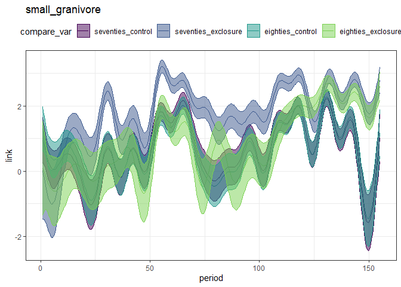<!-- -->

``` r
print(plot_fitted_pred(sg.pred, comparison_variable = "oplot_type"))
```

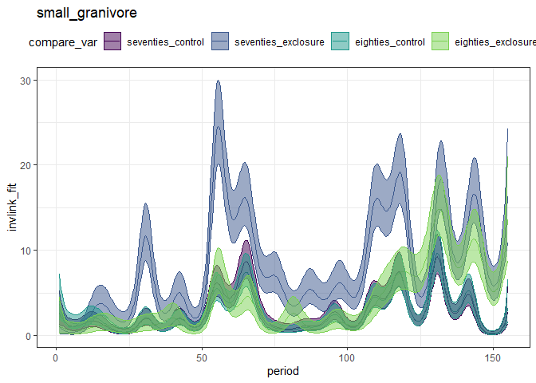<!-- -->

``` r
seventies_pred <- filter(sg.pred, oplot_type %in% c("seventies_control", "seventies_exclosure"))
print(plot_fitted_pred(seventies_pred, comparison_variable = "oplot_type"))
```

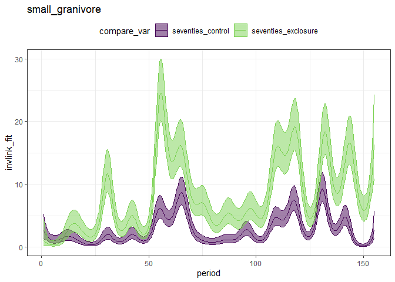<!-- -->

``` r
seventies_diff <- get_exclosure_diff(sg.gam, sg.pred, comparison_variable = "oplot_type", reference_level = 1, comparison_level = 2)

print(plot_exclosure_diff(seventies_diff))
```

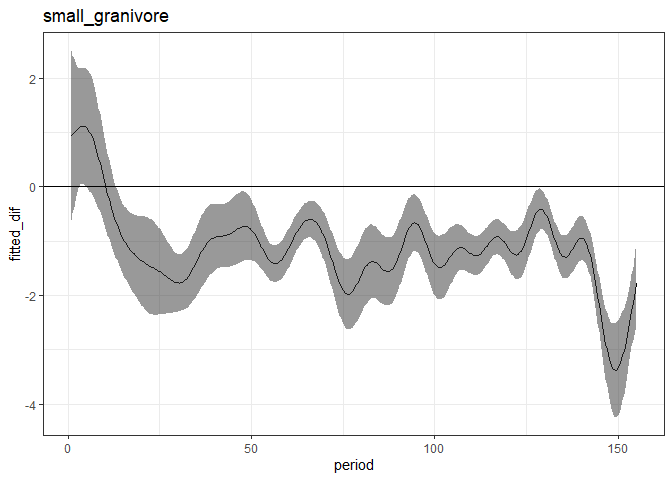<!-- -->

``` r
print(plot_fitted_pred(add_exclosure_diff(seventies_pred, seventies_diff), comparison_variable = "oplot_type"))
```

    ## Joining, by = "period"

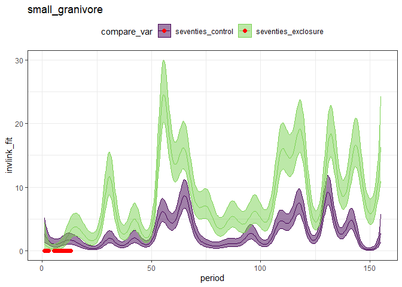<!-- -->

``` r
seventies_diff %>%
  filter(diff_overlaps_zero) %>%
  filter(period == max(period)) %>%
  distinct()
```

    ##     period            type fitted_dif      upper     lower diff_overlaps_zero
    ## 1 13.03607 small_granivore -0.6398264 0.01607514 -1.295728               TRUE

``` r
eighties_pred <- filter(sg.pred, oplot_type %in% c("eighties_control", "eighties_exclosure"))

print(plot_fitted_pred(eighties_pred, comparison_variable = "oplot_type"))
```

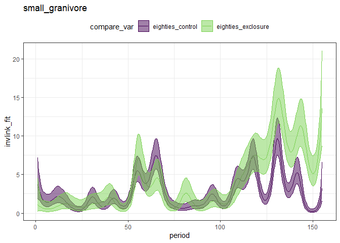<!-- -->

``` r
eighties_diff <- get_exclosure_diff(sg.gam, sg.pred, comparison_variable = "oplot_type", reference_level = 3, comparison_level = 4)

print(plot_exclosure_diff(eighties_diff))
```

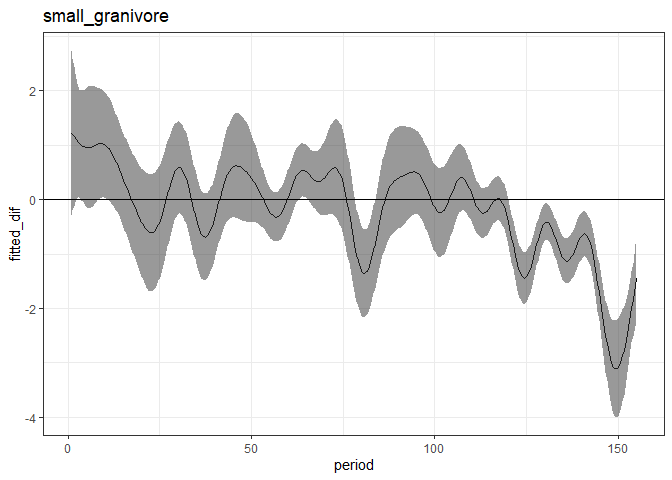<!-- -->

``` r
eighties_pred <- add_exclosure_diff(eighties_pred, eighties_diff)
```

    ## Joining, by = "period"

``` r
print(plot_fitted_pred(eighties_pred, comparison_variable = "oplot_type"))
```

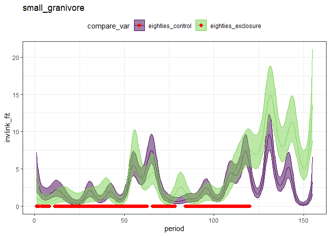<!-- -->

``` r
max(eighties_pred$period [ which(eighties_pred$diff_overlaps_zero)])
```

    ## [1] 119.8176

``` r
filter(rat_totals, period > 116, period < 122) %>%
  select(period, censusdate) %>%
  distinct()
```

    ##   period censusdate
    ## 1    117 1987-11-21
    ## 2    118 1988-01-23
    ## 3    119 1988-02-21
    ## 4    120 1988-03-20
    ## 5    121 1988-04-17

``` r
controls_pred <- filter(sg.pred, oplot_type %in% c("eighties_control", "seventies_control"))
print(plot_fitted_pred(controls_pred, comparison_variable = "oplot_type"))
```

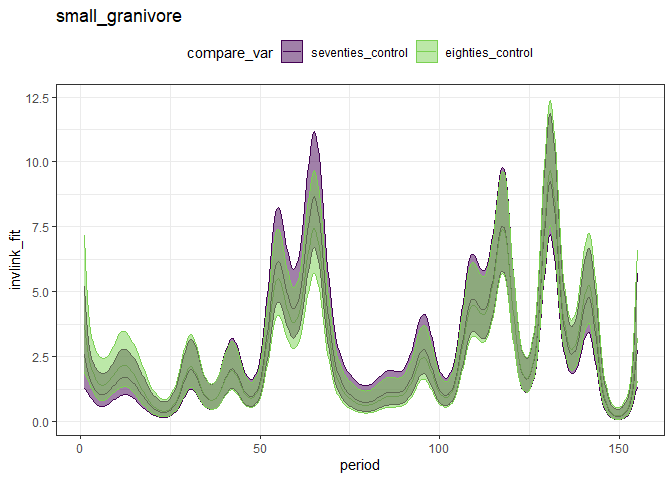<!-- -->

``` r
controls_diff <- get_exclosure_diff(sg.gam, sg.pred, comparison_variable = "oplot_type", reference_level = 1, comparison_level = 3)
print(plot_exclosure_diff(controls_diff))
```

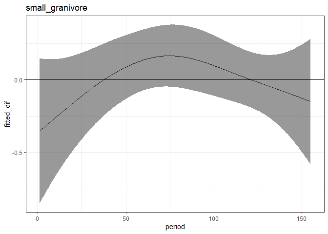<!-- -->

``` r
controls_pred <- add_exclosure_diff(controls_pred, controls_diff)
```

    ## Joining, by = "period"

``` r
print(plot_fitted_pred(controls_pred, comparison_variable = "oplot_type"))
```

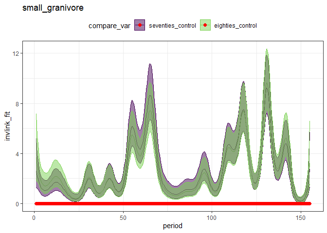<!-- -->

``` r
exclosures_pred <- filter(sg.pred, oplot_type %in% c("eighties_exclosure", "seventies_exclosure"))
print(plot_fitted_pred(exclosures_pred, comparison_variable = "oplot_type"))
```

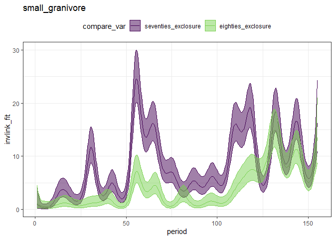<!-- -->

``` r
exclosures_diff <- get_exclosure_diff(sg.gam, sg.pred, comparison_variable = "oplot_type", reference_level = 2, comparison_level = 4)
print(plot_exclosure_diff(exclosures_diff))
```

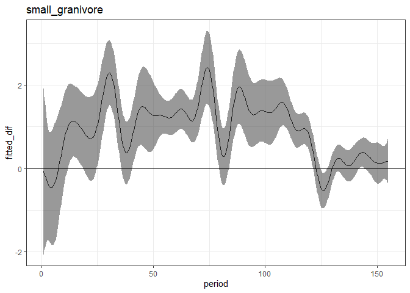<!-- -->

``` r
exclosures_pred <- add_exclosure_diff(exclosures_pred, exclosures_diff)
```

    ## Joining, by = "period"

``` r
print(plot_fitted_pred(exclosures_pred, comparison_variable = "oplot_type"))
```

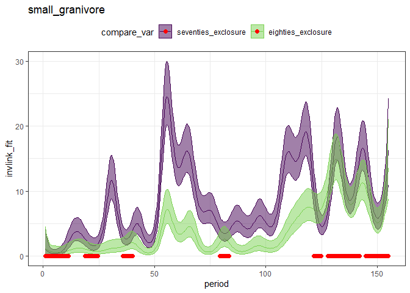<!-- -->

``` r
exclosures_pred %>%
  filter(period > 100) %>%
  filter(diff_overlaps_zero) %>%
  select(period) %>%
  distinct() %>%
  filter(period == min(period))
```

    ##     period
    ## 1 121.6693

``` r
filter(rat_totals, period > 116, period < 122) %>%
  select(period, censusdate) %>%
  distinct()
```

    ##   period censusdate
    ## 1    117 1987-11-21
    ## 2    118 1988-01-23
    ## 3    119 1988-02-21
    ## 4    120 1988-03-20
    ## 5    121 1988-04-17

``` r
# 
# sg.diff <- get_exclosure_diff(sg.gam, sg.pdat,comparison_variable = "trtmnt")
# 
# print(plot_exclosure_diff(sg.diff) +
#         geom_vline(xintercept = 35))
# 
# 
# min(sg.diff$period[ which(!sg.diff$diff_overlaps_zero)])
```

In this model (which has no “plot” effect):

  - The two sets of controls never diverge
  - The seventies exclosures exceed controls by period 13
  - The eighties exclosures exceed controls by period 119, which is Feb
    1988
  - The eighties exclosures (mostly) diverge from the seventies
    exclosures until period 121, which is April 1988.

The eighties exclosures were implemented in Jan 1988.

So,

  - An almost immediate effect
  - And no appreciable lag (mayyyybe 2 months but I wouldn’t put any
    stake in that) in new exclosures matching old exclosures.

This is a lot of pairwise comparisons, but I think this may be the best
way to do this? Because I don’t think you can do factor interactions in
a GAM, and even if you could it’s a little mindbending how to set them
up (because the treatments change).

There’s also a fair amount of treatment mess embedded in the
“control”/“exclosure” designations. Various seed additions, plant
removals, ant removals. None of which were thought to have an impact,
but it seems like it would be good practice to *confirm*.
