Small granivores originals
================

``` r
rat_plot_totals <- rat_plot_totals %>%
  mutate(plot_type = factor(plot_type),
         plot = factor(plot)) %>%
  mutate(oplot_type = ordered(plot_type),
         oplot = ordered(plot))
```

``` r
source(here::here("lore", "1994_longterm", "gams_fxns_generalized.R"))

sg_all<- filter(rat_plot_totals, type == "small_granivore")

ggplot(sg_all, aes(period, group = oplot,  nind, color = oplot_type)) +
  geom_line(size = 2) +
  theme_bw() +
  scale_color_viridis_d(end = .8) + 
  theme(legend.position = "top") + facet_wrap(vars(oplot_type))
```

<!-- -->

``` r
library(mgcv)
```

    ## Warning: package 'mgcv' was built under R version 4.0.3

    ## Loading required package: nlme

    ## 
    ## Attaching package: 'nlme'

    ## The following object is masked from 'package:dplyr':
    ## 
    ##     collapse

    ## This is mgcv 1.8-33. For overview type 'help("mgcv-package")'.

``` r
sg.gam <- gam(nind ~ plot_type + s(period, k = 10) + s(period, by = oplot_type, k = 10) + plot + s(period, by = oplot, k = 10), family = "poisson", data = sg_all, method = "REML", control = gam.control(nthreads = 4))
summary(sg.gam)
```

    ## 
    ## Family: poisson 
    ## Link function: log 
    ## 
    ## Formula:
    ## nind ~ plot_type + s(period, k = 10) + s(period, by = oplot_type, 
    ##     k = 10) + plot + s(period, by = oplot, k = 10)
    ## 
    ## Parametric coefficients:
    ##                           Estimate Std. Error z value Pr(>|z|)    
    ## (Intercept)               -1.07799    0.12951  -8.323  < 2e-16 ***
    ## plot_typeorig_exclosure    1.26250    0.15172   8.321  < 2e-16 ***
    ## plot_typesecond_control    0.94988    0.15240   6.233 4.58e-10 ***
    ## plot_typesecond_exclosure  0.40816    0.17856   2.286 0.022264 *  
    ## plot3                      0.53022    0.09884   5.364 8.12e-08 ***
    ## plot4                     -0.92639    0.14925  -6.207 5.40e-10 ***
    ## plot6                      0.31160    0.15745   1.979 0.047809 *  
    ## plot8                      0.00000    0.00000      NA       NA    
    ## plot11                     0.82847    0.16121   5.139 2.76e-07 ***
    ## plot12                     0.69607    0.15655   4.446 8.73e-06 ***
    ## plot13                     0.06624    0.16972   0.390 0.696318    
    ## plot14                    -0.14314    0.18987  -0.754 0.450918    
    ## plot15                     0.00000    0.00000      NA       NA    
    ## plot17                    -0.58253    0.14152  -4.116 3.85e-05 ***
    ## plot18                     0.00000    0.00000      NA       NA    
    ## plot19                     0.38992    0.10235   3.810 0.000139 ***
    ## plot20                     0.10535    0.16427   0.641 0.521320    
    ## plot21                     0.08417    0.10550   0.798 0.424982    
    ## plot22                    -0.97716    0.16414  -5.953 2.63e-09 ***
    ## ---
    ## Signif. codes:  0 '***' 0.001 '**' 0.01 '*' 0.05 '.' 0.1 ' ' 1
    ## 
    ## Approximate significance of smooth terms:
    ##                                            edf    Ref.df  Chi.sq  p-value    
    ## s(period)                            8.648e+00 8.895e+00 253.187  < 2e-16 ***
    ## s(period):oplot_typeorig_exclosure   7.225e+00 8.141e+00  50.050  < 2e-16 ***
    ## s(period):oplot_typesecond_control   4.007e+00 4.924e+00  20.883 0.000879 ***
    ## s(period):oplot_typesecond_exclosure 2.889e+00 3.590e+00  46.733  < 2e-16 ***
    ## s(period):oplot3                     1.001e+00 1.001e+00   4.627 0.031519 *  
    ## s(period):oplot4                     1.140e+00 1.265e+00   2.046 0.241529    
    ## s(period):oplot6                     1.000e+00 1.000e+00   0.002 0.969586    
    ## s(period):oplot8                     1.383e-04 2.698e-04   0.000 0.998361    
    ## s(period):oplot11                    5.848e+00 6.997e+00  26.786 0.000338 ***
    ## s(period):oplot12                    1.001e+00 1.002e+00  12.766 0.000356 ***
    ## s(period):oplot13                    4.216e+00 5.157e+00  18.453 0.002454 ** 
    ## s(period):oplot14                    1.000e+00 1.000e+00  10.879 0.000973 ***
    ## s(period):oplot15                    5.093e+00 6.190e+00  22.081 0.001367 ** 
    ## s(period):oplot17                    1.004e+00 1.008e+00  12.792 0.000354 ***
    ## s(period):oplot18                    7.675e-06 1.476e-05   0.000 0.999043    
    ## s(period):oplot19                    3.111e+00 3.858e+00   6.605 0.116390    
    ## s(period):oplot20                    1.965e+00 2.476e+00   4.672 0.140972    
    ## s(period):oplot21                    1.651e-04 3.254e-04   0.000 0.998247    
    ## s(period):oplot22                    3.121e+00 3.882e+00  12.685 0.012520 *  
    ## ---
    ## Signif. codes:  0 '***' 0.001 '**' 0.01 '*' 0.05 '.' 0.1 ' ' 1
    ## 
    ## Rank: 184/190
    ## R-sq.(adj) =  0.449   Deviance explained = 44.5%
    ## -REML = 3004.8  Scale est. = 1         n = 2480

``` r
gam.check(sg.gam)
```

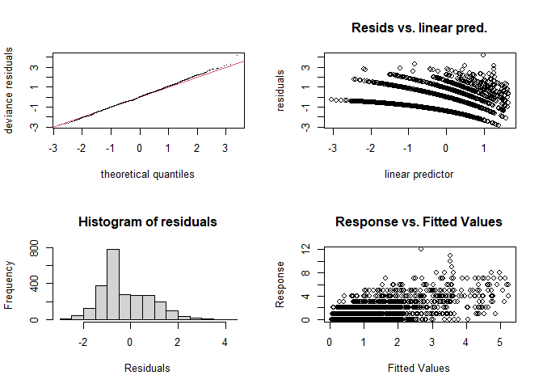<!-- -->

    ## 
    ## Method: REML   Optimizer: outer newton
    ## full convergence after 16 iterations.
    ## Gradient range [-0.0004779033,0.0003259795]
    ## (score 3004.836 & scale 1).
    ## Hessian positive definite, eigenvalue range [1.471802e-06,3.588598].
    ## Model rank =  184 / 190 
    ## 
    ## Basis dimension (k) checking results. Low p-value (k-index<1) may
    ## indicate that k is too low, especially if edf is close to k'.
    ## 
    ##                                            k'      edf k-index p-value    
    ## s(period)                            9.00e+00 8.65e+00    0.79  <2e-16 ***
    ## s(period):oplot_typeorig_exclosure   9.00e+00 7.23e+00    0.79  <2e-16 ***
    ## s(period):oplot_typesecond_control   9.00e+00 4.01e+00    0.79  <2e-16 ***
    ## s(period):oplot_typesecond_exclosure 9.00e+00 2.89e+00    0.79  <2e-16 ***
    ## s(period):oplot3                     9.00e+00 1.00e+00    0.79  <2e-16 ***
    ## s(period):oplot4                     9.00e+00 1.14e+00    0.79  <2e-16 ***
    ## s(period):oplot6                     9.00e+00 1.00e+00    0.79  <2e-16 ***
    ## s(period):oplot8                     9.00e+00 1.38e-04    0.79  <2e-16 ***
    ## s(period):oplot11                    9.00e+00 5.85e+00    0.79  <2e-16 ***
    ## s(period):oplot12                    9.00e+00 1.00e+00    0.79  <2e-16 ***
    ## s(period):oplot13                    9.00e+00 4.22e+00    0.79  <2e-16 ***
    ## s(period):oplot14                    9.00e+00 1.00e+00    0.79  <2e-16 ***
    ## s(period):oplot15                    9.00e+00 5.09e+00    0.79  <2e-16 ***
    ## s(period):oplot17                    9.00e+00 1.00e+00    0.79  <2e-16 ***
    ## s(period):oplot18                    9.00e+00 7.68e-06    0.79  <2e-16 ***
    ## s(period):oplot19                    9.00e+00 3.11e+00    0.79  <2e-16 ***
    ## s(period):oplot20                    9.00e+00 1.97e+00    0.79  <2e-16 ***
    ## s(period):oplot21                    9.00e+00 1.65e-04    0.79  <2e-16 ***
    ## s(period):oplot22                    9.00e+00 3.12e+00    0.79  <2e-16 ***
    ## ---
    ## Signif. codes:  0 '***' 0.001 '**' 0.01 '*' 0.05 '.' 0.1 ' ' 1

``` r
sg.pdat <- make_pdat(sg_all, comparison_variable = "oplot_type", include_plot = T) %>%
  mutate(plot_type = levels(sg_all$plot_type)[1],
         plot = levels(sg_all$plot)[1])
sg.pred <- get_predicted_vals(sg.gam, sg.pdat)


#sg.pred <- add_exclosure_diff(sg.pred, sg.diff)

print(plot_link_pred(sg.pred, comparison_variable = "oplot_type"))
```

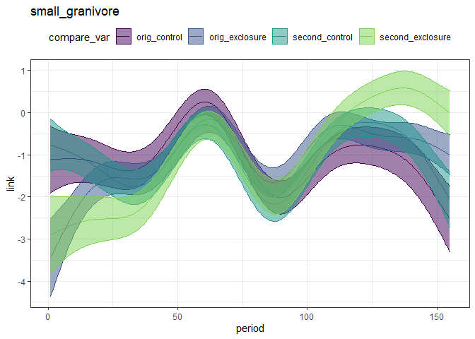<!-- -->

``` r
print(plot_fitted_pred(sg.pred, comparison_variable = "oplot_type"))
```

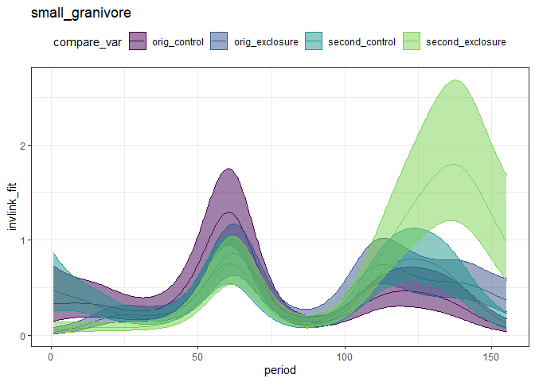<!-- -->

``` r
seventies_pred <- filter(sg.pred, grepl("orig", oplot_type))
print(plot_fitted_pred(seventies_pred, comparison_variable = "oplot_type"))
```

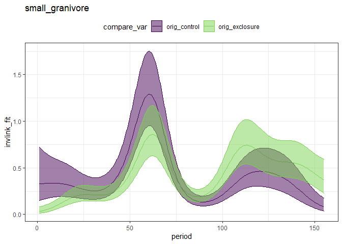<!-- -->

``` r
seventies_diff <- get_exclosure_diff(sg.gam, sg.pred, comparison_variable = "oplot_type", reference_level = 1, comparison_level = 2)

print(plot_exclosure_diff(seventies_diff))
```

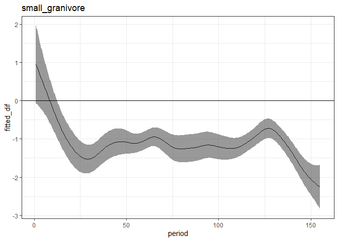<!-- -->

``` r
print(plot_fitted_pred(add_exclosure_diff(seventies_pred, seventies_diff), comparison_variable = "oplot_type"))
```

    ## Joining, by = "period"

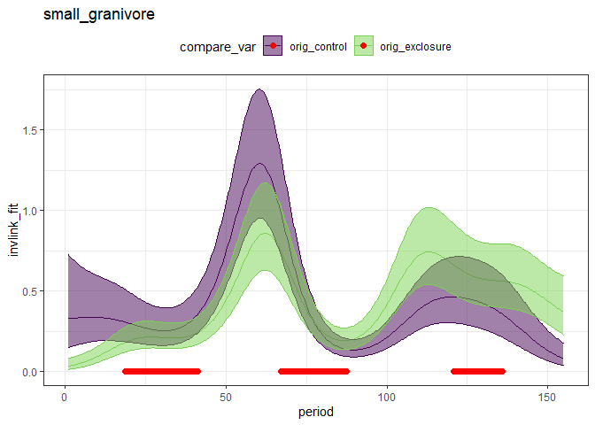<!-- -->

Two things. One, this now gives v different results than we expected.
Two, this model is definitely wrong or missing something somewhere,
because the exclosures are definitely NOT BELOW the controls. See period
50-100 - the model fit has the exclosures super low.

``` r
seventies_diff %>%
  filter(diff_overlaps_zero) %>%
  filter(period == max(period)) %>%
  distinct()
```

    ##     period            type fitted_dif       upper     lower diff_overlaps_zero
    ## 1 135.8657 small_granivore -0.4520962 0.006955612 -0.911148               TRUE

``` r
eighties_pred <- filter(sg.pred, grepl("second", oplot_type))

print(plot_fitted_pred(eighties_pred, comparison_variable = "oplot_type"))
```

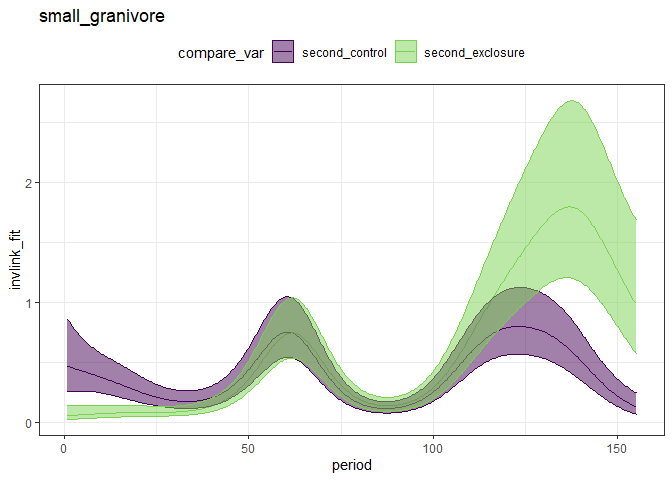<!-- -->

``` r
eighties_diff <- get_exclosure_diff(sg.gam, sg.pred, comparison_variable = "oplot_type", reference_level = 3, comparison_level = 4)

print(plot_exclosure_diff(eighties_diff))
```

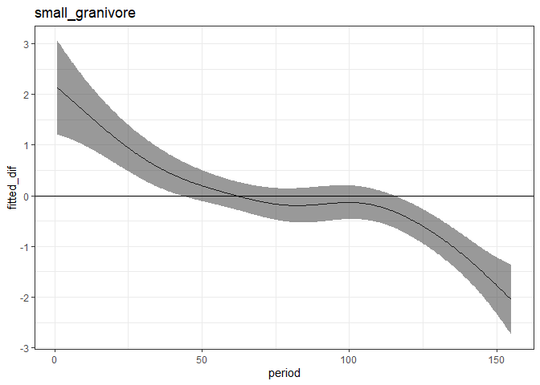<!-- -->

``` r
eighties_pred <- add_exclosure_diff(eighties_pred, eighties_diff)
```

    ## Joining, by = "period"

``` r
print(plot_fitted_pred(eighties_pred, comparison_variable = "oplot_type"))
```

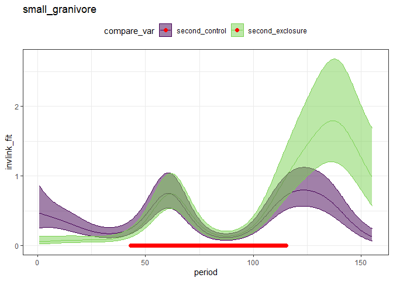<!-- -->

``` r
max(eighties_pred$period [ which(eighties_pred$diff_overlaps_zero)])
```

    ## [1] 115.1884

``` r
# filter(rat_totals, period > 116, period < 122) %>%
#   select(period, censusdate) %>%
#   distinct()


controls_pred <- filter(sg.pred, grepl("control", oplot_type))
print(plot_fitted_pred(controls_pred, comparison_variable = "oplot_type"))
```

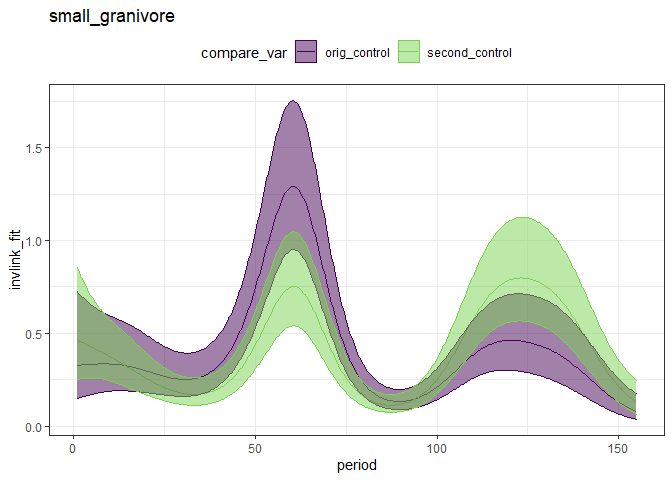<!-- -->

``` r
controls_diff <- get_exclosure_diff(sg.gam, sg.pred, comparison_variable = "oplot_type", reference_level = 1, comparison_level = 3)
print(plot_exclosure_diff(controls_diff))
```

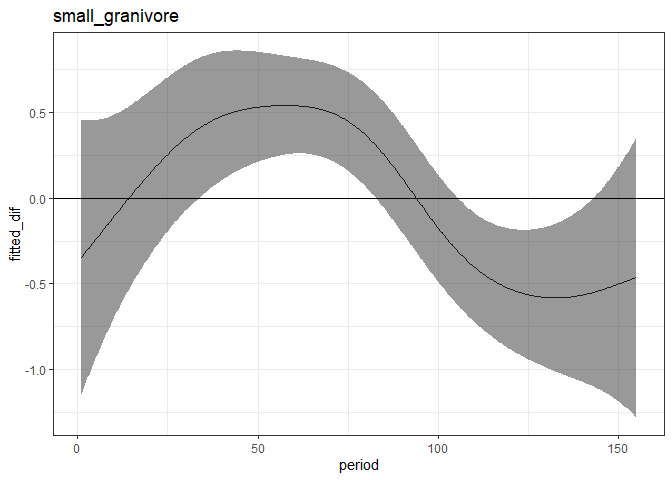<!-- -->

``` r
controls_pred <- add_exclosure_diff(controls_pred, controls_diff)
```

    ## Joining, by = "period"

``` r
print(plot_fitted_pred(controls_pred, comparison_variable = "oplot_type"))
```

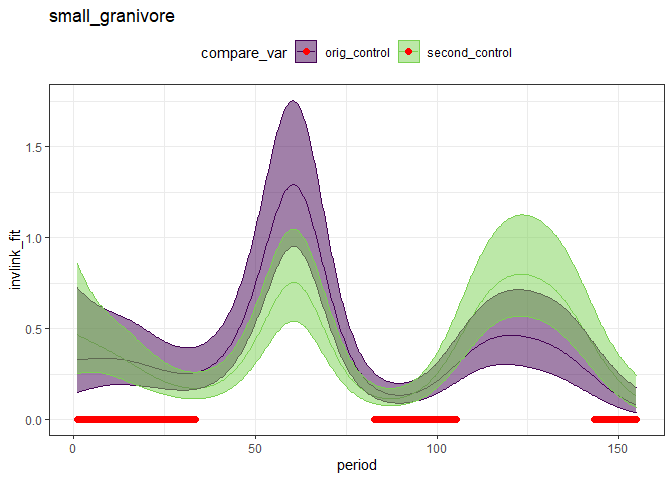<!-- -->

``` r
exclosures_pred <- filter(sg.pred, grepl("exclosure", oplot_type))
print(plot_fitted_pred(exclosures_pred, comparison_variable = "oplot_type"))
```

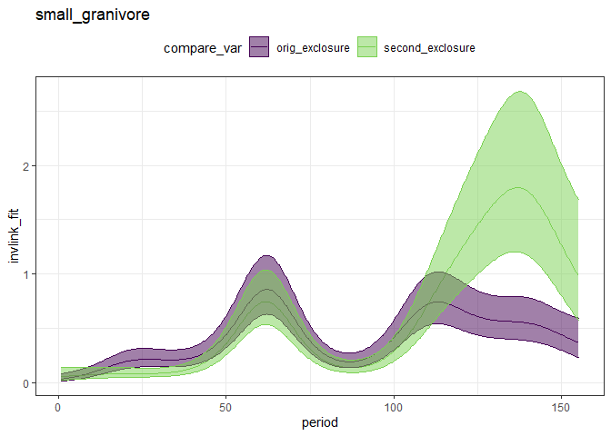<!-- -->

``` r
exclosures_diff <- get_exclosure_diff(sg.gam, sg.pred, comparison_variable = "oplot_type", reference_level = 2, comparison_level = 4)
print(plot_exclosure_diff(exclosures_diff))
```

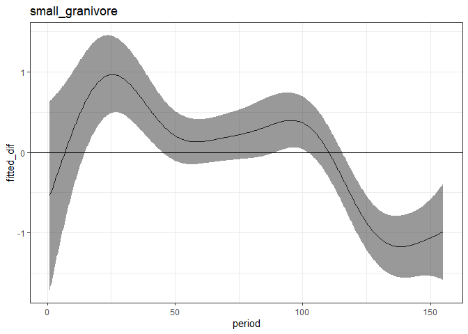<!-- -->

``` r
exclosures_pred <- add_exclosure_diff(exclosures_pred, exclosures_diff)
```

    ## Joining, by = "period"

``` r
print(plot_fitted_pred(exclosures_pred, comparison_variable = "oplot_type"))
```

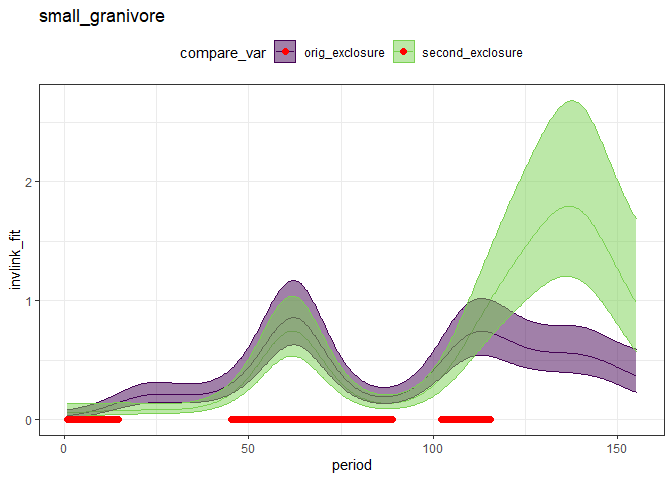<!-- -->

``` r
exclosures_pred %>%
  filter(period > 100) %>%
  filter(diff_overlaps_zero) %>%
  select(period) %>%
  distinct() %>%
  filter(period == min(period))
```

    ##     period
    ## 1 102.2265

``` r
# 
# sg.diff <- get_exclosure_diff(sg.gam, sg.pdat,comparison_variable = "trtmnt")
# 
# print(plot_exclosure_diff(sg.diff) +
#         geom_vline(xintercept = 35))
# 
# 
# min(sg.diff$period[ which(!sg.diff$diff_overlaps_zero)])
```
