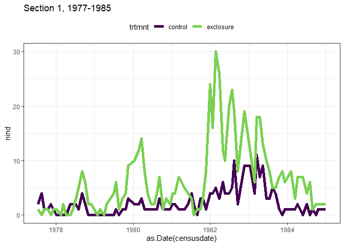
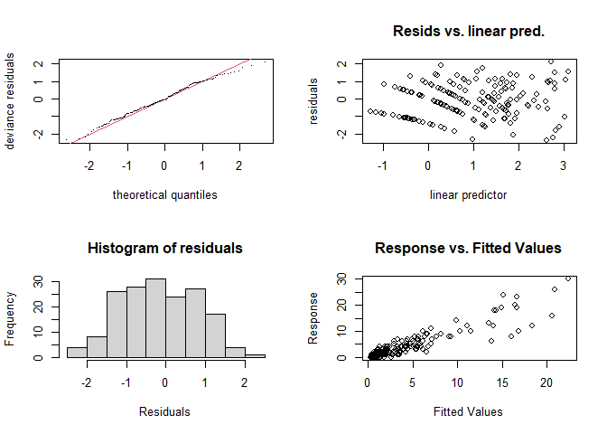
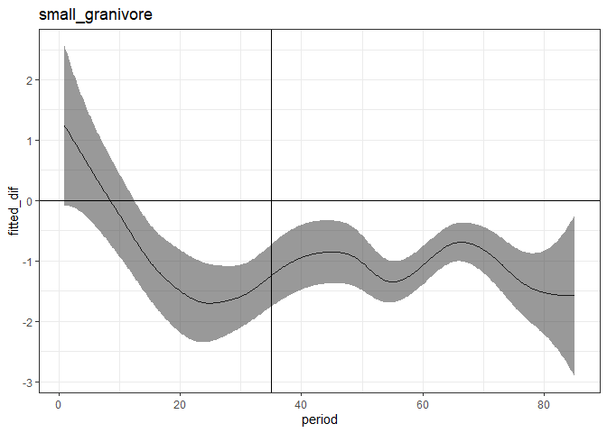
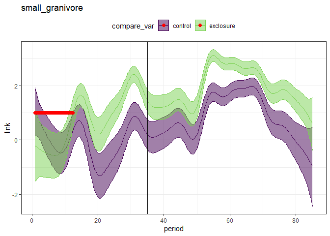
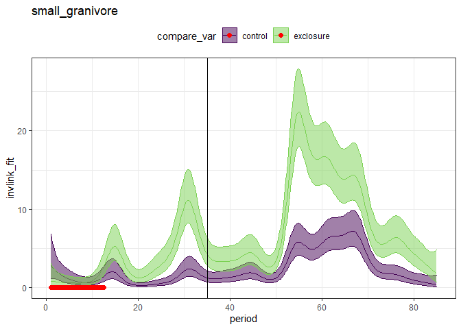

Small granivores originals
================

``` r
rat_totals <- rat_totals_1977 %>%
  rename(trtmnt = trtmnt_1977) %>%
  mutate(time_period = "seventies") %>%
  bind_rows(mutate(rename(rat_totals_1988, trtmnt = trtmnt_1988), time_period = "eighties"))
```

## 1\. Did the small granivore response on the **original** exclosure plots hold up over time?

Comparing original exclosures to original controls.

This is the same analysis as for the 1981 paper, but with additional
data.

I have split the timeseries for all plots into 2 sections. The first is
1977-85. The second is 85-91. This is chosen so the second chunk
consists of 3 years pre treatment and 3 years post. It might make sense
to have a shorter pre-treatment section in the second chunk.

``` r
source(here::here("lore", "1994_longterm", "gams_fxns_generalized.R"))

sg_orig <- filter(rat_totals, type == "small_granivore", censusdate  < as.Date("1985-01-01"), time_period == "seventies") %>%
  mutate(trtmnt = as.ordered(trtmnt))

ggplot(sg_orig, aes(as.Date(censusdate), nind, color = trtmnt)) +
  geom_line(size = 2) +
  theme_bw() +
  scale_color_viridis_d(end = .8) + 
  ggtitle("Section 1, 1977-1985") +
  theme(legend.position = "top")
```

<!-- -->

``` r
library(mgcv)
```

    ## Warning: package 'mgcv' was built under R version 4.0.3

    ## Loading required package: nlme

    ## 
    ## Attaching package: 'nlme'

    ## The following object is masked from 'package:dplyr':
    ## 
    ##     collapse

    ## This is mgcv 1.8-33. For overview type 'help("mgcv-package")'.

``` r
sg.gam <- gam(nind ~ trtmnt + s(period, k = 25) + s(period, by = trtmnt, k  = 25), data = sg_orig, family = poisson, method = "REML")

summary(sg.gam)
```

    ## 
    ## Family: poisson 
    ## Link function: log 
    ## 
    ## Formula:
    ## nind ~ trtmnt + s(period, k = 25) + s(period, by = trtmnt, k = 25)
    ## 
    ## Parametric coefficients:
    ##             Estimate Std. Error z value Pr(>|z|)    
    ## (Intercept)  0.94330    0.05887   16.02   <2e-16 ***
    ## trtmnt.L     0.69465    0.07894    8.80   <2e-16 ***
    ## ---
    ## Signif. codes:  0 '***' 0.001 '**' 0.01 '*' 0.05 '.' 0.1 ' ' 1
    ## 
    ## Approximate significance of smooth terms:
    ##                              edf Ref.df Chi.sq  p-value    
    ## s(period)                 18.418 21.089 164.01  < 2e-16 ***
    ## s(period):trtmntexclosure  7.135  8.823  28.64 0.000671 ***
    ## ---
    ## Signif. codes:  0 '***' 0.001 '**' 0.01 '*' 0.05 '.' 0.1 ' ' 1
    ## 
    ## R-sq.(adj) =  0.797   Deviance explained = 82.1%
    ## -REML = 362.77  Scale est. = 1         n = 170

``` r
gam.check(sg.gam)
```

<!-- -->

    ## 
    ## Method: REML   Optimizer: outer newton
    ## full convergence after 4 iterations.
    ## Gradient range [-5.618958e-05,-3.786935e-05]
    ## (score 362.7682 & scale 1).
    ## Hessian positive definite, eigenvalue range [1.003723,3.607889].
    ## Model rank =  50 / 50 
    ## 
    ## Basis dimension (k) checking results. Low p-value (k-index<1) may
    ## indicate that k is too low, especially if edf is close to k'.
    ## 
    ##                              k'   edf k-index p-value
    ## s(period)                 24.00 18.42    1.01    0.61
    ## s(period):trtmntexclosure 24.00  7.14    1.01    0.60

``` r
sg.pdat <- make_pdat(sg_orig, comparison_variable = "trtmnt")
sg.pred <- get_predicted_vals(sg.gam, sg.pdat)

sg.diff <- get_exclosure_diff(sg.gam, sg.pdat,comparison_variable = "trtmnt")

print(plot_exclosure_diff(sg.diff) +
        geom_vline(xintercept = 35))
```

<!-- -->

``` r
sg.pred <- add_exclosure_diff(sg.pred, sg.diff)
```

    ## Joining, by = "period"

``` r
print(plot_link_pred(sg.pred, comparison_variable = "trtmnt") +
        geom_vline(xintercept = 35))
```

<!-- -->

``` r
print(plot_fitted_pred(sg.pred, comparison_variable = "trtmnt") +
        geom_vline(xintercept = 35))
```

<!-- -->

``` r
min(sg.diff$period[ which(!sg.diff$diff_overlaps_zero)])
```

    ## [1] 12.61523

(vertical line is where the 1981 data stops.)

Yep.

Some notes.

  - Note `k=25` for the GAM; this is to get the k-index over 1.
  - The *timing* of the response is remarkably consistent (still being
    placed at 12-13).
  - The *magnitude* of the response fluctuates over time but often far
    exceeds what was seen in the first 35 periods.
  - Still not sure about including plot as an effect.
