Plots from Heske, Brown, and Mistry 1994
================

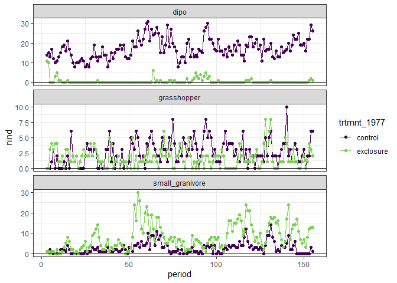<!-- -->

    ## `summarise()` regrouping output by 'three_month_section', 'type' (override with `.groups` argument)

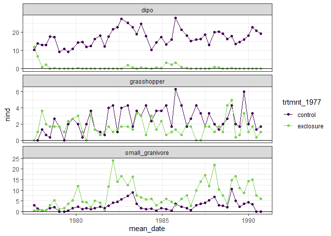<!-- -->

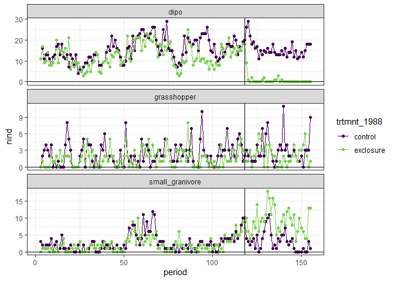<!-- -->

    ## `summarise()` regrouping output by 'three_month_section', 'type' (override with `.groups` argument)

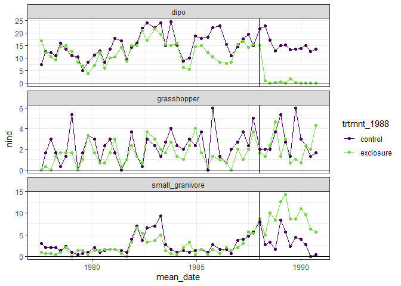<!-- -->

``` r
rat_totals <- rat_totals_1977 %>%
  rename(trtmnt = trtmnt_1977) %>%
  mutate(time_period = "seventies") %>%
  bind_rows(mutate(rename(rat_totals_1988, trtmnt = trtmnt_1988), time_period = "eighties")) %>%
  mutate(grassy = ifelse(time_period == "seventies", ifelse(trtmnt == "exclosure", TRUE, FALSE), FALSE))

ggplot(filter(rat_totals, type == "small_granivore", period > 2, period < 117), aes(period, nind, color = grassy)) +
  geom_line() +
  facet_wrap(vars(trtmnt), scales = "free_y") +
  theme_bw() +
  scale_color_viridis_d(option = "plasma", end = .8)
```

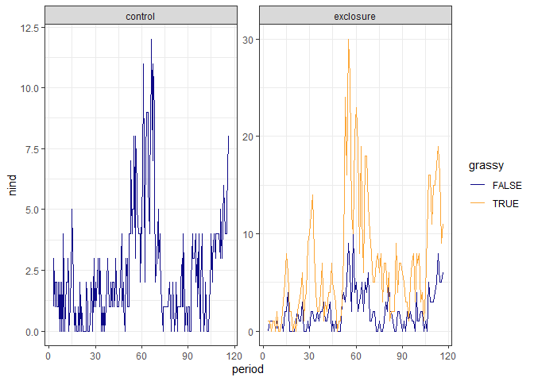<!-- -->

``` r
ggplot(filter(rat_totals, type == "small_granivore", period > 2, period < 117), aes(period, nind, color = trtmnt)) +
  geom_line() +
  facet_wrap(vars(time_period), scales = "free_y") +
  theme_bw() +
  scale_color_viridis_d(option = "plasma", end = .8)
```

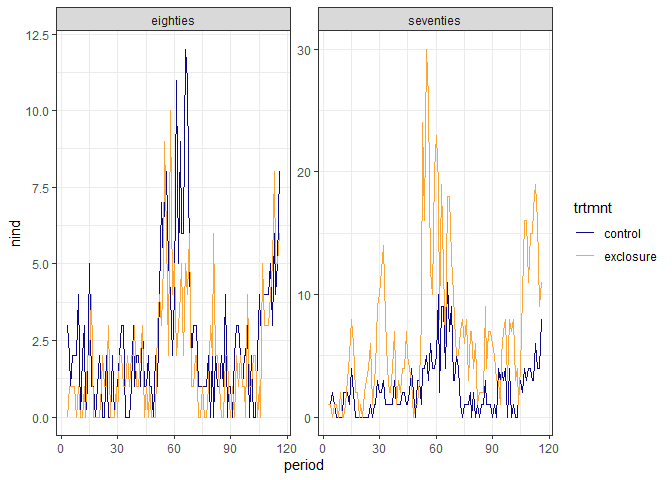<!-- -->

``` r
ggplot(filter(rat_totals, type == "small_granivore", period > 2, period < 117), aes(period, nind, color = time_period)) +
  geom_line() +
  facet_wrap(vars(trtmnt), scales = "fixed") +
  theme_bw() +
  scale_color_viridis_d(option = "plasma", end = .8)
```

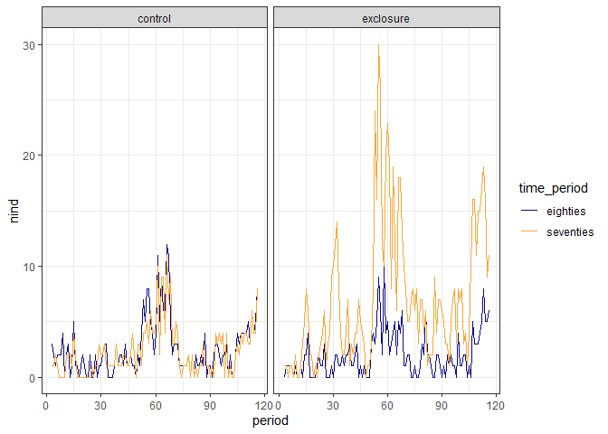<!-- -->

The eighties exclosures were controls prior, so it makes sense that that
TS is in line with the eighties controls and the seventies controls.

The thinking is, that the eighties exclosures are NOT grassy, but that
the seventies exclosures are grassy. Grass is good for small granivores.

How many small granivores do we see on the eighties vs seventies
exclosures following the implementation of the treatment?

``` r
ggplot(filter(rat_totals, type == "small_granivore"), aes(as.Date(censusdate), nind, color = time_period)) +
  geom_line(size = 2) +
  facet_wrap(vars(trtmnt), scales = "free", ncol = 1) +
  theme_bw() +
  scale_color_viridis_d(option = "plasma", end = .8) +
  theme(legend.position = "top")+
  geom_vline(xintercept = as.Date("1988-01-01"))
```

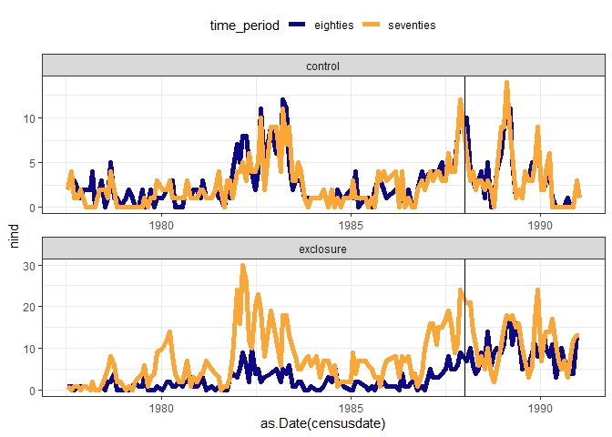<!-- -->

``` r
rat_totals <- rat_totals %>%
  mutate(trtmnt_period = paste(time_period, trtmnt, sep = "_"))

ggplot(filter(rat_totals, type == "small_granivore"), aes(as.Date(censusdate), nind, color= trtmnt, group = trtmnt_period)) +
  geom_line(size = 2) +
  theme_bw() +
  facet_wrap(vars(grassy), scales = "free", ncol = 1) +
  scale_color_viridis_d(end = .8) +
  theme(legend.position = "top")+
  geom_vline(xintercept = as.Date("1988-01-01"))
```

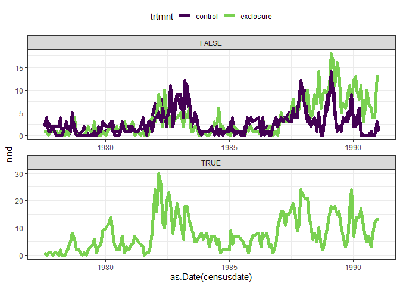<!-- -->

I’m **not sure** about this interpretation, but here is the logic around
these plots…

they generally represent a different approach from rmANOVA, in that
rmANOVA is (kind of) about chunking a TS into time periods and then
treating within-time-period as homogenous. rather than, the gam
difference approach is a little more about watching things converge and
diverge. you don’t have to specify the time periods a priori and in fact
you should **not**.

we see these bugbears also in the thibault bailey’s papers. the
baselines/conditions shift over the decades at the site, making it more
and more important to look at divergence **between treatments at the
same time**, than to chunk things into time periods.

(there is however an important time period in that the 1988 treatments
are implemented in Jan-Feb 1988\!)

look first at purple and orange plots. the controls (top panel) mirror
each other. the exclosures, the 1980s exclosures are well below the
1970s exclosures up until the treatment. this makes sense, bc at that
time they were controls. HOWEVER. they immediately match the 1970s
exclosures post treatment. BUT, that’s as much because the abundances on
the 70s plots have dropped, as because the abundances on the 80s plots
have increased. there’s not an obvious increase in the 80s time series
**precipitated by the treatment**, although there **is an increase**
that **starts some months before the treatment is implemented**. with
the caveat that humans are good at retrofitting pattern to data, but.
this isn’t a slam-dunk “treatment caused an increase” situation.

but then look at the (bottom) green and purple plots. The bottom panel
is the “grassy” plots, aka the exclosures that were implemented in 1977.
**All of the control plots** are starting to increase around 1987-88.
However following 1988, the **treated plots** diverge from the ones that
stayed controls and stay high while the controls drop out again.

``` r
ggplot(filter(rat_totals, type == "small_granivore", period > 100, period < 155), aes(as.Date(censusdate), nind, color= trtmnt, group = trtmnt_period)) +
  geom_line(size = 2) +
  theme_bw() +
  facet_wrap(vars(grassy), scales = "free", ncol = 1) +
  scale_color_viridis_d(end = .8) +
  theme(legend.position = "top")+
  geom_vline(xintercept = as.Date("1988-01-01"))
```

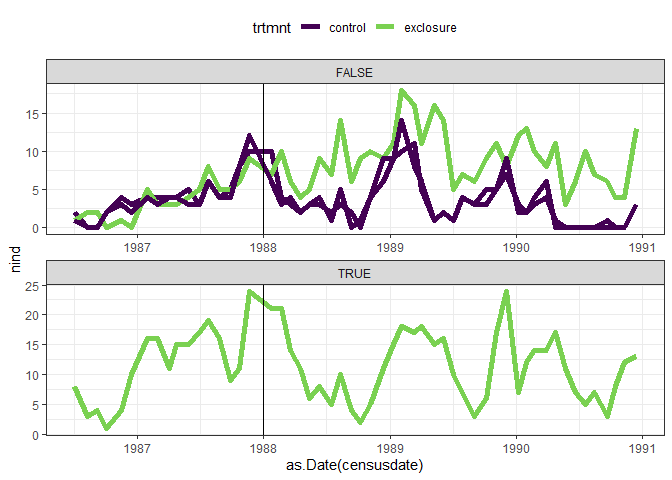<!-- -->

These plots, to me, also aren’t strongly supportive of the notion that
**grassiness** mediates an indirect effect of krats on small granivores.
The grassy (1970s) plots don’t have more small granivores than the
not-grassy plots once the krats are removed (1980s). If the grassiness
were a habitat effect, the grassy plots should have higher abundances
than the newly manipulated, but not yet grassy, plots.

There’s some commentary on this in the Heske discussion:

“Four out of five species of small granivores were not significantly
more abundant on the original exclosures than on the new exclosures.
These are *species typical of desert scrub, or, in the case of PM, not
strongly associated with either scrub or grassland.* The effect of krats
on these species appears to be primarily through direct competition….”

“RM, the one of the five most typically associated with grasslands, was
captured significantly more often on the original than on the new krat
exclosures. This difference reflects an additional contribution of an
indirect effect of the long-term changes in vegetation. The distribution
of harvest mice at our site was therefore affected by krats through both
direct and indirect pathways.”

They go on to look at cotton rats, which are not small but like grass.
“Cotton rats are as large or larger than krats, folivorous and
grassland specialists. Therefore we expect that they are not intimidated
by Dipo, do not compete with them for food, and prefer grassy habitats.
Captures of both cotton rats and RM are significantly // grass cover at
the site, whereas other rodents are not.” “As expected, cotton rats were
more abundant on the original than on the new exclosures. There was no
constitent treatment effect in the distribution of cotton rats other
than that explainable by their positive correlation with grass cover,
indicating that the direct interactions between cotton and krats were
minimal.”

### GAM planning

``` r
ggplot(filter(rat_totals, type == "small_granivore"), aes(as.Date(censusdate), nind, color= trtmnt, linetype = time_period)) +
  geom_line() +
  theme_bw() +
  scale_color_viridis_d(end = .8, direction = -1) +
  theme(legend.position = "top")+
  geom_vline(xintercept = as.Date("1988-01-01"))
```

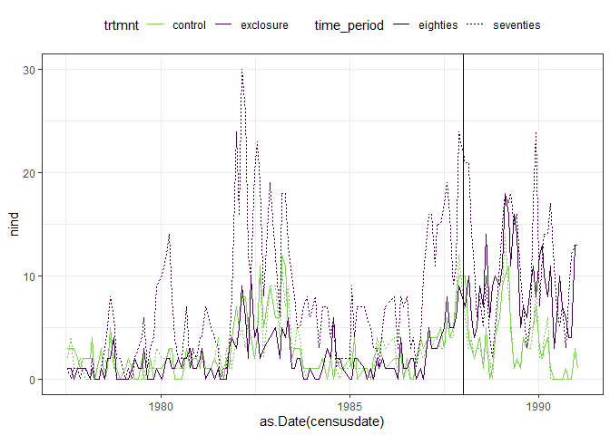<!-- -->

There are two comparisons to get to the *questions* -

  - New exclosures vs. new controls
  - New exclosures vs. old exclosures

& then others - that may be of groundwork?

  - New exclosures pre-treatment vs all controls
  - New controls vs old controls throughout

One way to approach this might be to fit the GAM by timeperiod\_trmtnt
(so 4 levels) and then extract the difference smooths pair-wise.
However, this feels inelegant and possibly not valid. It might be more
appropriate to do something like by(timeperiod) and by(treatment). But
this needs more thought.
