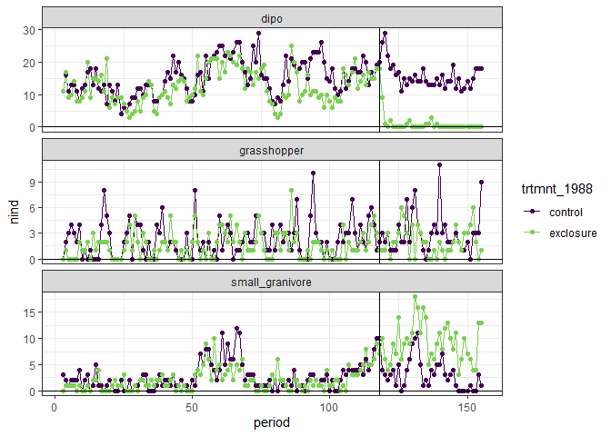
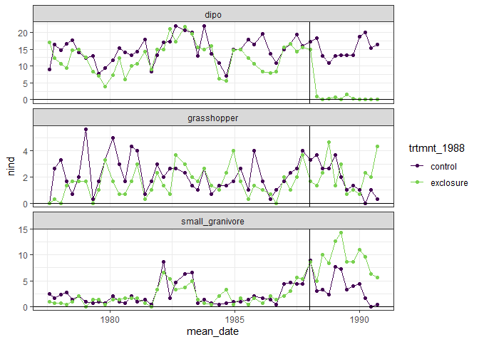

Plots from Heske, Brown, and Mistry 1994
================

<!-- -->

    ## `summarise()` regrouping output by 'three_month_section', 'type' (override with `.groups` argument)

<!-- -->

<!-- -->

    ## `summarise()` regrouping output by 'three_month_section', 'type' (override with `.groups` argument)

<!-- -->

The 1994 paper uses repeated measures ANOVA to test things, and is v
interested in direct and indirect effects. I’m not tracking all their
comparisons at the moment.
