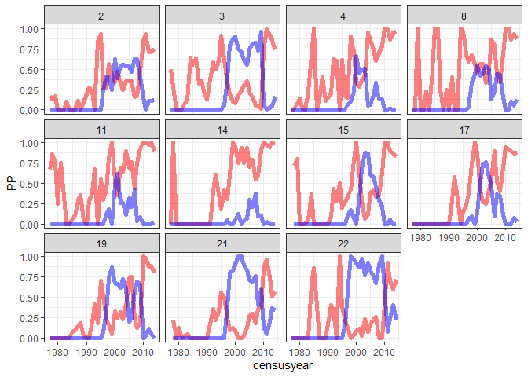
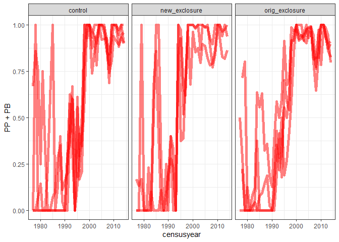
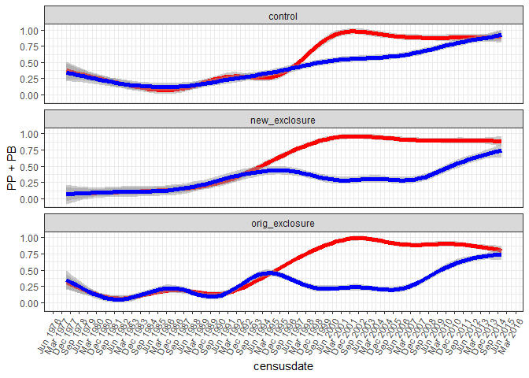

to 2015
================

``` r
rats <- read.csv(here::here("lore", "2020_redux", "2020_data_complete.csv"))
```

``` r
smgran <- filter(rats, type == "small_granivore")

smgran_comp <- smgran %>%
  select(censusdate, treatment, plot, species) %>%
  mutate(censusyear = as.integer(substr(censusdate, 0, 4))) %>%
  group_by( treatment, censusyear, plot, species) %>%
  summarize(nind = dplyr::n()) %>%
  ungroup %>%
  group_by(censusyear, treatment, plot) %>%
  mutate(totalind = sum(nind)) %>%
  ungroup() %>%
  mutate(nind = nind / totalind) %>% tidyr::pivot_wider(names_from = species, values_from = nind, values_fill= 0)
```

    ## `summarise()` regrouping output by 'treatment', 'censusyear', 'plot' (override with `.groups` argument)

``` r
smgran_comp_periods <- smgran %>%
  select(censusdate, period, treatment, plot, species) %>%
  group_by( censusdate, period, treatment, plot, species) %>%
  summarize(nind = dplyr::n()) %>%
  ungroup %>%
  group_by(censusdate, period, treatment, plot) %>%
  mutate(totalind = sum(nind)) %>%
  ungroup() %>%
  mutate(nind = nind / totalind) %>% tidyr::pivot_wider(names_from = species, values_from = nind, values_fill= 0) %>%
  mutate(censusdate = as.Date(censusdate))
```

    ## `summarise()` regrouping output by 'censusdate', 'period', 'treatment', 'plot' (override with `.groups` argument)

``` r
ggplot(smgran_comp, aes(censusyear, PP, group = plot)) +
  geom_line(size = 2, color = "red", alpha= .5) +
  geom_line(aes(censusyear, PB, group = plot), size = 2, color = "blue", alpha = .5) +
  theme_bw() +
  facet_wrap(vars(plot))
```

<!-- -->

``` r
ggplot(smgran_comp, aes(censusyear, PP + PB, group = plot)) +
  geom_line(size = 2, color = "red", alpha= .5)  +
  theme_bw() +
  facet_wrap(vars(treatment))
```

<!-- -->

``` r
ggplot(smgran_comp_periods, aes(censusdate, PP + PB)) +
  geom_smooth(method = "gam", se = T, size = 2, color = "red", alpha= .5)  +
   geom_smooth(aes(censusdate, PP), method = "gam", se = T, size = 2, color = "blue", alpha= .5)  +
  theme_bw() +
  facet_wrap(vars(treatment), ncol = 1) +
  scale_x_date(date_breaks = "9 month", date_labels =  "%b %Y") +
  theme(axis.text.x=element_text(angle=60, hjust=1))
```

    ## `geom_smooth()` using formula 'y ~ s(x, bs = "cs")'
    ## `geom_smooth()` using formula 'y ~ s(x, bs = "cs")'

<!-- -->

This is just to say…

  - While this wasn’t the case early in the study, after the late 1990s,
    PP + PB account for most of the “small granivore” community.
  - After around 2010, most (but not all) of it is PP.
  - PPs were a relatively small proportion even of **small granivores**
    in the 80s and early 90s.

Generally - possibly - pointing to the argument that, for the new
manipulations, we are looking a story that is perhaps mostly a story
about how PP, PB, and DX play together…

Bailey’s might be fading out for reasons unknown to us.

Where Bailey’s is present, especially since the 2010s, it’s not very
abundant.

See Ellen’s paper for some on PB-PP interactions, also Thibault et al
Redundant.

If we say PPs would rather hang with krats than with PB,

and krats are having any kind of suppressive effects on either or both
of them,

removing krats might create a kind of vacuum into which either PP or PB
could expand.

we know in the past, removing krats led to SOME expansion of pp’s/smgran
(70s and 80s) and that, once they found the site, bailey’s
preferentially colonized exclosures over controls.

however, since then we have seen the shift to shrubland.

krats may no longer be being very suppressive?
