to 2015
================

``` r
rats <- read.csv(here::here("lore", "2020_redux", "christensen_plots.csv"))
```

``` r
rats_types_totals <- rats %>%
  mutate(plot = factor(plot),
         treatment = factor(treatment)) %>%
  #mutate(plot = as.ordered(plot),
 #        treatment = as.ordered(treatment)) %>%
  select(period, treatment, type, plot, energy) %>%
  group_by(period, treatment, type, plot) %>%
  summarize(nind = dplyr::n(),
            totale = sum(energy))  %>%
  ungroup() 
```

    ## `summarise()` regrouping output by 'period', 'treatment', 'type' (override with `.groups` argument)

``` r
rats_totals <- rats %>% 
  mutate(plot = factor(plot),
         treatment = factor(treatment)) %>%
  select(period, treatment, plot, energy) %>%
  group_by(period, treatment, plot) %>%
  summarize(nind = dplyr::n(),
            totale = sum(energy)) %>%
  ungroup() 
```

    ## `summarise()` regrouping output by 'period', 'treatment' (override with `.groups` argument)

``` r
ggplot(filter(rats_totals), aes(period, nind, color = treatment, group = plot)) +
 geom_smooth(method = "gam", se = F, size = 2) +  theme_bw() +
  scale_color_viridis_d(end = .8) 
```

    ## `geom_smooth()` using formula 'y ~ s(x, bs = "cs")'

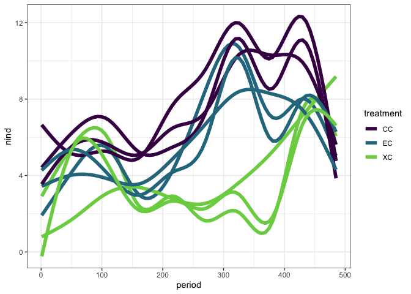<!-- -->

``` r
ggplot(filter(rats_totals), aes(period, totale, color = treatment, group = plot)) +
 geom_smooth(method = "gam", se = F, size = 2) +  theme_bw() +
  scale_color_viridis_d(end = .8) 
```

    ## `geom_smooth()` using formula 'y ~ s(x, bs = "cs")'

    ## Warning: Removed 467 rows containing non-finite values (stat_smooth).

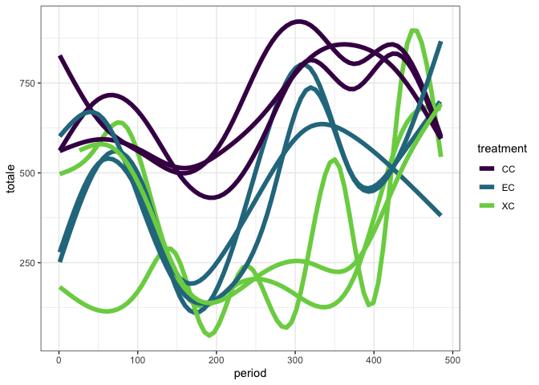<!-- -->

``` r
energy <- filter(rats_totals) %>%
  mutate(oplot = ordered(plot),
         treatment = as.ordered(treatment),
         type = "all") %>%
  as.data.frame()


library(mgcv)
```

    ## Loading required package: nlme

    ## 
    ## Attaching package: 'nlme'

    ## The following object is masked from 'package:dplyr':
    ## 
    ##     collapse

    ## This is mgcv 1.8-33. For overview type 'help("mgcv-package")'.

``` r
source(here::here("lore", "1994_longterm", "gams_fxns_generalized.R"))

n.mod <- gam(totale ~  treatment + s(period, k = 100) + s(period, by = treatment, k = 100), family = "tw", data  = energy)

summary(n.mod)
```

    ## 
    ## Family: Tweedie(p=1.444) 
    ## Link function: log 
    ## 
    ## Formula:
    ## totale ~ treatment + s(period, k = 100) + s(period, by = treatment, 
    ##     k = 100)
    ## 
    ## Parametric coefficients:
    ##              Estimate Std. Error t value Pr(>|t|)    
    ## (Intercept)  6.006218   0.008217 730.974  < 2e-16 ***
    ## treatment.L -0.620314   0.014546 -42.645  < 2e-16 ***
    ## treatment.Q  0.053531   0.013863   3.861 0.000115 ***
    ## ---
    ## Signif. codes:  0 '***' 0.001 '**' 0.01 '*' 0.05 '.' 0.1 ' ' 1
    ## 
    ## Approximate significance of smooth terms:
    ##                         edf Ref.df     F p-value    
    ## s(period)             83.40  93.09 15.22  <2e-16 ***
    ## s(period):treatmentEC 31.97  39.71 10.46  <2e-16 ***
    ## s(period):treatmentXC 43.71  53.78 17.84  <2e-16 ***
    ## ---
    ## Signif. codes:  0 '***' 0.001 '**' 0.01 '*' 0.05 '.' 0.1 ' ' 1
    ## 
    ## R-sq.(adj) =  0.647   Deviance explained = 63.6%
    ## -REML =  26350  Scale est. = 6.4901    n = 3898

``` r
gam.check(n.mod)
```

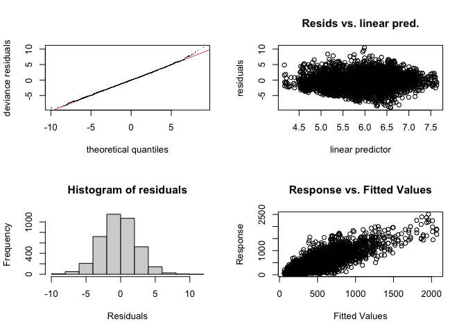<!-- -->

    ## 
    ## Method: REML   Optimizer: outer newton
    ## full convergence after 8 iterations.
    ## Gradient range [-2.58826e-05,0.02321504]
    ## (score 26349.64 & scale 6.490121).
    ## Hessian positive definite, eigenvalue range [2.61532,6313.662].
    ## Model rank =  300 / 300 
    ## 
    ## Basis dimension (k) checking results. Low p-value (k-index<1) may
    ## indicate that k is too low, especially if edf is close to k'.
    ## 
    ##                         k'  edf k-index p-value
    ## s(period)             99.0 83.4    1.03    0.99
    ## s(period):treatmentEC 99.0 32.0    1.03    0.99
    ## s(period):treatmentXC 99.0 43.7    1.03    0.98

``` r
n.pdat <- make_pdat(energy, include_plot = F)

n.pred <- get_predicted_vals(n.mod, n.pdat)
```

Here we have a GAM - fit without plot, because when I included plot I
got super-wrong estimates (like infinity rats for orig\_exclosure????)

This GAM is trash according to gam.check.

``` r
plot_fitted_pred(n.pred)# + facet_wrap(vars(compare_var), scales = "free_y")
```

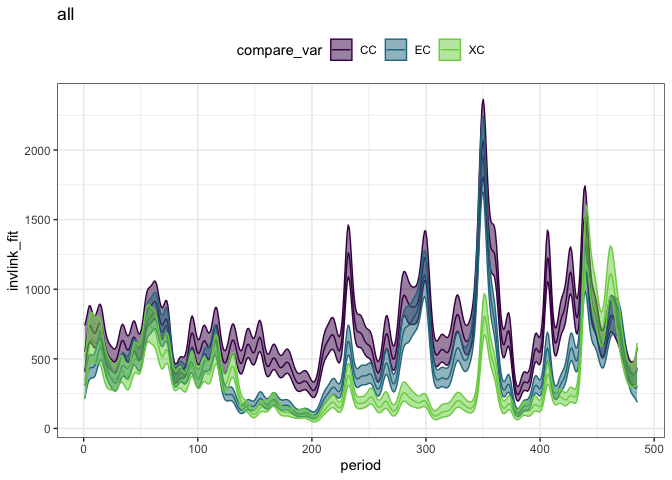<!-- -->

``` r
cc_xc <- get_exclosure_diff(n.mod, n.pdat, comparison_level = 3)

plot_exclosure_diff(cc_xc)
```

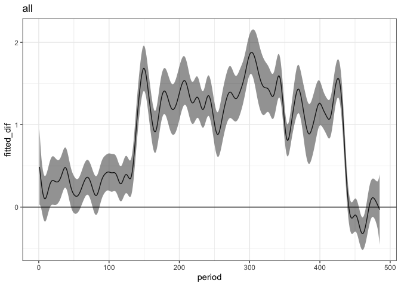<!-- -->

``` r
n.origdiff <- add_exclosure_diff(n.pred, cc_xc)
```

    ## Joining, by = "period"

``` r
plot_fitted_pred(filter(n.origdiff, treatment != "EC"))
```

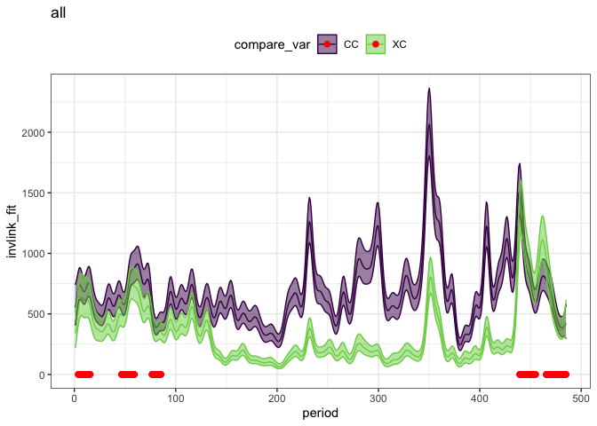<!-- -->

``` r
cc_ec <- get_exclosure_diff(n.mod, n.pdat)

plot_exclosure_diff(cc_ec)
```

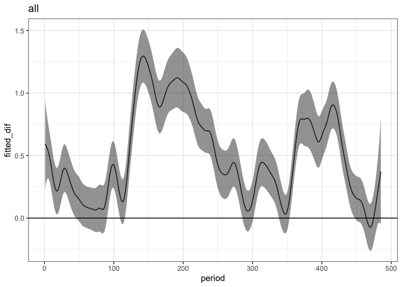<!-- -->

``` r
n.newdiff <- add_exclosure_diff(n.pred, cc_ec)
```

    ## Joining, by = "period"

``` r
plot_fitted_pred(filter(n.newdiff, treatment != "XC")) +
  geom_vline(xintercept = c(118, 216, 381, 434))
```

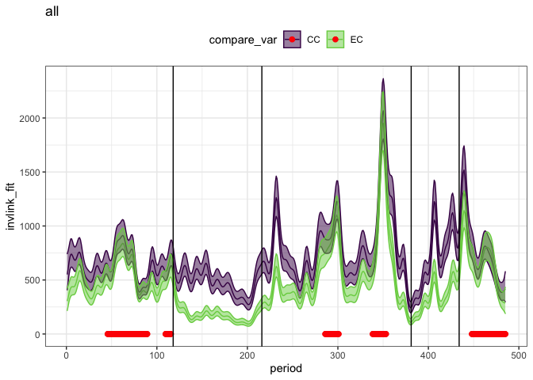<!-- -->

``` r
library(gratia)
n.sim.data <- filter(n.pdat, treatment != "XC") %>%
  mutate(rn = dplyr::row_number())
set.seed(1977)
n.sims <- simulate(n.mod, nsim = 500, newdata = n.sim.data) %>%
  as.data.frame() %>%
    mutate(rn = dplyr::row_number()) %>%
  tidyr::pivot_longer(-rn, names_to = "sim", values_to = "pred") %>%
  mutate(sim = as.integer(substr(sim, 2, nchar(sim)))) %>%
  right_join(n.sim.data) %>%
  tidyr::pivot_wider(id_cols = c(sim, period, type), names_from = treatment, values_from = pred) %>%
  mutate(ratio = EC / CC) %>%
  filter(!is.infinite(ratio), !is.na(ratio)) %>%
  group_by(period, type) %>%
  summarize(ratio_mean = mean(ratio),
            ratio_lower = quantile(ratio, probs = 0.025),
            ratio_upper = quantile(ratio, probs = 0.975),
            mean_EC= mean(EC),
            mean_CC = mean(CC)) %>%
  ungroup() %>%
  mutate(ratio_of_means = mean_EC/ mean_CC)
```

    ## Joining, by = "rn"

    ## `summarise()` regrouping output by 'period' (override with `.groups` argument)

``` r
nd.wide <- n.newdiff %>%
  select(period, treatment, invlink_fit, diff_overlaps_zero) %>%
  tidyr::pivot_wider(id_cols = c(period, diff_overlaps_zero), names_from= treatment, values_from = invlink_fit) %>%
  mutate(ratio = EC / CC)


ggplot(n.sims, aes(period, ratio_mean)) +
  geom_line() +
  ylim(0, 1.5) +
  geom_line(aes(period, ratio_of_means), color = "green") +
  geom_line(data = nd.wide, aes(period, ratio), color = "pink")
```

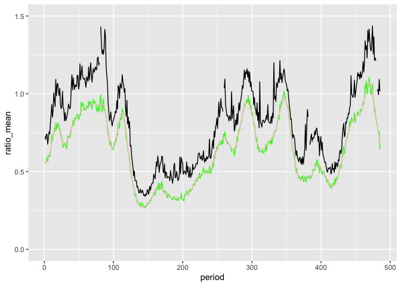<!-- -->

``` r
ggplot(nd.wide, aes(period, ratio)) +
  geom_line()
```

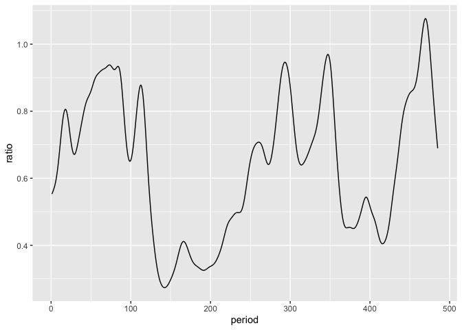<!-- -->

``` r
th_per1 <- filter(rats_totals, period >= 118, period < 216) %>%
  group_by(period, treatment) %>%
    summarize(totale = sum(totale, na.rm = T)) %>%ungroup()%>%
  mutate(era= "th1")
```

    ## `summarise()` regrouping output by 'period' (override with `.groups` argument)

``` r
th_per2 <- filter(rats_totals, period >= 216, period < 356)%>%
  group_by(period, treatment) %>%  summarize(totale = sum(totale, na.rm = T)) %>%
  ungroup() %>%
  mutate(era = "th2")
```

    ## `summarise()` regrouping output by 'period' (override with `.groups` argument)

``` r
since_th <- filter(rats_totals, period >= 356, period < 434) %>%
    group_by(period, treatment) %>%  summarize(totale = sum(totale, na.rm = T)) %>%ungroup() %>%
  mutate(era = "now")
```

    ## `summarise()` regrouping output by 'period' (override with `.groups` argument)

``` r
ggplot(th_per1, aes(period, totale, color = treatment)) +
  geom_line()
```

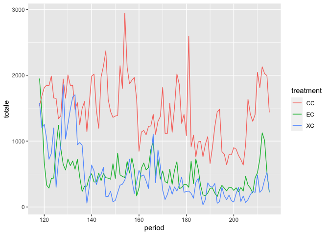<!-- -->

``` r
ggplot(th_per2, aes(period, totale, color = treatment)) +
  geom_line()
```

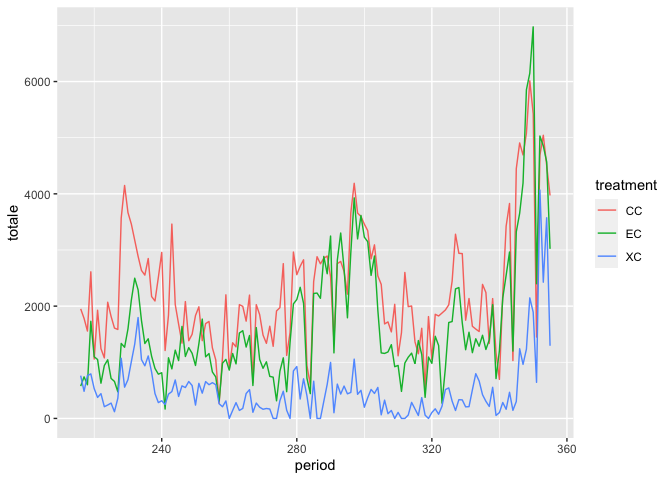<!-- -->

``` r
ggplot(since_th, aes(period, totale, color = treatment)) +
  geom_line()
```

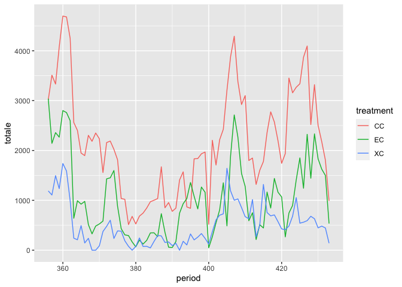<!-- -->

``` r
alltime <- bind_rows(th_per1, th_per2, since_th)

alltime_wide <- alltime %>%
  tidyr::pivot_wider(id_cols = c(period, era), names_from = treatment, values_from = totale)

ttest1 <- t.test(filter(alltime_wide, era == "th1")$CC, filter(alltime_wide, era == "th1")$EC)

ttest1
```

    ## 
    ##  Welch Two Sample t-test
    ## 
    ## data:  filter(alltime_wide, era == "th1")$CC and filter(alltime_wide, era == "th1")$EC
    ## t = 17.239, df = 159.08, p-value < 2.2e-16
    ## alternative hypothesis: true difference in means is not equal to 0
    ## 95 percent confidence interval:
    ##   843.2102 1061.4098
    ## sample estimates:
    ## mean of x mean of y 
    ## 1453.7683  501.4583

``` r
ttest2 <- t.test(filter(alltime_wide, era == "th2")$CC, filter(alltime_wide, era == "th2")$EC)

ttest2
```

    ## 
    ##  Welch Two Sample t-test
    ## 
    ## data:  filter(alltime_wide, era == "th2")$CC and filter(alltime_wide, era == "th2")$EC
    ## t = 4.327, df = 275.64, p-value = 2.116e-05
    ## alternative hypothesis: true difference in means is not equal to 0
    ## 95 percent confidence interval:
    ##  319.6738 853.3580
    ## sample estimates:
    ## mean of x mean of y 
    ##  2275.996  1689.480

``` r
ttest3 <- t.test(filter(alltime_wide, era == "now")$CC, filter(alltime_wide, era == "now")$EC)
ttest3
```

    ## 
    ##  Welch Two Sample t-test
    ## 
    ## data:  filter(alltime_wide, era == "now")$CC and filter(alltime_wide, era == "now")$EC
    ## t = 7.4105, df = 139.57, p-value = 1.097e-11
    ## alternative hypothesis: true difference in means is not equal to 0
    ## 95 percent confidence interval:
    ##   814.4905 1407.2440
    ## sample estimates:
    ## mean of x mean of y 
    ##  2152.474  1041.607

``` r
ggplot(alltime_wide, aes(period, EC / CC)) +
  geom_line() +
    geom_line(data = nd.wide, aes(period, ratio), color = "pink")
```

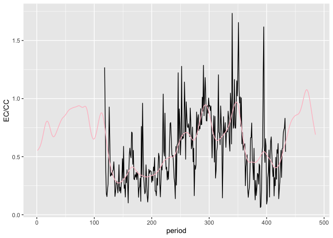<!-- -->
