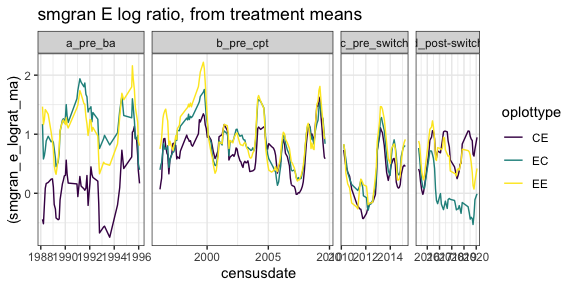
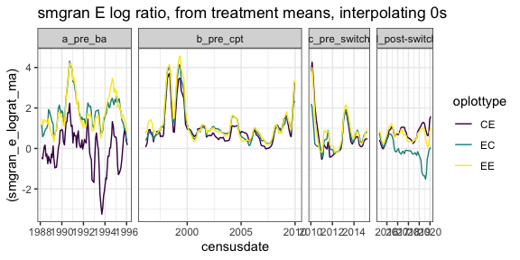
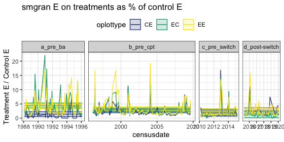
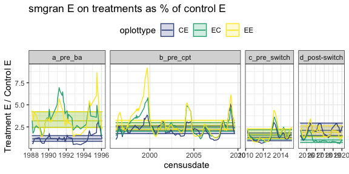
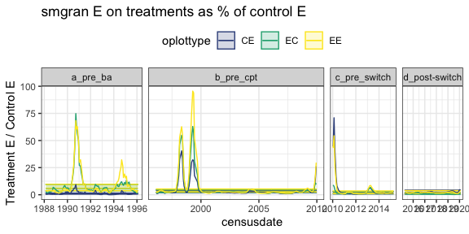
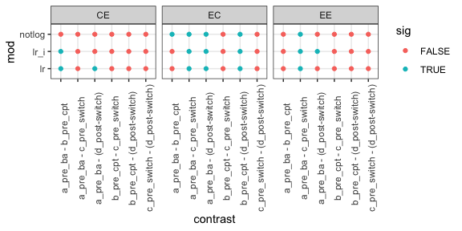

hold this loosely…
================

    ## Loading in data version 2.49.0

    ## Joining, by = "plot"

    ## Joining, by = "period"
    ## Joining, by = "period"

<!-- -->

    ## Joining, by = "period"

<!-- -->

# smgran E models

## Not log ratio

    ## Joining, by = c("era", "plot_type")

<!-- -->

## Log ratio

    ## Joining, by = c("era", "plot_type")

<!-- -->

## Log ratio interpolating

    ## Joining, by = c("era", "plot_type")

<!-- -->

## Significance comparison

<!-- -->
