New plots with 81 data
================

# Removal v control

    ## `summarise()` regrouping output by 'period' (override with `.groups` argument)

<!-- -->

``` r
rat_totals <- rat_totals %>%
  mutate(krat_treatment = ifelse(brown_trtmnt == "CC", "control", "exclosure")) %>%
  mutate(okrat_treatment = ordered(krat_treatment))

sg <- filter(rat_totals, type == "sg")

ggplot(sg, aes(period, nind, color= okrat_treatment)) +
  geom_line() +
  geom_point() +
  theme_bw() +
  scale_color_viridis_d(end = .8)
```

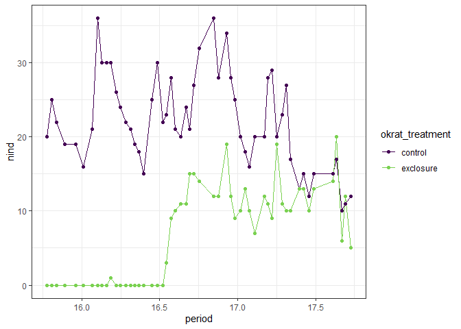<!-- -->

``` r
nind.gam <- gam(nind ~ okrat_treatment + s(period) + s(period, by = okrat_treatment), data = sg, family = poisson, method = "REML")

plot(nind.gam, pages= 1, scale = 0)
```

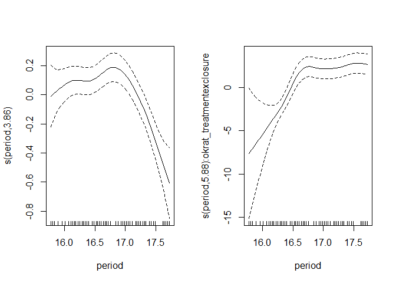<!-- -->

``` r
pdat <- as.data.frame(expand.grid(period = seq(min(sg$period), max(sg$period), length.out= 500), okrat_treatment = levels(sg$okrat_treatment)))

nind.predicted <- predict(nind.gam, newdata = pdat, type = "lpmatrix")
nind.link <- predict(nind.gam, newdata = pdat, type = "link", se.fit = T)

nind.predicted.vals <- nind.gam$family$linkinv(nind.predicted %*% coefficients(nind.gam))

pdat.pred <- pdat %>%
  mutate(predicted = nind.predicted.vals,
         link = nind.link$fit,
         se_link = nind.link$se.fit) %>%
  mutate(invlink_fit = nind.gam$family$linkinv(link),
         invlink_upper = nind.gam$family$linkinv(link + (2 * se_link)),
         invlink_lower = nind.gam$family$linkinv(link - (2 * se_link)),
         link_upper = link + (2 * se_link),
         link_lower = link - (2 * se_link))


ggplot(pdat.pred, aes(period, link, color= okrat_treatment)) +
  geom_line() +
  geom_ribbon(aes(period, ymin = link_lower, ymax = link_upper, fill = okrat_treatment), alpha = .5) +
  theme_bw() +
  scale_color_viridis_d(end = .8) +
  scale_fill_viridis_d(end = .8)
```

<!-- -->

``` r
ggplot(pdat.pred, aes(period, invlink_fit, color= okrat_treatment)) +
  geom_line() +
  geom_ribbon(aes(period, ymin = invlink_lower, ymax = invlink_upper, fill = okrat_treatment), alpha = .5) +
  theme_bw() +
  scale_color_viridis_d(end = .8) +
  scale_fill_viridis_d(end = .8)
```

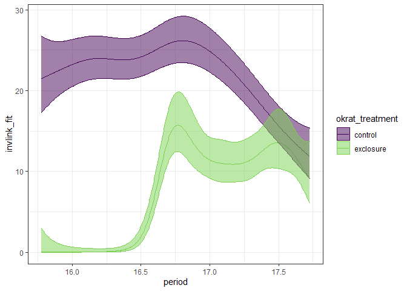<!-- -->

``` r
nind.diff.keeppar <- nind.predicted[1:500, ] - nind.predicted[501:1000, ]

nind.diff.vals <- nind.diff.keeppar %*% coef(nind.gam)


nind.diff.se<- sqrt(rowSums((nind.diff.keeppar %*% vcov(nind.gam, unconditional = FALSE)) * nind.diff.keeppar))

crit <- qnorm(.05/2, lower.tail = FALSE)
upr <- nind.diff.vals + (crit * nind.diff.se)
lwr <- nind.diff.vals - (crit * nind.diff.se)


pdat.diff <- pdat %>%
  select(period) %>%
  distinct()%>%
  mutate(fitted_dif = nind.diff.vals,
         upper= upr,
         lower = lwr) %>%
  mutate(diff_overlaps_zero = (upper * lower) < 0
  )

ggplot(pdat.diff, aes(period, fitted_dif)) +
  geom_line() +
  geom_ribbon(aes(period, ymin = lower, ymax = upper), alpha  = .5) +
  geom_hline(yintercept = 0) +
  geom_point(data = filter(pdat.diff, diff_overlaps_zero), aes(period, 1), color  = "red", size = 2) +
  theme_bw()
```

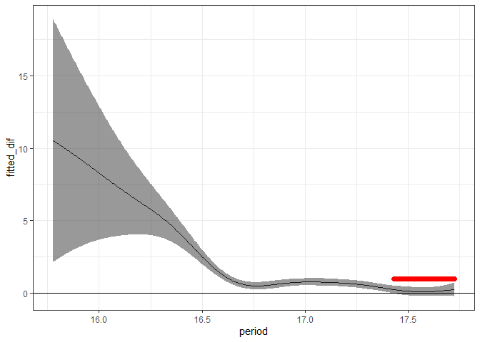<!-- -->

``` r
pdat.pred <- left_join(pdat.pred, select(pdat.diff, period, diff_overlaps_zero))
```

    ## Joining, by = "period"

``` r
ggplot(pdat.pred, aes(period, link, color= okrat_treatment)) +
  geom_line() +
  geom_ribbon(aes(period, ymin = link_lower, ymax = link_upper, fill = okrat_treatment), alpha = .5) +
  theme_bw() +
  scale_color_viridis_d(end = .8) +
  scale_fill_viridis_d(end = .8) +
  geom_point(data = filter(pdat.pred, diff_overlaps_zero), aes(period, 0), color = "red")
```

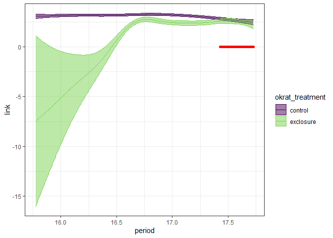<!-- -->

``` r
ggplot(pdat.pred, aes(period, invlink_fit, color= okrat_treatment)) +
  geom_line() +
  geom_ribbon(aes(period, ymin = invlink_lower, ymax = invlink_upper, fill = okrat_treatment), alpha = .5) +
  theme_bw() +
  scale_color_viridis_d(end = .8) +
  scale_fill_viridis_d(end = .8) +
  geom_point(data = filter(pdat.pred, diff_overlaps_zero), aes(period, 0), color = "red")
```

<!-- -->

# Total exclosure v control

``` r
smgran <- read.csv(here::here("lore", "2019_switch", "Data", "Dipo_counts.csv"))


rat_totals <- smgran %>%
  mutate(period = numericdate) %>%
  group_by(period, treatment) %>%
  summarize(nind = sum(n)) %>%
  filter(treatment %in% c("CC", "XC")) %>%
  rename(brown_trtmnt = treatment) %>%
  mutate(type = "sg")
```

    ## `summarise()` regrouping output by 'period' (override with `.groups` argument)

``` r
ggplot(filter(rat_totals, type != "other"), aes(period, nind, color = brown_trtmnt)) +
  geom_line() +
  geom_point()+
  theme_bw() +
  facet_wrap(vars(type), ncol = 1, scales = "free_y") +
  geom_hline(yintercept = 0) +
  scale_colour_viridis_d(end = .8)
```

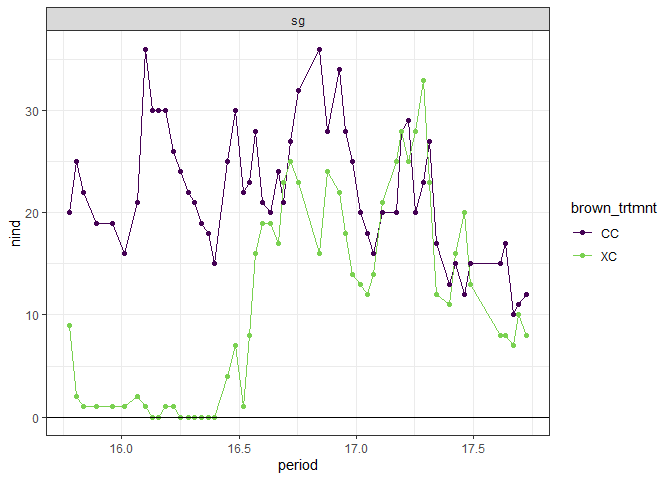<!-- -->

``` r
rat_totals <- rat_totals %>%
  mutate(krat_treatment = ifelse(brown_trtmnt == "CC", "control", "exclosure")) %>%
  mutate(okrat_treatment = ordered(krat_treatment))

sg <- filter(rat_totals, type == "sg")

ggplot(sg, aes(period, nind, color= okrat_treatment)) +
  geom_line() +
  geom_point() +
  theme_bw() +
  scale_color_viridis_d(end = .8)
```

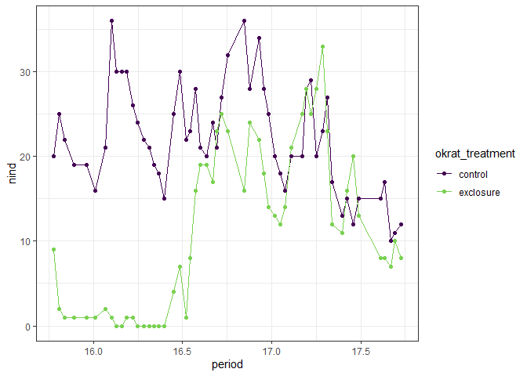<!-- -->

``` r
nind.gam <- gam(nind ~ okrat_treatment + s(period) + s(period, by = okrat_treatment), data = sg, family = poisson, method = "REML")

plot(nind.gam, pages= 1, scale = 0)
```

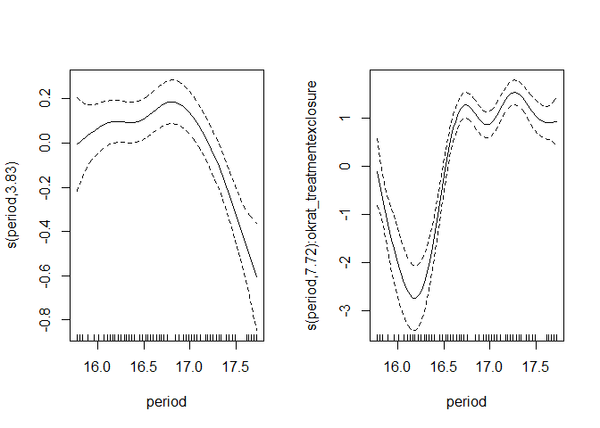<!-- -->

``` r
pdat <- as.data.frame(expand.grid(period = seq(min(sg$period), max(sg$period), length.out= 500), okrat_treatment = levels(sg$okrat_treatment)))

nind.predicted <- predict(nind.gam, newdata = pdat, type = "lpmatrix")
nind.link <- predict(nind.gam, newdata = pdat, type = "link", se.fit = T)

nind.predicted.vals <- nind.gam$family$linkinv(nind.predicted %*% coefficients(nind.gam))

pdat.pred <- pdat %>%
  mutate(predicted = nind.predicted.vals,
         link = nind.link$fit,
         se_link = nind.link$se.fit) %>%
  mutate(invlink_fit = nind.gam$family$linkinv(link),
         invlink_upper = nind.gam$family$linkinv(link + (2 * se_link)),
         invlink_lower = nind.gam$family$linkinv(link - (2 * se_link)),
         link_upper = link + (2 * se_link),
         link_lower = link - (2 * se_link))


ggplot(pdat.pred, aes(period, link, color= okrat_treatment)) +
  geom_line() +
  geom_ribbon(aes(period, ymin = link_lower, ymax = link_upper, fill = okrat_treatment), alpha = .5) +
  theme_bw() +
  scale_color_viridis_d(end = .8) +
  scale_fill_viridis_d(end = .8)
```

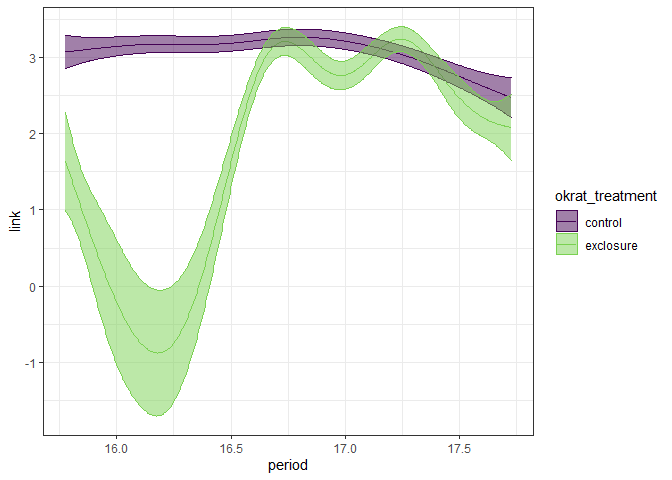<!-- -->

``` r
ggplot(pdat.pred, aes(period, invlink_fit, color= okrat_treatment)) +
  geom_line() +
  geom_ribbon(aes(period, ymin = invlink_lower, ymax = invlink_upper, fill = okrat_treatment), alpha = .5) +
  theme_bw() +
  scale_color_viridis_d(end = .8) +
  scale_fill_viridis_d(end = .8)
```

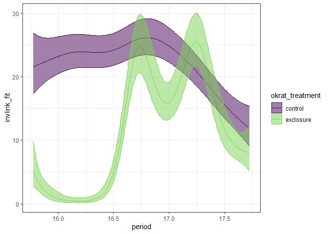<!-- -->

``` r
nind.diff.keeppar <- nind.predicted[1:500, ] - nind.predicted[501:1000, ]

nind.diff.vals <- nind.diff.keeppar %*% coef(nind.gam)


nind.diff.se<- sqrt(rowSums((nind.diff.keeppar %*% vcov(nind.gam, unconditional = FALSE)) * nind.diff.keeppar))

crit <- qnorm(.05/2, lower.tail = FALSE)
upr <- nind.diff.vals + (crit * nind.diff.se)
lwr <- nind.diff.vals - (crit * nind.diff.se)


pdat.diff <- pdat %>%
  select(period) %>%
  distinct()%>%
  mutate(fitted_dif = nind.diff.vals,
         upper= upr,
         lower = lwr) %>%
  mutate(diff_overlaps_zero = (upper * lower) < 0
  )

ggplot(pdat.diff, aes(period, fitted_dif)) +
  geom_line() +
  geom_ribbon(aes(period, ymin = lower, ymax = upper), alpha  = .5) +
  geom_hline(yintercept = 0) +
  geom_point(data = filter(pdat.diff, diff_overlaps_zero), aes(period, 1), color  = "red", size = 2) +
  theme_bw()
```

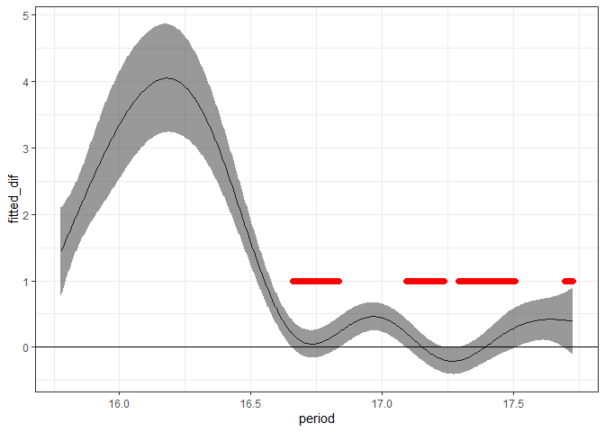<!-- -->

``` r
pdat.pred <- left_join(pdat.pred, select(pdat.diff, period, diff_overlaps_zero))
```

    ## Joining, by = "period"

``` r
ggplot(pdat.pred, aes(period, link, color= okrat_treatment)) +
  geom_line() +
  geom_ribbon(aes(period, ymin = link_lower, ymax = link_upper, fill = okrat_treatment), alpha = .5) +
  theme_bw() +
  scale_color_viridis_d(end = .8) +
  scale_fill_viridis_d(end = .8) +
  geom_point(data = filter(pdat.pred, diff_overlaps_zero), aes(period, 0), color = "red")
```

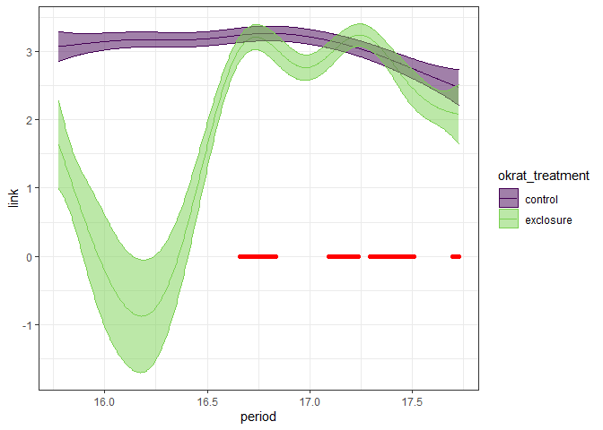<!-- -->

``` r
ggplot(pdat.pred, aes(period, invlink_fit, color= okrat_treatment)) +
  geom_line() +
  geom_ribbon(aes(period, ymin = invlink_lower, ymax = invlink_upper, fill = okrat_treatment), alpha = .5) +
  theme_bw() +
  scale_color_viridis_d(end = .8) +
  scale_fill_viridis_d(end = .8) +
  geom_point(data = filter(pdat.pred, diff_overlaps_zero), aes(period, 0), color = "red")
```

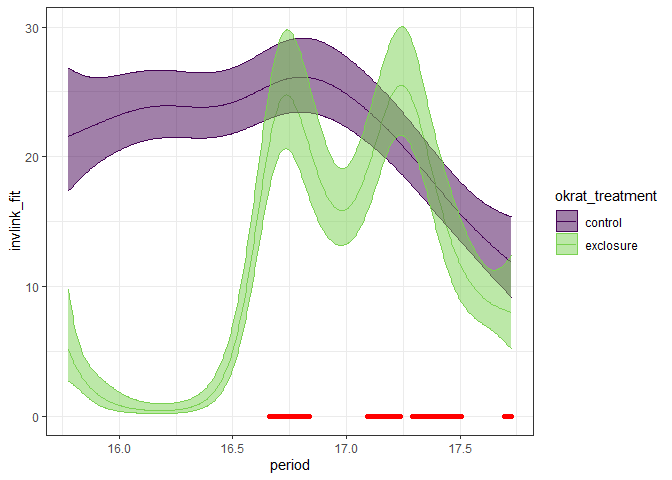<!-- -->
