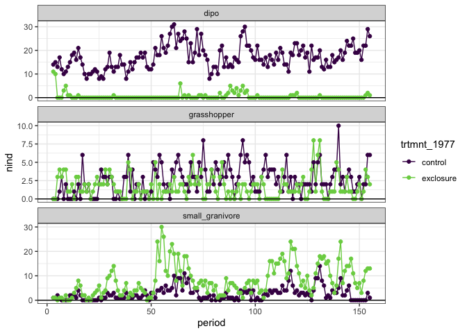
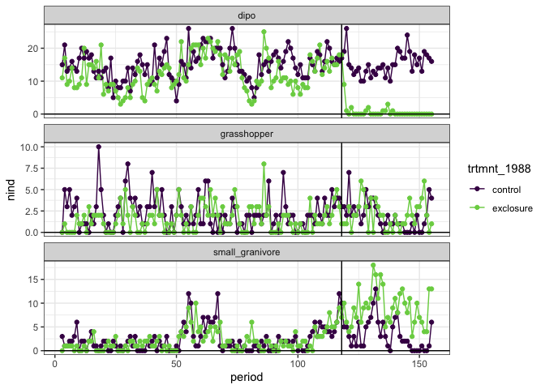
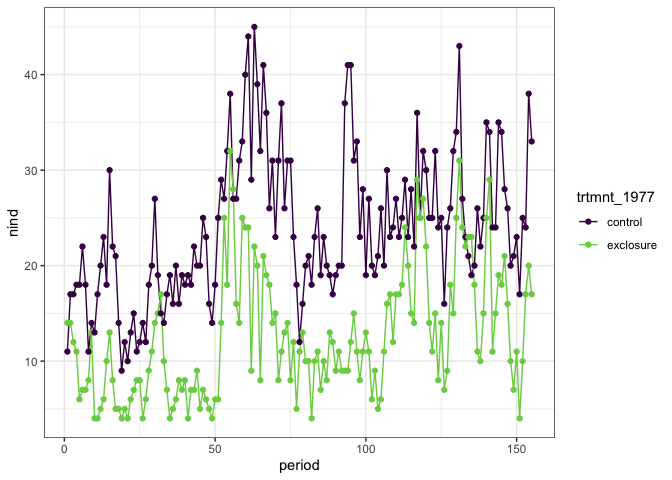
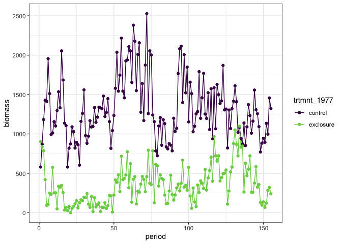
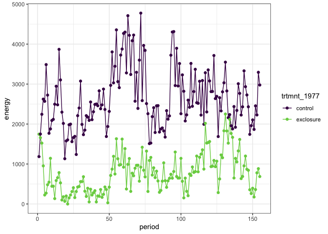
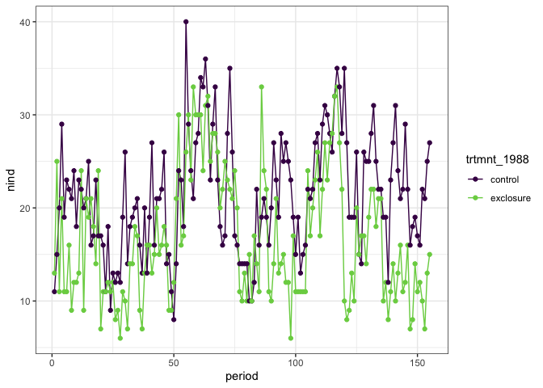
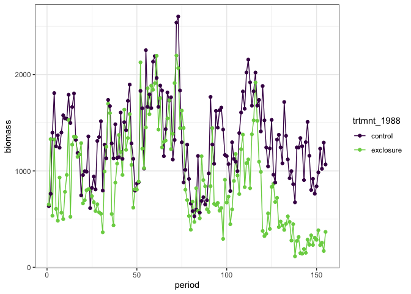
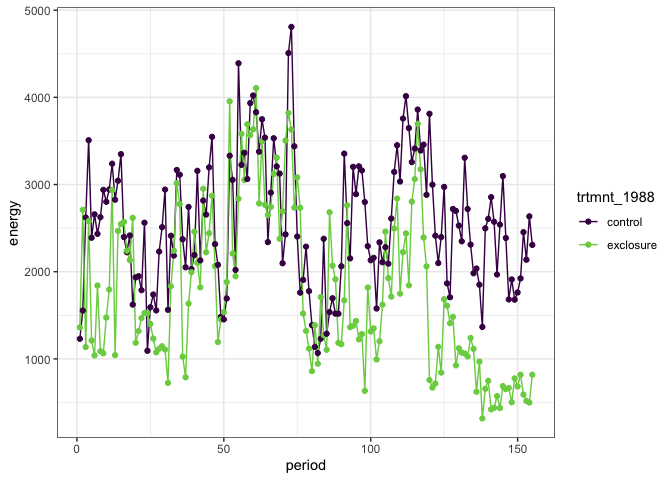

Plots from Heske, Brown, and Mistry 1994
================

<!-- --><!-- -->

    ## `summarise()` regrouping output by 'period' (override with `.groups` argument)

<!-- --><!-- --><!-- -->

    ## `summarise()` regrouping output by 'period' (override with `.groups` argument)

<!-- --><!-- --><!-- -->

Early on there was a *numerical* response in that there are *more small
granivores* on exclosures, but this doesn’t translate into anything like
compensation, in any currency, for the contributions of the missing
krats.
