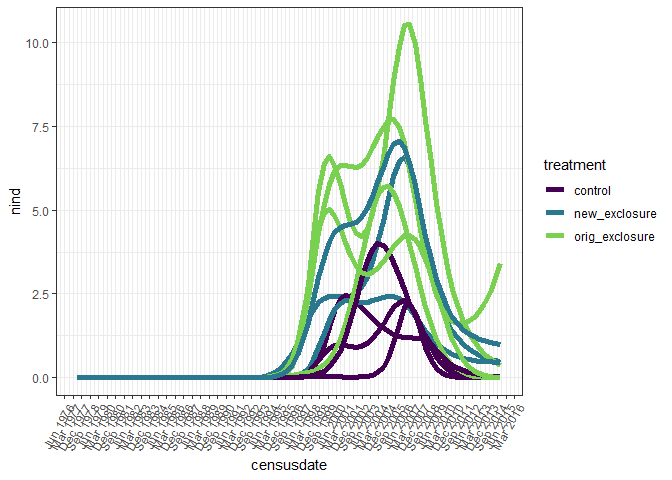
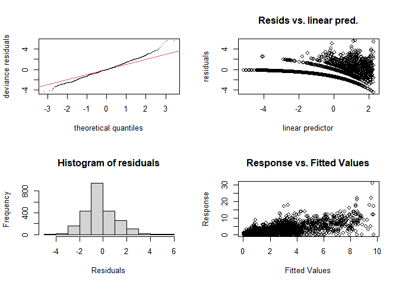
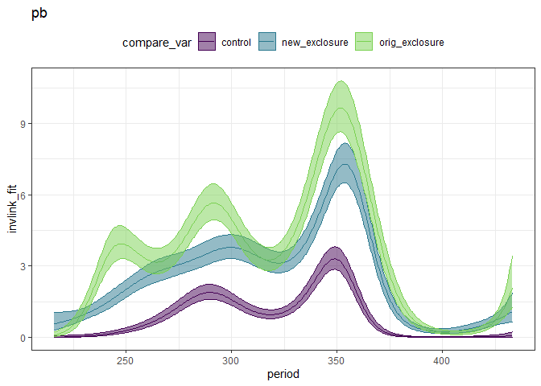
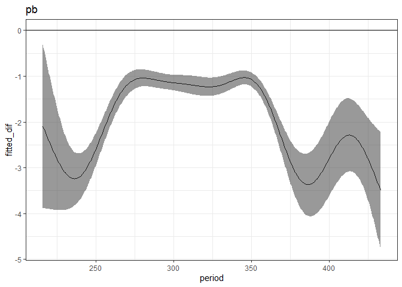
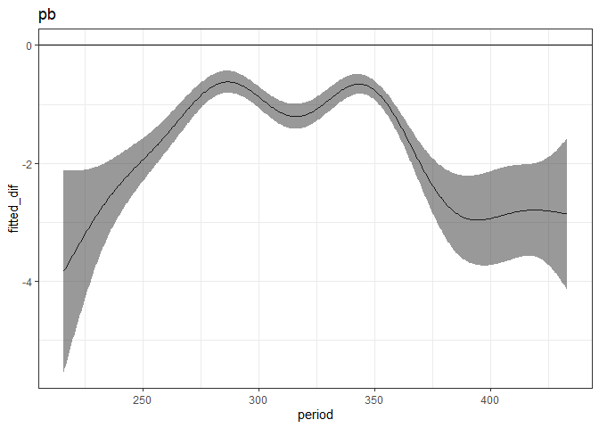

to 2015
================

``` r
rats <- read.csv(here::here("lore", "2020_redux", "2020_data_complete.csv"))
```

``` r
pb <- rats %>%
  filter(species == "PB") %>%
  select(period, censusdate, plot, treatment, energy) %>%
  group_by(period, censusdate, plot, treatment) %>%
  summarize(nind = dplyr::n(),
            energy = sum(energy)) %>%
  ungroup() %>%
  mutate(censusdate = as.Date(censusdate))
```

    ## `summarise()` regrouping output by 'period', 'censusdate', 'plot' (override with `.groups` argument)

``` r
pb_all_periods <- expand.grid(period = unique(rats$period),
                              plot = unique(rats$plot)) %>%
  left_join(distinct(select(rats, period, censusdate))) %>%
  left_join(distinct(select(rats, plot, treatment))) %>%
  mutate(censusdate = as.Date(censusdate)) %>%
  left_join(pb) %>%
  mutate(energy = ifelse(is.na(energy), 0, energy),
         nind = ifelse(is.na(nind), 0, nind))
```

    ## Joining, by = "period"

    ## Joining, by = "plot"

    ## Joining, by = c("period", "plot", "censusdate", "treatment")

``` r
ggplot(filter(pb_all_periods), aes(censusdate, nind, group = plot, color = treatment)) +
  geom_smooth(method = "gam", se = F, size = 2, method.args = list(family = "poisson")) +
  #geom_line()+
  theme_bw() +
  scale_color_viridis_d(end = .8) +
  scale_x_date(date_breaks = "9 month", date_labels =  "%b %Y") +
  theme(axis.text.x=element_text(angle=60, hjust=1))
```

    ## `geom_smooth()` using formula 'y ~ s(x, bs = "cs")'

<!-- -->

``` r
library(mgcv)
```

    ## Warning: package 'mgcv' was built under R version 4.0.3

    ## Loading required package: nlme

    ## 
    ## Attaching package: 'nlme'

    ## The following object is masked from 'package:dplyr':
    ## 
    ##     collapse

    ## This is mgcv 1.8-33. For overview type 'help("mgcv-package")'.

``` r
source(here::here("lore", "1994_longterm", "gams_fxns_generalized.R"))

pb_all_periods <- pb_all_periods %>%
  mutate(oplot = ordered(plot, levels = c(4,2,3,8,11,14,15,17,18,21,22)),
         treatment = as.ordered(treatment)) %>%
  as.data.frame() %>%
  filter(period > 215)

pb.mod <- gam(nind ~  treatment + s(period) + s(period, by = treatment) + plot + s(period, by = plot), family = "poisson", data  = pb_all_periods, method = "REML")

gam.check(pb.mod)
```

<!-- -->

    ## 
    ## Method: REML   Optimizer: outer newton
    ## full convergence after 7 iterations.
    ## Gradient range [-1.817038e-06,1.763517e-05]
    ## (score 4212.826 & scale 1).
    ## Hessian positive definite, eigenvalue range [1.953826,3.610829].
    ## Model rank =  40 / 41 
    ## 
    ## Basis dimension (k) checking results. Low p-value (k-index<1) may
    ## indicate that k is too low, especially if edf is close to k'.
    ## 
    ##                                      k'   edf k-index p-value    
    ## s(period)                          9.00  8.46    0.72  <2e-16 ***
    ## s(period):treatmentnew_exclosure   9.00  7.40    0.72  <2e-16 ***
    ## s(period):treatmentorig_exclosure  9.00  8.40    0.72  <2e-16 ***
    ## s(period):plot                    10.00  8.64    0.72  <2e-16 ***
    ## ---
    ## Signif. codes:  0 '***' 0.001 '**' 0.01 '*' 0.05 '.' 0.1 ' ' 1

``` r
pb.pdat <- make_pdat(pb_all_periods, include_plot = T)

pb.pdat <- pb.pdat %>%
  mutate(type = "pb",
         plot = 4)

pb.pred <- get_predicted_vals(pb.mod, pb.pdat)

plot_fitted_pred(pb.pred)
```

<!-- -->

``` r
ctrl_v_orig <- get_exclosure_diff(pb.mod, pb.pdat, comparison_level = 3)

plot_exclosure_diff(ctrl_v_orig)
```

<!-- -->

``` r
ctrl_v_new <- get_exclosure_diff(pb.mod, pb.pdat)

plot_exclosure_diff(ctrl_v_new)
```

<!-- -->
