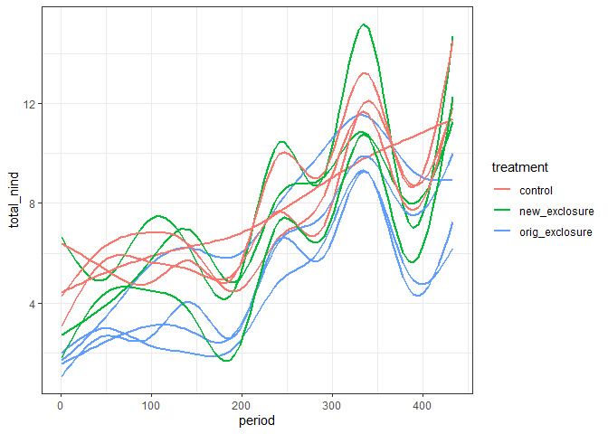
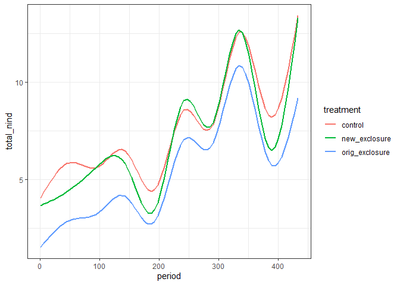
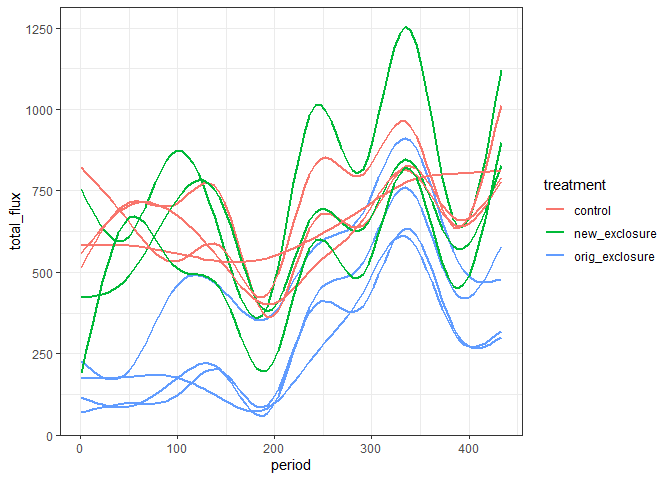
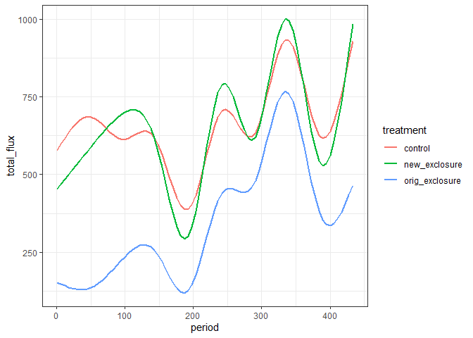
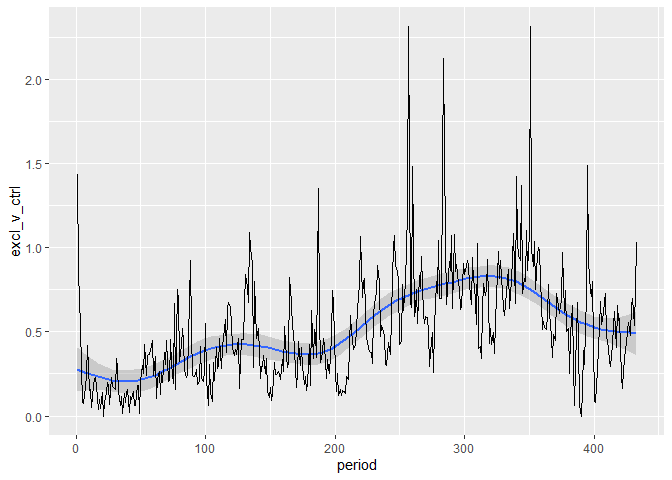
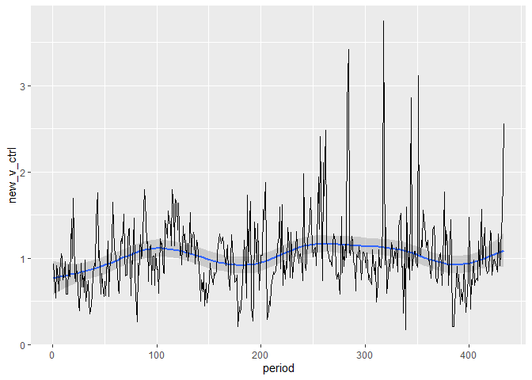

to 2015
================

``` r
rats <- read.csv(here::here("lore", "2020_redux", "2020_data_complete.csv"))
```

``` r
rats_types_totals <- rats %>%
  mutate(plot = factor(plot),
         treatment = factor(treatment)) %>%
  #mutate(plot = as.ordered(plot),
 #        treatment = as.ordered(treatment)) %>%
  select(period, treatment, type, plot, energy) %>%
  group_by(period, treatment, type, plot) %>%
  summarize(nind = dplyr::n(),
            totale = round(sum(energy)))  %>%
  ungroup() %>%
  group_by(plot, period) %>%
  mutate(total_nind = sum(nind),
         total_flux = sum(totale)) %>%
  ungroup()
```

    ## `summarise()` regrouping output by 'period', 'treatment', 'type' (override with `.groups` argument)

``` r
sv <- rats_types_totals %>%
  select(plot, period, treatment, total_nind, total_flux) %>%
  distinct()%>%
  mutate(total_nind = ifelse(is.na(total_nind), 0, total_nind),
         total_flux = ifelse(is.na(total_flux), 0, total_flux))


sv_all <- expand.grid(plot = unique(sv$plot), period = unique(sv$period)) %>%
  left_join(select(sv, plot, period, treatment)) %>%
  left_join(sv) %>%
  mutate(total_nind = ifelse(is.na(total_nind), 0, total_nind),
         total_flux = ifelse(is.na(total_flux), 0, total_flux))
```

    ## Joining, by = c("plot", "period")

    ## Joining, by = c("plot", "period", "treatment")

``` r
ggplot(sv, aes(period, total_nind, color = treatment, group = plot)) +
  geom_smooth(method = "gam", se = F) +
  theme_bw()
```

    ## `geom_smooth()` using formula 'y ~ s(x, bs = "cs")'

<!-- -->

``` r
ggplot(sv, aes(period, total_nind, color = treatment)) +
  geom_smooth(method = "gam", se = F) +
  theme_bw()
```

    ## `geom_smooth()` using formula 'y ~ s(x, bs = "cs")'

<!-- -->

``` r
ggplot(sv, aes(period, total_flux, color = treatment, group = plot)) +
  geom_smooth(method = "gam", se = F) +
  theme_bw()
```

    ## `geom_smooth()` using formula 'y ~ s(x, bs = "cs")'

<!-- -->

``` r
ggplot(sv, aes(period, total_flux, color = treatment)) +
  geom_smooth(method = "gam", se = F) +
  theme_bw()
```

    ## `geom_smooth()` using formula 'y ~ s(x, bs = "cs")'

<!-- -->

``` r
sv_wide <- sv %>%
  group_by(period,treatment) %>%
  summarize( mean_flux = mean(total_flux)) %>%
  ungroup() %>%
  tidyr::pivot_wider(names_from = treatment, values_from = mean_flux, values_fill = 0) %>%
  mutate(excl_v_ctrl = orig_exclosure/control,
         new_v_ctrl = new_exclosure/control)
```

    ## `summarise()` regrouping output by 'period' (override with `.groups` argument)

``` r
ggplot(sv_wide, aes(period, excl_v_ctrl)) +
  geom_smooth(method = "gam") +
  geom_line()
```

    ## `geom_smooth()` using formula 'y ~ s(x, bs = "cs")'

<!-- -->

``` r
ggplot(sv_wide, aes(period, new_v_ctrl)) +
  geom_smooth(method = "gam") +
  geom_line()
```

    ## `geom_smooth()` using formula 'y ~ s(x, bs = "cs")'

<!-- -->
