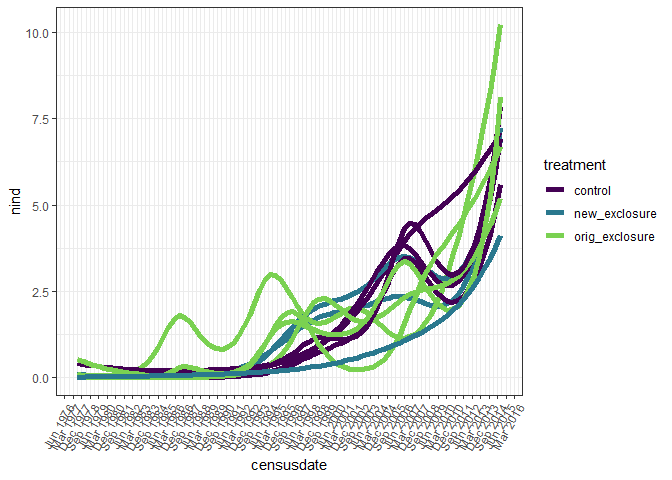
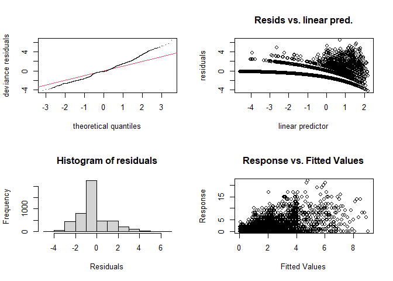
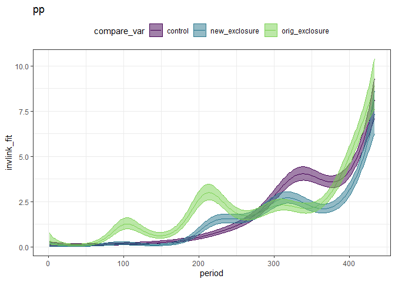
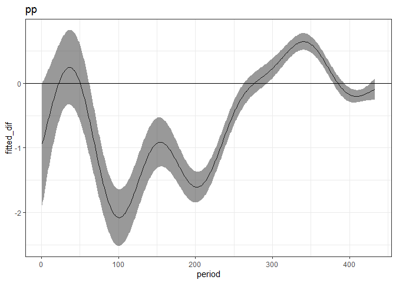
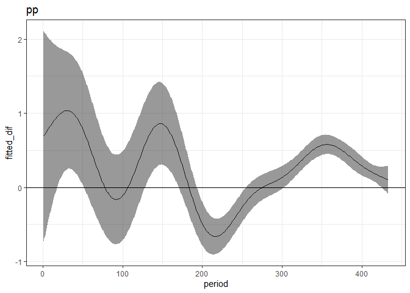

to 2015
================

``` r
rats <- read.csv(here::here("lore", "2020_redux", "2020_data_complete.csv"))
```

``` r
pp <- rats %>%
  filter(species == "PP") %>%
  select(period, censusdate, plot, treatment, energy) %>%
  group_by(period, censusdate, plot, treatment) %>%
  summarize(nind = dplyr::n(),
            energy = sum(energy)) %>%
  ungroup() %>%
  mutate(censusdate = as.Date(censusdate))
```

    ## `summarise()` regrouping output by 'period', 'censusdate', 'plot' (override with `.groups` argument)

``` r
pp_all_periods <- expand.grid(period = unique(rats$period),
                              plot = unique(rats$plot)) %>%
  left_join(distinct(select(rats, period, censusdate))) %>%
  left_join(distinct(select(rats, plot, treatment))) %>%
  mutate(censusdate = as.Date(censusdate)) %>%
  left_join(pp) %>%
  mutate(energy = ifelse(is.na(energy), 0, energy),
         nind = ifelse(is.na(nind), 0, nind))
```

    ## Joining, by = "period"

    ## Joining, by = "plot"

    ## Joining, by = c("period", "plot", "censusdate", "treatment")

``` r
ggplot(filter(pp_all_periods), aes(censusdate, nind, group = plot, color = treatment)) +
  geom_smooth(method = "gam", se = F, size = 2, method.args = list(family = "poisson")) +
  #geom_line()+
  theme_bw() +
  scale_color_viridis_d(end = .8) +
  scale_x_date(date_breaks = "9 month", date_labels =  "%b %Y") +
  theme(axis.text.x=element_text(angle=60, hjust=1))
```

    ## `geom_smooth()` using formula 'y ~ s(x, bs = "cs")'

<!-- -->

``` r
library(mgcv)
```

    ## Warning: package 'mgcv' was built under R version 4.0.3

    ## Loading required package: nlme

    ## 
    ## Attaching package: 'nlme'

    ## The following object is masked from 'package:dplyr':
    ## 
    ##     collapse

    ## This is mgcv 1.8-33. For overview type 'help("mgcv-package")'.

``` r
source(here::here("lore", "1994_longterm", "gams_fxns_generalized.R"))

pp_all_periods <- pp_all_periods %>%
  mutate(oplot = ordered(plot, levels = c(4,2,3,8,11,14,15,17,18,21,22)),
         treatment = as.ordered(treatment)) %>%
  as.data.frame() 

pp.mod <- gam(nind ~  treatment + s(period) + s(period, by = treatment) + plot + s(period, by = plot), family = "poisson", data  = pp_all_periods, method = "REML")

gam.check(pp.mod)
```

<!-- -->

    ## 
    ## Method: REML   Optimizer: outer newton
    ## full convergence after 7 iterations.
    ## Gradient range [-2.435115e-06,1.370418e-06]
    ## (score 7419.193 & scale 1).
    ## Hessian positive definite, eigenvalue range [1.296219,3.074111].
    ## Model rank =  40 / 41 
    ## 
    ## Basis dimension (k) checking results. Low p-value (k-index<1) may
    ## indicate that k is too low, especially if edf is close to k'.
    ## 
    ##                                      k'   edf k-index p-value    
    ## s(period)                          9.00  6.57    0.41  <2e-16 ***
    ## s(period):treatmentnew_exclosure   9.00  8.11    0.41  <2e-16 ***
    ## s(period):treatmentorig_exclosure  9.00  8.71    0.41  <2e-16 ***
    ## s(period):plot                    10.00  8.66    0.41  <2e-16 ***
    ## ---
    ## Signif. codes:  0 '***' 0.001 '**' 0.01 '*' 0.05 '.' 0.1 ' ' 1

``` r
pp.pdat <- make_pdat(pp_all_periods, include_plot = T)

pp.pdat <- pp.pdat %>%
  mutate(type = "pp",
         plot = 4)

pp.pred <- get_predicted_vals(pp.mod, pp.pdat)

plot_fitted_pred(pp.pred)
```

<!-- -->

``` r
ctrl_v_orig <- get_exclosure_diff(pp.mod, pp.pdat, comparison_level = 3)

plot_exclosure_diff(ctrl_v_orig)
```

<!-- -->

``` r
ctrl_v_new <- get_exclosure_diff(pp.mod, pp.pdat)

plot_exclosure_diff(ctrl_v_new)
```

<!-- -->

pps like to be where bailey’s are not???

pps preferred to be where krats are not in the 100s, but recently they
are more eually abundant in exclosures and controls.

something is different about the new exclosures? n = 3 bailey’s also
seemed to like those better

these gams, as mentioned, are trash. don’t overinterpret them.

weird playing field:

  - controls and exclosures similar
  - bailey’s on new exclosures closer to exclosure

removing krats could

  - release **bailey’s** possibly causing pp to go down
  - release **pps** - partially, bailey’s is on the decline
  - not really have an effect?
      - pps seem not to mind??? the presence of krats on the controls.
        or it nets out, because the exclosures have bailey’s? but
        bailey’s is not that abundant, is it?
      - krats are more scarce now
      - pbs could have some kind of incumbency on new exclosures giving
        them a lifeline
  - whole site has become shrubbier, possibly pp friendly
  - limit on pp may not be krats (krats might be using diff resources)
  - funny sense of mediation thru pb?
      - krat removal –\> more pb –\> bad for pp
  - pbs are biggest smgran, may –\> weakest numerical effect (altho we
    aren’t looking at such large numbers that it probably matters)

site - habitat/resource characteristics - have drifted. possibly
favoring smgran, esp pp. maybe a shift, from nibbling on krat’s table
crumbs –\> having an established home of their own (no idea how this
computes in more rigorous framing; idea is just that given the habitat
shift pp are no longer as sensitive to competition from krats somehow?)

pb has entered the system (and started to exit)

how have veg differences between the plots shifted over time? have they
become more similar since the 90s? part of the shrub takeover?

**pps** could have some kind of incumbency on the new exclosures,
protecting them from an increase in pb? in the 90s, pb arrival coincided
suspiciously with declines in even relatively large pp abundances.

on exclosures, pps are more abundant now than they were prior to pb
arrival. (ditto on controls, kind of on new\_exclosures.)

what response variables make sense, now?
