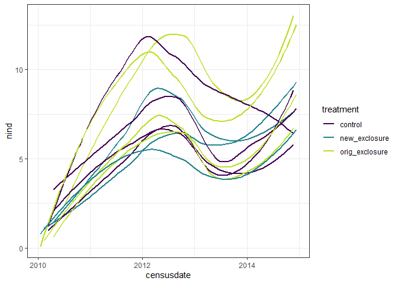
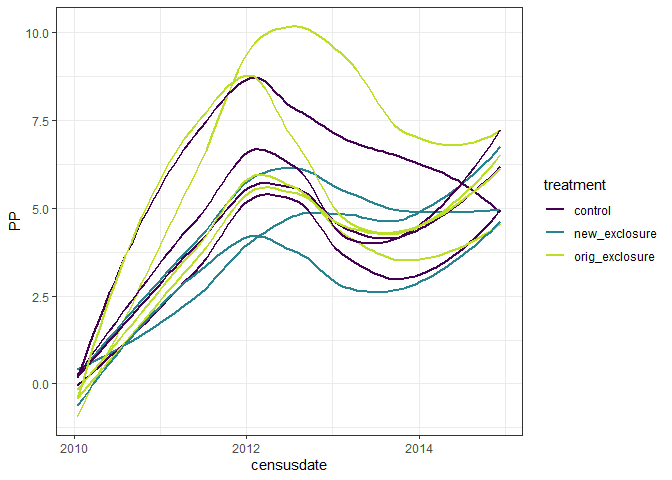
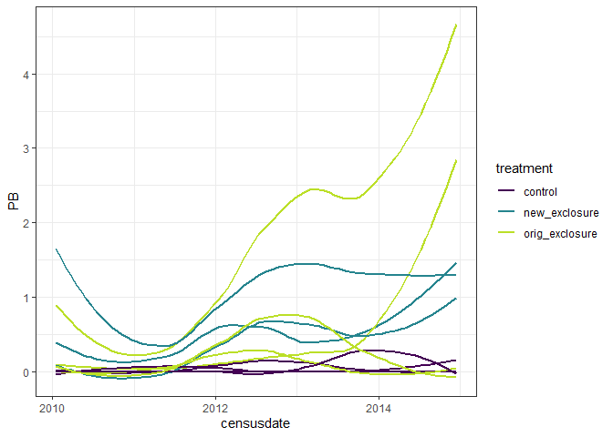

to 2015
================

``` r
rats <- read.csv(here::here("lore", "2020_redux", "2020_data_complete.csv")) %>%
  mutate(censusdate = as.Date(censusdate)) %>%
  filter(censusdate >= "2010-01-01")
```

``` r
rat_type_totals <- rats %>%
  group_by(plot, period, censusdate, treatment, type) %>%
  summarize(nind = dplyr::n()) %>%
  ungroup()
```

    ## `summarise()` regrouping output by 'plot', 'period', 'censusdate', 'treatment' (override with `.groups` argument)

``` r
ggplot(filter(rat_type_totals, type == "small_granivore"), aes(censusdate, nind, group = plot, color = treatment)) +
  geom_smooth(method = "loess", se = F) +
  theme_bw() +
  scale_color_viridis_d(end = .9)
```

    ## `geom_smooth()` using formula 'y ~ x'

<!-- -->

``` r
rat_species_totals <- rats %>%
  mutate(species = ifelse(is.na(species), "NA", species)) %>%
  group_by(plot, period, censusdate, treatment, species) %>%
  summarize(nind = dplyr::n()) %>%
  ungroup() %>%
  tidyr::pivot_wider(names_from = species, values_from = nind, values_fill = 0)
```

    ## `summarise()` regrouping output by 'plot', 'period', 'censusdate', 'treatment' (override with `.groups` argument)

``` r
ggplot((rat_species_totals), aes(censusdate, PP, group = plot, color = treatment)) +
  geom_smooth(method = "loess", se = F) +
  theme_bw() +
  scale_color_viridis_d(end = .9)
```

    ## `geom_smooth()` using formula 'y ~ x'

<!-- -->

``` r
ggplot((rat_species_totals), aes(censusdate, PB, group = plot, color = treatment)) +
  geom_smooth(method = "loess", se = F) +
  theme_bw() +
  scale_color_viridis_d(end = .9)
```

    ## `geom_smooth()` using formula 'y ~ x'

<!-- -->

``` r
pp <- rat_species_totals %>%
  select(period, plot, treatment, PP) %>%
  rename(nind = PP) %>%
  mutate(treatment = ordered(treatment, levels = c("control", "new_exclosure", "orig_exclosure")),
         oplot = ordered(plot, levels = c(4,2,3,8,11,14,15,17,18,21,22)),
         type = "small_granivore") %>%
  as.data.frame()

library(mgcv)
```

    ## Warning: package 'mgcv' was built under R version 4.0.3

    ## Loading required package: nlme

    ## 
    ## Attaching package: 'nlme'

    ## The following object is masked from 'package:dplyr':
    ## 
    ##     collapse

    ## This is mgcv 1.8-33. For overview type 'help("mgcv-package")'.

``` r
source(here::here("lore", "1994_longterm", "gams_fxns_generalized.R"))

#pp.mod <- gam(nind ~  treatment + s(period, k = 70) + s(period, by = treatment, k = 70), family = "poisson", data  = pp)

#pp.mod <- gam(nind ~  treatment + s(period, k = 20) + s(period, by = treatment, k = 20) + oplot + s(period, by = oplot), family = "poisson", data  = pp)

pp.mod <- gam(nind ~  treatment + s(period, k = 20) + s(period, by = treatment, k = 20), family = "poisson", data  = pp)

summary(pp.mod)
```

    ## 
    ## Family: poisson 
    ## Link function: log 
    ## 
    ## Formula:
    ## nind ~ treatment + s(period, k = 20) + s(period, by = treatment, 
    ##     k = 20)
    ## 
    ## Parametric coefficients:
    ##             Estimate Std. Error z value Pr(>|z|)    
    ## (Intercept)  0.91314    0.04073  22.420  < 2e-16 ***
    ## treatment.L  0.04200    0.03421   1.228     0.22    
    ## treatment.Q  0.22955    0.04092   5.609 2.04e-08 ***
    ## ---
    ## Signif. codes:  0 '***' 0.001 '**' 0.01 '*' 0.05 '.' 0.1 ' ' 1
    ## 
    ## Approximate significance of smooth terms:
    ##                                      edf Ref.df   Chi.sq p-value    
    ## s(period)                         18.906  19.00 1142.898  <2e-16 ***
    ## s(period):treatmentnew_exclosure   1.000   1.00    5.781  0.0162 *  
    ## s(period):treatmentorig_exclosure  1.889   2.36    1.843  0.5518    
    ## ---
    ## Signif. codes:  0 '***' 0.001 '**' 0.01 '*' 0.05 '.' 0.1 ' ' 1
    ## 
    ## R-sq.(adj) =  0.662   Deviance explained = 69.2%
    ## UBRE = 0.6225  Scale est. = 1         n = 583

``` r
gam.check(pp.mod)
```

<!-- -->

    ## 
    ## Method: UBRE   Optimizer: outer newton
    ## full convergence after 12 iterations.
    ## Gradient range [-5.260027e-07,4.167483e-08]
    ## (score 0.6225047 & scale 1).
    ## Hessian positive definite, eigenvalue range [5.258458e-07,0.0003800914].
    ## Model rank =  60 / 60 
    ## 
    ## Basis dimension (k) checking results. Low p-value (k-index<1) may
    ## indicate that k is too low, especially if edf is close to k'.
    ## 
    ##                                      k'   edf k-index p-value    
    ## s(period)                         19.00 18.91    0.65  <2e-16 ***
    ## s(period):treatmentnew_exclosure  19.00  1.00    0.65  <2e-16 ***
    ## s(period):treatmentorig_exclosure 19.00  1.89    0.65  <2e-16 ***
    ## ---
    ## Signif. codes:  0 '***' 0.001 '**' 0.01 '*' 0.05 '.' 0.1 ' ' 1

``` r
#pp.pdat <- make_pdat(pp, include_plot = T) 

pp.pdat <- make_pdat(pp, include_plot = F) 

pp.pred <- get_predicted_vals(pp.mod, pp.pdat)

plot_fitted_pred(pp.pred)# + facet_wrap(vars(compare_var), scales = "free_y")
```

<!-- -->

``` r
ctrl_v_orig <- get_exclosure_diff(pp.mod, pp.pdat, comparison_level = 3)

plot_exclosure_diff(ctrl_v_orig)
```

<!-- -->

``` r
pp.origdiff <- add_exclosure_diff(pp.pred, ctrl_v_orig)
```

    ## Joining, by = "period"

``` r
plot_fitted_pred(filter(pp.origdiff, treatment != "new_exclosure"))
```

<!-- -->

``` r
ctrl_v_new <- get_exclosure_diff(pp.mod, pp.pdat)

plot_exclosure_diff(ctrl_v_new)
```

<!-- -->

``` r
pp.newdiff <- add_exclosure_diff(pp.pred, ctrl_v_new)
```

    ## Joining, by = "period"

``` r
plot_fitted_pred(filter(pp.newdiff, treatment != "orig_exclosure"))
```

<!-- -->
