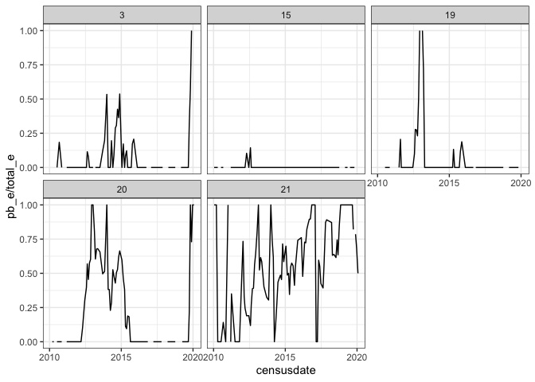
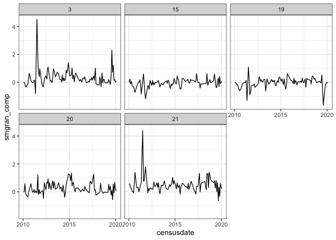
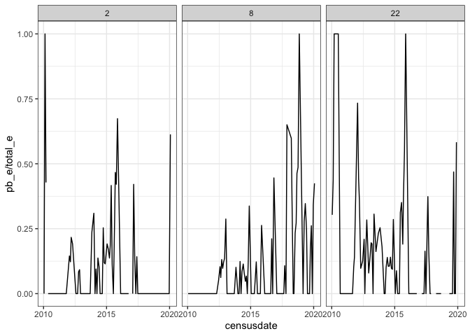
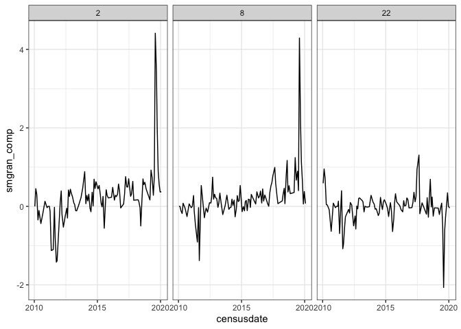

plot level compensation
================

``` r
tms <- get_treatment_means()
```

    ## Loading in data version 2.95.0

    ## Joining, by = "plot"

``` r
ctrls <- filter(tms, oplottype == "CC") %>%
  select(period, smgran_e, total_e, dipo_e) %>%
  rename(smgran_e_c = smgran_e,
         total_e_c = total_e,
         dipo_e_c = dipo_e)


plotl <- get_plot_totals() 
```

    ## Loading in data version 2.95.0
    ## Joining, by = "plot"

``` r
plotl_comp <- left_join(plotl, ctrls) %>%
  mutate(smgran_increase = smgran_e - smgran_e_c) %>%
  mutate(smgran_comp = smgran_increase / dipo_e_c) %>%
  group_by(fplot) %>%
  mutate(smgran_comp_ma = maopts(smgran_comp))
```

    ## Joining, by = "period"

``` r
ggplot(filter(plotl_comp, oplottype == "EE", as.numeric(oera) > 2), aes(censusdate, pb_e / total_e)) +
  facet_wrap(vars(plot)) +
  geom_line()
```

    ## Warning: Removed 5 row(s) containing missing values (geom_path).

<!-- -->

``` r
ggplot(filter(plotl_comp, oplottype == "EE", as.numeric(oera) > 2), aes(censusdate, smgran_comp)) +
  facet_wrap(vars(plot)) +
  geom_line()
```

<!-- -->

``` r
ggplot(filter(plotl_comp, oplottype == "CE", as.numeric(oera) > 2), aes(censusdate, pb_e/ total_e)) +
  facet_wrap(vars(plot)) +
  geom_line()
```

    ## Warning: Removed 2 row(s) containing missing values (geom_path).

<!-- -->

``` r
ggplot(filter(plotl_comp, oplottype == "CE", as.numeric(oera) > 2), aes(censusdate, smgran_comp)) +
  facet_wrap(vars(plot)) +
  geom_line()
```

<!-- -->
