1981 analysis with GAMs
================

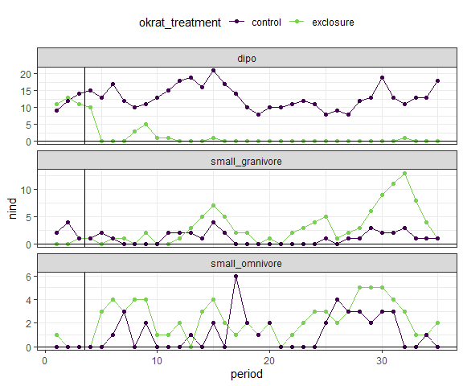<!-- -->

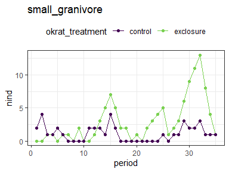<!-- -->

    ## 
    ## Family: poisson 
    ## Link function: log 
    ## 
    ## Formula:
    ## nind ~ okrat_treatment + s(period) + s(period, by = okrat_treatment)
    ## 
    ## Parametric coefficients:
    ##                   Estimate Std. Error z value Pr(>|z|)    
    ## (Intercept)         0.2488     0.1201   2.073 0.038204 *  
    ## okrat_treatment.L   0.5028     0.1526   3.295 0.000983 ***
    ## ---
    ## Signif. codes:  0 '***' 0.001 '**' 0.01 '*' 0.05 '.' 0.1 ' ' 1
    ## 
    ## Approximate significance of smooth terms:
    ##                                      edf Ref.df Chi.sq  p-value    
    ## s(period)                          7.858  8.633  49.28  < 2e-16 ***
    ## s(period):okrat_treatmentexclosure 2.302  2.845  15.45 0.000912 ***
    ## ---
    ## Signif. codes:  0 '***' 0.001 '**' 0.01 '*' 0.05 '.' 0.1 ' ' 1
    ## 
    ## R-sq.(adj) =  0.869   Deviance explained = 76.8%
    ## -REML = 111.42  Scale est. = 1         n = 70

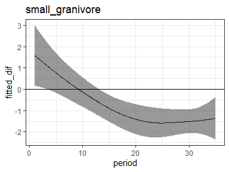<!-- -->

    ## Joining, by = "period"

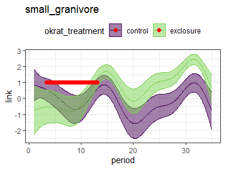<!-- -->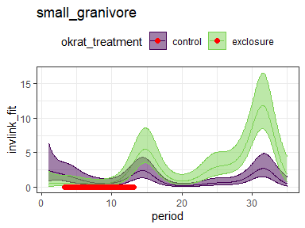<!-- -->

The small granivore timeseries start out separate (before the treatments
are even implemented). Later they diverge starting around period 13 and
do not come back together.

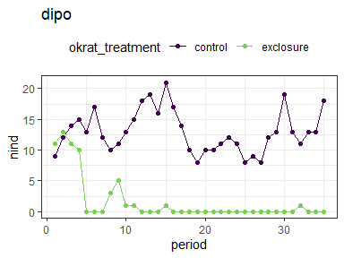<!-- -->

    ## 
    ## Family: poisson 
    ## Link function: log 
    ## 
    ## Formula:
    ## nind ~ okrat_treatment + s(period) + s(period, by = okrat_treatment)
    ## 
    ## Parametric coefficients:
    ##                   Estimate Std. Error z value Pr(>|z|)    
    ## (Intercept)         0.6310     0.2612   2.416   0.0157 *  
    ## okrat_treatment.L  -2.7244     0.3692  -7.379 1.59e-13 ***
    ## ---
    ## Signif. codes:  0 '***' 0.001 '**' 0.01 '*' 0.05 '.' 0.1 ' ' 1
    ## 
    ## Approximate significance of smooth terms:
    ##                                      edf Ref.df Chi.sq p-value    
    ## s(period)                          3.799  4.699  9.375  0.0993 .  
    ## s(period):okrat_treatmentexclosure 2.047  2.550 61.013  <2e-16 ***
    ## ---
    ## Signif. codes:  0 '***' 0.001 '**' 0.01 '*' 0.05 '.' 0.1 ' ' 1
    ## 
    ## R-sq.(adj) =   0.88   Deviance explained = 89.3%
    ## -REML = 134.78  Scale est. = 1         n = 70

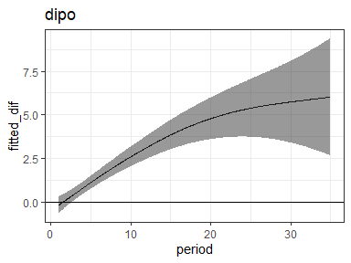<!-- -->

    ## Joining, by = "period"

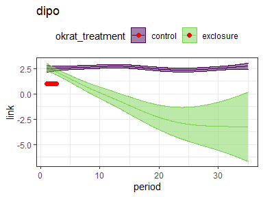<!-- -->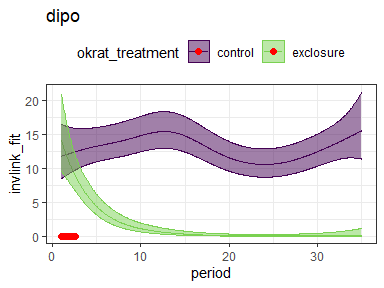<!-- -->

The dipo timeseries diverge starting around period 2 and do not come
back together.

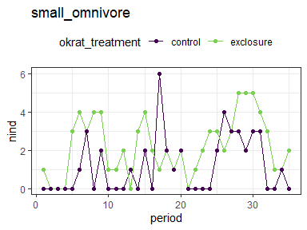<!-- -->

    ## 
    ## Family: poisson 
    ## Link function: log 
    ## 
    ## Formula:
    ## nind ~ okrat_treatment + s(period) + s(period, by = okrat_treatment)
    ## 
    ## Parametric coefficients:
    ##                   Estimate Std. Error z value Pr(>|z|)    
    ## (Intercept)         0.2536     0.1237   2.051 0.040305 *  
    ## okrat_treatment.L   0.5350     0.1523   3.513 0.000442 ***
    ## ---
    ## Signif. codes:  0 '***' 0.001 '**' 0.01 '*' 0.05 '.' 0.1 ' ' 1
    ## 
    ## Approximate significance of smooth terms:
    ##                                      edf Ref.df Chi.sq  p-value    
    ## s(period)                          7.006  8.055 31.251 0.000137 ***
    ## s(period):okrat_treatmentexclosure 2.015  2.527  2.801 0.298716    
    ## ---
    ## Signif. codes:  0 '***' 0.001 '**' 0.01 '*' 0.05 '.' 0.1 ' ' 1
    ## 
    ## R-sq.(adj) =   0.51   Deviance explained = 50.4%
    ## -REML = 112.88  Scale est. = 1         n = 70

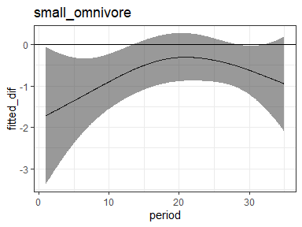<!-- -->

    ## Joining, by = "period"

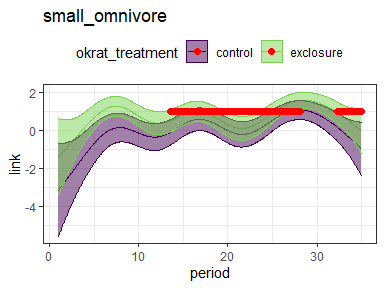<!-- -->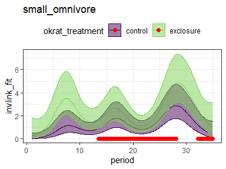<!-- -->

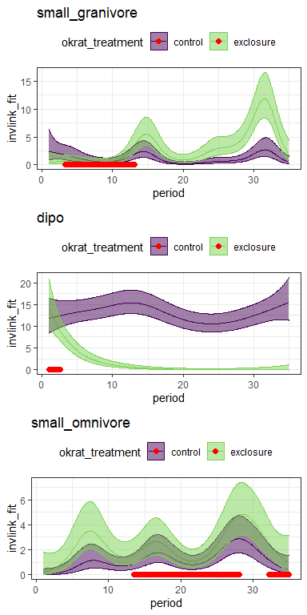<!-- -->
