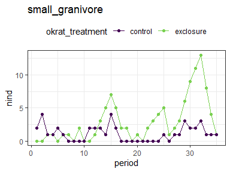
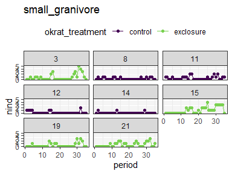
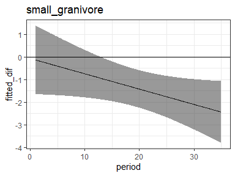
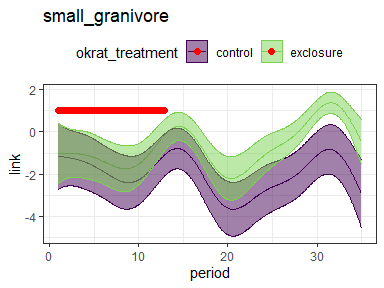
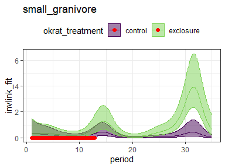

1981 analysis with GAMs
================

<!-- --><!-- -->

    ## 
    ## Family: poisson 
    ## Link function: log 
    ## 
    ## Formula:
    ## nind ~ okrat_treatment + s(period) + s(period, by = okrat_treatment) + 
    ##     oplot + s(period, by = oplot)
    ## 
    ## Parametric coefficients:
    ##                   Estimate Std. Error z value Pr(>|z|)    
    ## (Intercept)        -1.4152     0.1694  -8.356  < 2e-16 ***
    ## okrat_treatment.L   0.9085     0.3008   3.020  0.00252 ** 
    ## oplot.L            -0.9704     0.4590  -2.114  0.03448 *  
    ## oplot.Q             0.0000     0.0000      NA       NA    
    ## oplot.C             1.0299     0.6360   1.619  0.10541    
    ## oplot^4            -0.3449     0.3694  -0.934  0.35044    
    ## oplot^5            -0.3856     0.4180  -0.922  0.35628    
    ## oplot^6             0.5764     0.5574   1.034  0.30109    
    ## oplot^7             0.0750     0.5320   0.141  0.88789    
    ## ---
    ## Signif. codes:  0 '***' 0.001 '**' 0.01 '*' 0.05 '.' 0.1 ' ' 1
    ## 
    ## Approximate significance of smooth terms:
    ##                                          edf    Ref.df Chi.sq p-value    
    ## s(period)                          7.858e+00 8.620e+00 56.272  <2e-16 ***
    ## s(period):okrat_treatmentexclosure 1.000e+00 1.001e+00  3.664  0.0557 .  
    ## s(period):oplot8                   1.458e-05 2.899e-05  0.000  0.5000    
    ## s(period):oplot11                  1.000e+00 1.000e+00  0.364  0.5461    
    ## s(period):oplot12                  1.469e+00 1.776e+00  0.933  0.4668    
    ## s(period):oplot14                  1.000e+00 1.000e+00  0.133  0.7150    
    ## s(period):oplot15                  4.111e+00 5.061e+00 13.015  0.0251 *  
    ## s(period):oplot19                  1.000e+00 1.000e+00  0.003  0.9548    
    ## s(period):oplot21                  2.325e+00 2.926e+00  4.556  0.1873    
    ## ---
    ## Signif. codes:  0 '***' 0.001 '**' 0.01 '*' 0.05 '.' 0.1 ' ' 1
    ## 
    ## Rank: 88/90
    ## R-sq.(adj) =  0.576   Deviance explained = 54.9%
    ## -REML = 214.82  Scale est. = 1         n = 280

<!-- -->

    ## Joining, by = "period"

<!-- --><!-- -->

    ## 
    ## Family: poisson 
    ## Link function: log 
    ## 
    ## Formula:
    ## nind ~ okrat_treatment + s(period) + s(period, by = okrat_treatment)
    ## 
    ## Parametric coefficients:
    ##                   Estimate Std. Error z value Pr(>|z|)    
    ## (Intercept)         0.2488     0.1201   2.073 0.038204 *  
    ## okrat_treatment.L   0.5028     0.1526   3.295 0.000983 ***
    ## ---
    ## Signif. codes:  0 '***' 0.001 '**' 0.01 '*' 0.05 '.' 0.1 ' ' 1
    ## 
    ## Approximate significance of smooth terms:
    ##                                      edf Ref.df Chi.sq  p-value    
    ## s(period)                          7.858  8.633  49.28  < 2e-16 ***
    ## s(period):okrat_treatmentexclosure 2.302  2.845  15.45 0.000912 ***
    ## ---
    ## Signif. codes:  0 '***' 0.001 '**' 0.01 '*' 0.05 '.' 0.1 ' ' 1
    ## 
    ## R-sq.(adj) =  0.869   Deviance explained = 76.8%
    ## -REML = 111.42  Scale est. = 1         n = 70

<!-- -->

    ## Joining, by = "period"

<!-- --><!-- -->

    ## 
    ## Family: poisson 
    ## Link function: log 
    ## 
    ## Formula:
    ## nind ~ okrat_treatment + s(period) + s(period, by = okrat_treatment)
    ## 
    ## Parametric coefficients:
    ##                   Estimate Std. Error z value Pr(>|z|)    
    ## (Intercept)        -1.1374     0.1201  -9.474  < 2e-16 ***
    ## okrat_treatment.L   0.5028     0.1526   3.295 0.000983 ***
    ## ---
    ## Signif. codes:  0 '***' 0.001 '**' 0.01 '*' 0.05 '.' 0.1 ' ' 1
    ## 
    ## Approximate significance of smooth terms:
    ##                                      edf Ref.df Chi.sq  p-value    
    ## s(period)                          7.858  8.633  49.28  < 2e-16 ***
    ## s(period):okrat_treatmentexclosure 2.302  2.845  15.45 0.000912 ***
    ## ---
    ## Signif. codes:  0 '***' 0.001 '**' 0.01 '*' 0.05 '.' 0.1 ' ' 1
    ## 
    ## R-sq.(adj) =  0.462   Deviance explained = 41.9%
    ## -REML = 232.15  Scale est. = 1         n = 280

<!-- -->

    ## Joining, by = "period"

<!-- --><!-- -->
