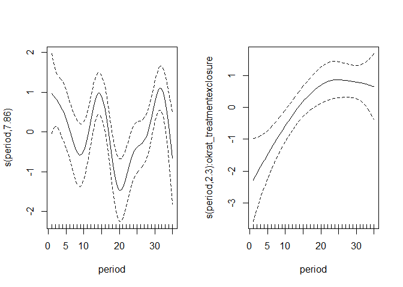
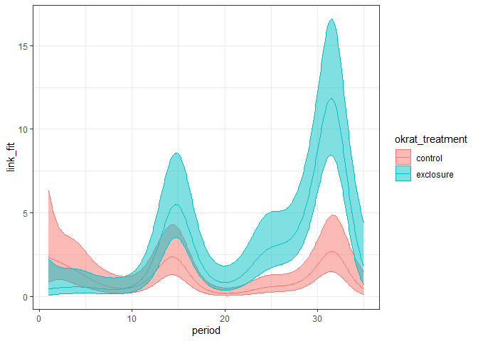
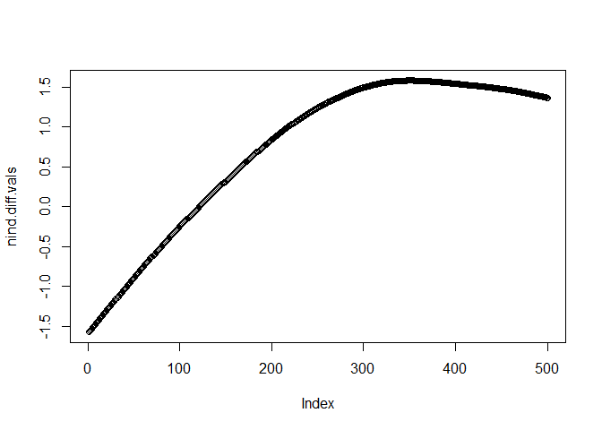
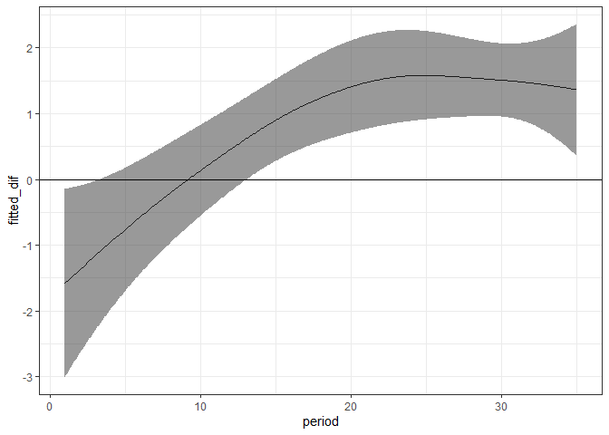

New plots with 81 data
================

``` r
library(dplyr)
```

    ## 
    ## Attaching package: 'dplyr'

    ## The following objects are masked from 'package:stats':
    ## 
    ##     filter, lag

    ## The following objects are masked from 'package:base':
    ## 
    ##     intersect, setdiff, setequal, union

``` r
library(mgcv)
```

    ## Warning: package 'mgcv' was built under R version 4.0.3

    ## Loading required package: nlme

    ## 
    ## Attaching package: 'nlme'

    ## The following object is masked from 'package:dplyr':
    ## 
    ##     collapse

    ## This is mgcv 1.8-33. For overview type 'help("mgcv-package")'.

``` r
library(ggplot2)

rat_totals <- read.csv(here::here("lore", "1981_competition", "1981_data_statevars.csv"), stringsAsFactors = F)

rat_totals <- rat_totals %>%
  mutate(krat_treatment = ifelse(brown_trtmnt == "dipo_present", "control", "exclosure")) %>%
  mutate(okrat_treatment = ordered(krat_treatment))

sg <- filter(rat_totals, type == "small_granivore")


head(sg)
```

    ##   period brown_trtmnt            type year month nind biomass   energy
    ## 1      1  dipo_absent small_granivore 1977     7    0       0  0.00000
    ## 2      2  dipo_absent small_granivore 1977     8    0       0  0.00000
    ## 3      3  dipo_absent small_granivore 1977     9    1      15 43.36913
    ## 4      4  dipo_absent small_granivore 1977    10    1      13 38.95559
    ## 5      5  dipo_absent small_granivore 1977    11    0       0  0.00000
    ## 6      6  dipo_absent small_granivore 1977    12    1       7 24.48701
    ##   krat_treatment okrat_treatment
    ## 1      exclosure       exclosure
    ## 2      exclosure       exclosure
    ## 3      exclosure       exclosure
    ## 4      exclosure       exclosure
    ## 5      exclosure       exclosure
    ## 6      exclosure       exclosure

``` r
is.ordered(sg$okrat_treatment)
```

    ## [1] TRUE

``` r
nind.gam <- gam(nind ~ okrat_treatment + s(period) + s(period, by = okrat_treatment), data = sg, family = poisson, method = "REML")

plot(nind.gam, pages= 1, scale = 0)
```

<!-- -->

``` r
pdat <- as.data.frame(expand.grid(period = seq(min(sg$period), max(sg$period), length.out= 500), okrat_treatment = levels(sg$okrat_treatment)))

nind.predicted <- predict(nind.gam, newdata = pdat, type = "lpmatrix")
nind.link <- predict(nind.gam, newdata = pdat, type = "link", se.fit = T)

nind.predicted.vals <- nind.gam$family$linkinv(nind.predicted %*% coefficients(nind.gam))

pdat.pred <- pdat %>%
  mutate(predicted = nind.predicted.vals,
         link = nind.link$fit,
         se_link = nind.link$se.fit) %>%
  mutate(link_fit = nind.gam$family$linkinv(link),
         link_upper = nind.gam$family$linkinv(link + (2 * se_link)),
         link_lower = nind.gam$family$linkinv(link - (2 * se_link)))

ggplot(pdat.pred, aes(period, link_fit, color= okrat_treatment)) +
  geom_line() +
  geom_ribbon(aes(period, ymin = link_lower, ymax =link_upper, fill = okrat_treatment), alpha = .5) +
  theme_bw()
```

<!-- -->

``` r
nind.diff.keeppar <-  nind.predicted[501:1000, ] -nind.predicted[1:500, ]

nind.diff.vals <- nind.diff.keeppar %*% coef(nind.gam)

plot(nind.diff.vals)
```

<!-- -->

``` r
nind.diff.se<- sqrt(rowSums((nind.diff.keeppar %*% vcov(nind.gam, unconditional = FALSE)) * nind.diff.keeppar))
crit <- qnorm(.05/2, lower.tail = FALSE)
upr <- nind.diff.vals + (crit * nind.diff.se)
lwr <- nind.diff.vals - (crit * nind.diff.se)

pdat.diff <- pdat %>%
  select(period) %>%
  distinct()%>%
  mutate(fitted_dif = nind.diff.vals,
         upper= upr,
         lower = lwr)

ggplot(pdat.diff, aes(period, fitted_dif)) +
  geom_line() +
  geom_ribbon(aes(period, ymin = lower, ymax = upper), alpha  = .5) +
  theme_bw() +
  geom_hline(yintercept = 0)
```

<!-- -->

``` r
ggplot(pdat.pred, aes(period, link_fit, color= okrat_treatment)) +
  geom_line() +
  geom_ribbon(aes(period, ymin = link_lower, ymax =link_upper, fill = okrat_treatment), alpha = .5) +
  theme_bw()
```

<!-- -->
