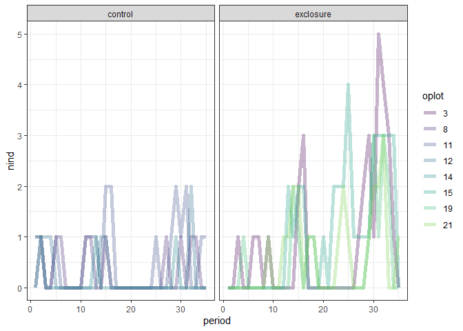
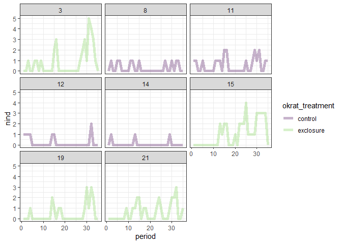
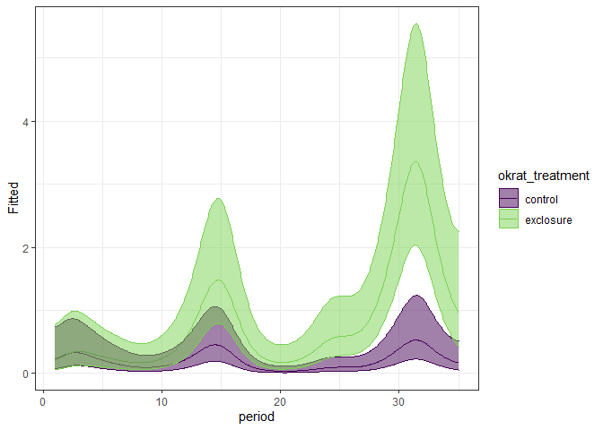
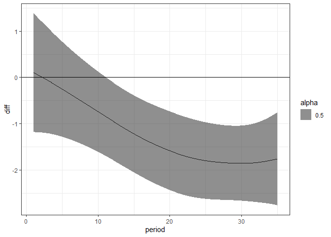

Replicating GAMS from 2019 paper
================

Using the functions and scripts exactly as Erica wrote them, but
swapping in the 1981 data and changing the treatments.

The idea being, then to take it apart and see how it works.

``` r
library(dplyr)
```

    ## 
    ## Attaching package: 'dplyr'

    ## The following objects are masked from 'package:stats':
    ## 
    ##     filter, lag

    ## The following objects are masked from 'package:base':
    ## 
    ##     intersect, setdiff, setequal, union

``` r
library(mgcv)
```

    ## Warning: package 'mgcv' was built under R version 4.0.3

    ## Loading required package: nlme

    ## 
    ## Attaching package: 'nlme'

    ## The following object is masked from 'package:dplyr':
    ## 
    ##     collapse

    ## This is mgcv 1.8-33. For overview type 'help("mgcv-package")'.

``` r
library(ggplot2)
library(cowplot)
```

    ## Warning: package 'cowplot' was built under R version 4.0.3

``` r
source(here::here("lore", "2020_switch", "FinalAnalysis", 'analysis_functions.R'))
theme_set(theme_bw())
#cbPalette <- c( "#e19c02","#999999", "#56B4E9", "#0072B2", "#D55E00", "#F0E442", "#009E73", "#CC79A7")
cbbPalette <- c("#000000", "#009E73", "#e79f00", "#9ad0f3", "#0072B2", "#D55E00", 
                "#CC79A7", "#F0E442")


# ==========================================================================================
# Number of small granivores
rats <- read.csv(here::here("lore", "1981_competition", "1981_data_plot_totals.csv"), stringsAsFactors = F)
sg <- filter(rats, type == "small_granivore") %>%
  mutate(plot = factor(plot),
         krat_treatment = factor(krat_treatment),
         oplot = ordered(plot),
         okrat_treatment = ordered(okrat_treatment),
         censusdate = period)
```

``` r
ggplot(sg, aes(period, nind, group= oplot, color = oplot)) +
  geom_line(size = 2, alpha = .3) +
  theme_bw() +
  scale_color_viridis_d(end = .8) +
  facet_wrap(vars(okrat_treatment))
```

<!-- -->

``` r
ggplot(sg, aes(period, nind, group= oplot, color = okrat_treatment)) +
  geom_line(size = 2, alpha = .3) +
  theme_bw() +
  scale_color_viridis_d(end = .8) +
  facet_wrap(vars(oplot))
```

<!-- -->

``` r
# GAM model --- includes plot-specific smooths
sg.gam <- gam(nind ~ oplot + okrat_treatment + s(period, k = 20) +
                s(period, by = okrat_treatment, k = 15) +
                s(period, by = oplot),
              data = sg, method = 'REML', family = poisson, select = TRUE, control = gam.control(nthreads = 4))

summary(sg.gam)
```

    ## 
    ## Family: poisson 
    ## Link function: log 
    ## 
    ## Formula:
    ## nind ~ oplot + okrat_treatment + s(period, k = 20) + s(period, 
    ##     by = okrat_treatment, k = 15) + s(period, by = oplot)
    ## 
    ## Parametric coefficients:
    ##                   Estimate Std. Error z value Pr(>|z|)    
    ## (Intercept)        -1.2820     0.1365  -9.393  < 2e-16 ***
    ## oplot.L            -0.8055     0.3415  -2.359 0.018325 *  
    ## oplot.Q             0.0000     0.0000      NA       NA    
    ## oplot.C             0.8523     0.4324   1.971 0.048700 *  
    ## oplot^4            -0.3157     0.3271  -0.965 0.334458    
    ## oplot^5            -0.2926     0.3283  -0.891 0.372772    
    ## oplot^6             0.7650     0.3212   2.382 0.017223 *  
    ## oplot^7             0.2535     0.4200   0.603 0.546178    
    ## okrat_treatment.L   0.8574     0.2553   3.358 0.000784 ***
    ## ---
    ## Signif. codes:  0 '***' 0.001 '**' 0.01 '*' 0.05 '.' 0.1 ' ' 1
    ## 
    ## Approximate significance of smooth terms:
    ##                                          edf Ref.df Chi.sq p-value    
    ## s(period)                          9.206e+00     19 54.826 < 2e-16 ***
    ## s(period):okrat_treatmentexclosure 1.635e+00     14  8.152 0.00359 ** 
    ## s(period):oplot8                   7.252e-05      9  0.000 0.74405    
    ## s(period):oplot11                  1.187e-04      9  0.000 0.49052    
    ## s(period):oplot12                  7.147e-01      9  1.372 0.14651    
    ## s(period):oplot14                  9.874e-05      9  0.000 0.63135    
    ## s(period):oplot15                  2.405e+00      9  7.745 0.01424 *  
    ## s(period):oplot19                  7.198e-05      9  0.000 0.98630    
    ## s(period):oplot21                  8.367e-01      9  1.286 0.19497    
    ## ---
    ## Signif. codes:  0 '***' 0.001 '**' 0.01 '*' 0.05 '.' 0.1 ' ' 1
    ## 
    ## Rank: 104/105
    ## R-sq.(adj) =  0.532   Deviance explained = 51.9%
    ## -REML = 225.11  Scale est. = 1         n = 280

``` r
# 
# sg.gam.noplot <- gam(nind ~ okrat_treatment + s(period, k = 20) + s(period, by = okrat_treatment, k = 15), data = sg, method = "REML", family = poisson, select = T, control= gam.control(nthreads = 4))
# 
# summary(sg.gam.noplot)


# Look at the treatment effect smooths on count scale. 
# terms to exclude; must be named exactly as printed in `summary(model)` output
exVars.d <- c('oplot', paste0('s(period):oplot', c(15,19,21,8,11,12,14)), "oplot.L", "oplot.Q", "oplot.C", "oplot^4", "oplot^5", "oplot^6", "oplot^7")


predict_treat_effect_disguised = function(dat, np, MODEL, exVars) {
  # Data to predict at; note the dummy plot - need to provide all variables used to
  # fit the model when predicting
  treatEff <- with(dat,
                   expand.grid(period = seq(min(censusdate), max(period), length = np),
                               krat_treatment  = c('control', 'exclosure'),
                               plot       = 3)) 
  ## create derived variables from the data we want to predict at
  treatEff <- transform(treatEff,
                        oplot       = ordered(plot),
                        okrat_treatment  = ordered(krat_treatment))
  
  # actually predict, on link scale so we can get proper CIs, exclude
  treatPred <- as.data.frame(predict(MODEL, treatEff, type = 'link', se.fit = TRUE,
                                     exclude = exVars))
  
  
  # bind predictions to data we predicted at
  treatPred <- cbind(treatEff, treatPred)
  # extract inverse of link function from the model
  ilink <- family(MODEL)$linkinv
  # form 95% bayesian credible interval / frequentist across-function confidence interval
  treatPred <- transform(treatPred, Fitted = ilink(fit),
                         Upper = ilink(fit + (2 * se.fit)),
                         Lower = ilink(fit - (2 * se.fit)))
  return(treatPred)
}


treatPred.sg <- predict_treat_effect_disguised(sg, np = 500, MODEL=sg.gam, exVars.d)

# plot GAM fit and data
ggplot(treatPred.sg, aes(period, Fitted, color = okrat_treatment)) +
  geom_line() +
  theme_bw() +
  geom_ribbon(aes(period, ymin = Lower, ymax = Upper, fill = okrat_treatment), alpha = .5) +
  scale_fill_viridis_d(end = .8) +
  scale_color_viridis_d(end = .8)
```

<!-- -->

``` r
osmooth_diff_disguised <- function(model, newdata, smooth_var, f1, f2, var, alpha = 0.05,
                                   unconditional = FALSE, removePara = TRUE, keepVar = TRUE, ...) {
  xp <- predict(model, newdata = newdata, type = 'lpmatrix',...)
  # reference level
  ref_level <- levels(newdata[[var]])[1L]
  ref_smooth <- grepl(paste0("s\\(", smooth_var, "\\)\\.{1}[[:digit:]]+$"), colnames(xp))
  not_smooth <- !grepl('^s\\(', colnames(xp))
  c1 <- ref_smooth | grepl(f1, colnames(xp))
  c2 <- ref_smooth | grepl(f2, colnames(xp))
  r1 <- newdata[[var]] == f1
  r2 <- newdata[[var]] == f2
  # difference rows of xp for data from comparison
  X <- xp[r1, ] - xp[r2, ]
  # zero out cols of X related to splines for other levels
  X[, !not_smooth][, ! (c1[!not_smooth] | c2[!not_smooth])] <- 0
  if (isTRUE(removePara)) {
    # zero out the parametric cols not associated with `var`,
    # ignore (Intercept), as it is zero anyway
    ind <- grepl('^s\\(', colnames(xp))
    if (isTRUE(keepVar)) {
      ind <- ind | grepl(paste0('^', var), colnames(xp))
    }
    X[, !ind] <- 0
  }
  dif <- X %*% coef(model)
  se <- sqrt(rowSums((X %*% vcov(model, unconditional = unconditional)) * X))
  crit <- qnorm(alpha/2, lower.tail = FALSE)
  upr <- dif + (crit * se)
  lwr <- dif - (crit * se)
  data.frame(pair = paste(f1, f2, sep = '-'),
             diff = dif,
             se = se,
             upper = upr,
             lower = lwr,
             period = newdata[r1,'period'])
}

# Compute pairwise treatment diffs if we leave *in* the parametric Treatment terms
d1 <- osmooth_diff_disguised(sg.gam, treatPred.sg, "period", "control", "exclosure", var = "okrat_treatment", removePara = FALSE)

ggplot(d1, aes(period, diff)) +
  geom_line() +
  geom_ribbon(aes(period, ymin = lower, ymax = upper, alpha = .5)) +
  geom_hline(yintercept = 0)
```

<!-- -->

``` r
# =========================================================================================
```
