Small granivores originals
================

``` r
rat_plot_totals <- rat_plot_totals %>%
  mutate(plot_type = factor(plot_type),
         plot = factor(plot)) %>%
  mutate(oplot_type = ordered(plot_type),
         oplot = ordered(plot))
```

### Plot counts but plot not included as a predictor

``` r
source(here::here("lore", "1994_longterm", "gams_fxns_generalized.R"))

sg_all<- filter(rat_plot_totals, type == "small_granivore")

ggplot(sg_all, aes(period, group = oplot,  nind, color = oplot_type)) +
  geom_line(size = 2) +
  theme_bw() +
  scale_color_viridis_d(end = .8) + 
  theme(legend.position = "top") + facet_wrap(vars(oplot_type))
```

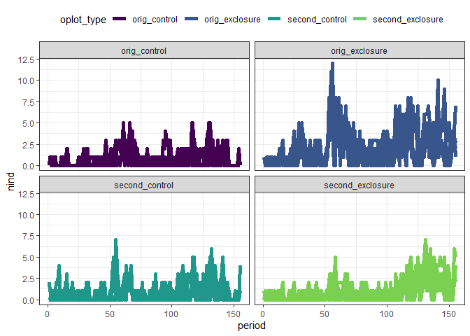<!-- -->

``` r
library(mgcv)
```

    ## Warning: package 'mgcv' was built under R version 4.0.3

    ## Loading required package: nlme

    ## 
    ## Attaching package: 'nlme'

    ## The following object is masked from 'package:dplyr':
    ## 
    ##     collapse

    ## This is mgcv 1.8-33. For overview type 'help("mgcv-package")'.

``` r
sg.gam <- gam(nind ~ oplot_type + s(period, k = 50) + s(period, by = oplot_type, k = 50), family = "poisson", data = sg_all, method = "REML", control = gam.control(nthreads = 4))
summary(sg.gam)
```

    ## 
    ## Family: poisson 
    ## Link function: log 
    ## 
    ## Formula:
    ## nind ~ oplot_type + s(period, k = 50) + s(period, by = oplot_type, 
    ##     k = 50)
    ## 
    ## Parametric coefficients:
    ##              Estimate Std. Error z value Pr(>|z|)    
    ## (Intercept)  -0.36526    0.02835 -12.883  < 2e-16 ***
    ## oplot_type.L -0.15749    0.05422  -2.904  0.00368 ** 
    ## oplot_type.Q -0.48547    0.05077  -9.563  < 2e-16 ***
    ## oplot_type.C  0.76151    0.04803  15.854  < 2e-16 ***
    ## ---
    ## Signif. codes:  0 '***' 0.001 '**' 0.01 '*' 0.05 '.' 0.1 ' ' 1
    ## 
    ## Approximate significance of smooth terms:
    ##                                         edf Ref.df  Chi.sq p-value    
    ## s(period)                            38.645 44.078 590.125  <2e-16 ***
    ## s(period):oplot_typeorig_exclosure   10.480 13.063  63.340  <2e-16 ***
    ## s(period):oplot_typesecond_control    2.456  3.075   4.838   0.188    
    ## s(period):oplot_typesecond_exclosure  4.346  5.439  88.598  <2e-16 ***
    ## ---
    ## Signif. codes:  0 '***' 0.001 '**' 0.01 '*' 0.05 '.' 0.1 ' ' 1
    ## 
    ## R-sq.(adj) =  0.474   Deviance explained = 45.2%
    ## -REML = 3015.4  Scale est. = 1         n = 2480

``` r
gam.check(sg.gam)
```

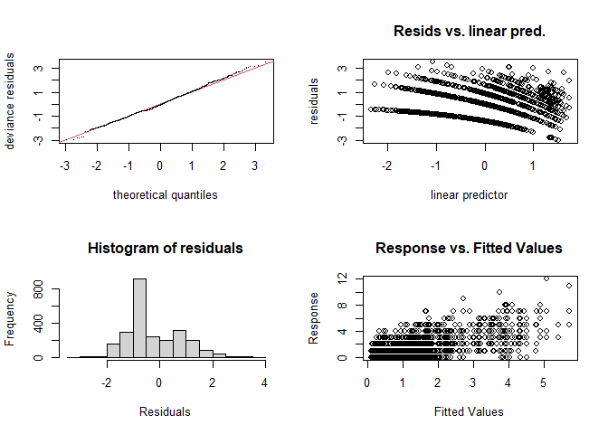<!-- -->

    ## 
    ## Method: REML   Optimizer: outer newton
    ## full convergence after 5 iterations.
    ## Gradient range [-8.472854e-07,4.939097e-06]
    ## (score 3015.354 & scale 1).
    ## Hessian positive definite, eigenvalue range [0.4556127,9.118723].
    ## Model rank =  200 / 200 
    ## 
    ## Basis dimension (k) checking results. Low p-value (k-index<1) may
    ## indicate that k is too low, especially if edf is close to k'.
    ## 
    ##                                         k'   edf k-index p-value
    ## s(period)                            49.00 38.65    0.93    0.29
    ## s(period):oplot_typeorig_exclosure   49.00 10.48    0.93    0.28
    ## s(period):oplot_typesecond_control   49.00  2.46    0.93    0.28
    ## s(period):oplot_typesecond_exclosure 49.00  4.35    0.93    0.28

``` r
sg.pdat <- make_pdat(sg_all, comparison_variable = "oplot_type") %>%
  mutate(plot_type = levels(sg_all$plot_type)[1])
sg.pred <- get_predicted_vals(sg.gam, sg.pdat)


#sg.pred <- add_exclosure_diff(sg.pred, sg.diff)

print(plot_link_pred(sg.pred, comparison_variable = "oplot_type"))
```

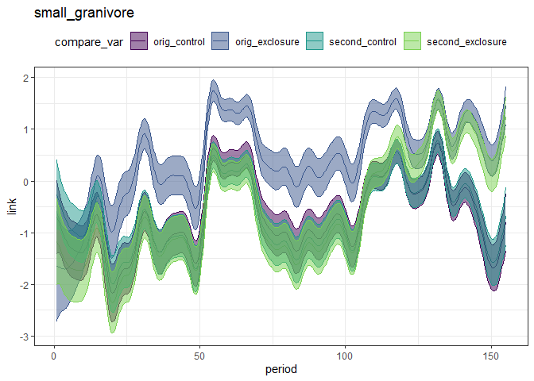<!-- -->

``` r
print(plot_fitted_pred(sg.pred, comparison_variable = "oplot_type"))
```

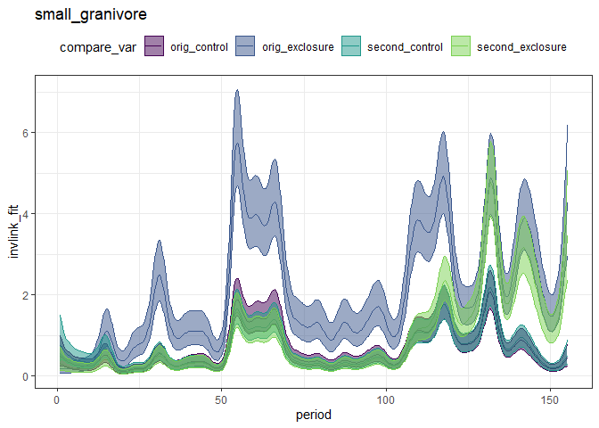<!-- -->

``` r
seventies_pred <- filter(sg.pred, grepl("orig", oplot_type))
print(plot_fitted_pred(seventies_pred, comparison_variable = "oplot_type"))
```

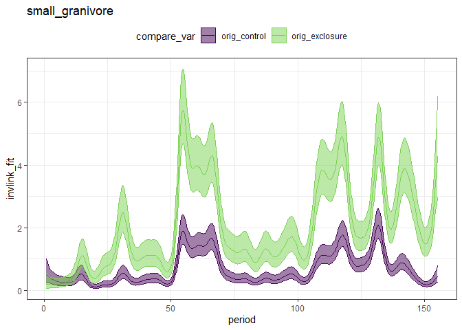<!-- -->

``` r
seventies_diff <- get_exclosure_diff(sg.gam, sg.pred, comparison_variable = "oplot_type", reference_level = 1, comparison_level = 2)

print(plot_exclosure_diff(seventies_diff))
```

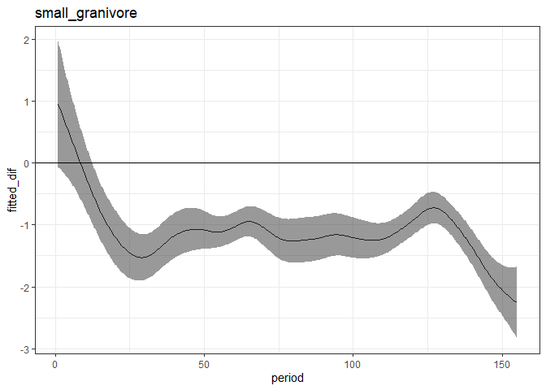<!-- -->

``` r
print(plot_fitted_pred(add_exclosure_diff(seventies_pred, seventies_diff), comparison_variable = "oplot_type"))
```

    ## Joining, by = "period"

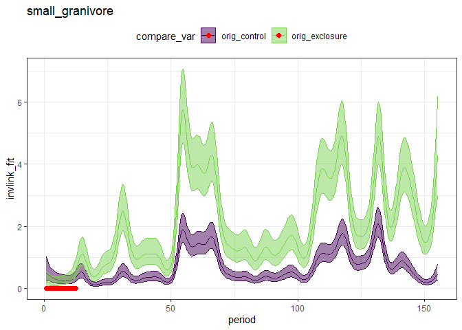<!-- -->

``` r
ggplot(filter(rat_plot_totals, type == "small_granivore", grepl("orig", plot_type)), aes(period, nind, color = oplot_type, group = plot)) +
  geom_line() +
  theme_bw() +
  scale_color_viridis_d(end = .8) 
```

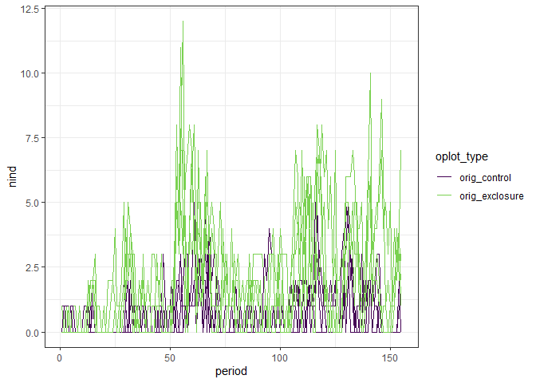<!-- -->

### Including plot as a predictor

``` r
source(here::here("lore", "1994_longterm", "gams_fxns_generalized.R"))

sg_all<- filter(rat_plot_totals, type == "small_granivore")

ggplot(sg_all, aes(period, group = oplot,  nind, color = oplot_type)) +
  geom_line(size = 2) +
  theme_bw() +
  scale_color_viridis_d(end = .8) + 
  theme(legend.position = "top") + facet_wrap(vars(oplot_type))
```

<!-- -->

``` r
library(mgcv)
sg.p.gam <- gam(nind ~ oplot_type + oplot + s(period, k = 20) + s(period, by = oplot_type, k =20) + s(period, by = oplot, k= 20), family = "poisson", data = sg_all, method = "REML", control = gam.control(nthreads = 4))
summary(sg.p.gam)
```

    ## 
    ## Family: poisson 
    ## Link function: log 
    ## 
    ## Formula:
    ## nind ~ oplot_type + oplot + s(period, k = 20) + s(period, by = oplot_type, 
    ##     k = 20) + s(period, by = oplot, k = 20)
    ## 
    ## Parametric coefficients:
    ##              Estimate Std. Error z value Pr(>|z|)    
    ## (Intercept)  -0.41646    0.03014 -13.818  < 2e-16 ***
    ## oplot_type.L  0.10138    0.08448   1.200 0.230104    
    ## oplot_type.Q -0.51679    0.08786  -5.882 4.05e-09 ***
    ## oplot_type.C  0.68607    0.12443   5.514 3.52e-08 ***
    ## oplot.L      -0.56325    0.11633  -4.842 1.29e-06 ***
    ## oplot.Q       0.00000    0.00000      NA       NA    
    ## oplot.C      -0.25959    0.16034  -1.619 0.105455    
    ## oplot^4       0.01871    0.16654   0.112 0.910524    
    ## oplot^5      -0.68962    0.11853  -5.818 5.95e-09 ***
    ## oplot^6       0.02752    0.14909   0.185 0.853542    
    ## oplot^7       0.48849    0.09731   5.020 5.16e-07 ***
    ## oplot^8      -0.48466    0.12882  -3.762 0.000168 ***
    ## oplot^9       0.02902    0.11640   0.249 0.803123    
    ## oplot^10      0.00000    0.00000      NA       NA    
    ## oplot^11      0.00000    0.00000      NA       NA    
    ## oplot^12     -0.70904    0.15251  -4.649 3.33e-06 ***
    ## oplot^13      0.18338    0.13024   1.408 0.159112    
    ## oplot^14     -0.13043    0.11439  -1.140 0.254220    
    ## oplot^15      0.01883    0.16541   0.114 0.909359    
    ## ---
    ## Signif. codes:  0 '***' 0.001 '**' 0.01 '*' 0.05 '.' 0.1 ' ' 1
    ## 
    ## Approximate significance of smooth terms:
    ##                                            edf    Ref.df  Chi.sq  p-value    
    ## s(period)                            1.676e+01 1.820e+01 340.550  < 2e-16 ***
    ## s(period):oplot_typeorig_exclosure   9.714e+00 1.182e+01  55.564  < 2e-16 ***
    ## s(period):oplot_typesecond_control   3.998e+00 4.992e+00  20.276 0.001114 ** 
    ## s(period):oplot_typesecond_exclosure 2.969e+00 3.721e+00  46.614  < 2e-16 ***
    ## s(period):oplot3                     1.001e+00 1.001e+00   4.627 0.031521 *  
    ## s(period):oplot4                     1.137e+00 1.260e+00   2.039 0.240711    
    ## s(period):oplot6                     1.000e+00 1.000e+00   0.002 0.969620    
    ## s(period):oplot8                     7.020e-04 1.370e-03   0.000 0.996009    
    ## s(period):oplot11                    7.030e+00 8.745e+00  30.327 0.000366 ***
    ## s(period):oplot12                    1.001e+00 1.001e+00  12.733 0.000362 ***
    ## s(period):oplot13                    4.831e+00 6.004e+00  20.013 0.002720 ** 
    ## s(period):oplot14                    1.001e+00 1.001e+00  10.856 0.000989 ***
    ## s(period):oplot15                    5.159e+00 6.450e+00  21.780 0.001915 ** 
    ## s(period):oplot17                    1.000e+00 1.001e+00  12.800 0.000347 ***
    ## s(period):oplot18                    3.720e-05 7.161e-05   0.000 0.998081    
    ## s(period):oplot19                    3.200e+00 3.999e+00   7.298 0.118312    
    ## s(period):oplot20                    2.003e+00 2.531e+00   4.597 0.143729    
    ## s(period):oplot21                    1.318e-04 2.599e-04   0.000 0.998523    
    ## s(period):oplot22                    3.267e+00 4.093e+00  12.512 0.013184 *  
    ## ---
    ## Signif. codes:  0 '***' 0.001 '**' 0.01 '*' 0.05 '.' 0.1 ' ' 1
    ## 
    ## Rank: 374/380
    ## R-sq.(adj) =  0.479   Deviance explained = 47.6%
    ## -REML = 2958.2  Scale est. = 1         n = 2480

``` r
gam.check(sg.p.gam)
```

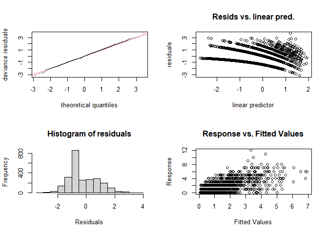<!-- -->

    ## 
    ## Method: REML   Optimizer: outer newton
    ## full convergence after 12 iterations.
    ## Gradient range [-0.0003125993,4.858298e-05]
    ## (score 2958.212 & scale 1).
    ## Hessian positive definite, eigenvalue range [7.276305e-06,5.495898].
    ## Model rank =  374 / 380 
    ## 
    ## Basis dimension (k) checking results. Low p-value (k-index<1) may
    ## indicate that k is too low, especially if edf is close to k'.
    ## 
    ##                                            k'      edf k-index p-value    
    ## s(period)                            1.90e+01 1.68e+01    0.82  <2e-16 ***
    ## s(period):oplot_typeorig_exclosure   1.90e+01 9.71e+00    0.82  <2e-16 ***
    ## s(period):oplot_typesecond_control   1.90e+01 4.00e+00    0.82  <2e-16 ***
    ## s(period):oplot_typesecond_exclosure 1.90e+01 2.97e+00    0.82  <2e-16 ***
    ## s(period):oplot3                     1.90e+01 1.00e+00    0.82  <2e-16 ***
    ## s(period):oplot4                     1.90e+01 1.14e+00    0.82  <2e-16 ***
    ## s(period):oplot6                     1.90e+01 1.00e+00    0.82  <2e-16 ***
    ## s(period):oplot8                     1.90e+01 7.02e-04    0.82  <2e-16 ***
    ## s(period):oplot11                    1.90e+01 7.03e+00    0.82  <2e-16 ***
    ## s(period):oplot12                    1.90e+01 1.00e+00    0.82  <2e-16 ***
    ## s(period):oplot13                    1.90e+01 4.83e+00    0.82  <2e-16 ***
    ## s(period):oplot14                    1.90e+01 1.00e+00    0.82  <2e-16 ***
    ## s(period):oplot15                    1.90e+01 5.16e+00    0.82  <2e-16 ***
    ## s(period):oplot17                    1.90e+01 1.00e+00    0.82  <2e-16 ***
    ## s(period):oplot18                    1.90e+01 3.72e-05    0.82  <2e-16 ***
    ## s(period):oplot19                    1.90e+01 3.20e+00    0.82  <2e-16 ***
    ## s(period):oplot20                    1.90e+01 2.00e+00    0.82  <2e-16 ***
    ## s(period):oplot21                    1.90e+01 1.32e-04    0.82  <2e-16 ***
    ## s(period):oplot22                    1.90e+01 3.27e+00    0.82  <2e-16 ***
    ## ---
    ## Signif. codes:  0 '***' 0.001 '**' 0.01 '*' 0.05 '.' 0.1 ' ' 1

``` r
sg.pdat <- make_pdat(sg_all, comparison_variable = "oplot_type", include_plot = T) %>%
  mutate(plot_type = levels(sg_all$plot_type)[1],
         oplot = levels(sg_all$oplot)[1])
sg.pred <- get_predicted_vals(sg.p.gam, sg.pdat)


#sg.pred <- add_exclosure_diff(sg.pred, sg.diff)

print(plot_link_pred(sg.pred, comparison_variable = "oplot_type"))
```

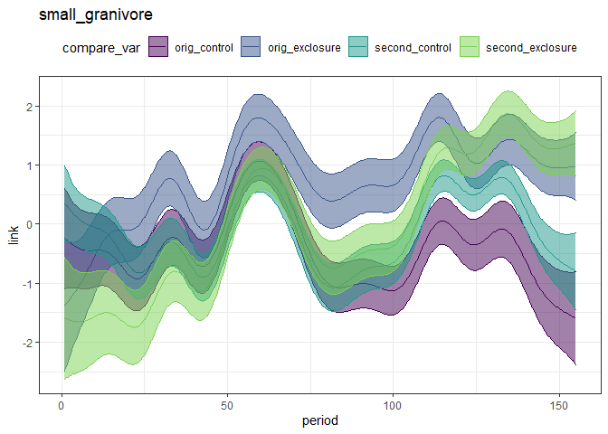<!-- -->

``` r
print(plot_fitted_pred(sg.pred, comparison_variable = "oplot_type"))
```

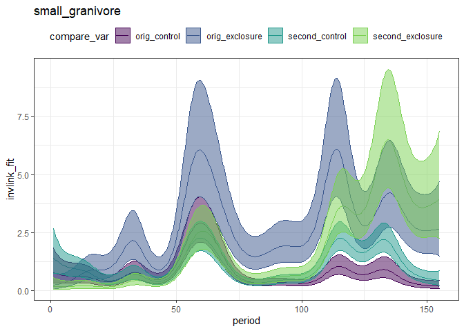<!-- -->

``` r
seventies_pred <- filter(sg.pred, grepl("orig", oplot_type))
print(plot_fitted_pred(seventies_pred, comparison_variable = "oplot_type"))
```

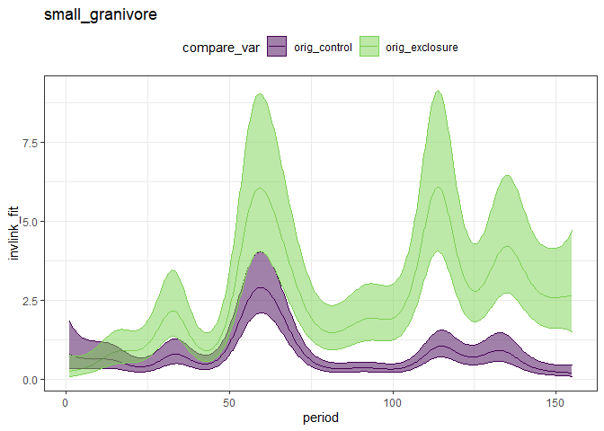<!-- -->

``` r
seventies_diff <- get_exclosure_diff(sg.p.gam, sg.pred, comparison_variable = "oplot_type", reference_level = 1, comparison_level = 2)

print(plot_exclosure_diff(seventies_diff))
```

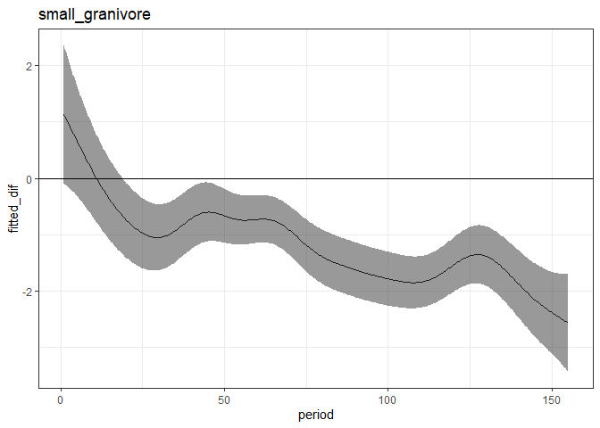<!-- -->

``` r
print(plot_fitted_pred(add_exclosure_diff(seventies_pred, seventies_diff), comparison_variable = "oplot_type"))
```

    ## Joining, by = "period"

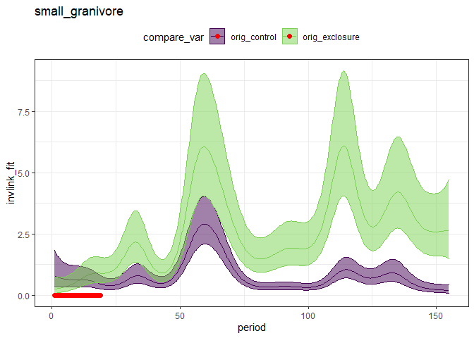<!-- -->

This model behaves weirdly if:

  - you include `plot`, not `oplot`, as the parametric term. That then
    gave predictions where the *controls* exceed the *exclosures* in
    time periods where that’s definitely not what the data are doing
  - you increase k to 30. That then fits wildly high numbers for the
    orig\_exclosures.

I have not managed to increase k sufficiently to get out of “low p
value” k-check land. High k for the ones that include plot takes a
long time to run, plus there’s the weirdly enormous values for
`orig_exclosure` for k = 30.

``` r
seventies_diff %>%
  filter(diff_overlaps_zero) %>%
  filter(period == max(period)) %>%
  distinct()
```

    ##    period            type fitted_dif       upper     lower diff_overlaps_zero
    ## 1 18.8998 small_granivore -0.6680566 0.007503048 -1.343616               TRUE

``` r
eighties_pred <- filter(sg.pred, oplot_type %in% c("second_control", "second_exclosure"))

print(plot_fitted_pred(eighties_pred, comparison_variable = "oplot_type"))
```

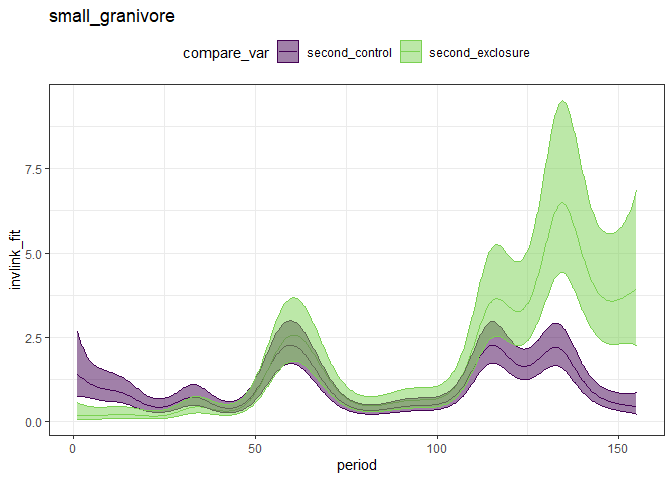<!-- -->

``` r
eighties_diff <- get_exclosure_diff(sg.p.gam, sg.pred, comparison_variable = "oplot_type", reference_level = 3, comparison_level = 4)

print(plot_exclosure_diff(eighties_diff))
```

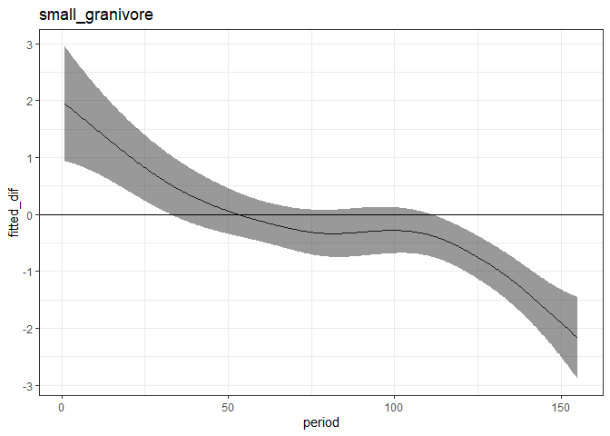<!-- -->

``` r
eighties_pred <- add_exclosure_diff(eighties_pred, eighties_diff)
```

    ## Joining, by = "period"

``` r
print(plot_fitted_pred(eighties_pred, comparison_variable = "oplot_type"))
```

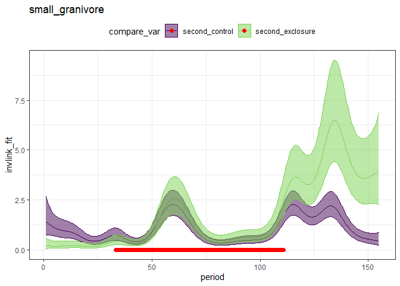<!-- -->

``` r
max(eighties_pred$period [ which(eighties_pred$diff_overlaps_zero)])
```

    ## [1] 110.8677

``` r
controls_pred <- filter(sg.pred, oplot_type %in% c("second_control", "orig_control"))
print(plot_fitted_pred(controls_pred, comparison_variable = "oplot_type"))
```

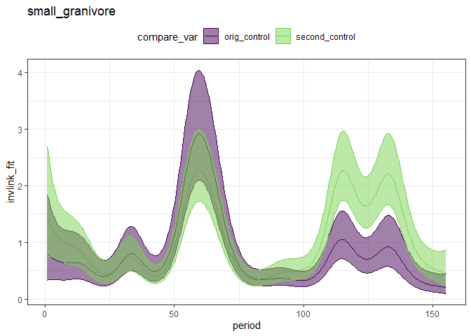<!-- -->

``` r
controls_diff <- get_exclosure_diff(sg.p.gam, sg.pred, comparison_variable = "oplot_type", reference_level = 1, comparison_level = 3)
print(plot_exclosure_diff(controls_diff))
```

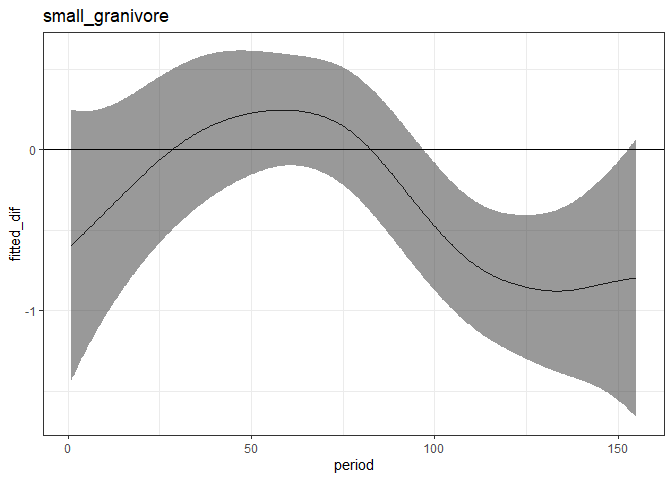<!-- -->

``` r
controls_pred <- add_exclosure_diff(controls_pred, controls_diff)
```

    ## Joining, by = "period"

``` r
print(plot_fitted_pred(controls_pred, comparison_variable = "oplot_type"))
```

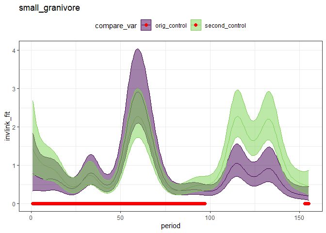<!-- -->

``` r
exclosures_pred <- filter(sg.pred, oplot_type %in% c("second_exclosure", "orig_exclosure"))
print(plot_fitted_pred(exclosures_pred, comparison_variable = "oplot_type"))
```

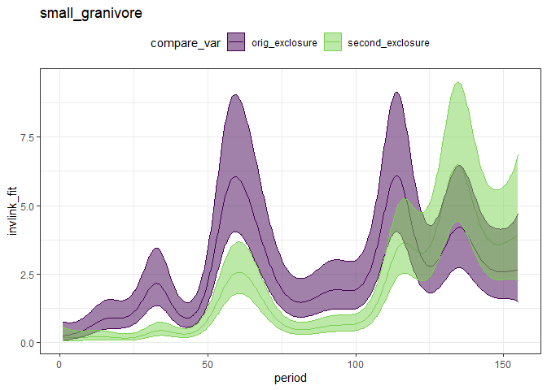<!-- -->

``` r
exclosures_diff <- get_exclosure_diff(sg.p.gam, sg.pred, comparison_variable = "oplot_type", reference_level = 2, comparison_level = 4)
print(plot_exclosure_diff(exclosures_diff))
```

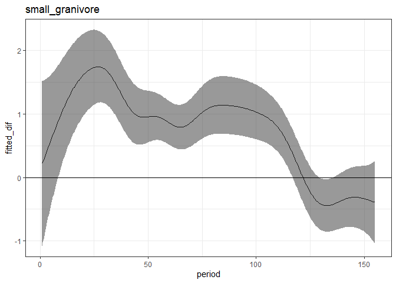<!-- -->

``` r
exclosures_pred <- add_exclosure_diff(exclosures_pred, exclosures_diff)
```

    ## Joining, by = "period"

``` r
print(plot_fitted_pred(exclosures_pred, comparison_variable = "oplot_type"))
```

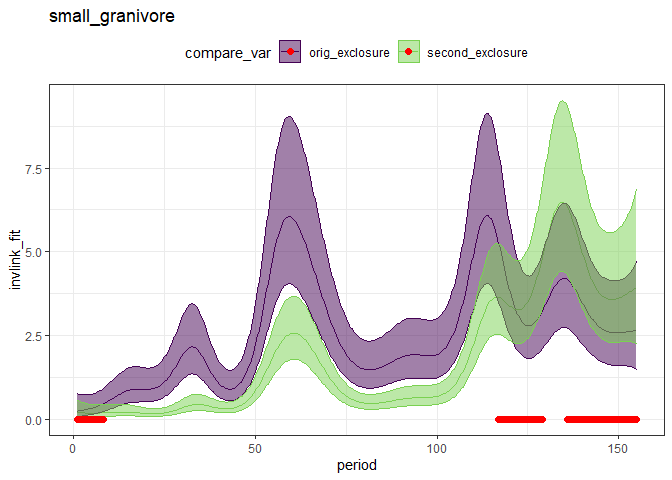<!-- -->

``` r
exclosures_pred %>%
  filter(period > 100) %>%
  filter(diff_overlaps_zero) %>%
  select(period) %>%
  distinct() %>%
  filter(period == min(period))
```

    ##     period
    ## 1 117.0401
